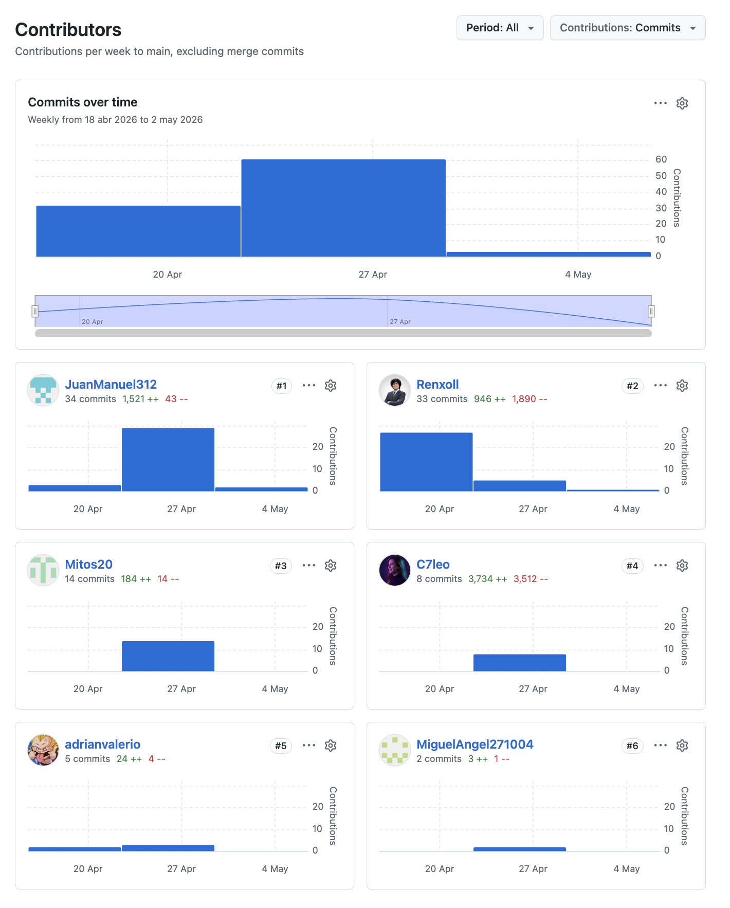
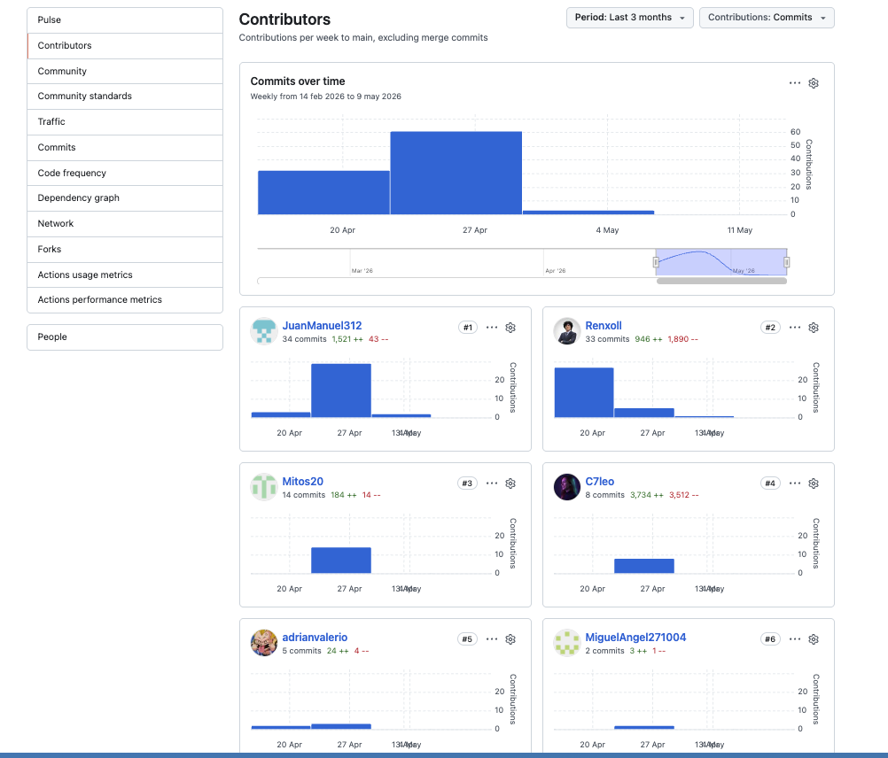
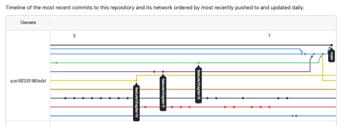
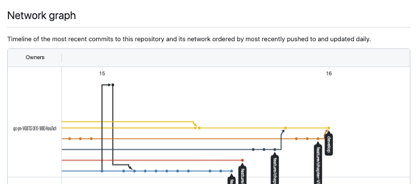

# Universidad Peruana de Ciencias Aplicadas

**Facultad de Ingeniería**

**Carrera de Ingeniería de Software**

**Periodo:** 202610

**NRC:** 18880

**Nombre del profesor:** Julio Manuel Noriega Melendez

### "Informe de Trabajo Final"

**Nombre del Startup:** NovaPeru Tech

**Nombre del Producto:** Veyra

**Integrantes:**

| Código     | Apellidos y Nombres             |
|------------|---------------------------------|
| u202312399 | Llerena Delgado Renzo Miguel    |
| u202214130 | Rentería Palacios Yasser        |
| u202214572 | Espinoza Vivas Camilla Leonor   |
| u20221a371 | Santos Torres Juan Manuel       |
| u202212897 | Román López Miguel Ángel Junior |
| u202210334 | Valerio Garcia Adrian Emanuel   |
|            |                                 | 
### Abril, 2026

---

## Registro de Versiones del Informe

| Versión | Fecha | Autor | Descripción |
|---------|-------|-------|-------------|
|   TB1  | 1/05/2026   | Todos los miembros del equipo  | Capitulo 1 Capitulo 2 Capitulo 3 Capitulo 4 Capitulo 5 |
| TP1 | 15/05/2026 | Todos los miembros del equipo | Revisión general del informe, corrección de errores y mejoras en la redacción. |

---

## Project Report Collaboration Insights

**Link de los repositorios de la organización**: https://github.com/upc-pre-1ASI0732-2610-16880-NovaTech

**Link del repositorio-Informe**: https://github.com/upc-pre-1ASI0732-2610-16880-NovaTech/Veyra-Document-Report

**Reporte de colaboración de la entrega del TB1**:

Durante la primera fase de elaboración del informe, el equipo Veyra centró sus esfuerzos en la construcción de los fundamentos conceptuales, de investigación y diseño inicial del proyecto. Cada integrante asumió un rol activo en la redacción, modelado y documentación de secciones clave del reporte, asegurando una coherencia entre la teoría, la metodología y la propuesta tecnológica.

Finalmente, estos gráficos representan la cantidad de commits realizados por cada miembro del equipo en el repositorio del proyecto. Cada barra representa a un miembro del equipo y la altura de la barra indica el número total de commits realizados por esa persona.

**Reporte de colaboración de la entrega del TB1**:

Durante la segunda fase de elaboración del informe, el equipo Veyra centró sus esfuerzos en la construcción de los fundamentos conceptuales, de investigación y diseño inicial del proyecto. Cada integrante asumió un rol activo en la redacción, modelado y documentación de secciones clave del reporte, asegurando una coherencia entre la teoría, la metodología y la propuesta tecnológica.

Finalmente, estos gráficos representan la cantidad de commits realizados por cada miembro del equipo en el repositorio del proyecto. Cada barra representa a un miembro del equipo y la altura de la barra indica el número total de commits realizados por esa persona.

**Ramificación del proyecto usando GitFlow:**

Este gráfico ofrece una visualización de las veces que se ha clonado nuestro repositorio, junto con las fechas correspondientes a cada evento. También muestran datos sobre el número de visitas que ha recibido el repositorio de nuestro equipo a lo largo del tiempo.

**TB1**

**TP1**

---

## Tabla de contenido

---
## ABET – EAC - Student Outcome 4

El curso contribuye al cumplimiento del Student Outcome ABET:
**ABET - EAC - Student Outcome 4**

**Criterio:**  La capacidad de reconocer responsabilidades éticas y
profesionales en situaciones de ingeniería y hacer juicios informados, que deben
considerar el impacto de las soluciones de ingeniería en contextos globales, económicos,
ambientales y sociales.

En el siguiente cuadro se describe las acciones realizadas y enunciados de conclusiones por parte del grupo, que permiten sustentar el haber alcanzado el logro del ABET - EAC - Student Outcome 3.

| Criterio específico                                                                                                                                          | Acciones realizadas                                                                                                                                                                                                                                                                                                                                                                                                                                                                                                                                                                                                                                                                                                                                                                                                                                                                                                                                                                                                                                                                                                                                                                                                                                                                                                                                                                                                                                                                                                                                                                                                                                                                                                                                                                                                                                                                                                                                                                                                                                                                                                                                                                                                                                                                                                                                                                                                                                                                                                                                                                                                                                                                                                                                                                                                                                                                                                                                                                                                                                                                                                                                                                                                                                                                                                                                                                                                                            | Conclusiones                                                                                                                                                                                                                                                                                                                                                                                                                                                                                                                                                                                                                                                                                                                                                                                                                                                                                                                                                                                                                                                                                                                                                                                                                                                                                                                                                                                                                                                                                                                                                                                                                                                                                                                                                                                                                                                                                                                                                                                                                                                                                                                                                                                                                                                                                                                                                                                                                                                                                                                   |
| ------------------------------------------------------------------------------------------------------------------------------------------------------------ | ---------------------------------------------------------------------------------------------------------------------------------------------------------------------------------------------------------------------------------------------------------------------------------------------------------------------------------------------------------------------------------------------------------------------------------------------------------------------------------------------------------------------------------------------------------------------------------------------------------------------------------------------------------------------------------------------------------------------------------------------------------------------------------------------------------------------------------------------------------------------------------------------------------------------------------------------------------------------------------------------------------------------------------------------------------------------------------------------------------------------------------------------------------------------------------------------------------------------------------------------------------------------------------------------------------------------------------------------------------------------------------------------------------------------------------------------------------------------------------------------------------------------------------------------------------------------------------------------------------------------------------------------------------------------------------------------------------------------------------------------------------------------------------------------------------------------------------------------------------------------------------------------------------------------------------------------------------------------------------------------------------------------------------------------------------------------------------------------------------------------------------------------------------------------------------------------------------------------------------------------------------------------------------------------------------------------------------------------------------------------------------------------------------------------------------------------------------------------------------------------------------------------------------------------------------------------------------------------------------------------------------------------------------------------------------------------------------------------------------------------------------------------------------------------------------------------------------------------------------------------------------------------------------------------------------------------------------------------------------------------------------------------------------------------------------------------------------------------------------------------------------------------------------------------------------------------------------------------------------------------------------------------------------------------------------------------------------------------------------------------------------------------------------------------------------------------- | ------------------------------------------------------------------------------------------------------------------------------------------------------------------------------------------------------------------------------------------------------------------------------------------------------------------------------------------------------------------------------------------------------------------------------------------------------------------------------------------------------------------------------------------------------------------------------------------------------------------------------------------------------------------------------------------------------------------------------------------------------------------------------------------------------------------------------------------------------------------------------------------------------------------------------------------------------------------------------------------------------------------------------------------------------------------------------------------------------------------------------------------------------------------------------------------------------------------------------------------------------------------------------------------------------------------------------------------------------------------------------------------------------------------------------------------------------------------------------------------------------------------------------------------------------------------------------------------------------------------------------------------------------------------------------------------------------------------------------------------------------------------------------------------------------------------------------------------------------------------------------------------------------------------------------------------------------------------------------------------------------------------------------------------------------------------------------------------------------------------------------------------------------------------------------------------------------------------------------------------------------------------------------------------------------------------------------------------------------------------------------------------------------------------------------------------------------------------------------------------------------------------------------ |
| 4.c.1 Reconoce responsabilidad ética y profesional en situaciones de ingeniería de software                                                                  | Camilla Espinoza   **TB1**   Aporté activamente en el desarrollo de los capítulos 1 y 2, contribuyendo con la organización del contenido, la redacción de secciones asignadas y el cumplimiento responsable de las tareas del equipo. Asimismo, apoyé en la elaboración de entrevistas del segmento 1, manteniendo una participación constante y comprometida con los objetivos del proyecto.   **TP1**   Implementé y documenté la configuración de Continuous Integration (CI), incluyendo herramientas y prácticas para automatizar procesos de compilación y validación del proyecto. Además, participé en la ejecución automática de pruebas y verificación de estabilidad del sistema antes de integrar cambios al repositorio principal.   Yasser Rentería   **TB1**   Aporté activamente en el trabajo en equipo durante el desarrollo de los capítulos 2 y 5, contribuyendo en la organización, elaboración de entrevistas y entrega de Needfinding con la debida responsabilidad de las tareas.   **TP1**   Realicé pruebas de sistema verificando el funcionamiento integral de la aplicación, evaluando la navegación, estabilidad y respuesta de las funcionalidades principales en distintos escenarios de uso.   Adrian Valerio   **TB1**   Contribuí en el desarrollo del Capítulo 3 y en la realización de entrevistas, cumpliendo responsablemente con las tareas asignadas y manteniendo una participación constante dentro del equipo.   **TP1**   Implementé pruebas de integración para validar la correcta interacción entre módulos, backend y base de datos, asegurando la consistencia de los flujos principales del sistema.  Renzo Llerena   **TB1**   Participé activamente en el desarrollo de los capítulos 1, 2 y 5. Asimismo, colaboré en la realización de las entrevistas para el segmento objetivo 2 y fui responsable de llevar a cabo el despliegue de los componentes de la plataforma Veyra.   **TP1**   Implementé pruebas unitarias para las funciones principales del sistema, validando métodos críticos, lógica de negocio y distintos escenarios de ejecución para garantizar el correcto funcionamiento del backend.   Juan Manuel Santos Torres   **TB1**   Realicé el trabajo, diseño y construcción del Capítulo 3. Fui quien diseñó y construyó en su totalidad las épicas, historias de usuario e historias técnicas, garantizando su coherencia con el backend, frontend y landing page. Además, me encargué de forma íntegra de la creación y reorganización del Product Backlog.   **TP1**   Desarrollé escenarios de Behavior-Driven Development (BDD) para describir el comportamiento esperado de las funcionalidades principales del sistema, definiendo criterios de aceptación alineados con las necesidades del usuario.   Miguel Ángel Junior Román López   **TB1**   Aporté activamente en el desarrollo de todo el capítulo 4, contribuyendo con la organización del contenido, la redacción de secciones asignadas y el cumplimiento responsable de las tareas del equipo, manteniendo una participación constante y comprometida con los objetivos del proyecto.   **TP1**   Implementé procesos de Continuous Delivery / Continuous Deployment (CD) para automatizar el despliegue y publicación de nuevas versiones del sistema en entornos de prueba y producción. | Camilla Espinoza   **TB1**   La participación en el desarrollo de capítulos y entrevistas fortaleció mi compromiso profesional y responsabilidad dentro del trabajo colaborativo del proyecto.   **TP1**   La configuración de procesos de integración continua permitió fortalecer el trabajo colaborativo y asegurar prácticas responsables de validación automática dentro del proyecto.   Yasser Rentería   **TB1**   El trabajo realizado en equipo permitió reforzar la responsabilidad y organización necesarias para cumplir adecuadamente con los objetivos del proyecto.   **TP1**   La ejecución de pruebas de sistema permitió reforzar el compromiso profesional con la calidad y estabilidad integral de la aplicación antes de su entrega final.   Adrian Valerio   **TB1**   La participación en el desarrollo del capítulo y entrevistas fortaleció mi sentido de responsabilidad profesional y compromiso ético dentro del equipo de trabajo.   **TP1**   La participación en las pruebas de integración fortaleció mi responsabilidad profesional al garantizar la correcta comunicación entre componentes críticos del sistema.   Renzo Llerena   **TB1**   La participación en entrevistas, capítulos y despliegue de la plataforma permitió fortalecer el compromiso con el trabajo responsable y la correcta ejecución de actividades técnicas del proyecto.   **TP1**   La implementación de pruebas unitarias permitió asegurar la calidad y confiabilidad de las funciones principales del sistema, fortaleciendo el compromiso ético con el desarrollo de software seguro y mantenible.   Juan Manuel Santos Torres   **TB1**   El diseño de épicas, historias de usuario y backlog permitió fortalecer la organización y responsabilidad profesional en la planificación y desarrollo del proyecto.   **TP1**   El desarrollo de escenarios BDD permitió garantizar que las funcionalidades implementadas respondieran adecuadamente a los requerimientos y necesidades de los usuarios.   Miguel Ángel Junior Román López   **TB1**   La participación en el desarrollo del capítulo 4 fortaleció el compromiso con la calidad del contenido, diseño y cumplimiento de los objetivos del equipo.   **TP1**   La automatización de despliegues y entregas continuas fortaleció las buenas prácticas de desarrollo responsable y mejoró la eficiencia del proceso de publicación del sistema. |
| 4.c.2 Emite juicios informados considerando el impacto de las soluciones de ingeniería de software en contextos globales, económicos, ambientales y sociales | Camilla Espinoza   **TB1**   Participé en el análisis y mejora del Capítulo 3, especialmente en la revisión de épicas, historias de usuario e historias técnicas, verificando su coherencia con el backend, frontend y landing page. Además, apoyé en la reorganización del Product Backlog y en la elaboración de la presentación PPT del proyecto.   **TP1**   Evalué el impacto técnico y operativo de automatizar procesos de compilación y pruebas mediante CI, permitiendo reducir errores humanos, optimizar tiempos de desarrollo y mejorar la estabilidad del software entregado a los usuarios.   Yasser Rentería   **TB1**   Apoyé en la generación de valor para la solución, el alto impacto del proyecto y la organización de las ideas para futuros procesos.   **TP1**   Analicé el comportamiento integral del sistema mediante pruebas funcionales completas, identificando posibles riesgos que podrían afectar la experiencia y confiabilidad para los usuarios finales.   Adrian Valerio   **TB1**   Participé en el desarrollo del Capítulo 3 y análisis de entrevistas, identificando necesidades reales de los usuarios y considerando su impacto en la solución propuesta.   **TP1**   Realicé pruebas de integración considerando el impacto de posibles fallos de comunicación entre componentes, asegurando la continuidad y estabilidad de los servicios del sistema.  Renzo Llerena   **TB1**   Participé activamente en el desarrollo de los capítulos 1, 2 y 5. Asimismo, colaboré en la realización de las entrevistas para el segmento objetivo 2 y fui responsable de llevar a cabo el despliegue de los componentes de la plataforma Veyra.   **TP1**   Implementé pruebas unitarias orientadas a prevenir errores en funcionalidades críticas, reduciendo riesgos operativos y mejorando la confiabilidad del sistema para los usuarios y el equipo de desarrollo.   Juan Manuel Santos Torres   **TB1**   Realicé el trabajo, diseño y construcción del Capítulo 3. Fui quien diseñó y construyó en su totalidad las épicas, historias de usuario e historias técnicas, garantizando su coherencia con el backend, frontend y landing page. Además, me encargué de forma íntegra de la creación y reorganización del Product Backlog.   **TP1**   Elaboré escenarios BDD alineados con las necesidades de los usuarios y criterios funcionales del sistema, permitiendo validar que las soluciones desarrolladas respondan correctamente al comportamiento esperado.   Miguel Ángel Junior Román López   **TB1**   Participé en el análisis y mejora del Capítulo 4, especialmente en la Landing Page UI Design, Web Applications UX/UI Design, Web Applications Prototyping, Domain-Driven Software Architecture. Además, apoyé en la elaboración de la presentación PPT del proyecto y revisión general de todo el reporte y landing page.   **TP1**   Implementé procesos automatizados de despliegue continuo para mejorar la rapidez y confiabilidad en la publicación de nuevas versiones del sistema, reduciendo tiempos de inactividad y errores manuales.                                                                                                                                                                                                                                 | Camilla Espinoza   **TB1**   El análisis de historias de usuario y backlog permitió comprender mejor el impacto de las decisiones de software en la organización y experiencia del usuario.   **TP1**   La implementación de integración continua permitió reducir riesgos técnicos y optimizar los procesos de desarrollo, generando una solución más confiable para los usuarios.   Yasser Rentería   **TB1**   La participación en la generación de valor del proyecto permitió reconocer la importancia del impacto social y funcional de la solución propuesta.   **TP1**   Las pruebas de sistema ayudaron a identificar riesgos funcionales y mejorar la estabilidad general del sistema, favoreciendo una experiencia más segura para los usuarios finales.   Adrian Valerio   **TB1**   El análisis de entrevistas permitió comprender mejor las necesidades reales de los usuarios y el impacto de las soluciones desarrolladas en su entorno.   **TP1**   El desarrollo de pruebas de integración permitió comprender la importancia de mantener una comunicación estable entre componentes para garantizar una experiencia confiable para los usuarios.   Renzo Llerena   **TB1**   La participación en entrevistas y despliegue de la plataforma permitió comprender el impacto operativo y funcional que tiene el software en los usuarios y en la continuidad del servicio.   **TP1**   Las pruebas unitarias permitieron identificar tempranamente posibles errores críticos, contribuyendo a una solución más estable y sostenible para el proyecto.   Juan Manuel Santos Torres   **TB1**   La organización de épicas e historias de usuario permitió analizar de manera más precisa las necesidades del proyecto y su impacto en el desarrollo de la solución.   **TP1**   La aplicación de escenarios BDD permitió validar funcionalidades centradas en las necesidades reales de los usuarios y asegurar una mejor calidad funcional del sistema.   Miguel Ángel Junior Román López   **TB1**   La participación en el diseño UI/UX y arquitectura permitió comprender cómo las decisiones tecnológicas impactan en la experiencia y accesibilidad para los usuarios.   **TP1**   La automatización de despliegues permitió optimizar la entrega de nuevas versiones del sistema y mejorar la continuidad operativa del proyecto.                                                                   |
