# Universidad Peruana de Ciencias Aplicadas


**Facultad de Ingeniería**

**Carrera de Ingeniería de Software**

**Periodo:** 202610


**NRC:** 18880

**Nombre del profesor:** Julio Manuel Noriega Melendez

### "Informe de Trabajo Final"

**Nombre del Startup:** NovaPeru Tech

**Nombre del Producto:** Veyra

**Integrantes:**

| Código     | Apellidos y Nombres             |
|------------|---------------------------------|
| u202312399 | Llerena Delgado Renzo Miguel    |
| u202214130 | Rentería Palacios Yasser        |
| u202214572 | Espinoza Vivas Camilla Leonor   |
| u20221a371 | Santos Torres Juan Manuel       |
| u202212897 | Román López Miguel Ángel Junior |
| u202210334 | Valerio Garcia Adrian Emanuel   |
|            |                                 | 
### Abril, 2026

---

## Registro de Versiones del Informe


| Versión | Fecha      | Autor                         | Descripción                                                                                                                                                                                                                                                                                                                                                                                                                                                                                                                                                |
|---------| ---------- | ----------------------------- | ---------------------------------------------------------------------------------------------------------------------------------------------------------------------------------------------------------------------------------------------------------------------------------------------------------------------------------------------------------------------------------------------------------------------------------------------------------------------------------------------------------------------------------------------------------- |
| AV1     | 01/05/2026 | Todos los miembros del equipo | Desarrollo inicial del informe del proyecto Veyra. Se elaboraron los Capítulos 1, 2, 3, 4 y 5, incluyendo introducción del proyecto, análisis del problema, entrevistas y Needfinding, definición de épicas e historias de usuario, Product Backlog, diseño UX/UI, arquitectura de software, Landing Page y organización general de la propuesta tecnológica. Además, se realizaron revisiones colaborativas de redacción, coherencia y estructura del documento.                                                                                          |
| TB1     | 15/05/2026 | Todos los miembros del equipo | Actualización técnica y funcional del proyecto. Se incorporaron actividades relacionadas con pruebas unitarias, pruebas de integración, pruebas de sistema y escenarios BDD. Asimismo, se implementaron procesos de Continuous Integration (CI) y Continuous Delivery/Deployment (CD), incluyendo automatización de compilaciones, validaciones y despliegues. Finalmente, se realizaron correcciones generales del informe, mejoras de redacción, validación de diagramas, revisión de arquitectura y actualización de evidencias y commits del proyecto. |
| TB2     | 11/07/2026 | Todos los miembros del equipo | Cierre del informe final (Release Review). Se completó el Capítulo VIII reconciliando la documentación con el estado real de lo implementado (MFA, pagos con Stripe, dashboard de ocupación y alertas, cifrado de datos médicos, inventario compartido de medicamentos), incluyendo el Experiment Design (8.2), el backlog re-priorizado (8.4.2) y la sesión de shareback (8.5.1). Se redactó la Matriz de Evaluación Ética y de Impacto, se realizaron y registraron las entrevistas de validación de los segmentos objetivo, y se actualizó el Capítulo V con la evidencia de colaboración del Sprint 3. Finalmente, se corrigieron defectos detectados durante las pruebas en producción (actualización de residentes/personal, onboarding de casas de reposo y flujo de autenticación con MFA) y se documentaron como evidencia de responsabilidad profesional.                     |


---

## Project Report Collaboration Insights

**Link de los repositorios de la organización**: https://github.com/upc-pre-1ASI0732-2610-16880-NovaTech

**Link del repositorio-Informe**: https://github.com/upc-pre-1ASI0732-2610-16880-NovaTech/Veyra-Document-Report

**Reporte de colaboración de la entrega del AV1**:

Durante la primera fase de elaboración del informe, el equipo Veyra centró sus esfuerzos en la construcción de los fundamentos conceptuales, de investigación y diseño inicial del proyecto. Cada integrante asumió un rol activo en la redacción, modelado y documentación de secciones clave del reporte, asegurando una coherencia entre la teoría, la metodología y la propuesta tecnológica.


Finalmente, estos gráficos representan la cantidad de commits realizados por cada miembro del equipo en el repositorio del proyecto. Cada barra representa a un miembro del equipo y la altura de la barra indica el número total de commits realizados por esa persona.


**Reporte de colaboración de la entrega del TB1**:

Durante la segunda fase de desarrollo del proyecto, el equipo Veyra enfocó sus esfuerzos en la implementación técnica, validación y aseguramiento de calidad del sistema. Cada integrante participó activamente en actividades relacionadas con pruebas de software, integración continua, despliegue automatizado y verificación funcional de la aplicación, contribuyendo al fortalecimiento de la arquitectura y estabilidad de la plataforma.

Asimismo, se desarrollaron pruebas unitarias, pruebas de integración, pruebas de sistema y escenarios BDD para validar el correcto funcionamiento de los distintos componentes del sistema. De igual manera, se implementaron procesos de Continuous Integration (CI) y Continuous Delivery/Deployment (CD), permitiendo automatizar compilaciones, validaciones y despliegues del proyecto.

Finalmente, estos gráficos representan la cantidad de commits realizados por cada miembro del equipo en el repositorio del proyecto. Cada barra representa a un miembro del equipo y la altura de la barra indica el número total de commits realizados por esa persona.


**Reporte de colaboración de la entrega del TB2**:

Durante el cierre del proyecto, el equipo Veyra concentró sus esfuerzos en consolidar el informe final: la reconciliación del Capítulo VIII con el estado real de lo implementado, la elaboración de la Matriz de Evaluación Ética y de Impacto, las entrevistas de validación de los distintos segmentos objetivo, y la documentación de las evidencias de despliegue de la aplicación y la API en producción.

En el período del 11 de junio al 11 de julio de 2026, 6 autores contribuyeron con 7 commits a `main` y 51 commits a todas las ramas del repositorio del informe, distribuidos en 3 pull requests fusionados (incluyendo la reconciliación del Capítulo VIII) y 1 pull request abierto (documentación de Evaluaciones Heurísticas y Auditoría UX del Capítulo VI).

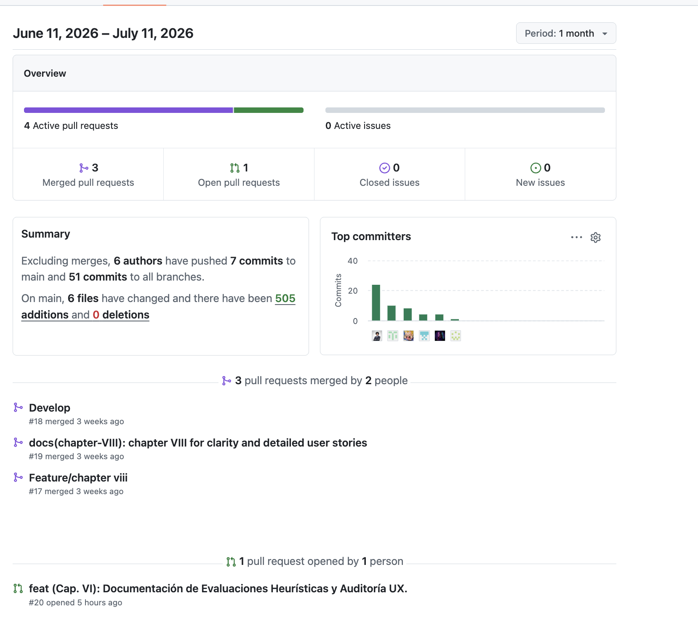

Al igual que en las entregas anteriores, el siguiente gráfico representa la cantidad de commits realizados por cada miembro del equipo en el repositorio del informe durante este cierre. Renzo Llerena lideró la consolidación final (95 commits), seguido por las contribuciones de Miguel Ángel Román López, Juan Manuel Santos Torres, Adrian Valerio, Yasser Rentería y Camilla Espinoza.

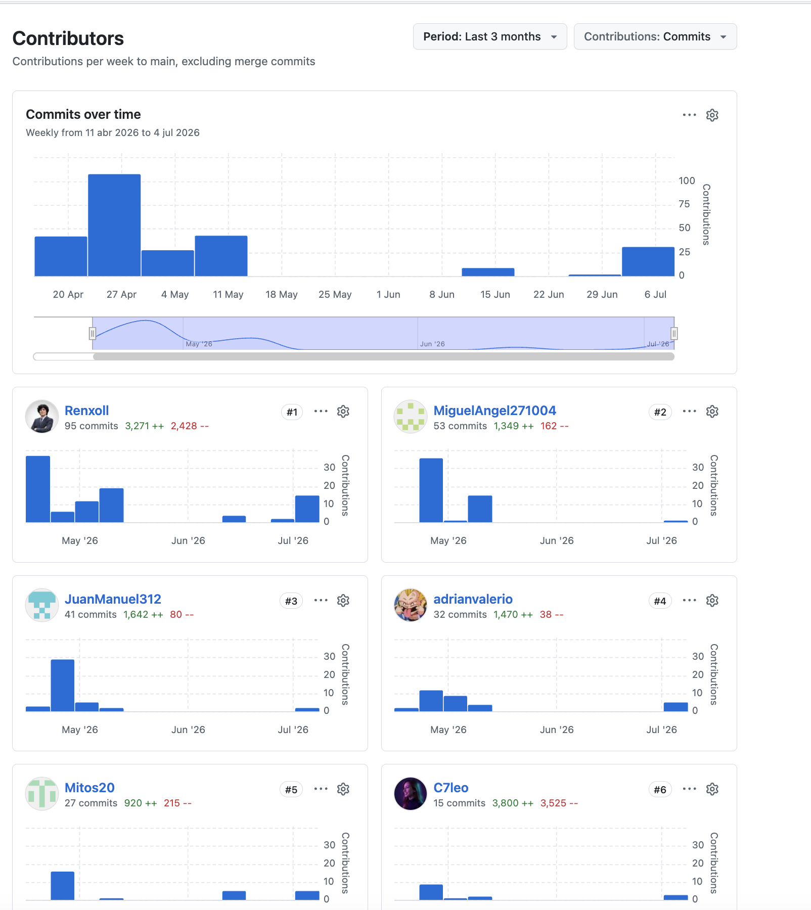


**Ramificación del proyecto usando GitFlow:**

Este gráfico ofrece una visualización de las veces que se ha clonado nuestro repositorio, junto con las fechas correspondientes a cada evento. También muestran datos sobre el número de visitas que ha recibido el repositorio de nuestro equipo a lo largo del tiempo.

**AV1**


**TB1**


**TB2**

Para el cierre del informe se mantuvo el flujo de ramas `feature/*` sobre `develop` (por ejemplo `feature/chapter-V`, `feature/ethical-impact-matrix`, `feature/anexes`, `feature/introduction`), fusionándose hacia `main` una vez validado el contenido de cada capítulo.

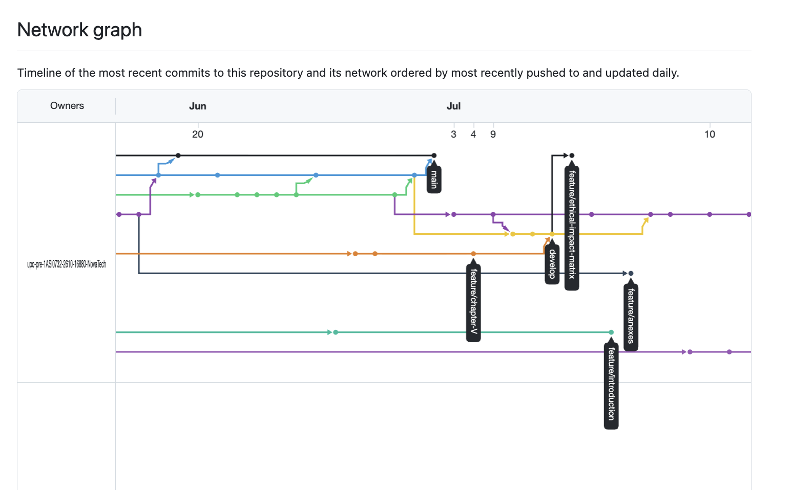

---

## Tabla de contenido

- [Capítulo I: Introducción](#capítulo-i-introducción)
- [Capítulo II: Requirements Elicitation & Analysis](#capítulo-ii-requirements-elicitation--analysis)
- [Capítulo III: Requirements Specification](#capítulo-iii-requirements-specification)
- [Capítulo IV: Product Design](#capítulo-iv-product-design)
- [Capítulo V: Product Implementation & Deployment](#capítulo-v-product-implementation--deployment)
- [Capítulo VI: Product Verification & Validation](#capítulo-vi-product-verification--validation)
- [Capítulo VII: DevOps Practices](#capítulo-vii-devops-practices)
- [Chapter VIII: Desarrollo Guiado por Experimentos](#chapter-viii-desarrollo-guiado-por-experimentos)
- [Conclusiones](#conclusiones)

---
## ABET – EAC - Student Outcome 4

El curso contribuye al cumplimiento del Student Outcome ABET:
**ABET - EAC - Student Outcome 4**

**Criterio:**  La capacidad de reconocer responsabilidades éticas y
profesionales en situaciones de ingeniería y hacer juicios informados, que deben
considerar el impacto de las soluciones de ingeniería en contextos globales, económicos,
ambientales y sociales.

En el siguiente cuadro se describe las acciones realizadas y enunciados de conclusiones por parte del grupo, que permiten sustentar el haber alcanzado el logro del ABET - EAC - Student Outcome 3.

| Criterio específico                                                                                                                                          | Acciones realizadas                                                                                                                                                                                                                                                                                                                                                                                                                                                                                                                                                                                                                                                                                                                                                                                                                                                                                                                                                                                                                                                                                                                                                                                                                                                                                                                                                                                                                                                                                                                                                                                                                                                                                                                                                                                                                                                                                                                                                                                                                                                                                                                                                                                                                                                                                                                                                                                                                                                                                                                                                                                                                                                                                                                                                                                                                                                                                                                                                                                                                                                                                                                                                                                                                                                                                                                                                                                                                            | Conclusiones                                                                                                                                                                                                                                                                                                                                                                                                                                                                                                                                                                                                                                                                                                                                                                                                                                                                                                                                                                                                                                                                                                                                                                                                                                                                                                                                                                                                                                                                                                                                                                                                                                                                                                                                                                                                                                                                                                                                                                                                                                                                                                                                                                                                                                                                                                                                                                                                                                                                                                                   |
| ------------------------------------------------------------------------------------------------------------------------------------------------------------ | ---------------------------------------------------------------------------------------------------------------------------------------------------------------------------------------------------------------------------------------------------------------------------------------------------------------------------------------------------------------------------------------------------------------------------------------------------------------------------------------------------------------------------------------------------------------------------------------------------------------------------------------------------------------------------------------------------------------------------------------------------------------------------------------------------------------------------------------------------------------------------------------------------------------------------------------------------------------------------------------------------------------------------------------------------------------------------------------------------------------------------------------------------------------------------------------------------------------------------------------------------------------------------------------------------------------------------------------------------------------------------------------------------------------------------------------------------------------------------------------------------------------------------------------------------------------------------------------------------------------------------------------------------------------------------------------------------------------------------------------------------------------------------------------------------------------------------------------------------------------------------------------------------------------------------------------------------------------------------------------------------------------------------------------------------------------------------------------------------------------------------------------------------------------------------------------------------------------------------------------------------------------------------------------------------------------------------------------------------------------------------------------------------------------------------------------------------------------------------------------------------------------------------------------------------------------------------------------------------------------------------------------------------------------------------------------------------------------------------------------------------------------------------------------------------------------------------------------------------------------------------------------------------------------------------------------------------------------------------------------------------------------------------------------------------------------------------------------------------------------------------------------------------------------------------------------------------------------------------------------------------------------------------------------------------------------------------------------------------------------------------------------------------------------------------------------------- | ------------------------------------------------------------------------------------------------------------------------------------------------------------------------------------------------------------------------------------------------------------------------------------------------------------------------------------------------------------------------------------------------------------------------------------------------------------------------------------------------------------------------------------------------------------------------------------------------------------------------------------------------------------------------------------------------------------------------------------------------------------------------------------------------------------------------------------------------------------------------------------------------------------------------------------------------------------------------------------------------------------------------------------------------------------------------------------------------------------------------------------------------------------------------------------------------------------------------------------------------------------------------------------------------------------------------------------------------------------------------------------------------------------------------------------------------------------------------------------------------------------------------------------------------------------------------------------------------------------------------------------------------------------------------------------------------------------------------------------------------------------------------------------------------------------------------------------------------------------------------------------------------------------------------------------------------------------------------------------------------------------------------------------------------------------------------------------------------------------------------------------------------------------------------------------------------------------------------------------------------------------------------------------------------------------------------------------------------------------------------------------------------------------------------------------------------------------------------------------------------------------------------------ |
| 4.c.1 Reconoce responsabilidad ética y profesional en situaciones de ingeniería de software                                                                  | Camilla Espinoza <br> **AV1** <br> Aporté activamente en el desarrollo de los capítulos 1 y 2, contribuyendo con la organización del contenido, la redacción de secciones asignadas y el cumplimiento responsable de las tareas del equipo. Asimismo, apoyé en la elaboración de entrevistas del segmento 1, manteniendo una participación constante y comprometida con los objetivos del proyecto. <br> **TB1** <br> Implementé y documenté la configuración de Continuous Integration (CI), incluyendo herramientas y prácticas para automatizar procesos de compilación y validación del proyecto. Además, participé en la ejecución automática de pruebas y verificación de estabilidad del sistema antes de integrar cambios al repositorio principal. <br> **AV2** <br>Apoyé en la elaboración y organización de la presentación del proyecto, estructurando el contenido de las diapositivas de acuerdo con los capítulos desarrollados. Además, contribuí en la redacción, diseño visual y orden de la información para que la exposición sea clara, coherente y alineada con los objetivos del trabajo.<br> **TB2** <br>Realicé la auditoría funcional de la aplicación desarrollada por otro equipo, ejecutando los casos de prueba asignados de manera objetiva, registrando evidencias y documentando los resultados en el informe de auditoría. Asimismo, participé en la elaboración de la presentación final del proyecto, organizando y sintetizando los principales hallazgos para comunicar los resultados de forma clara, precisa y profesional.<br><br> Yasser Rentería <br> **TB1** <br> Aporté activamente en el trabajo en equipo durante el desarrollo de los capítulos 2 y 5, contribuyendo en la organización, elaboración de entrevistas y entrega de Needfinding con la debida responsabilidad de las tareas. <br> **TP1** <br> Realicé pruebas de sistema verificando el funcionamiento integral de la aplicación, evaluando la navegación, estabilidad y respuesta de las funcionalidades principales en distintos escenarios de uso. <br> **TB2** <br> Contribuí en el desarrollo de capítulo 6, capítulo 8, las entrevistas de validación de los diferentes segmentos objetivos y las evidencias de nuestras aplicaciones deslegadas y API.<br><br> Adrian Valerio <br> **TB1** <br> Contribuí en el desarrollo del Capítulo 3 y en la realización de entrevistas, cumpliendo responsablemente con las tareas asignadas y manteniendo una participación constante dentro del equipo. <br> **TP1** <br> Implementé pruebas de integración para validar la correcta interacción entre módulos, backend y base de datos, asegurando la consistencia de los flujos principales del sistema. <br> **TB2** <br> Participé en la realización de entrevistas de validación dirigidas a los diferentes segmentos objetivo del proyecto. Durante estas entrevistas, presenté las funcionalidades principales de la plataforma Veyra, recopilé las opiniones de los participantes e identifiqué observaciones y oportunidades de mejora para la aplicación. Asimismo, apoyé en la documentación de las evidencias y resultados obtenidos para el desarrollo de los capítulos 6 y 8 del informe final. <br><br>Renzo Llerena <br> **TB1** <br> Participé activamente en el desarrollo de los capítulos 1, 2 y 5. Asimismo, colaboré en la realización de las entrevistas para el segmento objetivo 2 y fui responsable de llevar a cabo el despliegue de los componentes de la plataforma Veyra. <br> **TP1** <br> Implementé pruebas unitarias para las funciones principales del sistema, validando métodos críticos, lógica de negocio y distintos escenarios de ejecución para garantizar el correcto funcionamiento del backend. <br> **TB2** <br> Coordiné el cierre y consolidación del informe final del proyecto, revisando la totalidad del Capítulo VIII para asegurar su coherencia con los capítulos previos.<br><br> Juan Manuel Santos Torres <br> **TB1** <br> Realicé el trabajo, diseño y construcción del Capítulo 3. Fui quien diseñó y construyó en su totalidad las épicas, historias de usuario e historias técnicas, garantizando su coherencia con el backend, frontend y landing page. Además, me encargué de forma íntegra de la creación y reorganización del Product Backlog. <br> **TP1** <br> Desarrollé escenarios de Behavior-Driven Development (BDD) para describir el comportamiento esperado de las funcionalidades principales del sistema, definiendo criterios de aceptación alineados con las necesidades del usuario. <br> **TB2** <br> **Lideré la validación de calidad del software estructurando las evidencias de las Testing Suites (Unitarias, de Integración y BDD). Además, asumí la responsabilidad profesional de evaluar la interfaz mediante heurísticas de usabilidad y ejecuté de forma integral las auditorías de experiencia de usuario (UX), documentando tanto la auditoría realizada al equipo asignado como la planificación de modificaciones para subsanar los hallazgos que recibimos.**<br><br> Miguel Ángel Junior Román López <br> **TB1** <br> Aporté activamente en el desarrollo de todo el capítulo 4, contribuyendo con la organización del contenido, la redacción de secciones asignadas y el cumplimiento responsable de las tareas del equipo, manteniendo una participación constante y comprometida con los objetivos del proyecto. <br> **TP1** <br> Implementé procesos de Continuous Delivery / Continuous Deployment (CD) para automatizar el despliegue y publicación de nuevas versiones del sistema en entornos de prueba y producción. <br> **TB2** <br> **Asumí la responsabilidad ética y profesional de estructurar, ejecutar y documentar las Auditorías de Experiencia de Usuario (UX), abarcando tanto la auditoría realizada a otros equipos como la auditoría recibida, incluyendo el resumen de modificaciones para subsanar los hallazgos. Además, garanticé la correcta documentación del proceso de Continuous Integration, detallando de forma transparente las herramientas, prácticas y componentes del pipeline (Build & Test Suite). ** | Camilla Espinoza <br> **AV1** <br> La participación en el desarrollo de capítulos y entrevistas fortaleció mi compromiso profesional y responsabilidad dentro del trabajo colaborativo del proyecto. <br> **TB1** <br> La configuración de procesos de integración continua permitió fortalecer el trabajo colaborativo y asegurar prácticas responsables de validación automática dentro del proyecto. <br> **AV2** <br> Participé en la elaboración y organización de la presentación del proyecto, analizando y sintetizando los resultados obtenidos para comunicar de forma clara el impacto de la solución propuesta en la optimización de procesos, la gestión de la información y la experiencia de los usuarios.<br> **TB2** <br> Realicé la auditoría funcional de la aplicación desarrollada por otro equipo, evaluando los hallazgos obtenidos y formulando recomendaciones sustentadas para mejorar la calidad, seguridad y usabilidad del software. Asimismo, contribuí en la elaboración de la presentación final, comunicando el impacto de estas mejoras en la eficiencia operativa, la confiabilidad del sistema y la satisfacción de los usuarios.<br><br> Yasser Rentería <br> **TB1** <br> El trabajo realizado en equipo permitió reforzar la responsabilidad y organización necesarias para cumplir adecuadamente con los objetivos del proyecto. <br> **TP1** <br> La ejecución de pruebas de sistema permitió reforzar el compromiso profesional con la calidad y estabilidad integral de la aplicación antes de su entrega final. <br> **TB2** <br> El desarrollo de las evidencias pudo hacer que identifiquemos muchas de las correciones y bug arreglados en las diferentes aplicaciones<br><br> Adrian Valerio <br> **TB1** <br> La participación en el desarrollo del capítulo y entrevistas fortaleció mi sentido de responsabilidad profesional y compromiso ético dentro del equipo de trabajo. <br> **TP1** <br> La participación en las pruebas de integración fortaleció mi responsabilidad profesional al garantizar la correcta comunicación entre componentes críticos del sistema. <br> **TB2** <br> Analicé los resultados obtenidos en las entrevistas de validación realizadas a los diferentes segmentos objetivo, identificando cómo la plataforma Veyra podría influir en la gestión de las casas de reposo y en la comunicación con los familiares de los residentes. A partir de las opiniones recopiladas, evalué el impacto social, operativo y económico de las funcionalidades propuestas, contribuyendo a priorizar mejoras que respondieran a las necesidades reales de los usuarios.<br><br> Renzo Llerena <br> **TB1** <br> La participación en entrevistas, capítulos y despliegue de la plataforma permitió fortalecer el compromiso con el trabajo responsable y la correcta ejecución de actividades técnicas del proyecto. <br> **TP1** <br> La implementación de pruebas unitarias permitió asegurar la calidad y confiabilidad de las funciones principales del sistema, fortaleciendo el compromiso ético con el desarrollo de software seguro y mantenible. <br> **TB2** <br> Coordinar el cierre del informe reforzó mi responsabilidad profesional de asegurar que la documentación final reflejara con honestidad el estado real de lo implementado.<br><br> Juan Manuel Santos Torres <br> **TB1** <br> El diseño de épicas, historias de usuario y backlog permitió fortalecer la organización y responsabilidad profesional en la planificación y desarrollo del proyecto. <br> **TP1** <br> El desarrollo de escenarios BDD permitió garantizar que las funcionalidades implementadas respondieran adecuadamente a los requerimientos y necesidades de los usuarios. <br> **TB2** <br> **La documentación rigurosa de las pruebas y auditorías de usabilidad reforzó mi ética profesional, demostrándome que la responsabilidad de un ingeniero de software no termina en la escritura del código, sino en garantizar de manera transparente que el producto final sea estable, seguro y cumpla con los más altos estándares de calidad antes de llegar al usuario final.**<br><br> Miguel Ángel Junior Román López <br> **TB1** <br> La participación en el desarrollo del capítulo 4 fortaleció el compromiso con la calidad del contenido, diseño y cumplimiento de los objetivos del equipo. <br> **TP1** <br> La automatización de despliegues y entregas continuas fortaleció las buenas prácticas de desarrollo responsable y mejoró la eficiencia del proceso de publicación del sistema. <br> **TB2** <br> **Documentar las auditorías UX y los procesos de integración continua reforzó mi compromiso ético con la calidad del producto. Comprendí que la responsabilidad profesional de un ingeniero abarca tanto asegurar una experiencia de usuario fluida y libre de fricciones como mantener una infraestructura de despliegue estable y automatizada. ** |
| 4.c.2 Emite juicios informados considerando el impacto de las soluciones de ingeniería de software en contextos globales, económicos, ambientales y sociales | Camilla Espinoza <br> **AV1** <br> Participé en el análisis y mejora del Capítulo 3, especialmente en la revisión de épicas, historias de usuario e historias técnicas, verificando su coherencia con el backend, frontend y landing page. Además, apoyé en la reorganización del Product Backlog y en la elaboración de la presentación PPT del proyecto. <br> **TB1** <br> Evalué el impacto técnico y operativo de automatizar procesos de compilación y pruebas mediante CI, permitiendo reducir errores humanos, optimizar tiempos de desarrollo y mejorar la estabilidad del software entregado a los usuarios. <br> **AV2** <br>Apoyé en la organización del contenido del proyecto y de la presentación, procurando que la información se mostrara de forma clara, coherente y ordenada. Además, contribuí a estructurar las ideas considerando el impacto de la solución en los usuarios, el contexto social y la utilidad del sistema para mejorar la gestión en casas de reposo.<br> **TB2** <br>Durante la auditoría del sistema de otro equipo, evalué objetivamente los hallazgos y emití conclusiones sustentadas sobre el impacto de las mejoras propuestas en la calidad, confiabilidad y usabilidad del software. Asimismo, contribuí a la presentación final, comunicando cómo las recomendaciones de la auditoría pueden optimizar los procesos de la organización, reducir riesgos operativos y mejorar la experiencia de los usuarios.<br><br> Yasser Rentería <br> **TB1** <br> Apoyé en la generación de valor para la solución, el alto impacto del proyecto y la organización de las ideas para futuros procesos. <br> **TP1** <br> Analicé el comportamiento integral del sistema mediante pruebas funcionales completas, identificando posibles riesgos que podrían afectar la experiencia y confiabilidad para los usuarios finales. <br> **TB2** <br> Contribuí en el desarrollo de capítulo 6, capítulo 8, las entrevistas de validación de los diferentes segmentos objetivos y las evidencias de nuestras aplicaciones deslegadas y API.<br><br> Adrian Valerio <br> **TB1** <br> Participé en el desarrollo del Capítulo 3 y análisis de entrevistas, identificando necesidades reales de los usuarios y considerando su impacto en la solución propuesta. <br> **TP1** <br> Realicé pruebas de integración considerando el impacto de posibles fallos de comunicación entre componentes, asegurando la continuidad y estabilidad de los servicios del sistema. <br> **TB2** <br> Implemente el desarrollo de capítulo 6, capítulo 8, las entrevistas de validación de los diferentes segmentos objetivos y las evidencias de nuestras aplicaciones deslegadas y API.<br><br>Renzo Llerena <br> **TB1** <br> Participé activamente en el desarrollo de los capítulos 1, 2 y 5. Asimismo, colaboré en la realización de las entrevistas para el segmento objetivo 2 y fui responsable de llevar a cabo el despliegue de los componentes de la plataforma Veyra. <br> **TP1** <br> Implementé pruebas unitarias orientadas a prevenir errores en funcionalidades críticas, reduciendo riesgos operativos y mejorando la confiabilidad del sistema para los usuarios y el equipo de desarrollo. <br> **TB2** <br> Redacté la Matriz de Evaluación Ética y de Impacto, sintetizando los juicios informados del equipo sobre las consecuencias éticas, sociales, económicas, ambientales y globales de las decisiones de ingeniería tomadas durante el proyecto.<br><br> Juan Manuel Santos Torres <br> **TB1** <br> Realicé el trabajo, diseño y construcción del Capítulo 3. Fui quien diseñó y construyó en su totalidad las épicas, historias de usuario e historias técnicas, garantizando su coherencia con el backend, frontend y landing page. Además, me encargué de forma íntegra de la creación y reorganización del Product Backlog. <br> **TP1** <br> Elaboré escenarios BDD alineados con las necesidades de los usuarios y criterios funcionales del sistema, permitiendo validar que las soluciones desarrolladas respondan correctamente al comportamiento esperado. <br> **TB2** <br> **Analicé el impacto directo de nuestra plataforma evaluando el cumplimiento de las heurísticas de usabilidad y gestionando el cruce de auditorías de UX. Esto me permitió emitir juicios críticos para priorizar las modificaciones necesarias en el sistema, enfocándome en cómo los errores de interacción o diseño afectan la experiencia real de los usuarios en su entorno de trabajo.**<br><br> Miguel Ángel Junior Román López <br> **TB1** <br> Participé en el análisis y mejora del Capítulo 4, especialmente en la Landing Page UI Design, Web Applications UX/UI Design, Web Applications Prototyping, Domain-Driven Software Architecture. Además, apoyé en la elaboración de la presentación PPT del proyecto y revisión general de todo el reporte y landing page. <br> **TP1** <br> Implementé procesos automatizados de despliegue continuo para mejorar la rapidez y confiabilidad en la publicación de nuevas versiones del sistema, reduciendo tiempos de inactividad y errores manuales. <br> **TB2** <br> **Analicé los resultados de las auditorías de UX cruzadas para emitir juicios críticos sobre cómo los fallos de interfaz afectan la productividad y adopción por parte de los usuarios, formulando un plan de modificaciones estratégicas. Asimismo, evalué el impacto técnico y económico de mantener pipelines eficientes de Continuous Integration (Build & Test Suites) para minimizar riesgos y costos operativos por fallos en producción. ** | Camilla Espinoza <br> **AV1** <br> El análisis de historias de usuario y backlog permitió comprender mejor el impacto de las decisiones de software en la organización y experiencia del usuario. <br> **TB1** <br> La implementación de integración continua permitió reducir riesgos técnicos y optimizar los procesos de desarrollo, generando una solución más confiable para los usuarios. <br> **AV2** <br> La elaboración de la presentación permitió analizar y comunicar los resultados del proyecto, identificando el impacto de la solución en la mejora de los procesos, la organización de la información y la experiencia de los usuarios, sustentando las conclusiones con los resultados obtenidos.<br> **TB2** <br> La auditoría realizada permitió emitir juicios fundamentados sobre la calidad del software a partir de la evidencia recopilada. Las recomendaciones propuestas contribuyen a mejorar la usabilidad, confiabilidad y eficiencia del sistema, generando un impacto positivo tanto para la organización como para sus usuarios.<br><br> Yasser Rentería <br> **TB1** <br> La participación en la generación de valor del proyecto permitió reconocer la importancia del impacto social y funcional de la solución propuesta. <br> **TP1** <br> Las pruebas de sistema ayudaron a identificar riesgos funcionales y mejorar la estabilidad general del sistema, favoreciendo una experiencia más segura para los usuarios finales. <br> **TB2** <br> El desarrollo de las evidencias pudo hacer que identifiquemos muchas de las correciones y bug arreglados en las diferentes aplicaciones <br><br> Adrian Valerio <br> **TB1** <br> El análisis de entrevistas permitió comprender mejor las necesidades reales de los usuarios y el impacto de las soluciones desarrolladas en su entorno. <br> **TP1** <br> El desarrollo de pruebas de integración permitió comprender la importancia de mantener una comunicación estable entre componentes para garantizar una experiencia confiable para los usuarios. <br> **TB2** <br> **[Placeholder – Adrian Valerio: completar conclusión/reflexión sobre el cierre del proyecto]**<br><br> Renzo Llerena <br> **TB1** <br> La participación en entrevistas y despliegue de la plataforma permitió comprender el impacto operativo y funcional que tiene el software en los usuarios y en la continuidad del servicio. <br> **TP1** <br> Las pruebas unitarias permitieron identificar tempranamente posibles errores críticos, contribuyendo a una solución más estable y sostenible para el proyecto. <br> **TB2** <br> Elaborar la Matriz Ética me permitió reconocer que el impacto de una solución de software debe evaluarse de forma explícita y documentada, y no darse por sentado como consecuencia automática de un buen diseño técnico.<br><br> Juan Manuel Santos Torres <br> **TB1** <br> La organización de épicas e historias de usuario permitió analizar de manera más precisa las necesidades del proyecto y su impacto en el desarrollo de la solución. <br> **TP1** <br> La aplicación de escenarios BDD permitió validar funcionalidades centradas en las necesidades reales de los usuarios y asegurar una mejor calidad funcional del sistema. <br> **TB2** <br> **El proceso de evaluación heurística y auditoría cruzada me enseñó a valorar el impacto social y económico del software. Comprendí que resolver problemas de experiencia de usuario e implementar flujos de validación accesibles es fundamental, ya que una interfaz intuitiva y libre de errores define si una herramienta tecnológica realmente facilita la vida de las personas o se convierte en un obstáculo operativo.**<br><br> Miguel Ángel Junior Román López <br> **TB1** <br> La participación en el diseño UI/UX y arquitectura permitió comprender cómo las decisiones tecnológicas impactan en la experiencia y accesibilidad para los usuarios. <br> **TP1** <br> La automatización de despliegues permitió optimizar la entrega de nuevas versiones del sistema y mejorar la continuidad operativa del proyecto. <br> **TB2** <br> **La gestión de las auditorías UX y de la integración continua me permitió comprender que las decisiones de ingeniería tienen un impacto directo en la sostenibilidad del proyecto. Entendí que resolver problemas de usabilidad evita la pérdida de tiempo para los usuarios, mientras que una integración continua bien configurada optimiza el uso de recursos tecnológicos, asegurando la escalabilidad a largo plazo. ** |

---


## Capítulo I: Introducción
El presente proyecto tiene como finalidad el diseño, desarrollo e implementación de una solución Saas, incluyendo una aplicación web y una aplicación movil, con el objetivo de resolver problemáticas reales en contextos productivos. Esta solución se construye bajo un enfoque de ingeniería de software moderna, incorporando metodologías ágiles, diseño centrado en el usuario (Lean UX) y arquitecturas escalables orientadas a servicios.

En el contexto actual, las organizaciones enfrentan desafíos relacionados con la captura, procesamiento y análisis de datos en tiempo real, especialmente en entornos donde aún predominan procesos manuales o semi-digitalizados. Estas limitaciones generan ineficiencias operativas, retrasos en la toma de decisiones y pérdida de información relevante.

Frente a este escenario, el presente proyecto propone el desarrollo de un ecosistema digital que permita la automatización de la recolección de datos mediante dispositivos IoT, su procesamiento inteligente y su visualización a través de aplicaciones web y móviles, contribuyendo a la mejora de la eficiencia operativa y la toma de decisiones basada en datos.
### 1.1. Startup Profile
La presente sección describe el contexto general de la startup responsable del desarrollo de la solución propuesta. Se presenta una visión general de la organización, su enfoque tecnológico y propuesta de valor, así como la caracterización de los integrantes del equipo, destacando sus perfiles y roles dentro del proyecto.
#### 1.1.1. Descripción de la Startup
NovaTech es una startup tecnológica enfocada en el desarrollo de soluciones digitales basadas en modelos SaaS, integrando aplicaciones web y móviles con sistemas backend escalables. Su propuesta de valor se centra en la interoperabilidad, la accesibilidad y la adaptabilidad a distintos contextos empresariales, especialmente en sectores con baja digitalización.

El modelo de negocio de NovaTech es inherentemente escalable, permitiendo el crecimiento mediante la incorporación de nuevas instituciones sin incrementos proporcionales en los costos operativos. Esto facilita su expansión en el mercado latinoamericano, particularmente en el sector geriátrico.

En el marco de este proyecto, la startup desarrolla una solución orientada al sector salud, específicamente al monitoreo y gestión de información de pacientes en casas de reposo.

##### Misión
Desarrollar soluciones tecnológicas innovadoras que permitan a las organizaciones optimizar sus procesos mediante el uso de datos, automatización e integración de tecnologías emergentes.

##### Visión
Ser una startup referente en Latinoamérica en el desarrollo de soluciones SaaS (aplicaciones web y móviles), destacando por su innovación, escalabilidad y enfoque centrado en el usuario.

#### 1.1.2. Perfiles de integrantes del equipo
<div style="page-break-after: always;"></div>

<table border="1" width="100%">
  <tr>
    <td width="140" valign="top" align="center">
      
    </td>
    <td valign="top">
      <strong>Renzo Miguel Llerena Delgado - (U202312399)</strong> - Ingeniería de Software<br><br>
      Tengo 19 años, soy una persona tranquila, colaborativa y adaptable. Me gusta trabajar en equipo, aportando ideas y soluciones. Cuento con conocimientos en C++ y Python y siempre busco formas de hacer las cosas de manera eficiente.
    </td>
  </tr>

  <tr>
    <td width="140" valign="top" align="center">
      
    </td>
    <td valign="top">
      <strong>Juan Manuel Santos Torres - (U20221A371)</strong> - Ingeniería de Software<br><br>
      Me gusta mucho buscar la manera más sencilla y rápida de resolver cualquier problema, usando herramientas digitales para que el trabajo sea menos pesado. Soy alguien que siempre está metido en nuevos proyectos y me encanta trabajar con más personas para intercambiar ideas. Tengo 21 años y trato de que todo lo que hago, ya sea en los estudios o en el trabajo, tenga un orden y un propósito claro.
    </td>
  </tr>

  <tr>
    <td width="140" valign="top" align="center">
      
    </td>
    <td valign="top">
      <strong>Adrian Emanuel Valerio Garcia - (U202210334)</strong> - Ingeniería de Software<br><br>
      Me interesa el aprendizaje continuo y suelo enfocarme en resolver problemas de manera rápida y eficiente. Disfruto los videojuegos y aprender nuevas tecnologías, además de trabajar en equipo para lograr objetivos en conjunto. Tengo conocimientos en lenguajes de programación y procuro mejorar constantemente mis métodos de estudio para ampliar mis habilidades.
    </td>
  </tr>
    <tr>
    <td width="140" valign="top" align="center">
      
    </td>
    <td valign="top">
      <strong>Miguel Ángel Román López - (U202212897)</strong> - Ingeniería de Software<br><br>
      Poseo conocimientos en C++, programación orientada a objetos y diseño web. Mi aporte será investigación, ideas e imaginación para realizar un buen proyecto y cumplir con las entregas.
    </td>
  </tr>

  <td width="140" valign="top" align="center">
      
    </td>
    <td valign="top">
     <strong>Yasser Rentería Palacios - (U202214130)</strong> - Ingeniería de Software<br><br>
       Soy estudiante de Ingeniería de Software en la UPC, con enfoque en el desarrollo de aplicaciones web y la construcción de soluciones tecnológicas eficientes. Me interesa el aprendizaje continuo de lenguajes de programación, frameworks modernos y buenas prácticas de desarrollo. Asumo el rol de **Software Developer**, enfocado en transformar diseños y arquitecturas en soluciones funcionales, mediante la implementación de APIs, lógica de negocio y aplicaciones web o multiplataforma. Busco desarrollar software limpio, escalable y mantenible, siguiendo estándares de codificación que garanticen un trabajo colaborativo eficiente. Cuento con conocimientos en lenguajes como Python, Java y C#, así como en desarrollo frontend con Angular y Vue.js, y fundamentos de backend para la creación de APIs y lógica de negocio. También tengo experiencia trabajando con bases de datos como MongoDB, aplicando conceptos de modelado de datos y validación.
    </td>
     </tr>
    <td width="140" valign="top" align="center">
      
    </td>
    <td valign="top">
     <strong>Camilla Leonor Espinoza Vivas - (U202214572)</strong> - Ingeniería de Software<br><br>
      Poseo conocimientos en Ingeniería de Software enfocados al desarrollo web full-stack, utilizando tecnologías como Angular, Spring Boot, Java, TypeScript, JavaScript, HTML5 y CSS3. Tengo experiencia en diseño de software orientado a objetos, arquitectura RESTful, modelado con diagramas de clases y consumo/documentación de APIs con Swagger. Además, manejo control de versiones con Git y GitHub, y cuento con habilidades en UX/UI, prototipado y trabajo bajo metodologías ágiles utilizando herramientas como Jira Software.
    </td>
  </tr>  
</table>

### 1.2. Solution Profile
Veyra es una plataforma digital integral basada en un modelo SaaS, diseñada para mejorar la gestión de información clínica y operativa en casas de reposo. Permite el acceso remoto a datos relevantes tanto para el personal asistencial como para los familiares, facilitando la transparencia y la toma de decisiones informadas.

#### 1.2.1. Antecedentes y problemática

**1. ANTECEDENTES**

La población mundial envejece rápidamente, y América Latina no es la excepción. En 2022 había unos 88,6 millones de personas de 60 años o más en la región (13,4% de la población). En Perú, este fenómeno demográfico se refleja en que actualmente el 13,9% de la población (≈4 748 000 personas) tiene 60 años o más. Esta proporción crece a un ritmo sostenido (≈2,7% anual) y se estima que para el 2050 cerca del 25% de los peruanos formará parte de la comunidad de adultos mayores Este cambio estructural incrementa la demanda de servicios geriátricos (casas de reposo, centros de día, atención domiciliaria, etc.) y plantea retos en salud, pensiones y cuidado social.

En este contexto, las casas de reposo cumplen un rol crucial en el bienestar de los mayores, pero su gestión enfrenta limitaciones tecnológicas. Tradicionalmente, ingresar a una residencia era visto como "apartar" al anciano, pero hoy se reconoce que la familia sigue teniendo un rol activo en el cuidado. Sin embargo, la modernización digital del sector es incipiente: muchas residencias aún manejan la información clínica y administrativa en papel o en sistemas aislados. De hecho, incluso en el sistema de salud peruano en general "muchos hospitales y postas aún registran a mano la información del paciente" y la compartición de datos es limitada, pues cada institución (MINSA, EsSalud, FF.AA., FFAA, sector privado) opera con historiales fragmentados. Solo unas pocas residencias pioneras habían iniciado planes de transformación digital antes de la pandemia, siendo la COVID-19 un catalizador que "agilizó la necesidad de un gran cambio" tecnológico en los centros geriátricos. Esta falta de digitalización contribuye a la desconexión informativa entre las casas de reposo y los familiares. En la práctica, la comunicación suele limitarse a llamadas telefónicas esporádicas o visitas puntuales, sin un canal permanente de intercambio de datos. Esta brecha se traduce en frustración y ansiedad: los familiares desean recibir información puntual sobre la salud, actividades y necesidades de sus seres queridos, pero carecen de medios eficientes para ello. De hecho, expertos han señalado "la necesidad de la creación de una plataforma" que aproveche las últimas tecnologías para facilitar la interacción continua entre los familiares y el centro de cuidado.

**2. PROBLEMÁTICA**

Comunicación deficiente: El personal de las residencias de adultos mayores suele tener una alta carga de trabajo, lo que limita el tiempo disponible para informar a las familias. Se ha documentado que "en muchas residencias, el personal de atención directa se encuentra bajo una presión de tiempo que dificulta tener conversaciones con los miembros de la familia". Esta situación genera malentendidos, desconfianza y estrés emocional en los parientes, que a menudo no saben a quién recurrir o deben esperar largas horas para recibir respuestas básicas.

Falta de acceso a información en tiempo real: Los familiares no disponen de un medio seguro para consultar el estado clínico o las actividades diarias del residente de manera instantánea. La carencia de un portal o aplicación web significa que no pueden verificar datos como medicación administrada, citas médicas, registro de tratamientos o estado de ánimo sin depender de consultas directas al personal. En la práctica esto implica que las familias deben realizar numerosas llamadas telefónicas o visitas recurrentes para obtener actualizaciones, lo que aumenta la carga de trabajo de los cuidadores y mantiene a los parientes en incertidumbre. (Por el contrario, el uso de herramientas digitales permitiría "acceso constante a información actualizada", reduciendo la ansiedad y las llamadas repetitivas). Datos clínicos fragmentados: Los registros sanitarios de cada residente suelen estar dispersos en historias clínicas físicas o sistemas locales no integrados. Esto provoca duplicidad de información y dificulta el seguimiento longitudinal de la salud del adulto mayor. Por ejemplo, si un centro no cuenta con un expediente único digital, las anotaciones de enfermería, el historial médico y los reportes de actividades pueden quedar desorganizados o inaccesibles desde la distancia, lo que complica la coordinación entre médicos, enfermeras y familia.

Ausencia de plataformas integradas: Actualmente, no existe en el sector una solución web centralizada que unifique la gestión clínica, administrativa y comunicacional en residencias peruanas. Muchas tareas administrativas –como el control de pagos, el registro de recetas o los reportes diarios– se realizan de forma manual o en hojas de cálculo, sin interoperabilidad. Esta falta de automatización genera lentitud en los procesos y riesgo de errores, afectando la eficiencia del personal y reduciendo la transparencia hacia los familiares.

Baja adopción tecnológica: A diferencia de otros sectores de salud, las casas de reposo en Perú han incorporado la tecnología de forma limitada. Aunque en otros países especialistas destacan que la digitalización ofrece mejoras significativas en la calidad asistencial, en nuestro entorno las iniciativas tecnológicas (como teleasistencia o software de gestión) son incipientes Esta baja adopción implica que los centros dependen de métodos tradicionales, lo que aumenta la brecha con las expectativas modernas de atención y comunicación.

**Análisis 5W+2H:**

**What (¿Qué?):** Veyra busca resolver la falta de comunicación y coordinación entre las casas de reposo y las familias de los residentes. La plataforma web integrará el registro clínico, tratamientos, recordatorios, reportes diarios y datos administrativos en un único sistema accesible, permitiendo que el personal de las instituciones gestione la información y que los familiares consulten de forma segura el estado y la historia de su adulto mayor.

**Why (¿Por qué?):** Es importante abordar este problema para mejorar la calidad de vida de los adultos mayores y dar tranquilidad a sus familias. Al centralizar la información y ofrecer acceso en línea, Veyra reduce el estrés familiar, aumenta la transparencia en la atención y optimiza las tareas del personal. En un contexto de rápido envejecimiento poblacional, la solución contribuye a que las residencias operen de manera más eficiente y moderna, alineándose con estándares actuales de cuidado y facilitando el cumplimiento de las normativas de salud.

**Who (¿Quién?):** Afecta principalmente a dos grupos: el personal técnico y administrativo de las instituciones geriátricas, que necesitan gestionar datos clínicos y operativos de forma ordenada; y los familiares de los residentes, quienes demandan información actualizada y comunicación efectiva. Veyra beneficiará asimismo a los mismos adultos mayores al garantizar un seguimiento más riguroso de su atención médica, aunque ellos no serán usuarios directos de la plataforma (la interfaz está diseñada para personal técnico y familiares).

**When (¿Cuándo?):** Esta necesidad es especialmente crítica en la actualidad, debido a que el envejecimiento de la población ya supera ciertos umbrales y seguirá aumentando en las próximas décadas. Además, situaciones cotidianas como emergencias médicas, cambios de tratamiento o eventos familiares resaltan la urgencia de tener información actualizada en tiempo real. En consecuencia, el momento más crítico es el presente y el futuro inmediato, cuando las residencias busquen modernizar sus procesos y ofrecer mejores servicios ante el aumento sostenido de adultos mayores.

**Where (¿Dónde?):** Ocurre principalmente en el ámbito de casas de reposo, residencias geriátricas y centros de atención diurna en Perú (especialmente en las zonas urbanas con más población envejecida), así como en cualquier institución similar de Latinoamérica interesada en mejorar su gestión. También implica el contexto familiar de esos residentes, quienes pueden estar localizados tanto en la misma ciudad como en regiones distantes, requiriendo acceso remoto a la información.

**How (¿Cómo?):** Se resuelve mediante el desarrollo de Veyra, una aplicación web centralizada en la nube. El personal de la residencia ingresará datos clínicos, tratamientos y reportes a través de la plataforma, que implementará seguridad y cifrado para proteger la confidencialidad. Los familiares dispondrán de un portal web seguro con acceso mediante credenciales, donde consultarán los datos relevantes en cualquier momento. En el futuro se integrarán dispositivos IoT (brazaletes, sensores biométricos) para automatizar la captura de constantes vitales y movimiento, pero esto queda fuera del alcance inicial. La plataforma facilitará notificaciones y recordatorios (por ejemplo, de medicación o citas) y podrá escalar conforme crezca el número de usuarios.

**How much (¿Cuánto?):** El modelo de ingresos proyectado es de tipo SaaS (Software como Servicio). Se planea ofrecer suscripción mensual o anual a las instituciones (casas de reposo) basada en el tamaño o número de residentes. La tarifa cubriría acceso al sistema, soporte técnico y futuras actualizaciones (por ejemplo, incorporación de IoT). Los familiares tendrían acceso incluido con la suscripción del centro, de modo que el costo recae sobre la institución. Adicionalmente, se podría considerar un esquema escalonado: un plan básico con funciones esenciales y niveles superiores con módulos avanzados (informes personalizados, integración de dispositivos, etc.), así como una tarifa de implementación inicial para configurar el sistema. Esto permitirá sostenibilidad económica de Veyra adaptada al mercado de residencias de tercera edad.

#### 1.2.2. Lean UX Process

El Lean UX es un enfoque que permite validar las soluciones propuestas para problemas identificados. Este enfoque se centra en las personas que utilizarán nuestro producto. Una vez identificada la problemática a resolver, se empleó este proceso para reconocer áreas clave que contribuirán a dar forma al producto propuesto.

##### 1.2.2.1. Lean UX Problem Statements

El estado actual del **cuidado de adultos mayores en casas de reposo** se ha enfocado principalmente en **procesos manuales y registros físicos,** lo que provoca **ineficiencias operativas, falta de transparencia, pérdida de información y riesgos en la gestión clínica y médica.** Esta situación afecta a **administradores, personal de salud y familiares de los residentes,** quienes dependen de métodos desactualizados para acceder y compartir información crítica sobre la salud de los adultos mayores.

Lo que los productos o servicios existentes no logran resolver es la centralización **digital de la gestión médica y comunicacional dentro de las casas de reposo.** Actualmente, **no existe una solución integrada que unifique el monitoreo de salud, la comunicación con familiares y el control administrativo** en una sola plataforma segura y confiable.

Nuestro producto, **Veyra**, abordará esta brecha mediante una **plataforma web segura, intuitiva y escalable que:**

- Centraliza la información médica y administrativa de los residentes.

- Facilita la comunicación directa y transparente entre las casas de reposo y los familiares.

- Ofrece reportes visuales, alertas automáticas y seguimiento en tiempo real.

Nuestro enfoque inicial estará dirigido a **los administradores de casas de reposo privadas ubicadas en zonas urbanas,** con entre **20 y 80 residentes,** que ya utilicen herramientas digitales básicas. También se orientará a **familiares y apoderados** que busquen un **seguimiento transparente y continuo** del estado de salud de sus seres queridos.

Sabremos que tenemos éxito cuando observemos **mayor transparencia y confianza entre los administradores de casas de reposo y familiares de los adultos mayores, tiempos de respuesta más rápidos ante eventos médicos, mayor participación de los usuarios en la plataforma y una reducción medible de los errores de comunicación.**

#### 1.2.2.2. Lean UX Assumptions

**Business Assumptions:**

Existe un mercado suficientemente grande de **casas de reposo privadas medianas (20 a 80 residentes)** en Perú y Latinoamérica que necesitan digitalizar sus procesos para seguir siendo competitivas.

Los **directores y administradores** están dispuestos a invertir en una plataforma SaaS como Veyra **si perciben mejoras claras en eficiencia operativa, control de la información y reputación frente a las familias**.

Las residencias pueden **asumir una suscripción mensual o anual** (por sede o por número de residentes) sin afectar de forma crítica su estructura de costos, siempre que el valor percibido sea evidente.

La **digitalización de procesos internos** (historial clínico, comunicación con familiares, reportes y cobros) genera **ahorros en tiempo y reducción de errores** que compensan el costo de implementación y operación de Veyra.

Los beneficios de **mayor transparencia hacia los familiares** se traducen en **mayor ocupación, fidelización y recomendación** de la residencia, lo que hace sostenible el modelo de negocio de Veyra.

El modelo **SaaS B2B** de Veyra es escalable a **otras ciudades y países de la región** con ajustes principalmente comerciales (precio, regulaciones), sin cambios estructurales en el producto base.

**Business Outcomes:**

Queremos que las **casas de reposo adopten Veyra como su herramienta principal de gestión**, registrando diariamente información médica, medicamentos y reportes.

Buscamos que los **familiares consulten regularmente la plataforma**, interactúen con el personal y reporten mayor confianza y satisfacción.

Esperamos reducir en un 30% **los errores en la administración de medicamentos** y mejorar en un **40% la eficiencia operativa** del personal durante los primeros seis meses.

Queremos que las **instituciones perciban un ahorro de tiempo administrativo** y una reducción en las llamadas o consultas manuales de familiares.

Aspiramos a que **nuevas casas de reposo se suscriban a planes de pago mensuales**, validando el valor percibido del producto.

Buscamos que Veyra se consolide como una **solución tecnológica de referencia** en la gestión integral del cuidado de adultos mayores.

**User Assumptions:**

Los **administradores y personal médico** necesitan herramientas que integren historiales, medicamentos, citas y reportes en un solo lugar.

Los **familiares o apoderados** requieren acceso rápido, seguro y claro a la información de salud de los residentes, sin depender de llamadas o correos.

Ambos grupos valoran **la transparencia, la inmediatez y la facilidad de uso** por encima de las funciones excesivamente técnicas.

Los **administradores** priorizan la eficiencia operativa y la reducción de errores.

Los **familiares** buscan confianza, tranquilidad y cercanía con la institución.

Existe una disposición positiva hacia las soluciones digitales siempre que sean **intuitivas, seguras y personalizables según el rol del usuario.**

**User Outcomes:**

Los **administradores** reportan una mejor organización y control del flujo de trabajo interno.

El **personal médico** disminuye el uso de registros en papel y optimiza la actualización de información clínica.

Los **familiares** se sienten más tranquilos e informados, reduciendo su necesidad de llamadas o visitas presenciales.

Las **decisiones clínicas y administrativas** se basan en datos actualizados, reduciendo errores.

Las instituciones **mejoran su comunicación y reputación** gracias a la transparencia en la atención.

Los usuarios recomiendan Veyra como una **herramienta confiable, moderna y fácil de usar.**

**Features:**

1) **Módulo de historial clínico digital** con acceso restringido por rol, que permite a administradores y cuidadores gestionar y actualizar datos en tiempo real, evitando pérdidas de información.

2) **Aplicación web para familiares** donde pueden visualizar notificaciones y reportes médicos actualizados, reduciendo la incertidumbre y aumentando la confianza en el servicio.

3) **Sistema de alertas automáticas** sobre medicamentos, citas y posibles emergencias médicas, que mejora la coordinación del cuidado y reduce el riesgo de errores.

4) **Paneles analíticos e informes descargables** que permiten a los administradores tomar decisiones basadas en datos y optimizar el uso de recursos clínicos y administrativos.

5) **Canales de comunicación interna y externa** (por ejemplo, chat o registro estructurado de comunicaciones) integrados en la plataforma, para fortalecer el vínculo entre familias y personal del hogar.

##### 1.2.2.3. Lean UX Hypothesis Statements

**Hipótesis 1 – Historial clínico digital**

Creemos que lograremos **una mejora significativa en la eficiencia operativa y reducción de errores en los registros médicos,**

si **los administradores y cuidadores**

Obtienen **la capacidad de gestionar y actualizar la información clínica de los residentes en tiempo real y de forma segura,**

Con **un módulo de historial clínico digital con acceso restringido por rol.**

**Hipótesis 2 – Notificaciones y reportes para familiares**

Creemos que lograremos **un aumento en la confianza y satisfacción de los familiares respecto al servicio de cuidado,**

Si **los familiares y apoderados de los adultos mayores**

Obtienen **visibilidad inmediata y transparente del estado de salud y atención médica de sus seres queridos,**

Con **una aplicación web que les permita visualizar notificaciones y reportes médicos actualizados.**

**Hipótesis 3 – Alertas automáticas de salud y medicación**

Creemos que lograremos **una reducción en los errores médicos y una mejor coordinación del cuidado diario,**

Si **los cuidadores y administradores de las casas de reposo**

Reciben **alertas oportunas sobre medicamentos, citas y posibles emergencias médicas,**

Con **un sistema automatizado de notificaciones y recordatorios inteligentes.**

**Hipótesis 4 – Paneles analíticos e informes descargables**

Creemos que lograremos **una toma de decisiones más informada y una gestión más eficiente de los recursos clínicos,**

si **los administradores de las casas de reposo**

Acceden a **indicadores visuales, métricas y reportes descargables sobre el estado de salud y desempeño institucional,**

Con **paneles analíticos avanzados e informes generados por la plataforma.**

**Hipótesis 5 – Canales de comunicación integrados**

Creemos que lograremos **un fortalecimiento del vínculo emocional y la confianza entre familiares y cuidadores,**

Si **las familias y el personal de las casas de reposo**

Pueden **comunicarse de forma directa, rápida y segura sobre el estado del residente,**

Con **la integración de canales de comunicación interna y externa como chat o llamadas dentro de Veyra.**

##### 1.2.2.4. Lean UX Canvas

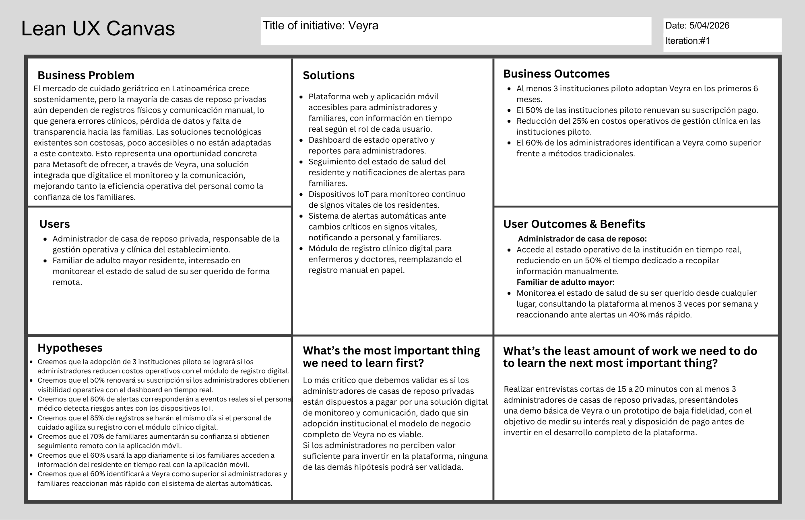

### 1.3. Segmentos objetivos

Esta sección incluye la descripción de los segmentos asociados al dominio del problema, incluyendo características demográficas e información estadística de sustento.

#### Segmento Objetivo 1: Administradores o directores de casas de reposo 

Características demográficas:

Edad: Entre 35 y 65 años.

Género: Indistinto.

Ocupación: Administradores, directores o gerentes de casas de reposo privadas o centros geriátricos.

Nivel educativo: Profesionales con grado universitario en administración, enfermería, gerontología o afines.

Ubicación geográfica: Principalmente áreas urbanas del Perú.

Información estadística de sustento:

Según la Superintendencia Nacional de Salud (SUSALUD) (2023), existen ≈320 casas de reposo registradas en Perú, con un crecimiento del 12% anual debido al envejecimiento poblacional.

El INEI reporta que el 13.1% de la población peruana son adultos mayores (≥60 años), y se proyecta que alcance el 20% para 2050. Esto incrementa la demanda de servicios geriátricos formales.

Un estudio de la Cámara de Comercio de Lima (2022) indica que el 75% de estas residencias utiliza métodos manuales (papel o Excel) para gestionar información, lo que genera ineficiencias y errores.

#### Segmento Objetivo 2: Familiares de adultos mayores 

Características demográficas:

Edad: Entre 35 y 65 años (hijos o cuidadores principales de adultos mayores).

Género: Mayormente, mujeres (70%), quienes asumen roles de cuidado en Perú (INEI, 2023).

Ocupación: Profesionales, trabajadores independientes o empleados con tiempo limitado.

Nivel socioeconómico: Medio y medio-alto, con capacidad de pago para residencias privadas.

Ubicación geográfica: Zonas urbanas de Perú, especialmente Lima Metropolitana (50%) y capitales regionales.

Información estadística de sustento:

El INEI reporta que el 30% de adultos mayores peruanos vive en hogares multigeneracionales, pero la migración laboral y la urbanización han aumentado la demanda de residencias geriátricas.

Un estudio de APESEG (2023) muestra que el 65% de familiares percibe desconfianza en la calidad del cuidado en residencias, debido a la falta de transparencia en la comunicación.

El Banco Interamericano de Desarrollo (BID) destaca que el 85% de peruanos usa smartphones, lo que facilita la adopción de soluciones digitales para monitoreo remoto.

---

# Capítulo II: Requirements Elicitation & Analysis


## 2.1. Competidores. 
La mejor forma de diseñar un producto útil es escuchando a quienes lo usarán día a día. En esta etapa de la investigación, dejamos de lado las suposiciones y buscamos evidencia real a través de entrevistas. Esto nos permite conectar con los "puntos de dolor" (pain points) de los administradores y cuidadores.

### 2.1.1. Análisis competitivo. 
Para lograr una recolección de información valiosa y estructurada, hemos diseñado guías de entrevista específicas para nuestros segmentos objetivo. El cuestionario busca explorar no solo datos demográficos, sino también la experiencia tecnológica del usuario y sus frustraciones actuales. A continuación, se presenta el diseño de preguntas para nuestros segmentos clave: administradores de casas de reposo y familiares de residentes.


<table border="1" cellpadding="4" cellspacing="0" 
style="margin:auto; font-size:11px; font-family:sans-serif; table-layout:fixed; width:100%; word-wrap:break-word;">
<tr>
<th colspan="6">Competitive Analysis Landscape</th>
</tr>

<tr>
<td colspan="2"><b>¿Por qué este análisis?</b></td>
<td colspan="4">
Comparar posicionamiento de Veyra en valor, marketing, producto y estrategia; identificar fortalezas, debilidades, oportunidades y amenazas frente a competidores.
</td>
</tr>

<tr>
  <td colspan="2"><b>Competidores</b></td>
  <td><b>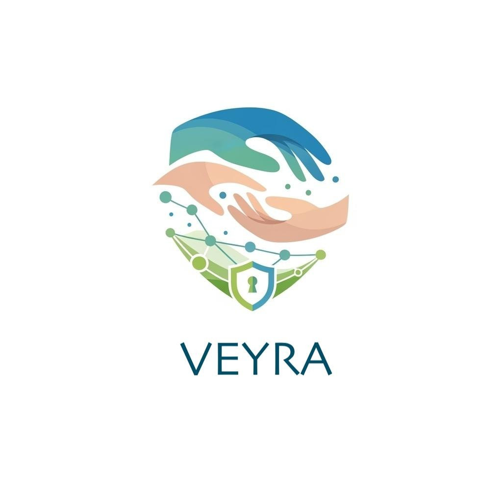 Veyra</b></td>
  <td><b> StoriiCare</b></td>
  <td><b> SeniorSoft</b></td>
  <td><b> CareCloud</b></td>
</tr>

<tr>
<td rowspan="2"><b>Perfil</b></td>
<td>Overview</td>
<td>Plataforma SaaS integral enfocada en la gestión de casas de reposo y conexión con familias en Perú y Latinoamérica.</td>
<td>Software SaaS global para residencias de adultos mayores, fundado en Reino Unido con presencia internacional.</td>
<td>Software de escritorio dirigido a grandes clínicas y residencias geriátricas.</td>
<td>Plataforma cloud para la gestión de salud general (EE.UU.) con EHR, facturación y portal de pacientes.</td>
</tr>

<tr>
<td>Ventaja competitiva</td>
<td>Especialización regional, modelo escalable, acceso familiar bidireccional y preparación para IoT.</td>
<td>Portal familiar avanzado con historias de vida y enfoque centrado en la persona.</td>
<td>Gestión operativa completa: historial clínico, facturación, inventario y camas.</td>
<td>Suite clínica y administrativa completa con integración de pagos.</td>
</tr>

<tr>
<td rowspan="2"><b>Marketing</b></td>
<td>Mercado objetivo</td>
<td>Casas de reposo medianas/pequeñas y familias en LATAM.</td>
<td>Residencias en UK, US, Australia y Canadá.</td>
<td>Grandes clínicas geriátricas.</td>
<td>Centros de salud en EE.UU.</td>
</tr>

<tr>
<td>Estrategias</td>
<td>Marketing digital, alianzas y precios flexibles.</td>
<td>Marketing de contenidos, redes sociales y testimonios.</td>
<td>Ventas directas institucionales.</td>
<td>Marketing especializado en salud.</td>
</tr>

<tr>
<td rowspan="3"><b>Producto</b></td>
<td>Servicios</td>
<td>Plataforma web y app móvil.</td>
<td>Web y app para familias.</td>
<td>Software de escritorio.</td>
<td>Suite CareCloud.</td>
</tr>

<tr>
<td>Precios</td>
<td>Modelo modular: gratuito, estándar y premium.</td>
<td>No transparentes.</td>
<td>No públicos.</td>
<td>Altos, bajo cotización.</td>
</tr>

<tr>
<td>Distribución</td>
<td>Web, móvil y API.</td>
<td>Web y móvil.</td>
<td>Instalación local.</td>
<td>Web y móvil.</td>
</tr>

<tr>
<td rowspan="4"><b>SWOT</b></td>
<td>Fortalezas</td>
<td>Especialización local y escalabilidad.</td>
<td>Experiencia de usuario familiar.</td>
<td>Gestión operativa sólida.</td>
<td>Producto robusto.</td>
</tr>

<tr>
<td>Debilidades</td>
<td>Marca nueva.</td>
<td>No adaptado a LATAM.</td>
<td>Tecnología obsoleta.</td>
<td>Costoso y complejo.</td>
</tr>

<tr>
<td>Oportunidades</td>
<td>Crecimiento del sector en LATAM.</td>
<td>Expansión global.</td>
<td>Migración a la nube.</td>
<td>Grandes cadenas.</td>
</tr>

<tr>
<td>Amenazas</td>
<td>Competidores globales.</td>
<td>Competencia local.</td>
<td>Soluciones cloud.</td>
<td>Opciones económicas.</td>
</tr>
</table>


### 2.1.2. Estrategias y tácticas frente a competidores

Una vez identificados los actores del mercado, el siguiente paso es definir cómo Veyra se abrirá paso entre ellos. No basta con conocer a la competencia; necesitamos un plan de acción que aproveche nuestras ventajas y blinde nuestras debilidades. Para lograrlo, utilizamos la Matriz CAME, una herramienta que nos permite "traducir" el análisis FODA previo en decisiones estratégicas reales.

A través de este análisis, establecemos tácticas ofensivas para explotar nuestra especialización en el mercado latinoamericano, y acciones de supervivencia para mitigar los riesgos de ser una marca nueva. Este enfoque nos asegura que cada funcionalidad de nuestro sistema tenga un propósito estratégico detrás.


**Estrategia FO (Ofensiva):**
- Priorizar el desarrollo de la aplicación web y móvil con funcionalidades centradas en comunicación en tiempo real, historial del residente y gestión administrativa.
- Implementar modelo freemium → premium para facilitar la adopción.
- Posicionarse como solución especializada en LATAM con enfoque en familias y residencias.

**Estrategia FA (Defensiva):**
- Reforzar seguridad y protección de datos.
- Ofrecer soporte local y SLA competitivo.
- Incluir funcionalidades offline o de baja conectividad en la app.

**Estrategia DO (Reorientación):**
- Validación rápida con usuarios reales mediante prototipos web/móvil.
- Desarrollo de APIs para integración con sistemas existentes.
- Generación de contenido técnico y casos de éxito.

**Estrategia DA (Supervivencia):**
- Infraestructura robusta (backups, alta disponibilidad).
- Precios competitivos para penetración de mercado.
- Certificaciones y auditorías para generar confianza.

## 2.2. Entrevistas. 

Para que Veyra pase de ser una idea a una solución útil, necesitamos salir de la oficina y validar nuestras hipótesis con las personas que viven el día a día del cuidado geriátrico. La recolección de información mediante entrevistas directas nos permite entender no solo qué funciones necesitan los usuarios, sino cómo se sienten y qué problemas reales enfrentan.

En esta sección, dejamos de lado las suposiciones para escuchar la voz de los administradores y familiares, asegurando que nuestra propuesta tecnológica sea intuitiva y genere un impacto positivo en su rutina.

### 2.2.1. Diseño de entrevistas. 
Para que las conversaciones sean productivas y comparables, hemos estructurado guías de entrevista específicas para cada segmento. El objetivo no es solo obtener datos demográficos, sino identificar "puntos de dolor" críticos, como la fragmentación de la información clínica o la ansiedad de los familiares por la falta de comunicación. A continuación, presentamos los cuestionarios diseñados para Administradores y Familiares:
#### Segmento objetivo: Administrador de casa de reposo

#### Preguntas Personales:

¿Cuál es su nombre?

¿Cuál es su edad?

¿Qué marca de celular usa?

¿Cuál es su rol dentro de la casa de reposo?

¿Cuántos años de experiencia tiene en el sector de casas de reposo?


#### Preguntas específicas:

¿Cómo se comunican actualmente con los familiares para informarles sobre el estado de salud, citas médicas o incidencias?

¿Qué tipo de dispositivo (PC, laptop, tablet, teléfono, sistema interno, apps) utiliza para realizar sus actividades administrativas diarias?

¿Que navegador web utiliza con más frecuencia?

¿Cuáles son los mayores desafíos o inconvenientes que enfrentan en la gestión diaria de la información y el cuidado de los residentes?

¿Qué sistema o método utilizan actualmente para gestionar la información de los residentes (historias clínicas, medicamentos, citas, alertas)?

¿Qué funcionalidades consideran esenciales en una plataforma de gestión para mejorar sus operaciones?

¿Qué procesos considera más urgentes de digitalizar o automatizar dentro de la casa de reposo?

#### Segmento objetivo: Familiares de adultos mayores

#### Preguntas Personales:

¿Cuál es su nombre?

¿Cuál es su edad?

¿Qué marca de celular usa?

¿Usa computadora de escritorio o laptop?

¿Cuál es su relación con el adulto mayor que reside en la casa de reposo?

¿Cuál es su ocupación?

¿Dónde reside actualmente?

#### Preguntas específicas :

¿Qué dificultades ha tenido para acceder a información sobre la salud o atención de su familiar?

¿Qué tipo de información le gustaría poder consultar de manera más frecuente y organizada?

¿Qué tan cómodo se sentiría utilizando plataformas web o aplicaciones móviles para consultar información médica sobre su adulto mayor?

Cuando ocurre una urgencia médica, ¿cómo suele enterarse y cuánto tiempo demora en recibir la notificación?

¿Qué aspectos le generarían más confianza al usar una plataforma de este tipo?

¿Qué tipo de dispositivo utiliza con más frecuencia para comunicarse con la casa de reposo o revisar información (celular, laptop, tablet, PC)?

¿Por qué medio prefiere recibir notificaciones importantes? (WhatsApp, SMS, llamada, correo, app)

### 2.2.2. Registro de entrevistas. 

**Segmento 1: Administrador de casas de reposo**

**Entrevista 1**

| Campo                             | Información |
|----------------------------------|-------------|
| Entrevista                       | #1 |
| Nombre                           | Jorge  |
| Apellidos                        | Santos |
| Edad                             | 21 años  |
| Distrito                         | Santiago de Surco |
| Evidencia                        |  |
| Link                             | [Link Entrevistas](https://youtu.be/LLKccTrdLM0) |
| Inicio de la entrevista          | 00:00 min |
| Duración de la entrevista        | 03:48 min |
| Resumen                          | **Perfil y Frustración:**<br>Joven de perfil administrativo, optimizador y orientado a la eficiencia (rasgos influenciados por su ocupación como Coordinador de Gestión y Procesos Administrativos en una casa de reposo). Su principal frustración es la fragmentación de la información (dependencia del papel y archivos separados) y la lentitud que esto genera para encontrar historiales médicos completos o listas de medicamentos ante una emergencia.<br><br>**Comportamiento y Necesidades:**<br>Desea tener un tablero de control centralizado y contar con alertas automáticas en tiempo real para la toma de medicamentos. Valora la reducción del margen de error mediante la digitalización y exige que las historias clínicas sean accesibles de forma segura desde cualquier dispositivo, buscando reducir el trabajo manual para dedicar más tiempo de calidad a los residentes.<br><br>**Tecnología, Marcas y Canales:**<br>Es un usuario digital versátil. Su ecosistema de hardware principal se basa en una laptop para tareas pesadas de oficina y un smartphone marca OPPO para movilidad y consultas rápidas. A nivel de software e influencias de marca, prefiere Google Chrome por su excelente sincronización con sus herramientas de trabajo. Actualmente utiliza llamadas telefónicas y grupos de WhatsApp, pero requiere un módulo de comunicación directa integrado que elimine la informalidad y permita mantener un historial de comunicación claro con los familiares. | |

**Entrevista 2**

| Campo                             | Detalle |
|----------------------------------|---------|
| **Nombre**                       | Jose Luis |
| **Apellidos**                    | Quispe Huamam  |
| **Edad**                         | 29 años |
| **Distrito**                     | Chorrillos |
| **Evidencia**                    |  |
| **Link**                         | |
| **Inicio de la entrevista**      | 03:49 min |
| **Duración**                     | 05:04 min |
| **Resumen**                      | **Perfil y Frustración**:<br>Administrador de casa de reposo con enfoque organizativo, operativo y orientado a mejorar la eficiencia en la atención de los residentes. Su principal frustración es que la información se encuentra dispersa entre fichas físicas, archivos Excel, cuadernos y mensajes de WhatsApp, lo que genera demoras, confusión y riesgo de errores al momento de consultar datos importantes como historiales médicos, medicamentos, citas o incidencias.<br><br>**Comportamiento y Necesidades**:<br>Busca contar con una plataforma digital que centralice la información de los residentes y permita acceder rápidamente a datos actualizados. Necesita funciones como registro de residentes, historial médico, control de medicamentos, alertas de citas médicas, registro de incidencias y reportes diarios. Valora especialmente la automatización de procesos críticos para reducir el trabajo manual y mejorar la coordinación entre administrador, cuidadores, enfermeros y familiares.<br><br>**Tecnología, Marcas y Canales**:<br>Utiliza principalmente una laptop para actividades administrativas y un celular Samsung para comunicación rápida y coordinación diaria. Su navegador más usado es Google Chrome. Actualmente se comunica con los familiares mediante WhatsApp y llamadas telefónicas, pero considera necesario contar con un canal más formal e integrado que permita enviar reportes, alertas e incidencias de manera ordenada y segura. |

**Entrevista 3**

| Campo                             | Información |
|----------------------------------|-------------|
| Entrevista                       | #3 |
| Nombre                           | Renato  |
| Apellidos                        | Pérez |
| Edad                             | 30 años  |
| Distrito                         | San Juan de Miraflores |
| Evidencia                        |  |
| Link                             | [Link Entrevistas](https://1drv.ms/v/c/2c6332e5e5a79287/IQCiPBeohaQKQo_81SEM6I3RAX3bQVSMoJ21AK-UOjN7eCM?e=Xa0FhD) |
| Inicio de la entrevista          | 00:00 min |
| Duración de la entrevista        | 05:05 min |
| Resumen                          | **Perfil y Frustración:**<br>El administrador de la casa de reposo, con 45 años y más de una década de experiencia, se encarga de la gestión general, supervisando al personal y coordinando la atención de los residentes. En su trabajo diario utiliza principalmente una computadora para tareas administrativas y un celular para comunicarse rápidamente con familiares y el equipo, apoyándose en herramientas como Excel, registros físicos y el navegador Google Chrome. Actualmente, la comunicación con los familiares se realiza mediante llamadas, WhatsApp y, en algunos casos, correos electrónicos. Sin embargo, enfrenta varios desafíos importantes, como la organización de la información, la prevención de errores en la administración de medicamentos y la necesidad de mantener una comunicación constante y clara. El sistema de gestión actual resulta limitado y propenso a errores, por lo que considera fundamental implementar una plataforma digital que incluya historial clínico, alertas de medicamentos, gestión de citas y canales de comunicación integrados. En este sentido, los procesos más urgentes de digitalizar son el registro de pacientes, el control de medicamentos y la generación de reportes diarios, con el objetivo de mejorar la eficiencia y reducir riesgos.. | |

**Segmento 2: Familiares de adultos mayores**

**Entrevista 1**

| Campo                             | Información                                                                                                                                                                                                                                                                                                                                                                                                                                                                                                                                                                                                                                                                                                                                                                                                                                                                                                                                                                                                                                                                                 |
|----------------------------------|---------------------------------------------------------------------------------------------------------------------------------------------------------------------------------------------------------------------------------------------------------------------------------------------------------------------------------------------------------------------------------------------------------------------------------------------------------------------------------------------------------------------------------------------------------------------------------------------------------------------------------------------------------------------------------------------------------------------------------------------------------------------------------------------------------------------------------------------------------------------------------------------------------------------------------------------------------------------------------------------------------------------------------------------------------------------------------------------|
| Entrevista                       | #1                                                                                                                                                                                                                                                                                                                                                                                                                                                                                                                                                                                                                                                                                                                                                                                                                                                                                                                                                                                                                                                                                          |
| Nombre                           | José Carlos                                                                                                                                                                                                                                                                                                                                                                                                                                                                                                                                                                                                                                                                                                                                                                                                                                                                                                                                                                                                                                                                                 |
| Apellidos                        | Vargas Enríquez                                                                                                                                                                                                                                                                                                                                                                                                                                                                                                                                                                                                                                                                                                                                                                                                                                                                                                                                                                                                                                                                             |
| Edad                             | 25 años                                                                                                                                                                                                                                                                                                                                                                                                                                                                                                                                                                                                                                                                                                                                                                                                                                                                                                                                                                                                                                                                                     |
| Distrito                         | Chorrillos                                                                                                                                                                                                                                                                                                                                                                                                                                                                                                                                                                                                                                                                                                                                                                                                                                                                                                                                                                                                                                                                                  |
| Evidencia                        | 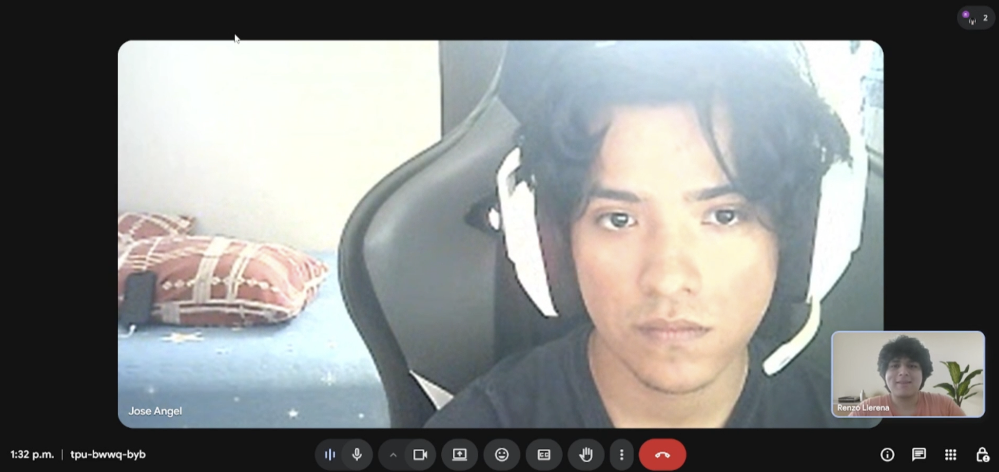                                                                                                                                                                                                                                                                                                                                                                                                                                                                                                                                                                                                                                                                                                                                                                                                                                                                                                                                                                                                                           |
| Link                             | [Link Entrevistas](https://shorturl.at/vQBoO)                                                                                                                                                                                                                                                                                                                                                                                                                                                                                                                                                                                                                                                                                                                                                                                                                                                                                                                                                                                                                                               |
| Inicio de la entrevista          | 13:32 min                                                                                                                                                                                                                                                                                                                                                                                                                                                                                                                                                                                                                                                                                                                                                                                                                                                                                                                                                                                                                                                                                   |
| Duración de la entrevista        | 03:32 min                                                                                                                                                                                                                                                                                                                                                                                                                                                                                                                                                                                                                                                                                                                                                                                                                                                                                                                                                                                                                                                                                   |
| Resumen                          | Joven de perfil analítico, protector y orientado a la eficiencia (rasgos influenciados por su ocupación como Ingeniero de Software en el sector bancario). Su principal frustración es la incertidumbre y la falta de inmediatez en la comunicación tradicional (llamadas) con la casa de reposo de su abuelo.<br><br>**Comportamiento y Necesidades:** Desea tener control y visibilidad sobre el estado de salud, medicaciones y reportes médicos semanales. Valora la rapidez y exige que la información médica tenga un respaldo profesional constante para sentir confianza.<br><br>**Tecnología, Marcas y Canales:** Es un usuario altamente digital. Su ecosistema de hardware principal se basa en PC de escritorio y smartphone. A nivel de software e influencias de marca, prefiere navegadores orientados a la privacidad y rendimiento (Brave, Chrome) y exige que los canales de interacción para urgencias sean directos y de uso diario, eligiendo WhatsApp o notificaciones push de una App nativa por encima de medios tradicionales como el SMS o el correo electrónico. |

**Entrevista 2**

| Campo                             | Detalle |
|----------------------------------|---------|
| **Nombre**                       | Leo Gerardo |
| **Apellidos**                    | Gómez Ferrua |
| **Edad**                         | 30 años |
| **Distrito**                     | Chorrillos |
| **Evidencia**                    |  |
| **Link**                         | https://shorturl.at/uoNBn |
| **Inicio de la entrevista**      | 14:47 min |
| **Duración**                     | 05:41 min |
| **Resumen**                      | Leo Gómez, de 30 años, es el responsable del cuidado de su abuela. Durante la entrevista, se describió como una persona analítica, racional y metódica, con alta afinidad por la tecnología. Expresó que la comunicación con el centro geriátrico resulta ineficiente, ya que debe realizar varias llamadas para obtener información que suele llegar incompleta o dispersa. <br><br> Indicó que utiliza de manera regular un smartphone, una laptop y una tablet, tanto para su trabajo como para el seguimiento del estado de su familiar. Señaló que sus navegadores principales son Google Chrome y Safari, y que está familiarizado con herramientas digitales como Google Drive, Zoom y Gmail, las cuales usa a diario. <br><br> Manifestó que su principal frustración es la falta de reportes médicos completos y oportunos. Expresó que desea acceder a información detallada sobre medicación, chequeos médicos, alimentación y actividades recreativas, dentro de una plataforma segura. También afirmó que le gustaría recibir notificaciones inmediatas en caso de cambios en el estado de salud o situaciones de emergencia. <br><br> Finalmente, indicó que confiaría plenamente en un sistema siempre que garantice seguridad, acceso restringido y comunicación directa con el personal. Representa al segmento de familiares jóvenes y con alta alfabetización digital, que demandan transparencia y actualización constante de la información. |

**Entrevista 3**

| Campo                             | Detalle |
|----------------------------------|---------|
| **Nombre**                       | Juan |
| **Apellidos**                    | Pescoran Angulo |
| **Edad**                         | 20 años |
| **Distrito**                     | Barranco |
| **Evidencia**                    |  |
| **Link**                         | [Link Entrevistas](https://upcedupe-my.sharepoint.com/:v:/g/personal/u202210334_upc_edu_pe/IQArQB5Qo22gTL_CSsRcLoU7AaicA1HH1qOKfxMbqWm1wj4?nav=eyJyZWZlcnJhbEluZm8iOnsicmVmZXJyYWxBcHAiOiJTdHJlYW1XZWJBcHAiLCJyZWZlcnJhbFZpZXciOiJTaGFyZURpYWxvZy1MaW5rIiwicmVmZXJyYWxBcHBQbGF0Zm9ybSI6IldlYiIsInJlZmVycmFsTW9kZSI6InZpZXcifX0%3D&e=cX8wAc) |
| **Inicio de la entrevista**      | 17:30 min |
| **Duración**                     | 06:18 min |
| **Resumen**                      | Juan Pescarán, de 21 años, residente de Barranco, hace seguimiento del estado de su abuela en un centro de reposo. Se describe como una persona analítica y orientada a la tecnología. Señala que la comunicación con el centro es ineficiente, ya que la información suele ser incompleta y requiere múltiples llamadas.

Utiliza regularmente smartphone y su computadora de escritoria, y está familiarizado con herramientas como Google Drive, Zoom y Gmail. Su principal molestia es la falta de reportes médicos claros y oportunos. Busca una plataforma segura que centralice información sobre salud, alimentación y actividades, y que envíe notificaciones en tiempo real ante cualquier cambio.

Representa a familiares jóvenes con alta alfabetización digital, que demandan acceso inmediato, transparencia y comunicación directa.|


### 2.2.3. Análisis de entrevistas. 

En esta sección se presenta el análisis detallado de la información recolectada. Para cada segmento, se explican primero los hallazgos estadísticos objetivos y subjetivos, seguidos de la evidencia gráfica correspondiente.

#### Segmento 1: Administradores de Casas de Reposo

**Análisis de Características Objetivas y Subjetivas:**

El análisis revela una digitalización precaria. Como se detalla en el gráfico a continuación, el **100%** de los administradores utiliza **WhatsApp** como canal principal y el **100%** gestiona la información clínica en **sistemas físicos** (papel). Si bien un **67%** se apoya en **Excel**, la falta de integración es crítica.
A nivel subjetivo, el **100%** valora la **comunicación rápida** y la **digitalización**. Sin embargo, existe una restricción clara: el **67%** demanda **soluciones sencillas**, rechazando herramientas complejas, y un **33%** aún prioriza la gestión personal directa.


#### Segmento 2: Familiares de Adultos Mayores

**Análisis de Características Objetivas y Subjetivas:**

Los datos confirman una experiencia actual deficiente. El **100%** reporta **dificultad para acceder a información** y el **100%** indica que se enteran de las **urgencias mediante llamadas**, lo cual consideran tardío e ineficiente. Un **100%** manifiesta la necesidad de ver la **info de medicación**.
Subjetivamente, el dolor principal es la incertidumbre: el **67%** siente **preocupación por demoras**, por lo que el **100%** solicita la **centralización** de datos. Afortunadamente, el **67%** se siente **cómodo usando apps**, validando la viabilidad de una solución móvil.


#### Análisis Comparativo

**Contrastación de Segmentos:**

Al comparar ambos grupos, encontramos coincidencias vitales para el producto: ambos tienen un **100% de necesidad de centralización** de información. Sin embargo, existe una brecha notable en la percepción de "preocupación": mientras los administradores priorizan la operatividad (0% de preocupación personal por demoras), para el **67%** de los familiares es una fuente de ansiedad crítica. Esto define nuestra propuesta de valor: eficiencia para el administrador y tranquilidad para el familiar.


### Conclusiones y Definición de Arquetipos

Basado en el análisis estadístico, se definen los siguientes perfiles para los User Personas:

1.  **User Persona Administrador ("El Gestor Operativo"):**
    * **Rasgo clave:** Busca eficiencia, pero teme a la tecnología compleja.
    * **Sustento:** El 67% exige "soluciones sencillas" y el 100% ya usa WhatsApp. La solución debe tener una curva de aprendizaje mínima.
2.  **User Persona Familiar ("El Monitor Preocupado"):**
    * **Rasgo clave:** Necesita control y transparencia para reducir ansiedad.
    * **Sustento:** El 100% pide información de medicación y el 67% sufre por la demora en noticias. La solución debe centrarse en notificaciones en tiempo real.

## 2.3. Needfinding. 

### 2.3.1. User Personas. 

A partir del análisis de entrevistas y la recolección de información sobre las dinámicas en casas de reposo, se identificaron los principales perfiles de usuarios que interactúan directamente con la solución Veyra. Estos perfiles representan los segmentos clave para el sistema, ya que concentran tanto la necesidad de gestión operativa como la necesidad de acceso confiable a información médica en tiempo real. La construcción de los *User Persona* permite al equipo de desarrollo comprender mejor sus motivaciones, frustraciones y hábitos, lo que resulta esencial para diseñar funcionalidades adecuadas y experiencias de usuario efectivas.

**1) Segmento 1: Administradores de casas de reposo**

Para los administradores se elaboró el User Persona **Mauricio Sánchez Valencia**. Se consideraron factores como su edad, rol en la gestión de una casa de reposo, experiencia en la administración del cuidado de adultos mayores y su necesidad de optimizar procesos de comunicación y gestión de la información. Sus principales frustraciones giran en torno a la falta de un sistema centralizado para el control de historias clínicas, medicamentos y citas médicas, lo que genera demoras en la comunicación con familiares y dificultades en el seguimiento de residentes. Asimismo, se tomó en cuenta su familiaridad con herramientas digitales básicas y la necesidad de contar con una plataforma moderna, intuitiva y segura que le permita centralizar toda la información de manera ágil y confiable.


**2) Segmento 2: Familiares de adultos mayores**

Para los familiares se elaboró el User Persona **Carmen Morales Quispe**. Se consideraron aspectos como su edad, ocupación y su rol como familiar de un adulto mayor residente en una casa de reposo. Sus principales motivaciones están orientadas a mantenerse informada en tiempo real sobre el estado de salud, el tratamiento y la administración de medicamentos de su familiar, incluso mientras desarrolla sus actividades laborales. Entre sus frustraciones se encuentra la falta de información clara, la demora en las notificaciones sobre urgencias y la necesidad de depender de llamadas o visitas presenciales. Su perfil refleja una predisposición positiva hacia el uso de soluciones digitales, siempre que estas sean rápidas, confiables y fáciles de utilizar.


### 2.3.2. User Task Matrix. 

El User Task Matrix presenta las tareas que realizan los User Persona para cumplir sus objetivos en su día a día, independientemente de si usan nuestro software o no. Se evalúa la frecuencia y la importancia de cada tarea para identificar dónde aportar valor.

| Tarea (Task)                                   | Administrador (Mauricio) |                 | Familiar (Carmen) |                 |
|------------------------------------------------|--------------------------|-----------------|-------------------|-----------------|
|                                                | **Frecuencia**           | **Importancia** | **Frecuencia**    | **Importancia** |
| Mantener actualizado el registro de residentes | Often                    | High            | Rarely            | Low             |
| Planificar citas médicas y terapias            | Often                    | High            | Occasionally      | Medium          |
| Comunicar incidencias o urgencias a la familia | Occasionally             | High            | Rarely            | High            |
| Supervisar el cumplimiento de la medicación    | Often                    | High            | Often             | High            |
| Consultar el estado de salud y evolución       | Often                    | Medium          | Often             | High            |
| Coordinar turnos del personal de cuidado       | Often                    | Medium          | Rarely            | Low             |
| Realizar pagos o cobros de mensualidad         | Monthly                  | High            | Monthly           | High            |

**Análisis del Task Matrix:**

Se observa que la tarea **"Supervisar cumplimiento de medicación"** y **"Consultar estado de salud"** tienen una Importancia **High** y Frecuencia **Often** para ambos segmentos (el administrador para controlar, el familiar para saber). Esto confirma que estas tareas son el "Core" del negocio y deben ser priorizadas. Además, la tarea crítica de **"Comunicar incidencias"** es de alta importancia para ambos, validando la necesidad de un sistema de alertas.

### 2.3.3. User Journey Mapping. 

**Segmento 1 – Administrador de casa de reposo (Mauricio Sánchez Valencia)**

El User Journey Mapping de Mauricio representa el recorrido actual que experimenta como administrador de una casa de reposo, en la gestión diaria de información médica, coordinación con el personal y comunicación con familiares de los residentes.
El mapa ilustra el proceso end-to-end, desde la recolección de datos de los pacientes hasta la generación de reportes y la respuesta a consultas externas.

En la situación **As-Is**, Mauricio enfrenta un flujo de trabajo manual y fragmentado: revisa documentos físicos, consolida información en hojas de cálculo y mantiene la comunicación por canales informales como llamadas o mensajes.
Esto genera demoras, sobrecarga de tareas y posibles errores en la actualización de datos.

El Journey busca evidenciar los puntos críticos de su experiencia actual, identificando las emociones, tareas, fricciones y oportunidades de mejora a lo largo de cada etapa (Awareness, Data Collection, Daily Management, Communication, Reporting y Decision-Making).
Este análisis servirá como base para diseñar una solución tecnológica que automatice procesos, mejore la eficiencia y facilite la interacción entre administración, personal y familiares.


**Segmento 2 – Familiar de adulto mayor (Carmen Morales Quispe)**

El User Journey Mapping de Carmen describe la experiencia completa que vive como familiar de un adulto mayor residente en la casa de reposo, desde el momento en que busca información sobre su ser querido hasta que recibe actualizaciones sobre su estado de salud.
El mapa detalla las etapas de su recorrido end-to-end, reflejando las acciones, pensamientos, emociones y frustraciones que enfrenta actualmente sin contar con una plataforma digital centralizada.

En la situación **As-Is**, Carmen depende de medios tradicionales como llamadas telefónicas, correos o mensajes de WhatsApp para comunicarse con el personal del centro.
Esto provoca demoras, pérdida de información y una sensación constante de incertidumbre sobre el bienestar de su familiar.

El Journey permite comprender su perspectiva emocional y sus puntos de dolor, mostrando los momentos clave en los que necesita información rápida, confiable y accesible.
Este análisis busca sentar las bases para una futura solución tecnológica que le brinde tranquilidad, transparencia y confianza, fortaleciendo su vínculo con el centro y con el cuidado de su familiar.


### 2.3.4. Empathy Mapping. 

Para la elaboración de los *Empathy Maps*, el equipo partió del conocimiento y observaciones recolectadas durante el análisis de los User Persona. Se colocó al centro de cada mapa al usuario correspondiente (Mauricio Sánchez Valencia y Carmen Morales Quispe) y se respondieron las preguntas claves sobre su entorno, emociones, comportamientos y necesidades.

**Segmento 1: Administradores de casas de reposo**


En este mapa se analizó a Mauricio Sánchez Valencia, un administrador joven con la responsabilidad de garantizar la calidad del servicio en una casa de reposo. Se identificó que piensa constantemente en la necesidad de organizar y centralizar la información médica y operativa de los residentes, ya que le preocupa que los procesos manuales generen errores y retrasos. Escucha las quejas de familiares por falta de comunicación oportuna y observa cómo sus colegas deben invertir tiempo en tareas repetitivas en lugar de enfocarse en el bienestar de los residentes. Mauricio expresa la necesidad de contar con una solución moderna que mejore la gestión y actúa implementando estrategias de control básicas con las herramientas disponibles, aunque estas son limitadas. Su dolor principal es la sobrecarga administrativa y la falta de un sistema ágil, mientras que su ganancia esperada es lograr eficiencia en la gestión, confianza de los familiares y un mejor control de la información.

**Segmento 2: Familiares de adultos mayores**


En este mapa se analizó a Carmen Morales Quispe, una comerciante que busca mantenerse informada sobre el estado de salud de su familiar mientras desarrolla sus actividades diarias. Ella piensa en la tranquilidad que le daría tener acceso rápido y claro a la evolución médica, medicación y tratamientos de su ser querido. Escucha a otros familiares compartir la frustración por la falta de información y observa que depender de llamadas o visitas no siempre es suficiente. Carmen suele expresar la necesidad de contar con una aplicación confiable y fácil de usar, y actúa buscando cualquier canal de comunicación disponible para mantenerse al tanto. Su dolor principal es la incertidumbre y la demora en recibir notificaciones sobre emergencias, mientras que su ganancia esperada es tener confianza, tranquilidad y control al poder consultar la información médica en tiempo real desde cualquier lugar.

### 2.3.5. As-is Scenario Mapping. 

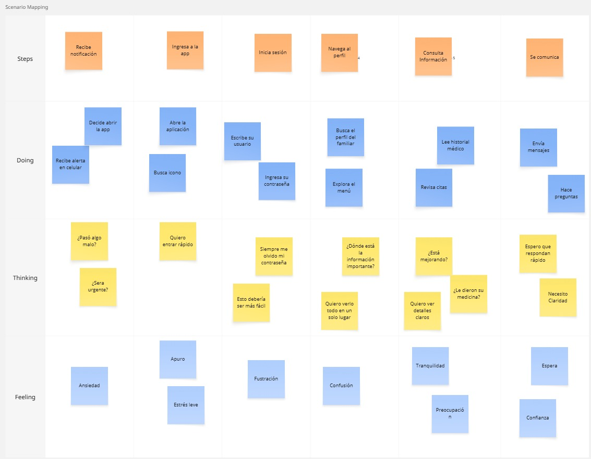

Actualmente, los familiares obtienen información sobre sus seres queridos a través de llamadas, mensajes o visitas, lo que genera una comunicación fragmentada y no inmediata. La ausencia de una plataforma centralizada impide el acceso en tiempo real a datos relevantes como estado de salud, actividades o tratamientos. Esta dependencia del personal provoca retrasos, información incompleta y altos niveles de ansiedad, evidenciando la necesidad de un sistema más transparente y accesible.


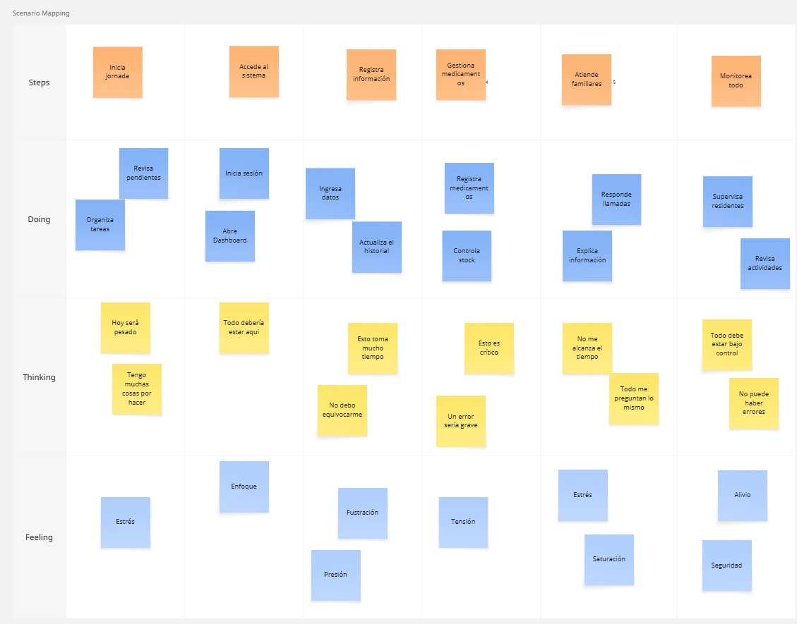

En la actualidad, los administradores gestionan la información mediante registros manuales, hojas de cálculo y sistemas no integrados, lo que dificulta la organización y actualización de datos críticos. Además, la comunicación con familiares se realiza de forma individual y manual, generando una alta carga operativa y riesgo de errores. Esta situación limita la eficiencia del personal y resalta la necesidad de una solución tecnológica que centralice procesos y optimice la gestión.

## 2.4. Ubiquitous Language. 

In this project, whose main objective is to improve transparency and efficiency in elderly care within nursing homes through a web platform,
the following **ubiquitous language** has been defined to ensure clarity and consistency among users, developers, and stakeholders:

| Term                   | Definition                                                                                                                         |
|------------------------|------------------------------------------------------------------------------------------------------------------------------------|
| Resident               | Elderly person living in a nursing home whose clinical care, activities, and well-being are managed on the platform.               |
| Family Member          | Authorized user who accesses the resident's information, receives notifications, and participates in the supervision of care.      |
| Administrator          | Responsible for the overall management of the nursing home; manages residents, staff, subscription plans, and reports.             |
| Care Staff             | Doctors, nurses, or caregivers who record health data, treatments, appointments, and observations in the platform.                 |
| Digital Medical Record | Centralized record with the resident's medical information (diagnoses, allergies, medications, check-ups, notes).                  |
| Treatment              | Prescribed medical plan that may include medications, therapies, and periodic appointments.                                        |
| Medical Schedule       | Set of appointments, reminders, and scheduled activities for the resident; accessible to staff and family members.                 |
| Medical Alert          | Automatic notification generated by the system (e.g., medication reminder, emergency, upcoming appointment).                       |
| Clinical Report        | Digital document automatically generated with consolidated information on the resident's care and progress.                        |
| Notification           | Message sent to family members or staff about relevant events (medication, visits, clinical changes).                              |
| Control Panel          | Main view for administrators and staff, showing metrics, reports, and the overall status of residents.                             |
| Subscription Plan      | Access modality to the platform (Individual, Standard, Premium) that defines available functionalities depending on the residence. |
| Session                | Authenticated period in which a user (administrator, family member, or staff) accesses the system with secure credentials.         |
| Family Dashboard       | Simplified interface for family members, where they can check health status, appointments, and relevant notifications.             |
| Roles and Permissions  | Validations that ensure each profile (administrator, staff, family) only accesses the operations they are authorized for.          |

**Expected benefits of the ubiquitous language:**

- Facilitates communication among developers, users, and system administrators.
- Improves understanding of the system's main functionalities.
- Avoids ambiguities and interpretation errors in design and implementation.
- Ensures consistency in documentation, interfaces, and project processes.

---

# Capítulo III: Requirements Specification

## 3.1. User Stories. 
<p>Para la especificación de requisitos de los usuarios, se desarrollaron las historias de usuario que describen cada requisito y funcionalidad que debe estar implementado en el desarrollo del producto final para satisfacer las necesidades del público objetivo. A continuación se presentan las historias de usuario relacionadas con la plataforma "Veyra". Esta sección reúne historias de usuario centradas en la experiencia de los distintos roles: el visitante, el familiar del adulto mayor y el administrador de la casa de reposo. Aquí se definen las necesidades clave para cada uno, desde la navegación inicial y contacto, hasta la gestión detallada de residentes, personal y medicamentos.</p>

  <table>
    <thead>
        <tr>
            <th>ID</th>
            <th>Título</th>
            <th>Descripción</th>
            <th>Criterios de Aceptación</th>
        </tr>
    </thead>
    <tbody>
        <tr>
            <td>US12</td>
            <td>Registro de residentes</td>
            <td>Como administrador, quiero crear y mantener perfiles completos de cada residente para centralizar toda su información personal y médica.</td>
            <td>Dado que el admin ingresa datos válidos, cuando guarda el perfil, entonces el sistema genera un ID único y confirma el registro.</td>
        </tr>
        <tr>
            <td>TS-RM002</td>
            <td>Ver expediente detallado</td>
            <td>Como desarrollador, quiero un endpoint GET que devuelva la información completa del residente para consulta del personal autorizado.</td>
            <td>Dado un ID de residente válido, cuando la API lo encuentra, entonces responde 200 con la data personal y médica completa.</td>
        </tr>
        <tr>
            <td>TS-RM-005</td>
            <td>Actualizar información de pacientes</td>
            <td>Como desarrollador, quiero un endpoint PATCH para modificar datos del perfil del residente (contactos de emergencia, condiciones nuevas).</td>
            <td>Dado un cambio en el contacto de emergencia, cuando se envía el PATCH, entonces el sistema actualiza solo ese campo y confirma.</td>
        </tr>
        <tr>
            <td>US14</td>
            <td>Administración de medicamentos</td>
            <td>Como administrador, quiero controlar la toma de medicamentos de los residentes para garantizar cumplimiento de tratamientos.</td>
            <td>Dado que se registra una toma, cuando el medicamento tiene stock, entonces el sistema descuenta una unidad y guarda fecha/hora.</td>
        </tr>
        <tr>
            <td>TS-I002</td>
            <td>Agregar medicamentos al inventario</td>
            <td>Como desarrollador, quiero un endpoint POST para que el administrador pueda alimentar el catálogo de medicinas de la casa de reposo.</td>
            <td>Dado POST con nombre, lote y fecha de vencimiento, cuando se valida, entonces retorna 201 y el objeto creado.</td>
        </tr>
        <tr>
            <td>TS-EM001</td>
            <td>Agregar empleado</td>
            <td>Como desarrollador, quiero implementar un endpoint POST para registrar nuevos empleados (cuidadores, enfermeros) con roles.</td>
            <td>Dado POST con datos personales y rol, cuando se crea el perfil, entonces el sistema asigna los permisos correspondientes.</td>
        </tr>
        <tr>
            <td>TS18</td>
            <td>Autenticación y MFA</td>
            <td>Como desarrollador, quiero implementar 2FA para proteger el acceso a información sensible de salud de los adultos mayores.</td>
            <td>Dado login correcto, cuando el 2FA está activo, entonces el sistema bloquea el acceso hasta verificar el código SMS/TOTP.</td>
        </tr>
        <tr>
            <td>TS17</td>
            <td>Integración con Stripe (pagos)</td>
            <td>Como desarrollador, quiero integrar pagos para que las familias paguen la mensualidad de la casa de reposo desde la app.</td>
            <td>Dado el pago de una cuota, cuando Stripe confirma el cargo, entonces el sistema actualiza el estado de la cuenta a "Pagado".</td>
        </tr>
        <tr>
            <td>TS-NH001</td>
            <td>Crear Nursing Home (Onboarding)</td>
            <td>Como desarrollador, quiero que el administrador registre su casa de reposo tras crear su cuenta para habilitar las funciones de gestión.</td>
            <td>Dado POST con RUC y nombre legal, cuando se valida la empresa, entonces vincula la sede al administrador.</td>
        </tr>
        <tr>
            <td>TS-ST001</td>
            <td>Dashboard de Estadísticas</td>
            <td>Como administrador, quiero un panel con métricas (ocupación, residentes activos) para tomar decisiones operativas.</td>
            <td>Dado el acceso al dashboard, cuando el sistema calcula datos, entonces muestra gráficos de ocupación y alertas críticas.</td>
        </tr>
        <tr>
            <td>US02</td>
            <td>Visualización de Planes en Landing</td>
            <td>Como visitante, quiero ver los planes de suscripción y sus precios para elegir el que mejor se adapte a mi presupuesto.</td>
            <td>Dado ingreso a la landing, cuando se visualiza la sección planes, entonces muestra comparativa de características y costos.</td>
        </tr>
        <tr>
            <td>US38</td>
            <td>Protección de datos mediante cifrado</td>
            <td>Como administrador, quiero que toda la información médica esté cifrada para cumplir con las normativas de protección de datos personales.</td>
            <td>Dado almacenamiento de datos sensibles, cuando se guardan en DB, entonces deben estar cifrados en reposo.</td>
        </tr>
        <tr>
            <td>US44</td>
            <td>Manejo de errores comprensible</td>
            <td>Como usuario, quiero que el sistema me guíe cuando ocurre un error (ej. falta de internet) para no perder la información ingresada.</td>
            <td>Dado un fallo de red al guardar, cuando el usuario pulsa enviar, entonces el sistema muestra mensaje claro y opción de reintento.</td>
        </tr>
    </tbody>
</table>

## 3.2. Product Backlog. 

En esta sección se presenta el Product Backlog priorizado, el cual contiene las Historias de Usuario y Technical Stories estimadas en Story Points. El orden de los elementos ha sido determinado por el valor que aportan al negocio, priorizando en las primeras iteraciones los elementos de la Landing Page y las funcionalidades core del sistema.

<table>
    <thead>
        <tr>
            <th>#</th>
            <th>ID</th>
            <th>Título</th>
            <th>Descripción</th>
            <th>Estimación (SP)</th>
        </tr>
    </thead>
    <tbody>
        <tr><td>1</td><td>TS-NH001</td><td>Crear Nursing Home (Onboarding)</td><td>Como desarrollador quiero que el administrador registre su casa de reposo tras crear su cuenta para habilitar las funciones de gestión.</td><td>5</td></tr>
        <tr><td>2</td><td>US12</td><td>Registro de residentes</td><td>Como administrador quiero crear y mantener perfiles completos de cada residente para centralizar toda su información personal y médica.</td><td>5</td></tr>
        <tr><td>3</td><td>TS-RM002</td><td>Ver expediente detallado</td><td>Como desarrollador quiero un endpoint GET que devuelva la información completa del residente para consulta del personal autorizado.</td><td>2</td></tr>
        <tr><td>4</td><td>TS-RM-005</td><td>Actualizar información de pacientes</td><td>Como desarrollador quiero un endpoint PATCH para modificar datos del perfil del residente (contactos de emergencia, condiciones nuevas).</td><td>3</td></tr>
        <tr><td>5</td><td>TS-EM001</td><td>Agregar empleado</td><td>Como desarrollador quiero implementar un endpoint POST para registrar nuevos empleados (cuidadores, enfermeros) con roles.</td><td>3</td></tr>
        <tr><td>6</td><td>US14</td><td>Administración de medicamentos</td><td>Como administrador quiero controlar la toma de medicamentos de los residentes para garantizar cumplimiento de tratamientos.</td><td>3</td></tr>
        <tr><td>7</td><td>TS-I002</td><td>Agregar medicamentos al inventario</td><td>Como desarrollador quiero un endpoint POST para que el administrador pueda alimentar el catálogo de medicinas de la casa de reposo.</td><td>2</td></tr>
        <tr><td>8</td><td>US20</td><td>Preguntas sobre rutina diaria</td><td>Como familiar quiero enviar preguntas directas al personal sobre el día a día de mi familiar para resolver dudas puntuales.</td><td>3</td></tr>
        <tr><td>9</td><td>TS18</td><td>Autenticación y MFA</td><td>Como desarrollador quiero implementar 2FA para proteger el acceso a información sensible de salud de los adultos mayores.</td><td>8</td></tr>
        <tr><td>10</td><td>US38</td><td>Protección de datos mediante cifrado</td><td>Como administrador quiero que toda la información médica esté cifrada para cumplir con las normativas de protección de datos personales.</td><td>5</td></tr>
        <tr><td>11</td><td>TS17</td><td>Integración con Stripe (pagos)</td><td>Como desarrollador quiero integrar pagos para que las familias paguen la mensualidad de la casa de reposo desde la app.</td><td>8</td></tr>
        <tr><td>12</td><td>TS-ST001</td><td>Dashboard de Estadísticas</td><td>Como administrador quiero un panel con métricas (ocupación, residentes activos) para tomar decisiones operativas.</td><td>5</td></tr>
        <tr><td>13</td><td>US02</td><td>Visualización de Planes en Landing</td><td>Como visitante quiero ver los planes de suscripción y sus precios para elegir el que mejor se adapte a mi presupuesto.</td><td>2</td></tr>
        <tr><td>14</td><td>US44</td><td>Manejo de errores comprensible</td><td>Como usuario quiero que el sistema me guíe cuando ocurre un error para no perder la información ingresada.</td><td>3</td></tr>
    </tbody>
</table>

**Evidencia de Product Backlog en Jira:**

A continuación, se muestra la gestión del backlog en la herramienta Jira Software, evidenciando la priorización y estimación de las historias.

<div align="center">
  
  <p><em>Figura: Captura del Product Backlog en Jira Software.</em></p>
</div>

## 3.3. Impact Mapping. 

<p>
  En el Impact Mapping del modelo de negocio digital para la gestión de casas de reposo, el equipo elaboró el mapa en UXPressia partiendo de un Business Goal principal que cumple los criterios SMART: “Mejorar la transparencia, eficiencia y confianza en la gestión de casas de reposo, alcanzando 500 residencias afiliadas y 10,000 familiares activos en el primer año de operación”. A partir de esta meta se incorporaron como Actors/Personas a los User Personas previamente definidos: Mauricio Sánchez (administrador de la residencia) y Carmen Morales (familiar cuidadora). Para cada uno se identificaron los Impacts esperados, es decir, cómo queremos que cambien su comportamiento para ayudar a lograr el objetivo: en el caso de Mauricio, la optimización de la gestión de residentes, personal y medicamentos, el mayor control de horarios, servicios y visitas y el cumplimiento de normas de seguridad y privacidad de datos de salud; en el caso de Carmen, el acceso en tiempo real al estado de salud e historial médico, la mayor confianza mediante comunicaciones y notificaciones y la tranquilidad por recibir recordatorios automáticos de citas y visitas.
</p>

<p>
  A partir de estos impactos se definieron los Deliverables que el negocio digital debe ofrecer para provocar dichos cambios en el comportamiento de los actores. Entre ellos se encuentran el módulo de gestión de residentes y personal (tratamientos, recetas y roles), el inventario digital de medicamentos con alertas de stock bajo, la agenda centralizada de citas y visitas, el panel de control en tiempo real, la gestión de roles y permisos, la auditoría y encriptación de datos clínicos y los reportes de cumplimiento normativo. Para la familia se definieron el portal y app familiar con dashboard simplificado, el sistema de notificaciones push, SMS y correo, el módulo de mensajería segura, el calendario con recordatorios automáticos y las alertas configurables. Finalmente, en la columna de User Stories se detallaron historias en formato “Como [persona] deseo [acción] para [beneficio]” (por ejemplo, historias para registro de residentes, gestión de medicamentos, agenda de citas, notificaciones y seguimiento del bienestar emocional), que permiten trazar la ruta desde los objetivos de negocio hasta los features concretos del producto, asegurando la alineación entre Business Goals, Impacts, Deliverables y desarrollo de la solución.
</p>

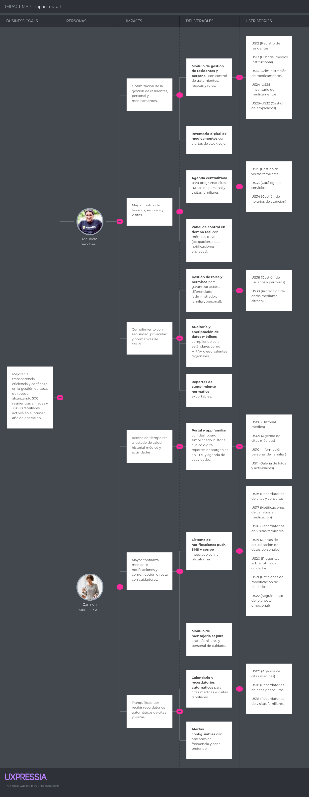

<div style="page-break-after: always;"></div>

---

# Capítulo IV: Product Design

## 4.1. Style Guidelines. 

### 4.1.1. General Style Guidelines. 

El diseño visual de la plataforma **Veyra** se inclina hacia una estética moderna, limpia y amigable, en línea con nuestro compromiso de ofrecer soluciones de cuidado que transmitan confianza, claridad y facilidad de uso. Nuestro objetivo es crear una experiencia digital que sea tanto eficiente como reconfortante para las familias y las instituciones de cuidado.

En este capítulo, detallaremos cada uno de los elementos visuales y de estilo que guían el desarrollo de la aplicación Veyra, siempre siguiendo los principios de Diseño de Experiencia de Usuario (UX) e Interfaz de Usuario (UI) para garantizar la máxima usabilidad y accesibilidad.

**Branding**

El logo principal de nuestra plataforma es *Veyra*, un nombre que evoca cercanía y visión en el cuidado. Nuestro propósito es ser un puente digital para el cuidado de los adultos mayores, ofreciendo una solución integral para gestores de cuidado y familias. El branding se enfoca en transmitir innovación, soporte y confiabilidad, valores esenciales para quienes confían en nosotros el bienestar de sus seres queridos.
<br>

<p align="center">
  
</p>

**Typography**

La tipografía empleada en Veyra será **Rubik**, con sus variantes Regular, Medium, SemiBold y Bold. La elección de Jost se basa en su estética moderna y profesional, que se equilibra con una excelente legibilidad en diversas resoluciones y dispositivos (móviles, tabletas, ordenadores). Además, su disponibilidad a través de Google Fonts asegura una carga eficiente y consistente.

La jerarquía tipográfica se establece de la siguiente manera para garantizar claridad y ritmo visual:

- **Títulos principales (H1/Sección heading):** 4rem (aprox. 64px) en escritorio, 2.8rem (aprox. 45px) en móvil.

- **Subtítulos (H2/Sub-headings):** 2.8rem (aprox. 45px) en escritorio, 2.2rem (aprox. 35px) en móvil.

- **Títulos de componentes (H3/H4):** 2rem (aprox. 32px) a 2.2rem (aprox. 35px).

- **Cuerpo del texto (p):** 1.6rem (aprox. 16px) con un interlineado de 1.6.

- **Botones y etiquetas (span):** 1.4rem (aprox. 14px) a 1.8rem (aprox. 18px).

<p align="center">
  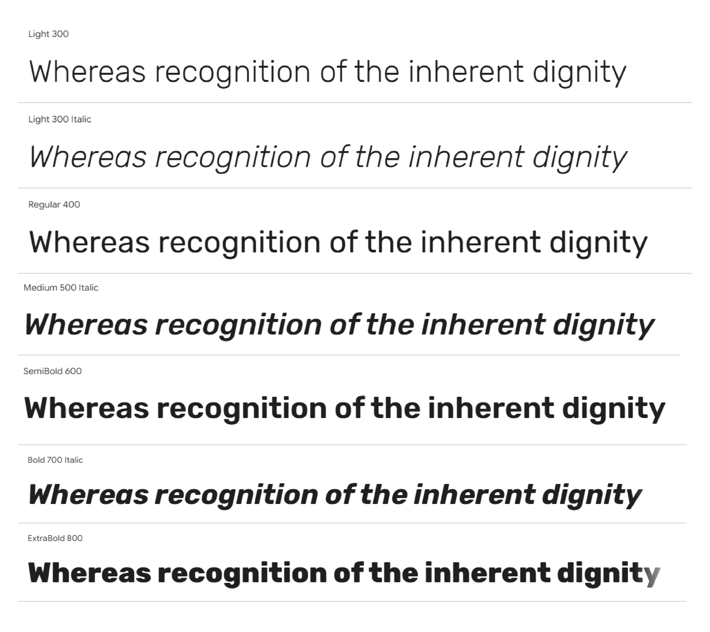
</p>

Esta distribución garantiza un contraste óptimo entre el texto y el fondo, superando un ratio mínimo de 4.5:1 según las WCAG 2.1 AA para una accesibilidad superior.

<br>

**Colors**

Nuestra paleta de colores ha sido cuidadosamente seleccionada para evocar sensaciones de calma, profesionalismo y confianza. Se ha distribuido en tres categorías principales:

**Paleta principal**: Colores que definen la identidad de Veyra y se usan en elementos clave.
* **Primario (Azul Veyra):** var(--primary-color) (referencia principal).
* **Secundario (Azul Profundo):** var(--secondary-color) (para texto principal y elementos interactivos).
* **Terciario (Gris Oscuro):** var(--tertiary-color) (para texto secundario y detalles).
* **Fondo Claro:** var(--bg-light) (fondos de secciones).
* **Fondo Blanco:** var(--white) (fondos de tarjetas y elementos principales).
  
**Paleta de Soporte**: Colores complementarios que añaden profundidad y contraste.
* **Gris Neutro:** Para bordes sutiles, líneas divisorias y fondos de alternancia.

**Colores Funcionales**: Reservados para comunicar estados específicos al usuario.
* **Éxito:** Verde (#4CAF50) para confirmaciones y acciones exitosas.
* **Error:** Rojo (#F44336) para alertas y mensajes de error.
* **Advertencia:** Amarillo (#FFC107) para notificaciones y avisos importantes.


<p align="center">
  
</p>

Esta combinación cromática refleja los valores de nuestra marca y busca transmitir al público una imagen de profesionalismo, seguridad y calidez en el cuidado de adultos mayores.
<br>

**Spacing**

El espaciado en Veyra sigue un sistema de espaciado modular y consistente para garantizar un ritmo visual armonioso y una jerarquía clara en toda la interfaz. La consistencia en el espaciado ayuda a reducir la carga cognitiva del usuario y mejora la legibilidad.

* **Espaciado Básico:** Usamos un espaciado base de 0.5rem (8px) para elementos pequeños como iconos, botones y texto. Este valor es la unidad mínima y se multiplica para crear espacios más grandes.

* **Margen Interno (Padding) Generoso:** Las secciones principales de la página utilizan un padding vertical de 6rem (96px) para crear pausas visuales claras. Los contenedores de tarjetas o elementos secundarios usan padding más pequeños, como 2.5rem (40px), para agrupar el contenido de forma lógica.

* **Espacio entre Elementos:** El espaciado entre elementos relacionados, como las tarjetas de planes o los miembros del equipo, varía entre 1.5rem (24px) y 3rem (48px). Esto mantiene una densidad de información adecuada sin abrumar visualmente al usuario.

* **Line Height del Texto:** El interlineado del texto (line-height) está configurado en 1.6, lo que facilita la lectura de párrafos largos y evita que las líneas se sientan demasiado juntas.

<br>

**Tono de Comunicación**

La voz y el tono de Veyra están diseñados para ser tan confiables y amigables como nuestra plataforma. Nuestro objetivo es conectar con familias e instituciones de cuidado de manera empática y profesional.

* **Tono: Amigable y empático,** con un toque de profesionalismo. Buscamos proyectar cercanía y comprensión de las necesidades de nuestros usuarios (familias), mientras mantenemos la autoridad y la seriedad que esperan las instituciones de cuidado.

* **Actitud: Confiable y serena.** El 90% de nuestra comunicación es tranquilizadora y segura, mientras que el 10% restante es entusiasta, especialmente en los llamados a la acción (CTAs) para motivar al usuario.

* **Lenguaje: Claro y directo.** Evitamos la jerga técnica innecesaria. Nos enfocamos en los beneficios que Veyra aporta a la vida diaria de las familias y los gestores de cuidado, hablando en términos de paz mental, eficiencia y conexión.

* **Voz: Experta y cálida.** Posicionamos a Veyra como una solución líder en tecnología de cuidado, pero siempre con un enfoque humano y comprensivo.

Este enfoque comunicacional busca generar confianza y lealtad, asegurando a las familias que están tomando la mejor decisión para sus seres queridos, y a las instituciones, que están optimizando sus procesos con una herramienta de vanguardia.

### 4.1.2. Web Style Guidelines. 
Las directrices de estilo web de Veyra se centran en la simplicidad, la accesibilidad y la modernidad. Nuestro objetivo es crear una experiencia visual que refleje la misión de nuestra plataforma: conectar y simplificar el cuidado de los adultos mayores con un diseño limpio e intuitivo.

**1) Layout**

* **Sistema de Grid:** Utilizamos un diseño de cuadrícula flexible para garantizar que el contenido de Veyra se vea bien en cualquier dispositivo. Este enfoque permite que las tarjetas de servicios y planes se ajusten dinámicamente, manteniendo el orden y la coherencia visual.
* **Headers y Footers:** El encabezado (header) es fijo en la parte superior, proporcionando acceso constante a la navegación principal y los botones de acción (Sign In, Sign Up). El pie de página (footer) es completo y funcional, con enlaces esenciales que complementan la experiencia del usuario.
* **Cards:** Las tarjetas son un componente central en nuestro diseño. Se usan para destacar los servicios, beneficios y testimonios. Tienen bordes redondeados y sombras suaves para darles una apariencia moderna y hacer que el contenido se sienta "elevado" y fácil de leer.

**2) Responsive Design**

* **Desktop:** La navegación principal es visible en la barra superior junto a los botones de inicio de sesión. El contenido se presenta en múltiples columnas para un uso eficiente del espacio de la pantalla.
* **Tablet:** El menú de navegación se oculta en un botón de hamburguesa para maximizar el espacio. Los elementos de la cuadrícula se adaptan a un diseño de dos columnas. Los botones y formularios se expanden para ser fáciles de tocar.
* **Mobile:** La experiencia está optimizada para la visualización en una sola columna. La navegación se realiza a través de un menú desplegable, y todos los elementos interactivos, como botones y campos de entrada, son grandes y claros, ideales para pantallas táctiles.

**3) Interaction Design**

* **Botones:** Nuestros botones son llamativos y fáciles de hacer clic, con efectos visuales sutiles al pasar el cursor para confirmar la interactividad. El botón principal de llamado a la acción (Start now →) destaca claramente del resto.

* **Formularios:** El formulario de contacto en el pie de página es sencillo y directo. Los campos son claros y están bien espaciados para evitar errores del usuario.

**4) Images and Icons**

* **Imágenes:** Se utilizan fotografías de alta calidad que evocan calidez, conexión y cuidado. Las imágenes de personas mayores y familias interactuando refuerzan el mensaje de Veyra. Las imágenes están optimizadas para una carga rápida.

* **Íconos:** Empleamos un conjunto de íconos de estilo lineal y minimalista. Estos iconos se utilizan para representar servicios y características, ofreciendo una guía visual rápida y coherente en toda la página.

**5) Repositorio Central**

* **Organización:** El proyecto sigue una estructura de archivos lógica. Los estilos están en la carpeta assets/style.css, y los archivos JavaScript en assets/scripts. Todos los activos visuales (imágenes, logos) se encuentran centralizados en assetsassets/img/chapter-IV y assets/logos, respectivamente.

* **Versionado:** Usamos un sistema de control de versiones como Git para gestionar los cambios en los archivos de estilo y contenido. Esto asegura que todos los colaboradores trabajen en la versión más reciente del proyecto.

### 4.1.3. Mobile Style Guidelines. 
#### 4.1.3.1. iOS Mobile Style Guidelines. 
#### 4.1.3.2. Android Mobile Style Guidelines. 
### 4.2. Android Mobile Style Guidelines. Information Architecture. 

La arquitectura de la información de la página de inicio de Veyra está diseñada para una navegación intuitiva, permitiendo que los usuarios encuentren rápidamente la información que necesitan y comprendan el valor de nuestra plataforma.

### 4.2.1. Organization Systems. 

* **Jerarquía de Contenidos:** La información está estructurada de lo general a lo específico. Comenzamos con un mensaje de impacto en la sección Hero, seguido de un resumen de nuestros servicios, y luego profundizamos en las características y beneficios en las secciones subsiguientes.
  
* **Secciones Principales:** La página de inicio está organizada en secciones clave:
    * **Hero:** La promesa de Veyra.

    * **What We Offer:** Una visión general de los servicios.

    * **Features:** Los beneficios clave del producto.

    * **Benefits:** Cómo Veyra ayuda a los usuarios.

    * **About Us:** Quiénes somos.

    * **Our Team:** Las personas detrás del proyecto.

    * **Plans:** Opciones de precios.

    * **Testimonials & CTA:** Reseñas y llamado a la acción final.

* **Agrupación de Contenidos:** El contenido se agrupa lógicamente para facilitar la comprensión. Por ejemplo, los beneficios se agrupan en tarjetas con títulos claros y párrafos descriptivos, mientras que los testimonios se presentan en un formato de cuadrícula fácil de escanear.

### 4.2.2. Labeling Systems. 

* **Nomenclatura:** Se utiliza un lenguaje claro y directo en los títulos de las secciones (What we offer, Features, Plans). Los botones tienen etiquetas descriptivas como Start now →, Sign In y Sign Up para que el usuario sepa exactamente qué esperar.

* **Consistencia:** Mantenemos una nomenclatura uniforme. Por ejemplo, la sección de precios se llama Plans en la barra de navegación y en el título de la sección, evitando confusiones.

* **Lenguaje Adaptativo:** El contenido está diseñado para ser fácil de entender para todos, utilizando un lenguaje que resuena con familias y cuidadores de personas mayores, sin jerga técnica.

### 4.2.3. SEO Tags and Meta Tags 
### 4.2.4. Searching Systems. 

* **Barra de Búsqueda:** Aunque la página de inicio no requiere una barra de búsqueda, una vez que el usuario inicia sesión en la aplicación principal, esta funcionalidad será clave. Estará ubicada en un lugar prominente y permitirá buscar rápidamente información de residentes, historial médico y otros datos relevantes.

* **Filtros y Facetas:** Dentro de la aplicación, los usuarios podrán filtrar la información por residente, tipo de medicamento, fecha, etc., para encontrar lo que necesitan de manera eficiente.

* **Historial de Búsqueda:** Se implementará un historial para que el personal de enfermería y los administradores puedan acceder rápidamente a las búsquedas frecuentes.

* **Resultados Relevantes:** Los resultados de búsqueda se priorizarán según la relevancia para la cuenta y las funciones del usuario.

### 4.2.5. Navigation Systems. 

 **Navegación Global:** La barra de navegación en el encabezado proporciona acceso principal a las secciones de la página de inicio. El menú de hamburguesa en dispositivos móviles asegura que esta navegación sea siempre accesible.

* **Navegación Contextual:** Enlaces internos, como los botones en la sección What We Offer y los botones de llamado a la acción, guían al usuario de manera contextual a la siguiente etapa de su recorrido.

* **Navegación Secundaria:** Enlaces internos, como los botones en la sección What We Offer y los botones de llamado a la acción, guían al usuario de manera contextual a la siguiente etapa de su recorrido.

<div style="page-break-after: always;"></div>

## 4.3. Landing Page UI Design. 

El diseño de la interfaz de usuario (UI) de la página de inicio de Veyra es fundamental para captar la atención de los visitantes y guiarlos hacia una acción clara: conectar con el cuidado de sus seres queridos. Nos hemos centrado en la creación de una experiencia intuitiva y fluida, garantizando que cada elemento de la página sea interactivo y fácil de usar, reflejando el compromiso de Veyra con la simplicidad y la transparencia.

### 4.3.1. Landing Page Wireframe. 

El wireframe de nuestra página de inicio sirve como un mapa visual que define la estructura y el flujo de la información. Este esquema asegura una disposición lógica de los componentes, facilitando la navegación y destacando la propuesta de valor de Veyra. Las secciones del wireframe están diseñadas para contar una historia completa y persuasiva:

**Nav y Hero:**

Esta sección de entrada incluye el logotipo de Veyra, acompañado de un eslogan que resume nuestra promesa: "The Best Care is Always Connected" (El Mejor Cuidado Siempre Está Conectado). La barra de navegación permite un acceso rápido a secciones clave como Features, Benefits, y About Us, mientras que el área principal ofrece una visión concisa del producto, acompañada de un claro llamado a la acción: "Start now →" (Empieza ahora →). Un visual atractivo refuerza el mensaje de calidez y conexión familiar.

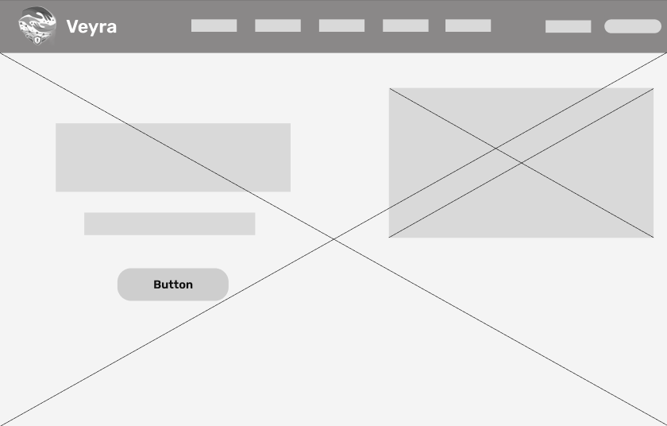


**Services (What We Offer):**

Aquí se detallan los servicios principales de Veyra: Home Health Care, Pediatric Care, Companion Care y Conditions Treated. Cada servicio se presenta con un ícono representativo y una breve descripción, haciendo que nuestra oferta sea fácil de entender y visualmente accesible.

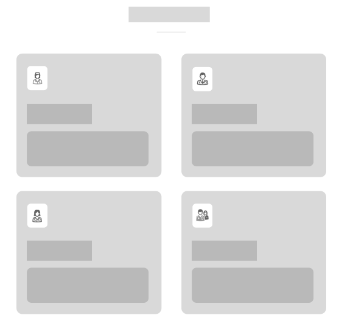


**Acerca de la aplicación (About the Platform):**

Esta sección presenta lo que hace única a Veyra: una plataforma diseñada para centros de cuidado de adultos mayores que optimiza la gestión clínica y la comunicación. Explicamos cómo Veyra centraliza la información para mejorar la eficiencia, reducir errores y, lo más importante, dar tranquilidad a las familias. Enfatizamos nuestros valores de transparencia, seguridad y conexión, mostrando una lista de beneficios clave como la comunicación fluida, el acceso a información en tiempo real y la seguridad de los datos.

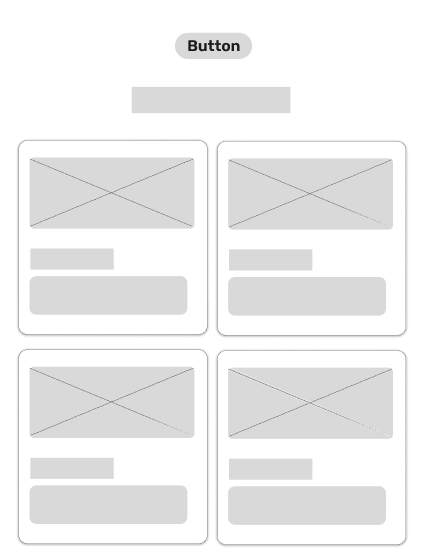

**Sobre el Equipo (Our Team):**

En esta sección, se humaniza la marca al presentar al equipo detrás de Veyra. Con fotos y descripciones de los miembros, mostramos a las personas dedicadas a este proyecto, construyendo confianza y una conexión personal con los visitantes.

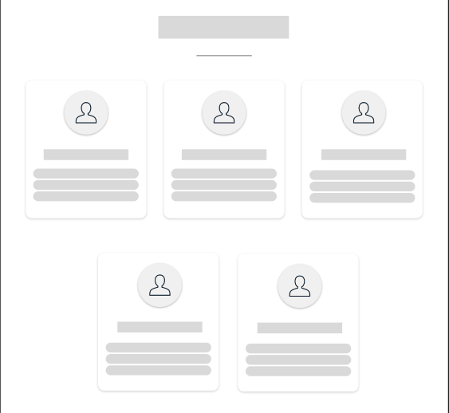

**Precios (Plans):**

La sección de Precios ofrece una visión clara de los planes disponibles. Presentamos el Family Plan y el Nursing Home Plan, con un comparativo de características para ayudar a los usuarios a elegir la opción que mejor se adapte a sus necesidades, ya sea para el cuidado en casa o para una institución. Un conmutador entre tarifas mensuales y anuales, junto con la indicación de un ahorro, hace la elección más informada.

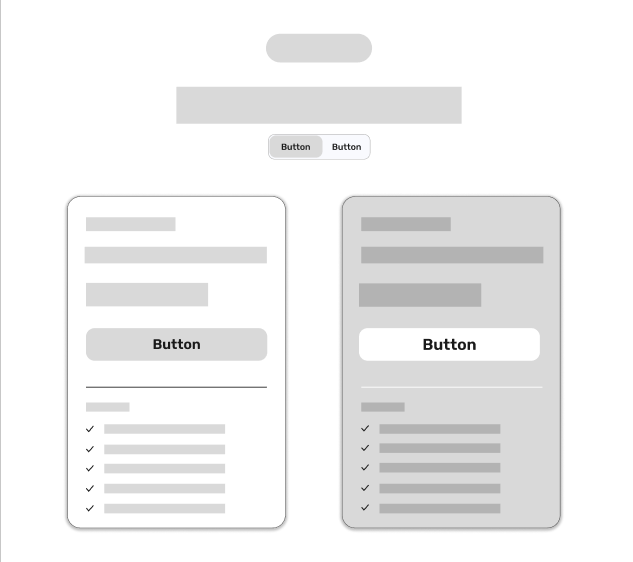

**Footer:**
El pie de página es un elemento crucial para la usabilidad. Contiene enlaces a información vital como "Terms of Service" y "Privacy Policy", además de detalles de contacto (correo electrónico, teléfono y ubicación). Esto proporciona un acceso rápido a la información sin saturar la interfaz, ofreciendo un cierre limpio y funcional a la página.


Este wireframe sienta las bases para un diseño visual que no solo se ve bien, sino que también guía al usuario de manera intuitiva a través de nuestra propuesta de valor, reforzando la confianza y la conexión que Veyra promete.

<div style="page-break-after: always;"></div>

### 4.3.2. Landing Page Mock-up. 

**Hero de la aplicación** 

El hero de nuestra plataforma Veyra presenta una imagen principal que evoca cuidado y conexión, con un título claro: "The Best Care is Always Connected". Una breve descripción capta nuestra esencia, y un botón de llamado a la acción "Start for free →" invita a los usuarios a dar el primer paso. Una barra de navegación en la parte superior permite acceder de forma fluida a todas las secciones de la página, proporcionando una experiencia de usuario intuitiva.

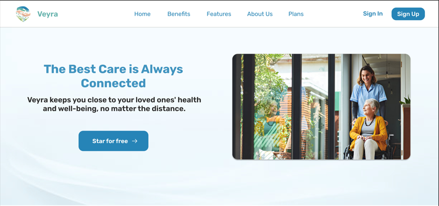

**What We Offer** 

En la sección "What We Offer", presentamos nuestras principales áreas de servicio a través de tarjetas con iconos representativos. Cada tarjeta tiene un título y una breve descripción, como "Home Health Care" o "Pediatric Care", lo que permite a los usuarios entender rápidamente el alcance de nuestra plataforma y los tipos de cuidado que apoyamos.

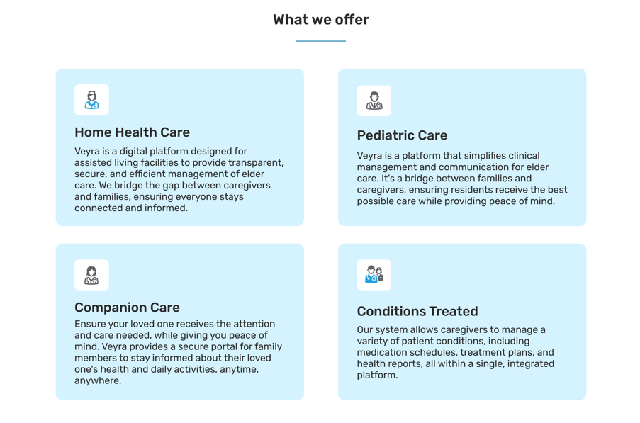

**Features** 

La sección de "Features" muestra las funcionalidades clave de Veyra. El diseño tipo acordeón permite a los usuarios expandir cada característica para leer su descripción completa, mientras que un video de demostración de YouTube al lado les ofrece una vista visual de la plataforma en acción. Esto combina información detallada con un formato interactivo y dinámico.

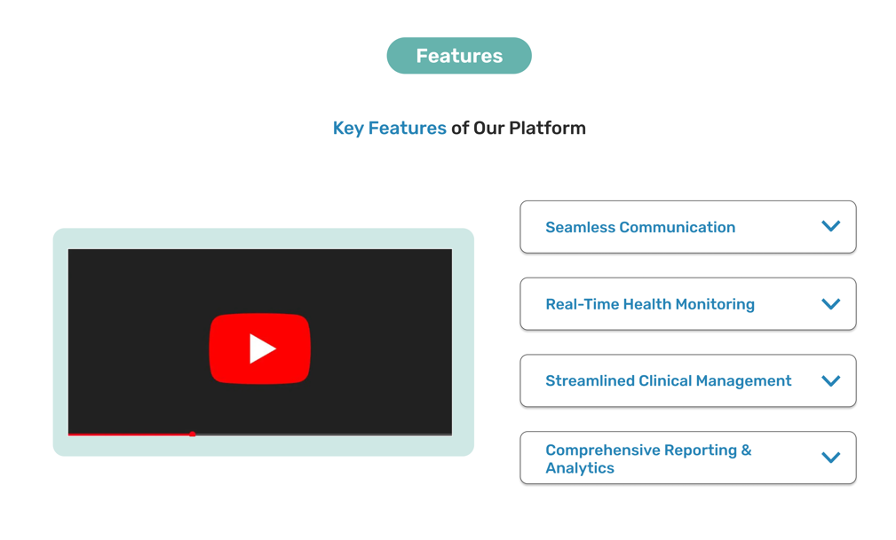

**Benefits** 

En "Benefits", destacamos las ventajas de utilizar Veyra. A través de un diseño de tarjetas con imágenes, títulos y descripciones, comunicamos cómo nuestra plataforma mejora la comunicación, agiliza la gestión clínica y aumenta la tranquilidad tanto para las familias como para las instituciones de cuidado.

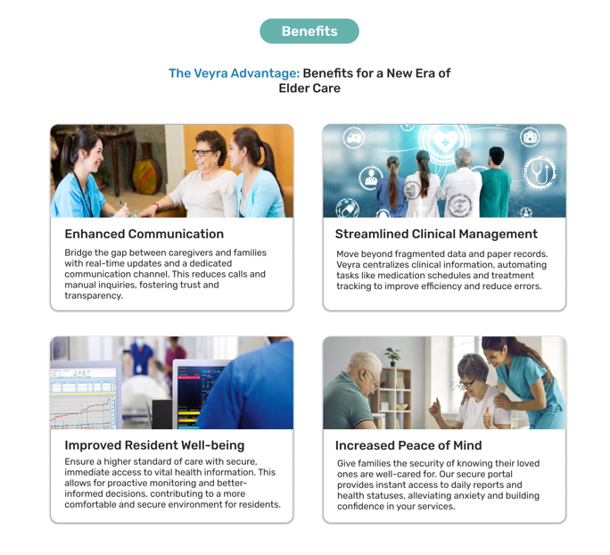

**About Us** 

La sección "About Us" presenta a NovaPeru Tech, la empresa detrás de Veyra. Aquí, compartimos nuestra misión y los valores de innovación y confianza que nos impulsan. Un video o imagen animada acompaña el texto, reforzando nuestro mensaje de una manera visualmente atractiva y moderna.

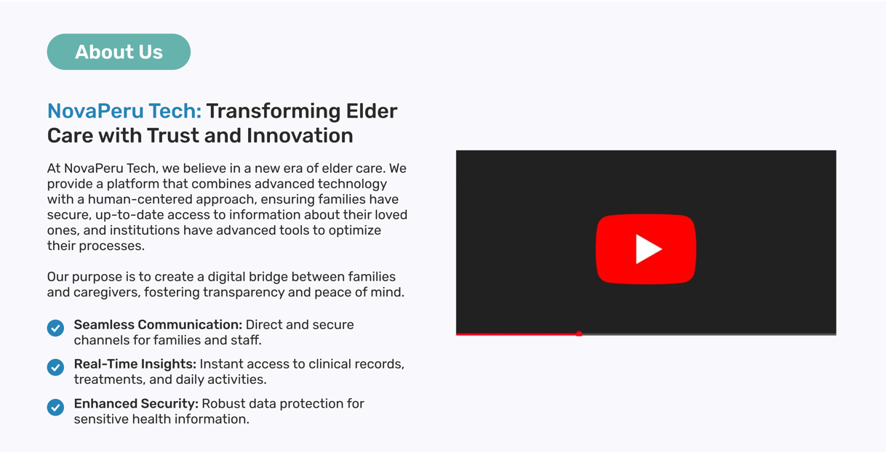

**Our Team** 

La sección "Our Team" presenta a los ingenieros de software detrás de Veyra. Las tarjetas de perfil muestran una foto, el nombre, el cargo y una breve biografía de cada miembro. El diseño de 3 tarjetas arriba y 2 abajo, centradas, brinda un aspecto organizado y profesional, permitiendo a los usuarios conocer al equipo de desarrollo.

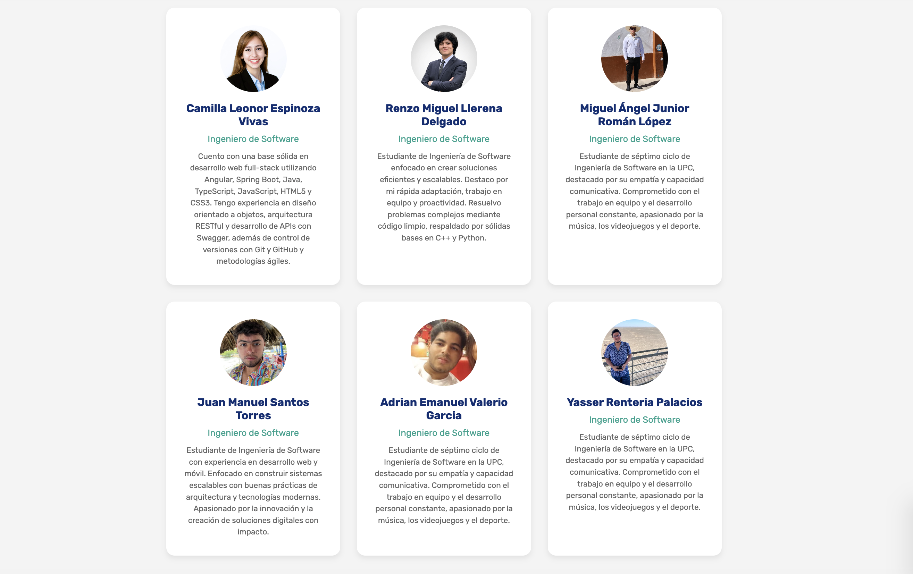

**Plans** 

En la sección de "Plans", ofrecemos los detalles de nuestros planes de precios. Las tarjetas de "Family Plan" y "Nursing Home Plan" incluyen descripciones, precios con opciones mensuales y anuales, y listas de características. El diseño permite un fácil cambio entre planes mensuales y anuales, facilitando la elección del plan adecuado.

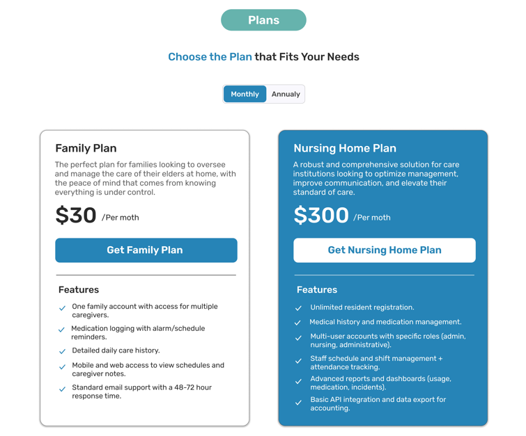

**Footer** 

El "Footer" de nuestra landing page contiene enlaces útiles y recursos adicionales. Un formulario de suscripción invita a los usuarios a unirse a nuestra comunidad. El logo de Veyra, enlaces de contacto, información legal y de derechos de autor se encuentran aquí, asegurando que toda la información relevante esté fácilmente accesible para los usuarios.

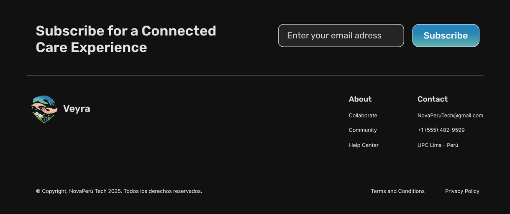

<div style="page-break-after: always;"></div>

## 4.4. Mobile Applications UX/UI Design. 
### 4.4.1. Mobile Applications Wireframes. 
### 4.4.2. Mobile Applications Wireflow Diagrams. 
### 4.4.3. Mobile Applications Mock-ups. 
### 4.4.4. Mobile Applications User Flow Diagrams. 
## 4.5. Mobile Applications Prototyping. 
### 4.5.1. Android Mobile Applications Prototyping. 
### 4.5.2. iOS Mobile Applications Prototyping. 
## 4.6. Web Applications UX/UI Design. 

La sección de Web Applications UX/UI Design presenta la propuesta visual, estructural y de interacción desarrollada para las distintas aplicaciones que conforman la experiencia digital de Veyra, el ecosistema orientado a la gestión integral de residencias geriátricas y a la conexión transparente entre administradores, personal asistencial y familiares.

El diseño se elaboró siguiendo principios de usabilidad, accesibilidad, consistencia visual y orientación a tareas, asegurando que cada interfaz responda a las necesidades reales identificadas durante el proceso de entrevistas y validaciones con usuarios. La propuesta UI/UX se centra en crear una experiencia clara, confiable y sencilla para usuarios con distintos niveles de alfabetización digital.

Dentro de esta sección se detallan los siguientes componentes:

1. Estructura general de la interfaz

Se describen las decisiones de diseño relacionadas con la arquitectura visual, la organización de pantallas, los patrones de navegación (menús, barras superiores, breadcrumbs) y la jerarquía de información para cada tipo de usuario:

- Administradores de residencias.

- Familiares o apoderados de adultos mayores.

  <br>

2. Lineamientos de diseño visual

Se especifican los elementos que conforman la identidad gráfica de Veyra:

- Paleta de colores asociada a salud, confianza y bienestar.

- Tipografías legibles y consistentes.

- Uso de espaciados, tamaños y contrastes orientados a mejorar la accesibilidad.

<br>

3. Componentes de interacción

Incluye la definición de los principales componentes UI y su comportamiento:

- Formularios optimizados y validados.

- Tarjetas informativas para residentes.

- Módulos de reportes y gráficos.

- Alertas, notificaciones y estados del sistema.

- Controles interactivos como botones, selectores y tablas dinámicas.

<br>

4. Flujo de usuario

Se documentan los recorridos que realizan cada uno de los segmentos clave:

- Registro y acceso de familiares.

- Consulta de medicación, historial clínico y citas.

- Gestión administrativa de residentes.

- Supervisión operativa del personal asistencial.

Estos flujos fueron construidos tomando en cuenta los pain points observados en las entrevistas, priorizando accesos rápidos, reducción de pasos innecesarios y claridad en la información.

<br>

5. Justificación del diseño

Se argumenta cómo las decisiones visuales e interactivas responden a:

- Las necesidades reales de los usuarios.

- Las limitaciones tecnológicas identificadas en centros geriátricos.

- Las expectativas de seguridad, claridad y rapidez en la comunicación familiar.
<br>

### 4.6.1. Web Applications Wireframes. 

<p>
En esta sección se presentan los <strong>wireframes diseñados para la aplicación web de NovaPeru Tech (Veyra)</strong>. 
Cada pantalla responde a las funcionalidades principales del sistema y a los distintos roles de usuario 
(Administrador, Familiar, Personal de cuidado).
</p>

<h5>Login – NovaPeru Tech</h5>
<p>Pantalla de inicio donde los usuarios acceden a la aplicación según su rol 
(Administrador, Familiar, Personal de cuidado). Incluye campos de correo y contraseña, además de validaciones de acceso.</p>

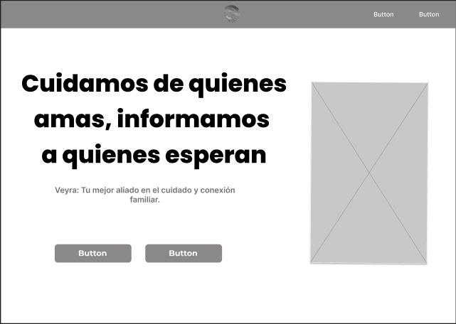

<h5>Inicio de Sesión – NovaPeru Tech</h5>
<p>Formulario de acceso con credenciales de usuario. Presenta opciones de recuperación de contraseña y mantiene consistencia visual con la identidad de NovaPeru Tech.</p>

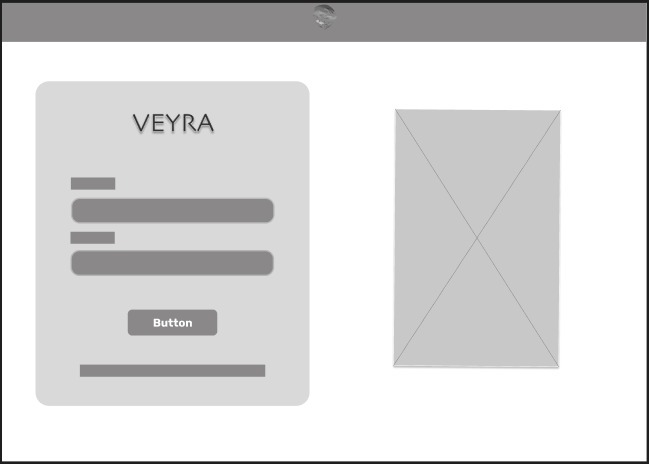

<h5>Registrar Familiar – NovaPeru Tech</h5>
<p>Formulario para que los familiares creen una cuenta, ingresando datos personales básicos, correo electrónico y contraseña. Incluye validaciones de formato y confirmación de correo.</p>

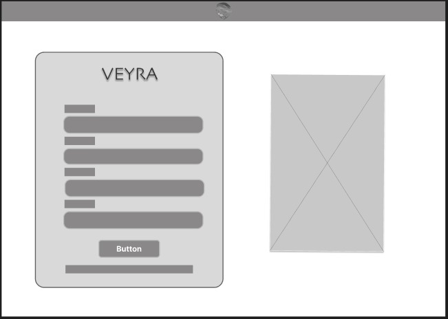

<h5>Registrar Administrador – NovaPeru Tech</h5>
<p>Pantalla destinada a registrar un nuevo administrador en la plataforma. Permite ingresar información personal, datos de contacto y credenciales de acceso.</p>

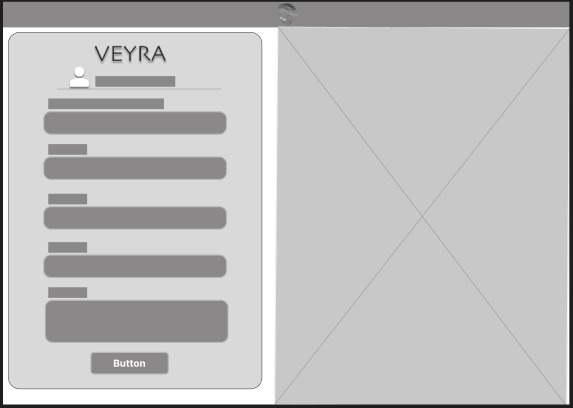

<h5>Inventario – NovaPeru Tech</h5>
<p>Módulo donde el administrador puede visualizar el inventario de medicamentos y recursos clínicos. Permite filtrar, ordenar y consultar detalles de cada ítem.</p>

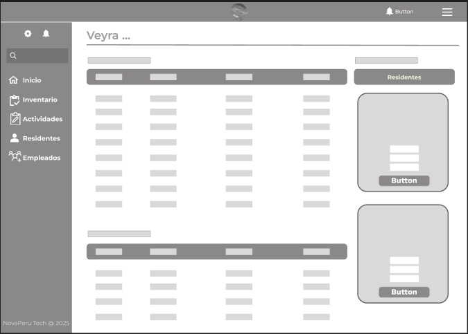

<h5>Inventario – Modificar – NovaPeru Tech</h5>
<p>Sección para editar la información de medicamentos en el inventario: nombre, cantidad, fecha de vencimiento, laboratorio y observaciones.</p>

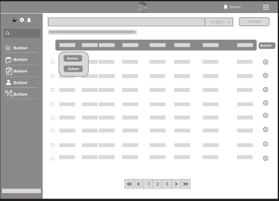

<h5>Paciente – NovaPeru Tech</h5>
<p>Pantalla que muestra la información general de un residente (datos personales, estado clínico, actividades recientes).</p>

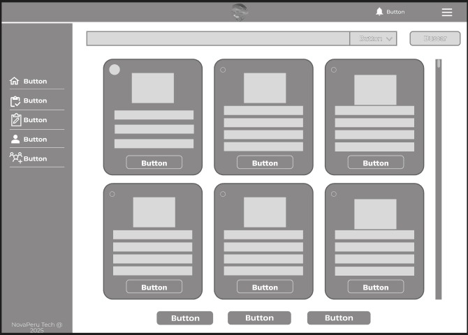

<h5>Paciente – Agregar – NovaPeru Tech</h5>
<p>Formulario para registrar un nuevo residente en la institución. Incluye datos personales, médicos, contactos de emergencia y observaciones.</p>

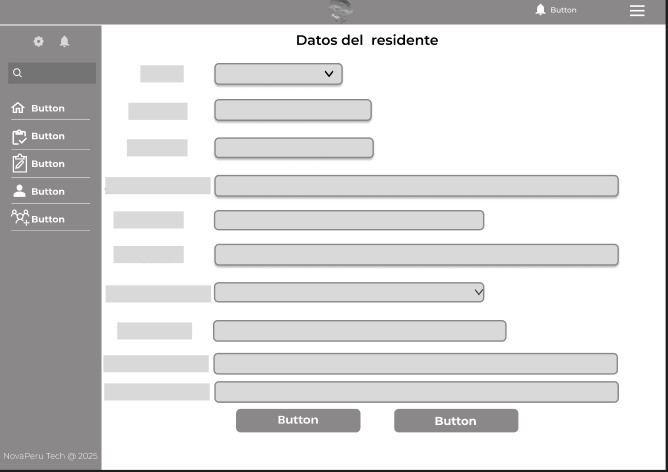

<h5>Paciente – Eliminar – NovaPeru Tech</h5>
<p>Módulo que permite al administrador eliminar registros de pacientes, con mensaje de confirmación para evitar acciones accidentales.</p>

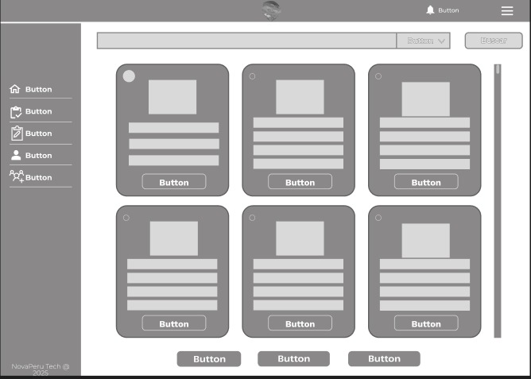

<h5>Empleado – NovaPeru Tech</h5>
<p>Pantalla donde se listan los empleados de la institución, mostrando nombre, rol, contacto y estado laboral.</p>

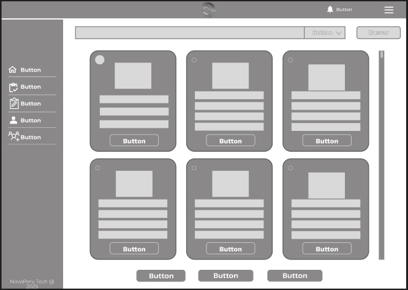

<h5>Empleado – Card Detalles – NovaPeru Tech</h5>
<p>Vista detallada de un empleado en formato de card, mostrando información personal, turno asignado, horas extra y contacto de emergencia.</p>

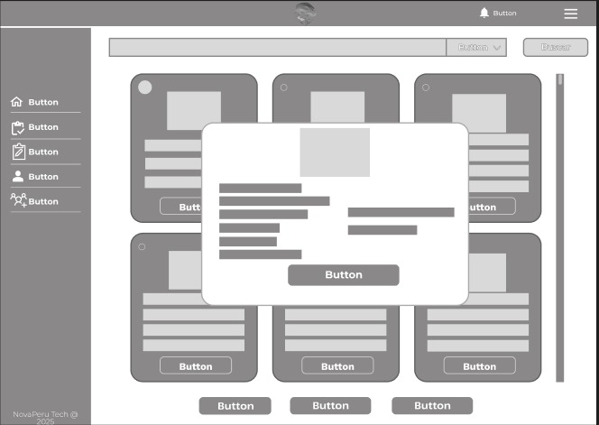

<h5>Actividad – Familiar – NovaPeru Tech</h5>
<p>Pantalla que muestra las actividades recientes del residente (ejercicios, visitas, terapias). 
El familiar puede visualizar fotos, descripciones y fechas.</p>

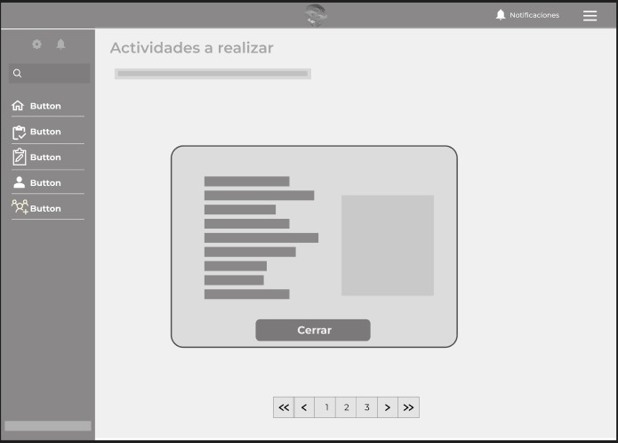

<h5>Historial de Pedido – NovaPeru Tech</h5>
<p>Pantalla que permite consultar pedidos realizados, con detalles de estado, fecha y productos solicitados.</p>

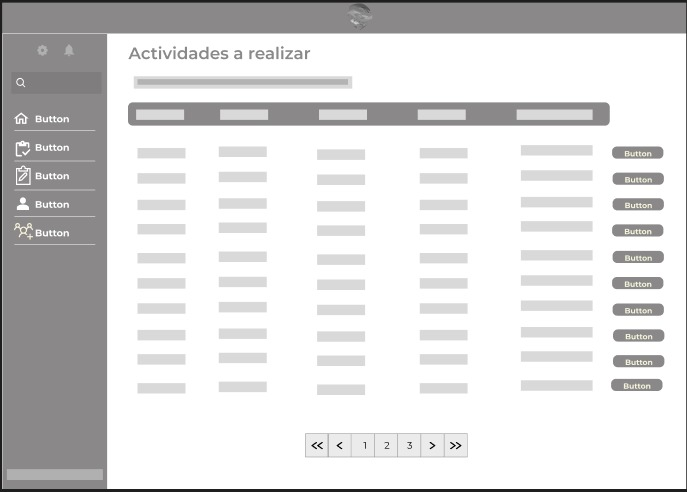

### 4.6.2. Web Applications Wireflow Diagrams. 

<p>Los Wireflows se emplean principalmente en el diseño de la experiencia de usuario (UX) y son especialmente útiles para aplicaciones que incluyen flujos de trabajo e interacciones complejas.</p>

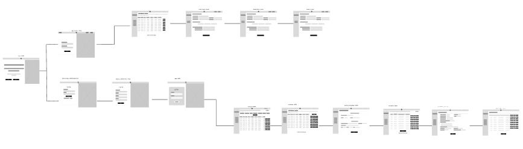

<div style="page-break-after: always;"></div>

### 4.6.3. Web Applications Mock-ups. 

<p>
En esta sección se presentan los <strong>mock-ups diseñados para la aplicación web de NovaPeru Tech (Veyra)</strong>. 
Cada pantalla responde a las funcionalidades principales del sistema y a los distintos roles de usuario 
(Administrador, Familiar, Personal de cuidado).
</p>

<h5>Login – NovaPeru Tech</h5>
<p>Pantalla de inicio donde los usuarios acceden a la aplicación según su rol 
(Administrador, Familiar, Personal de cuidado). Incluye campos de correo y contraseña, además de validaciones de acceso.</p>

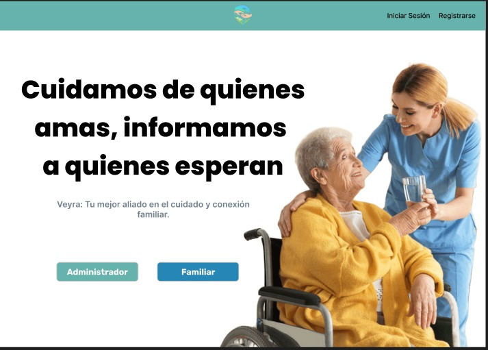

<h5>Inicio de Sesión – NovaPeru Tech</h5>
<p>Formulario de acceso con credenciales de usuario. Presenta opciones de recuperación de contraseña y mantiene consistencia visual con la identidad de NovaPeru Tech.</p>

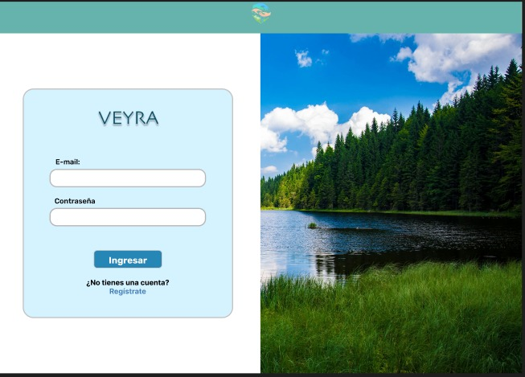

<h5>Registrar Familiar – NovaPeru Tech</h5>
<p>Formulario para que los familiares creen una cuenta, ingresando datos personales básicos, correo electrónico y contraseña. Incluye validaciones de formato y confirmación de correo.</p>

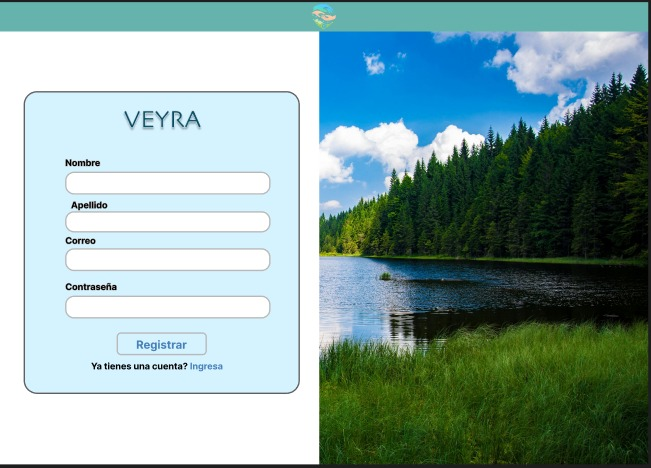

<h5>Registrar Administrador – NovaPeru Tech</h5>
<p>Pantalla destinada a registrar un nuevo administrador en la plataforma. Permite ingresar información personal, datos de contacto y credenciales de acceso.</p>

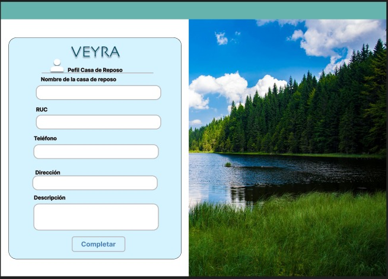

<h5>Inventario – NovaPeru Tech</h5>
<p>Módulo donde el administrador puede visualizar el inventario de medicamentos y recursos clínicos. Permite filtrar, ordenar y consultar detalles de cada ítem.</p>

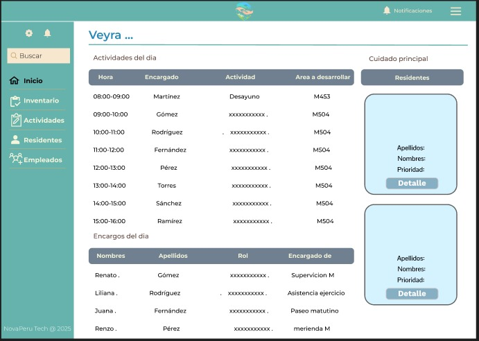

<h5>Inventario – Modificar – NovaPeru Tech</h5>
<p>Sección para editar la información de medicamentos en el inventario: nombre, cantidad, fecha de vencimiento, laboratorio y observaciones.</p>

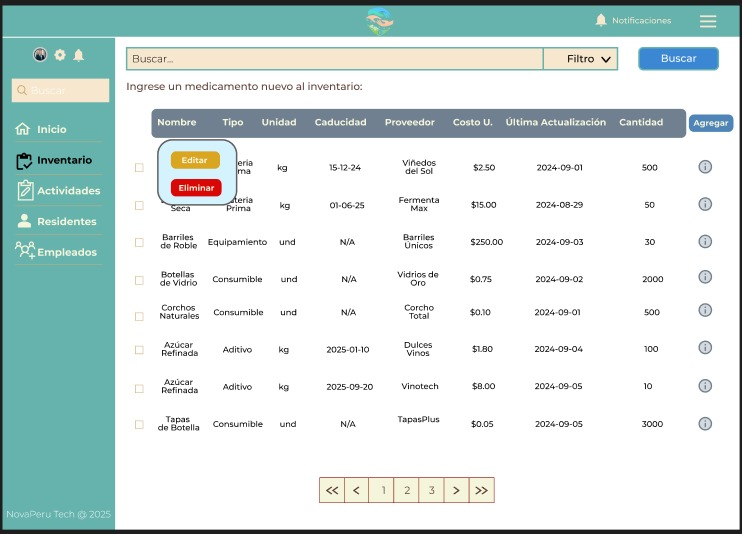

<h5>Paciente – NovaPeru Tech</h5>
<p>Pantalla que muestra la información general de un residente (datos personales, estado clínico, actividades recientes).</p>

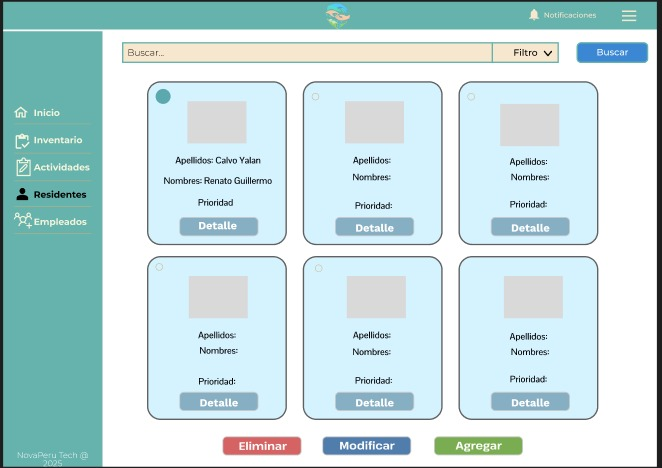

<h5>Paciente – Agregar – NovaPeru Tech</h5>
<p>Formulario para registrar un nuevo residente en la institución. Incluye datos personales, médicos, contactos de emergencia y observaciones.</p>

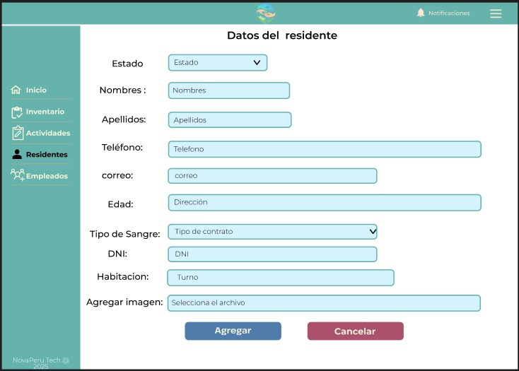

<h5>Paciente – Eliminar – NovaPeru Tech</h5>
<p>Módulo que permite al administrador eliminar registros de pacientes, con mensaje de confirmación para evitar acciones accidentales.</p>

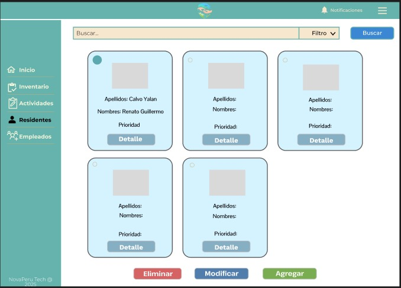

<h5>Empleado – NovaPeru Tech</h5>
<p>Pantalla donde se listan los empleados de la institución, mostrando nombre, rol, contacto y estado laboral.</p>

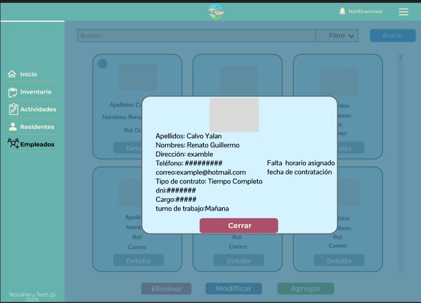

<h5>Empleado – Card Detalles – NovaPeru Tech</h5>
<p>Vista detallada de un empleado en formato de card, mostrando información personal, turno asignado, horas extra y contacto de emergencia.</p>


<h5>Actividad – Familiar – NovaPeru Tech</h5>
<p>Pantalla que muestra las actividades recientes del residente (ejercicios, visitas, terapias). 
El familiar puede visualizar fotos, descripciones y fechas.</p>

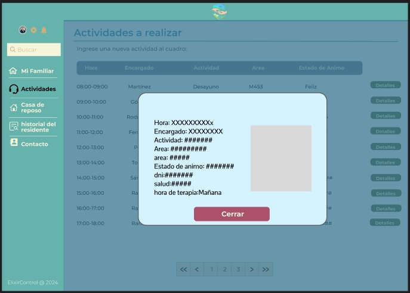

<h5>Historial de Pedido – NovaPeru Tech</h5>
<p>Pantalla que permite consultar pedidos realizados, con detalles de estado, fecha y productos solicitados.</p>

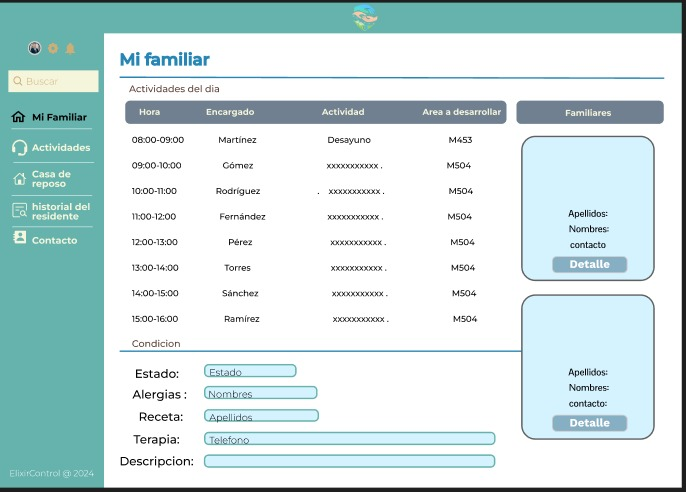

<div style="page-break-after: always;"></div>

### Mock-ups Version Mobile
<p>La sección de Web Applications UX/UI Design presenta la propuesta visual, estructural y de interacción desarrollada para las distintas aplicaciones que conforman la experiencia digital de Veyra, el ecosistema orientado a la gestión integral de residencias geriátricas y a la conexión transparente entre administradores, personal asistencial y familiares.

El diseño se elaboró siguiendo principios de usabilidad, accesibilidad, consistencia visual y orientación a tareas, asegurando que cada interfaz responda a las necesidades reales identificadas durante el proceso de entrevistas y validaciones con usuarios. La propuesta UI/UX se centra en crear una experiencia clara, confiable y sencilla para usuarios con distintos niveles de alfabetización digital.</p>

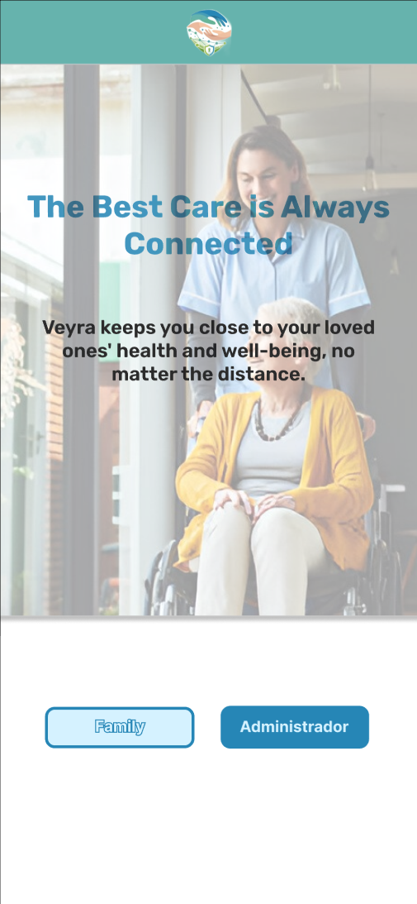


<div style="page-break-after: always;"></div>

### 4.6.4. Web Applications User Flow Diagrams.

El *user flow* es la representación visual del camino que un usuario sigue dentro de la aplicación Veyra para alcanzar un objetivo específico. Estos diagramas son esenciales para asegurar que la navegación sea lógica, intuitiva y libre de obstáculos, garantizando una experiencia de usuario satisfactoria y eficiente para cada uno de los roles: **Administrador**, **Familiar** y **Personal de Cuidado**. A continuación, se detallan los flujos para las tareas clave de la plataforma.

---

- #### **Objetivo 1: Un administrador desea registrar un nuevo residente en el sistema.**

  **Happy Path**

  En esta ruta ideal, el administrador inicia sesión y accede al panel de control. Desde allí, navega a la sección de "Pacientes" y selecciona la opción para agregar un nuevo residente. Completa todos los campos del formulario con la información correcta del residente (datos personales, médicos, etc.) y guarda el registro. El sistema confirma que el residente ha sido agregado exitosamente y lo muestra en la lista de pacientes.

  

  **Unhappy Paths**

  En este escenario alternativo, el administrador intenta guardar el formulario con campos obligatorios vacíos o con datos en un formato incorrecto (por ejemplo, un número de teléfono con letras). El sistema muestra mensajes de error específicos junto a los campos problemáticos, impidiendo que el registro se complete hasta que la información sea corregida.

  

---

- #### **Objetivo 2: Un familiar desea registrarse en la plataforma Veyra.**

  **Happy Path**

  El familiar accede a la página de inicio y selecciona la opción "Registrarse". Completa el formulario con sus datos personales, correo electrónico y una contraseña segura. Al enviar el formulario, el sistema valida la información, crea la cuenta y le envía un correo de confirmación. El familiar es redirigido a la pantalla de inicio de sesión o directamente a su panel, listo para vincularse con un residente.

  

  **Unhappy Paths**

  La ruta infeliz ocurre si el familiar intenta registrarse con un correo electrónico que ya existe en el sistema o si las contraseñas no coinciden. La plataforma mostrará un mensaje de error claro, indicando el problema específico para que el usuario pueda corregirlo y completar su registro.

  

---

- #### **Objetivo 3: Un administrador desea agregar un nuevo medicamento al inventario.**

  **Happy Path**

  El administrador, después de iniciar sesión, navega a la sección de "Inventario". Hace clic en el botón para agregar un nuevo ítem, completa los detalles del medicamento (nombre, cantidad, fecha de vencimiento, etc.) y guarda la información. El sistema confirma la adición y el nuevo medicamento aparece inmediatamente en la lista del inventario.

  

  **Unhappy Paths**

  En este caso, el administrador intenta registrar un medicamento sin completar campos clave como el nombre o la cantidad. El sistema previene el registro y resalta los campos obligatorios que faltan, mostrando un mensaje que guía al usuario para que complete la información necesaria antes de poder guardar.

  

---

- #### **Objetivo 4: Un familiar desea ver las actividades recientes de su ser querido.**

  **Happy Path**

  El familiar inicia sesión en su cuenta y es dirigido a su panel principal. Desde allí, accede a la sección "Actividades del Residente". La aplicación muestra una lista cronológica de las últimas actividades (terapias, comidas, visitas), incluyendo fotos y descripciones publicadas por el personal de cuidado, brindando tranquilidad y conexión.

  

---

- #### **Objetivo 5: Un usuario (administrador o familiar) ha olvidado su contraseña y desea recuperarla.**

  **Happy Path**

  En la pantalla de inicio de sesión, el usuario hace clic en "¿Olvidaste tu contraseña?". Ingresa su dirección de correo electrónico registrada y recibe un enlace o código de recuperación. Al seguir las instrucciones, puede establecer una nueva contraseña y acceder nuevamente a su cuenta sin problemas.

  

  **Unhappy Paths**

  Si el usuario ingresa un correo electrónico que no está registrado en la base de datos de Veyra, el sistema le informará que el correo no fue encontrado, protegiendo la seguridad de los datos y pidiéndole que verifique la dirección ingresada.

  

<div style="page-break-after: always;"></div>

## 4.7. Web Applications Prototyping. 

La sección de Web Applications Prototyping presenta los prototipos interactivos diseñados para la versión Desktop y Mobile Web de Veyra. Estos prototipos permiten simular la navegación real dentro de la plataforma y visualizar cómo los usuarios recorren los principales paths definidos en los User Flow Diagrams.

Las decisiones de interacción tomadas en esta etapa responden a tres criterios fundamentales:

- Claridad y simplicidad de uso, especialmente considerando que parte de nuestros usuarios tienen competencia digital intermedia.

- Rapidez de acceso a la información crítica, alineada con la necesidad de monitoreo médico en tiempo real.

- Consistencia visual y funcional, asegurando que las interacciones sean predecibles y estén alineadas con el Design System de VEYRA.
<br>

**Criterios que guiaron las decisiones de interacción**

1. Arquitectura de Información basada en prioridades del usuario

La estructura del contenido se organizó priorizando los elementos más consultados por los familiares y cuidadores:

- Reportes diarios

- Estado de salud

- Medicación

- Citas médicas

- Actividades

- Alertas

Estos componentes se ubicaron en zonas de acceso rápido tanto en desktop como en mobile, asegurando rutas de navegación cortas y directas.

<br>


2. Navegación clara y consistente

Se optó por un sistema de navegación híbrido:

En desktop, un menú superior horizontal que mantiene visibles las secciones principales.

En mobile, un menú inferior tipo tab-bar para accesos frecuentes y un menú hamburguesa para secciones secundarias.

Esta decisión refleja la arquitectura de información previamente definida y garantiza que las rutas de navegación coincidan con los User Flow Diagrams propuestos.

<br>

3. Interacciones basadas en patrones familiares

Para reducir la curva de aprendizaje se utilizaron patrones estándar, como:

Acordeones para secciones extensas (features, historial).

Tarjetas para resumir información médica y actividades.

Íconos universales (alertas, calendario, medicación).

Transiciones suaves que evitan saturar la experiencia.

<br>


4. Principios de diseño inclusivo

Los prototipos consideran: Tipografías legibles, Contrastes adecuados para adultos mayores, Botones amplios para facilitar el toque en mobile, Lenguaje visual claro y directo, Prototipos UI – Versión Desktop

Los prototipos desktop muestran una interfaz amplia, optimizada para profesionales y usuarios que consultan información desde una laptop o PC. Entre los elementos destacados:

• Dashboard principal

Vista general del estado del residente.

Resumen de alertas y citas.

Gráficos simples para evolución de signos vitales.

<br>

• Navegación superior

Acceso rápido a Home, Reports, Medication, Calendar, Activities y Settings.

Persistencia visual para orientar al usuario.

<br>

• Secciones modulares

El contenido se divide en bloques visuales que permiten una lectura rápida:

Tarjetas de información médica.

Tablas de medicación.

Calendarios interactivos.

Panel lateral con alertas recientes.

Prototipos UI – Versión Mobile Web Browser

La versión móvil prioriza la usabilidad y accesibilidad, manteniendo la esencia visual del desktop pero adaptada a pantallas reducidas.

<br>

• Home simplificado

Resumen al instante del estado del residente.

Acceso directo a alertas, medicación y reportes.

<br>

• Tab-Bar inferior

Incluye 4 accesos principales:

Home

Reports

Medication

Profile

Esto reduce la carga cognitiva y facilita el uso con una sola mano.

<br>

• Menú hamburguesa

Incluye secciones secundarias como Settings, About, Permissions, o historial extendido. Se evita sobrecargar la pantalla principal.

<br>

• Interacción táctil optimizada

Botones grandes y espaciados.

Acordeones y sliders fáciles de usar.

Scroll vertical continuo para favorecer fluidez.

<br>

**Relación con los User Flow Diagrams**

Cada prototipo fue diseñado respetando los recorridos definidos en los User Flows, garantizando que:

Las pantallas aparezcan en el orden lógico previsto.

No existan rutas muertas o pasos innecesarios.

Las tareas principales (ver reportes, recibir alertas, revisar medicación) se completen con la menor cantidad de clics posible.

La navegación sea intuitiva para usuarios con distintos niveles tecnológicos.


http://bit.ly/4q6AhWP

## 4.8. Domain-Driven Software Architecture. 

La arquitectura de software de VEYRA se construye a partir de los resultados obtenidos en el Big Picture Event Storming, que permitió comprender en profundidad los flujos clave del dominio de atención residencial y las interacciones entre familiares, cuidadores y personal administrativo. A partir de este análisis inicial, se desarrolló una visión más estructurada del dominio utilizando los principios de Domain-Driven Design (DDD).

En las siguientes secciones se presenta cada nivel del modelo, explicando la estructura, responsabilidades y comunicación entre los elementos que conforman la arquitectura de VEYRA.


### 4.8.1. Software Architecture Context Diagram. 

En este nivel se presenta una vista de alto nivel de la arquitectura, donde el foco está en el sistema de software Veyra como una “caja negra” y en las interacciones que mantiene con sus usuarios y con otros sistemas externos.

El context diagram muestra al **Veyra Software System** como un recuadro en el centro, rodeado por los principales actores y sistemas con los que se comunica:

- **Nursing Home Administrator**: usuario interno responsable de gestionar hogares, residentes, personal, actividades y servicios. Interactúa con Veyra para registrar y mantener información operativa del hogar de cuidado.
- **Family Member**: usuario externo que consulta la plataforma para monitorear el estado de salud, medicación y actividades de sus familiares adultos mayores, así como para revisar información relevante de su cuidado.
- **Payment System (Stripe)**: sistema externo encargado de procesar suscripciones, pagos y facturación asociados al uso de la plataforma.
- **Google Maps API**: servicio de mapas utilizado para obtener geolocalización y direcciones de los hogares de cuidado, facilitando la búsqueda y navegación de ubicaciones.
- **Email Notification Service**: servicio de correo utilizado para enviar notificaciones transaccionales (activación de cuenta, recordatorios, alertas, etc.) a los usuarios de Veyra.

En el diagrama se representan las relaciones entre estos elementos, destacando que tanto el administrador como el familiar interactúan únicamente con Veyra, mientras que el sistema se encarga de orquestar las integraciones con los servicios externos (pagos, mapas y notificaciones). Esta vista permite entender el alcance del sistema, los límites de responsabilidad y el ecosistema en el que se inserta Veyra antes de entrar a detalles de implementación.


---

### 4.8.2. Software Architecture Container Diagrams. 

En el nivel de contenedores, la atención se desplaza desde “quién usa el sistema” hacia “cómo se organiza internamente el sistema en aplicaciones y fuentes de datos”. El container diagram muestra los elementos de alto nivel de la arquitectura de Veyra, sus responsabilidades principales y la forma en que se comunican entre sí y con los sistemas externos.

La arquitectura lógica de Veyra se estructura en los siguientes contenedores:

- **Landing Page**: aplicación web estática que presenta la propuesta de valor de Veyra, guía a nuevos usuarios y redirige a la aplicación principal. Está desarrollada con tecnologías web estándar (HTML, CSS y JavaScript) y se despliega en un entorno orientado a contenido estático.
- **Single Page Application (SPA)**: aplicación web principal, implementada en **Angular**, donde interactúan el Nursing Home Administrator y el Family Member. Este contenedor concentra la experiencia de usuario, las vistas y la lógica de presentación para los diferentes contextos del dominio (nursing, hcm, iam, analytics, health, profiles, tracking, payments y activities).
- **API Application**: backend implementado con **Spring Boot**, que expone una API REST y encapsula la lógica de negocio, reglas de validación y orquestación de procesos. Este contenedor agrupa los módulos backend por contexto (Nursing Backend, HCM Backend, IAM Backend, Analytics Backend, Health Backend, Profiles Backend, Tracking Backend, Payments Backend, Activities Backend y Shared Backend).
- **Database**: base de datos relacional **MySQL**, donde se persiste la información estructurada del sistema: hogares, residentes, personal, perfiles, métricas, historiales clínicos, datos de seguimiento, pagos y actividades.

En el diagrama se observa que:

- Los usuarios acceden primero a la **Landing Page**, la cual redirige a la **SPA** tras la autenticación.
- La **SPA** se comunica exclusivamente con la **API Application** mediante peticiones **HTTP/HTTPS** con mensajes **JSON**, siguiendo un estilo REST.
- La **API Application** persiste y consulta datos en la **Database** mediante **JDBC** y mapeo objeto–relacional.
- Tanto la **SPA** como la **API Application** interactúan con los sistemas externos: el **Payment System** para pagos y suscripciones, la **Google Maps API** para geolocalización y el **Email Notification Service** para el envío de notificaciones.

Esta vista permite apreciar cómo se distribuyen las responsabilidades entre la capa de presentación (Landing y SPA), la capa de lógica de negocio (API Application) y la capa de persistencia (Database), así como las principales decisiones tecnológicas que se han tomado para cada contenedor.


---

### 4.8.3. Software Architecture Components Diagrams. 

En el nivel de componentes se detalla la descomposición interna de los contenedores, mostrando los bloques estructurales que conforman cada uno y las relaciones entre ellos. Dado que la **Single Page Application** y la **Database** ya fueron descritas en otros apartados mediante diagramas de clases frontend y de base de datos, en esta sección se pone especial énfasis en el contenedor **API Application**, donde reside la mayor parte de la lógica de negocio.

El component diagram de la **API Application** agrupa la arquitectura interna siguiendo los bounded contexts definidos en el dominio de Veyra. Cada módulo backend representa un componente principal dentro del contenedor:

- **Nursing Backend**: implementa la lógica relacionada con hogares de cuidado, habitaciones, residentes, asignaciones y medicación. Gestiona las operaciones CRUD y reglas de negocio para el contexto de nursing.
- **HCM Backend**: agrupa la funcionalidad de recursos humanos, incluyendo registro de personal, contratos, turnos y organización interna del hogar de cuidado.
- **IAM Backend**: se encarga de la autenticación, gestión de usuarios, roles, permisos y validaciones de acceso a la aplicación.
- **Analytics Backend**: ofrece capacidades de agregación y consulta de métricas, estadísticas y datos analíticos de los hogares, apoyando el monitoreo y la toma de decisiones.
- **Health Backend**: administra historiales clínicos, evaluaciones médicas y registros de signos vitales, proporcionando una vista estructurada del estado de salud de los residentes.
- **Profiles Backend**: gestiona la información de perfiles de personas y empresas (contacto, direcciones, datos de identificación), compartida por varios procesos del sistema.
- **Tracking Backend**: maneja la captura y procesamiento de datos provenientes de bandas médicas y sensores, permitiendo la trazabilidad del estado de los residentes.
- **Payments Backend**: encapsula el manejo de suscripciones, facturación, pagos y conciliaciones, y se integra con el **Payment System (Stripe)** para la ejecución de cobros.
- **Activities Backend**: gestiona la programación de actividades, horarios y participación de residentes, coordinando la agenda de eventos del hogar de cuidado.
- **Shared Backend**: provee componentes compartidos, utilidades, clases base, eventos y mecanismos de infraestructura transversales utilizados por los demás módulos backend.

En el diagrama se refleja cómo:

- La **SPA** consume los servicios expuestos por cada módulo backend a través de la **API Application**, utilizando endpoints REST específicos por contexto.
- Cada módulo backend accede a la **Database** para leer y escribir la información correspondiente a su contexto (por ejemplo, Nursing Backend a tablas de hogares y residentes, HCM Backend a tablas de personal y contratos, etc.).
- Algunos módulos se integran con sistemas externos: **Payments Backend** con el sistema de pagos, **Nursing Backend** y **Profiles Backend** con la API de mapas, y **IAM Backend** con el servicio de notificaciones por correo.
- Todos los módulos backend reutilizan capacidades comunes provistas por el **Shared Backend**, lo que favorece la consistencia, la reutilización y la reducción de duplicación de código.

De esta forma, los component diagrams complementan los diagramas de clases del frontend, backend y base de datos, mostrando cómo los contenedores se descomponen en componentes coherentes con los bounded contexts del dominio y cómo estos colaboran entre sí para implementar la funcionalidad completa de Veyra.


<div style="page-break-after: always;"></div>

## 4.9. Software Object-Oriented Design. 

En esta sección se presenta el diseño orientado a objetos del sistema Veyra, el cual desarrolla con mayor detalle la implementación interna de los componentes identificados en los diagramas C4 del apartado 4.6. A partir de los contenedores y componentes definidos en Structurizr (Frontend, API Application y Database), se derivan diagramas de clases específicos para cada bounded context del dominio, con el objetivo de mostrar:

- Cómo se modelan las entidades, agregados, servicios y recursos en el backend para cada contexto.
- Cómo se estructuran los componentes de presentación, estado e infraestructura en el frontend.
- Cómo se reflejan estos modelos en el diseño de la base de datos relacional.

De esta forma, el diseño orientado a objetos enlaza el nivel arquitectónico (C4 Model) con el nivel de implementación, permitiendo verificar coherencia entre bounded contexts, responsabilidades de cada módulo y decisiones de diseño técnico (p. ej., uso de patrones, clases base y modelos de vista).

### 4.9.1. Class Diagrams. 

En esta subsección se presentan los diagramas de clases que detallan la estructura interna de los principales componentes para cada bounded context. Estos diagramas complementan al Component Diagram de la **API Application** y a los contenedores definidos en Structurizr, proporcionando una vista centrada en clases, atributos, métodos y relaciones.

A nivel de **frontend**, se modelan las clases en función de los módulos y vistas que consumen los servicios expuestos por la API:

- **Frontend completo (Frontend)**: muestra la organización general de la capa de presentación, incluyendo componentes de rutas, componentes de página y stores de estado que interactúan con los contenedores backend definidos en el container diagram.
- **Nursing Frontend**: detalla las clases que gestionan las vistas y lógica de presentación para hogares, habitaciones, residentes, asignaciones y medicación, en correspondencia con el componente *Nursing Backend*.
- **HCM Frontend**: modela los componentes responsables de la gestión de personal, contratos y turnos, alineados con el componente *HCM Backend*.
- **IAM Frontend**: incluye los formularios y componentes relacionados con autenticación, registro, manejo de sesión y autorización, que consumen los endpoints del *IAM Backend*.
- **Analytics Frontend**: presenta los componentes de interfaz que construyen dashboards, gráficos y vistas de métricas, apoyándose en el *Analytics Backend*.
- **Profiles Frontend**: muestra las clases dedicadas a la administración de perfiles personales y empresariales, conectadas al *Profiles Backend*.
- **Shared Frontend**: agrupa componentes reutilizables (layouts, formularios base, servicios compartidos) que sirven como infraestructura de presentación común para el resto de módulos frontend.

A nivel de **backend**, los diagramas de clases reflejan la implementación detallada de los módulos definidos como componentes en la **API Application**:

- **Backend completo (Backend)**: ilustra la estructura general de la capa de dominio y aplicación (aggregates, entities, value objects, services, repositories, event handlers), mostrando cómo se distribuyen estas clases entre los distintos bounded contexts que fueron modelados como componentes (*Nursing Backend, HCM Backend, IAM Backend, Analytics Backend, Health Backend, Profiles Backend, Tracking Backend, Payments Backend, Activities Backend y Shared Backend*).
- **Nursing Backend**: incluye agregados como NursingHome, Resident, Room y Medication, junto con sus servicios de dominio y repositorios, encargados de la lógica de hogares, habitaciones, cuidados y medicación.
- **HCM Backend**: detalla las clases Staff, Contract y otras entidades de recursos humanos, así como servicios y repositorios asociados a la gestión de personal y contratos.
- **IAM Backend**: muestra clases como User, Role y UserRoleAssignment, junto con servicios de autenticación/autorización y repositorios para credenciales y roles.
- **Analytics Backend**: modela la entidad Metric y otros elementos de dominio que soportan el cálculo y consulta de métricas y eventos.
- **Health Backend**: representa entidades relacionadas con historiales clínicos, evaluaciones y registros médicos (por ejemplo, VitalSign y sus objetos de valor asociados).
- **Profiles Backend**: agrupa PersonProfile, BusinessProfile y clases relacionadas con datos de identificación y contacto.
- **Tracking Backend**: define entidades para measurements, dispositivos y señales de bandas médicas que permiten la trazabilidad del estado de los residentes.
- **Payments Backend**: contiene las clases Subscription, Payment y objetos de valor de dinero, período y estado, responsables del manejo de pagos y conciliaciones.
- **Activities Backend**: modela las actividades, horarios y participación de residentes en eventos del hogar de cuidado.
- **Shared Backend**: concentra clases base auditables, utilidades y configuraciones compartidas por los demás módulos, soportando la consistencia del diseño y la reutilización de código.

### Diagrama de clases del frontend

### Diagrama del frontend completo:


<h3><strong>Diagrama del frontend dividido por contextos:</strong></h3>

<h4>nursing frontend:</h4>
<p><strong>Responsabilidad:</strong> Maneja las vistas de hogares, habitaciones, asignaciones y servicios de cuidado. </p>


<h4>hcm frontend:</h4>
<p><strong>Responsabilidad:</strong> Maneja las vistas de la gestión de personal, contratos, turnos y organización interna.</p>


<h4>iam frontend:</h4>
<p><strong>Responsabilidad:</strong>Maneja las vistas de Usuarios, autenticación, roles y permisos.</p>


<h4>analytics frontend:</h4>
<p><strong>Responsabilidad:</strong> Maneja las vistas de métricas, auditoría y análisis de eventos.</p>


<!--
<h4>health frontend:</h4>
<p><strong>Responsabilidad:</strong> Maneja las vistas de evaluaciones médicas, historiales clínicos y servicios de salud.</p>


-->
<!--
<h4>communication frontend:</h4>
<p><strong>Responsabilidad:</strong> Maneja las vistas de notificaciones, mensajes y comunicación interna del sistema.</p>


-->
<h4>profiles frontend:</h4>
<p><strong>Responsabilidad:</strong> Maneja las vistas de perfiles personales, empresariales y datos asociados.</p>


<!--
<h4>tracking frontend:</h4>
<p><strong>Responsabilidad:</strong> Maneja las vistas de bandas médicas, sensores y trazabilidad de residentes.</p>


-->
<!--
<h4>payments frontend:</h4>
<p><strong>Responsabilidad:</strong> Maneja las vistas de pagos, facturación, transacciones y conciliaciones.</p>


-->
<!--
<h4>activities frontend:</h4>
<p><strong>Responsabilidad:</strong> Maneja las vistas de actividades, programación, horarios y participación de residentes.</p>


-->
<h4>shared frontend:</h4>
<p><strong>Responsabilidad:</strong> Maneja los componentes comunes, utilidades, base classes, eventos, comunicación entre módulos, patrones compartidos.</p>


<div style="page-break-after: always;"></div>

### Diagrama de clases del backend

### Diagrama del backend completo:


<h3><strong>Diagrama del backend dividido por contextos:</strong></h3>

<h4>nursing backend:</h4>
<p><strong>Responsabilidad:</strong> Lógica de hogares, habitaciones, asignaciones y servicios de cuidado.</p>


<h4>hcm backend:</h4>
<p><strong>Responsabilidad:</strong> Gestión de personal, contratos, turnos y organización interna.</p>


<h4>iam backend:</h4>
<p><strong>Responsabilidad:</strong> Usuarios, autenticación, roles y permisos.</p>


<h4>analytics backend:</h4>
<p><strong>Responsabilidad:</strong> Manejo de métricas, auditoría y análisis de eventos.</p>


<h4>health backend:</h4>
<p><strong>Responsabilidad:</strong> Evaluaciones médicas, historiales clínicos y servicios de salud.</p>


<!--
<h4>communication backend:</h4>
<p><strong>Responsabilidad:</strong> Notificaciones, mensajes y comunicación interna del sistema.</p>


-->
<h4>profiles backend:</h4>
<p><strong>Responsabilidad:</strong> Perfiles personales, empresariales y datos asociados.</p>


<h4>tracking backend:</h4>
<p><strong>Responsabilidad:</strong> Bandas médicas, sensores y trazabilidad de residentes.</p>


<h4>payments backend:</h4>
<p><strong>Responsabilidad:</strong> Pagos, facturación, transacciones y conciliaciones.</p>


<h4>activities backend:</h4>
<p><strong>Responsabilidad:</strong> Actividades, programación, horarios y participación de residentes.</p>


<h4>shared backend:</h4>
<p><strong>Responsabilidad:</strong> Componentes comunes, utilidades, base classes, eventos, comunicación entre módulos, patrones compartidos.</p>


<div style="page-break-after: always;"></div>

### 4.9.2. Class Dictionary. 
## 4.10. Database Design.
### 4.10.1. Relational/Non-Relational Database Diagram. 

#### Diagrama de base de datos completo:


<h3><strong>Diagrama de base de datos dividido por contextos:</strong></h3>

<h4>nursing base de datos:</h4>
<p><strong>Responsabilidad:</strong> Gestión de hogares, habitaciones y asignaciones.</p>


<h4>hcm base de datos:</h4>
<p><strong>Responsabilidad:</strong> Almacena información para recursos humanos  y sus contratos.</p>


<h4>iam base de datos:</h4>
<p><strong>Responsabilidad:</strong> Gestión de usuarios, roles y asignaciones de acceso.</p>


<h4>analytics base de datos:</h4>
<p><strong>Responsabilidad:</strong> Métricas, eventos y datos para análisis.</p>


<h4>health base de datos:</h4>
<p><strong>Responsabilidad:</strong> Historiales médicos, evaluaciones y registros clínicos.</p>


<!--
<h4>communication base de datos:</h4>
<p><strong>Responsabilidad:</strong> Notificaciones, mensajes y comunicaciones internas.</p>


-->
<h4>profiles base de datos:</h4>
<p><strong>Responsabilidad:</strong> Perfiles, datos personales de las personas y de las empresas.</p>


<h4>tracking base de datos:</h4>
<p><strong>Responsabilidad:</strong> Manejo de data de bandas medicas  y trazabilidad.</p>


<h4>payments base de datos:</h4>
<p><strong>Responsabilidad:</strong> Facturación, pagos y transacciones.</p>


<h4>activities base de datos:</h4>
<p><strong>Responsabilidad:</strong> Actividades, horarios y participación.</p>


---

# Capítulo V: Product Implementation & Deployment

## 5.1. Software Configuration Management

En esta sección se describen las decisiones, convenciones y principios adoptados por el equipo para garantizar la coherencia, trazabilidad y control de versiones durante el ciclo de vida del desarrollo de la solución **Veyra**.  

Se establecen los lineamientos para:

- Configuración del entorno de desarrollo  
- Gestión del código fuente  
- Convenciones de estilo  
- Configuración de despliegue  

---

## 5.1.1. Software Development Environment Configuration

En esta sección se especifican los productos de software utilizados durante el ciclo de vida del proyecto. Para cada herramienta se detalla:

- Nombre  
- Propósito técnico dentro del proyecto Veyra  
- Ruta de referencia (software SaaS) o ruta de descarga (instalación local)  

Las herramientas se organizan según las siguientes disciplinas:

1. **Project Management**
2. **Requirements Management**
3. **Product UX/UI Design**
4. **Software Development**
5. **Software Testing**
6. **Software Documentation**

### Project Management

Esta disciplina se centra en la planificación, seguimiento y control de las actividades del proyecto, asegurando el cumplimiento de los objetivos dentro del tiempo y recursos establecidos.

**Jira**  
Plataforma de gestión de proyectos ágiles utilizada para:
- Administración del Product Backlog  
- Planificación de Sprints  
- Asignación de User Stories y Tasks  
- Seguimiento mediante tableros Scrum (To-Do, In-Process, To-Review, Done)  

**Ruta de referencia:** https://www.atlassian.com/software/jira  

---

### Requirements Management

Este proceso se enfoca en la documentación, verificación y seguimiento de los requisitos del proyecto, asegurando que las necesidades de los stakeholders sean satisfechas.

**Trello**  
Plataforma de gestión visual utilizada para:
- Organización del Sprint Backlog  
- Gestión de User Stories por estado  
- Priorización colaborativa de requisitos  

**Ruta de referencia:** https://trello.com  

---

### Product UX/UI Design

El diseño de la experiencia e interfaz de usuario contempla un sitio web responsivo compatible con escritorio y dispositivos móviles.

**UXPressia**  
Elaboración de User Personas, Empathy Maps, Customer Journey Maps e Impact Maps.  
**Ruta:** https://uxpressia.com/  

**Miro**  
Soporte para EventStorming (Big Picture y Design-Level) e identificación de elementos del dominio.  
**Ruta:** https://miro.com/es/  

**Figma**  
Diseño de Wireframes, Mockups y prototipos interactivos aplicando Material Design.  
**Ruta:** https://www.figma.com/es-es/  

**Lucidchart**  
Creación de Wireflows, User Flows, diagramas UML y diagramas de base de datos.  
**Ruta:** https://www.lucidchart.com/pages/es  

**Overflow**  
Diseño de User Flow Diagrams con rutas de navegación detalladas.  
**Ruta:** https://overflow.io/  

---

### Software Development

El desarrollo abarca Landing Page, Frontend Web Application y Backend Web Services.

**GitHub**  
Control de versiones y gestión de repositorios con GitFlow, Conventional Commits y Semantic Versioning.  
**Ruta:** https://github.com  
**Organización:** https://github.com/NovaPeru-Tech  

**WebStorm**  
IDE para desarrollo Frontend con Angular, HTML5, CSS3, JavaScript y TypeScript.  
**Descarga:** https://www.jetbrains.com/webstorm/  
**Licencia:** https://www.jetbrains.com/community/education/  

**IntelliJ IDEA**  
IDE para desarrollo Backend con Java y Spring Boot, con integración a Render.  
**Descarga:** https://www.jetbrains.com/idea/  
**Licencia:** https://www.jetbrains.com/community/education/  

**Angular Framework**  
Desarrollo de aplicaciones frontend con componentes reutilizables y consumo de APIs.  
**Ruta:** https://angular.io/  

**Angular Material**  
Componentes UI basados en Material Design.  
**Ruta:** https://material.angular.io/  

**Spring Boot**  
Desarrollo de servicios RESTful con persistencia y documentación integrada.  
**Ruta:** https://spring.io/projects/spring-boot  

**Tecnologías base**
- HTML5: https://html.spec.whatwg.org/  
- CSS3: https://www.w3.org/Style/CSS/  
- JavaScript: https://developer.mozilla.org/es/docs/Web/JavaScript  

**TypeScript**  
Lenguaje tipado para Angular.  
**Ruta:** https://www.typescriptlang.org/  

**Java (JDK 25)**  
Lenguaje backend compatible con Render.  
**Ruta:** https://openjdk.org/  

---

### Software Testing

Las pruebas permiten verificar que el software cumple con los requisitos especificados.

**Gherkin**  
Lenguaje DSL para criterios de aceptación en formato Given–When–Then.  
Permite definir escenarios comprensibles y automatizables.

**Keywords:** Feature, Scenario, Given, When, Then, And, But  

**Ruta de referencia:** https://cucumber.io/docs/gherkin/  

---

### Software Documentation

La documentación facilita el mantenimiento y evolución del sistema.

**OpenAPI / Swagger**  
Documentación interactiva de APIs REST (endpoints, parámetros, respuestas, códigos HTTP).  
**Ruta:** https://swagger.io/  
**URL:** https://veyra-backend-application-release.onrender.com/swagger-ui/index.html#/ 

**Markdown**  
Lenguaje de marcado ligero para documentación en GitHub.  
**Ruta:** https://www.markdownguide.org/  

### 5.1.2. Source Code Management. 

En esta sección se establecen los medios y esquemas de organización aplicados para el seguimiento de modificaciones del código fuente. Se utiliza GitHub como plataforma y sistema de control de versiones distribuido.

---

#### Repositorios del Proyecto

| Producto                    | URL del Repositorio |
|----------------------------|---------------------|
| Organización NovaPeru-Tech | https://github.com/upc-pre-1ASI0732-2610-16880-NovaTech |
| Landing Page               | https://github.com/upc-pre-1ASI0732-2610-16880-NovaTech/Veyra-Landing-Page |
| Frontend Web Application   | https://github.com/upc-pre-1ASI0732-2610-16880-NovaTech/Veyra-Frontend-Application |
| Backend Web Services       | https://github.com/upc-pre-1ASI0732-2610-16880-NovaTech/Veyra-Backend-Application |
| Project Report             | https://github.com/upc-pre-1ASI0732-2610-16880-NovaTech/Veyra-Document-Report |

---

#### GitFlow Workflow

Se implementa GitFlow como modelo de flujo de trabajo para el control de versiones, permitiendo desarrollo paralelo y gestión estructurada de releases.

**Ramas principales:**

- **main** → versiones estables en producción  
- **develop** → integración de funcionalidades  

**Ramas de soporte:**

- **feature/<feature-name>** → nuevas funcionalidades  
- **release/<version>** → preparación de versiones  
- **hotfix/<issue>** → correcciones urgentes  

---

#### Convenciones de nomenclatura para ramas

| Tipo   | Formato                                      | Ejemplo                                  |
|--------|----------------------------------------------|------------------------------------------|
| Feature| `feature/<bounded-context>-<feature-description>` | `feature/residents-add-medical-history` |
| Release| `release/<major.minor.patch>`               | `release/1.0.0`                          |
| Hotfix | `hotfix/<issue-description>`                | `hotfix/fix-login-validation`            |

---

#### Conventional Commits

<p>
  Se aplica la especificación Conventional Commits para los mensajes de commit, siguiendo la estructura:
</p>

<pre><code>&lt;type&gt;[optional scope]: &lt;description&gt;

[optional body]

[optional footer(s)]
</code></pre>

**Tipos:**

| Tipo   | Descripción                         |
|--------|-------------------------------------|
| feat   | Nueva funcionalidad                |
| fix    | Corrección de bug                  |
| docs   | Cambios en documentación           |
| style  | Formato sin afectar lógica         |
| refactor | Refactorización                  |
| perf   | Mejora de rendimiento              |
| test   | Pruebas                            |
| build  | Build o dependencias               |
| chore  | Mantenimiento                      |

**Ejemplos:**

<p><strong>Ejemplos de Commits:</strong></p>

<pre><code>feat(residents): add medical history registration form
fix(auth): resolve token expiration validation issue
docs(readme): update deployment instructions
build(deps): upgrade Angular to version 17
chore(config): update environment variables for production
</code></pre>


---

#### Semantic Versioning

**Formato:** `MAJOR.MINOR.PATCH`

- **MAJOR** → cambios incompatibles  
- **MINOR** → nuevas funcionalidades  
- **PATCH** → correcciones  

**Ejemplos:**

- `1.0.0`  
- `1.1.0`  
- `1.1.1`  
- `2.0.0`  

---

#### Configuración de GitHub en WebStorm

1. Ir a **VCS > Enable Version Control Integration** y seleccionar Git  
2. Ir a **File > Settings > Version Control > GitHub** y agregar la cuenta  
3. Configurar usuario en **File > Settings > Version Control > Git**  
4. Conectar repositorio en **Git > Manage Remotes**  
5. Commit: `Ctrl + K`  
6. Push: `Ctrl + Shift + K`  

### 5.1.3. Source Code Style Guide & Conventions

En esta sección se establecen las convenciones de estilo y nomenclatura adoptadas para los lenguajes utilizados en el proyecto Veyra: HTML, CSS, JavaScript, TypeScript, Java y Gherkin. Se aplica nomenclatura en inglés para todos los elementos del código, siguiendo el *Ubiquitous Language* del dominio.

---

#### Referencias de guías de estilo adoptadas

| Lenguaje / Tecnología | Guía de estilo |
|----------------------|---------------|
| HTML / CSS | https://google.github.io/styleguide/htmlcssguide.html |
| JavaScript | https://google.github.io/styleguide/jsguide.html |
| TypeScript | https://google.github.io/styleguide/tsguide.html |
| Angular | https://angular.io/guide/styleguide |
| Java | https://google.github.io/styleguide/javaguide.html |
| Spring Boot | https://docs.spring.io/spring-boot/docs/current/reference/html/features.html |
| Gherkin | https://cucumber.io/docs/gherkin/reference/ |

---

#### Nomenclatura general

Se utiliza nomenclatura en inglés para todos los elementos del código, alineada al dominio del negocio.

| Elemento | Convención | Ejemplo |
|----------|-----------|---------|
| Clases (Java/TypeScript) | PascalCase | `ResidentService`, `MedicationController` |
| Interfaces (TypeScript) | PascalCase | `IResidentRepository`, `Resident` |
| Métodos / Funciones | camelCase | `getResidentById()`, `createMedication()` |
| Variables | camelCase | `residentName`, `medicationList` |
| Constantes | SCREAMING_SNAKE_CASE | `MAX_RESIDENTS`, `API_BASE_URL` |
| Componentes Angular (archivos) | kebab-case | `resident-list.component.ts` |
| Clases CSS | kebab-case | `.resident-card`, `.medication-form` |
| Endpoints REST | kebab-case (plural) | `/api/v1/residents`, `/api/v1/medications` |

---

#### Sangría

Se utiliza indentación de **2 espacios** en HTML, CSS, JavaScript y TypeScript.

<p><strong>Ejemplo HTML:</strong></p>

<pre><code>&lt;!DOCTYPE html&gt;
&lt;html&gt;
  &lt;head&gt;
    &lt;title&gt;VEYRA - Nursing Home Management&lt;/title&gt;
  &lt;/head&gt;
  &lt;body&gt;
    &lt;header&gt;
      &lt;h1&gt;Welcome to VEYRA&lt;/h1&gt;
    &lt;/header&gt;
    &lt;main&gt;
      &lt;p&gt;Comprehensive care management platform.&lt;/p&gt;
    &lt;/main&gt;
  &lt;/body&gt;
&lt;/html&gt;
</code></pre>

<h4>Convenciones por Lenguaje</h4>

<h5>HTML</h5>

<ul>
  <li>Declarar <code>&lt;!DOCTYPE html&gt;</code> en la primera línea.</li>
  <li>Utilizar minúsculas para nombres de elementos y atributos.</li>
  <li>Utilizar comillas dobles para valores de atributos: <code>&lt;div class="container"&gt;</code></li>
  <li>Incluir atributos <code>alt</code> en todas las imágenes para accesibilidad.</li>
  <li>No omitir elementos <code>&lt;title&gt;</code> y meta tags.</li>
  <li>Usar líneas en blanco para separar bloques de código extensos.</li>
</ul>

<h5>CSS</h5>

<ul>
  <li>Utilizar shorthand properties cuando sea posible: <code>margin: 10px 20px;</code></li>
  <li>Terminar todas las declaraciones con punto y coma.</li>
  <li>Un espacio después de los dos puntos en propiedades: <code>color: #333;</code></li>
  <li>Usar comillas simples para valores de font-family: <code>font-family: 'Open Sans', sans-serif;</code></li>
  <li>Organizar propiedades alfabéticamente dentro de cada selector.</li>
</ul>

<h5>JavaScript / TypeScript</h5>

<ul>
  <li>Usar <code>const</code> y <code>let</code> en lugar de <code>var</code>.</li>
  <li>Espacios alrededor de operadores: <code>const result = a + b;</code></li>
  <li>Punto y coma al final de instrucciones.</li>
  <li>Llaves de apertura en la misma línea de la declaración.</li>
  <li>Usar arrow functions para callbacks: <code>items.map(item => item.name)</code></li>
</ul>

<p><strong>Ejemplo TypeScript:</strong></p>

<pre><code>export class ResidentService {
  private residents: Resident[] = [];

  getResidentById(id: number): Resident | undefined {
    return this.residents.find(resident => resident.id === id);
  }

  createResident(resident: Resident): void {
    this.residents.push(resident);
  }
}
</code></pre>

<h5>Java</h5>

<ul>
  <li>Seguir convenciones de nomenclatura de Spring Boot.</li>
  <li>Documentar clases y métodos públicos con Javadoc.</li>
  <li>Organizar imports alfabéticamente, separando imports de java.*, javax.*, org.*, com.*</li>
  <li>Máximo 120 caracteres por línea.</li>
  <li>Usar anotaciones de Spring en líneas separadas.</li>
</ul>

<p><strong>Ejemplo Java:</strong></p>

<pre><code>@RestController
@RequestMapping("/api/v1/residents")
public class ResidentController {

    private final ResidentService residentService;

    public ResidentController(ResidentService residentService) {
        this.residentService = residentService;
    }

    @GetMapping("/{id}")
    public ResponseEntity&lt;Resident&gt; getResidentById(@PathVariable Long id) {
        return residentService.findById(id)
            .map(ResponseEntity::ok)
            .orElse(ResponseEntity.notFound().build());
    }
}
</code></pre>

<h5>Gherkin</h5>

<ul>
  <li>Escribir escenarios en inglés.</li>
  <li>Un escenario por comportamiento específico.</li>
  <li>Mantener pasos atómicos y reutilizables.</li>
  <li>Usar indentación de dos espacios para los pasos.</li>
</ul>

<p><strong>Ejemplo Gherkin:</strong></p>

<pre><code>Feature: Resident Management

  Scenario: Successfully register a new resident
    Given the administrator is authenticated
    And the administrator is on the resident registration form
    When the administrator enters valid resident information
    And clicks the "Register" button
    Then the system should display a success message
    And the new resident should appear in the residents list

  Scenario: Attempt to register resident with missing required fields
    Given the administrator is authenticated
    And the administrator is on the resident registration form
    When the administrator submits the form with empty required fields
    Then the system should display validation error messages
    And the resident should not be registered
</code></pre>

<div style="page-break-after: always;"></div>


### 5.1.4. Software Deployment Configuration. 

  <p>
	  En esta sección se especifica la configuración de despliegue para cada uno de los producto digitales de la solución Veyra: Landing Page, Frontend Web Application y Backend Web Services. 
  </p>

<h4>Landing Page - GitHub Pages</h4>

<p>
  El Landing Page se despliega mediante GitHub Pages directamente desde el repositorio, aprovechando el hosting gratuito para sitios estáticos.
</p>

<p><strong>Pasos de configuración:</strong></p>

<ol>
  <li>Acceder al repositorio <code>NovaTech-LandingPage</code> en GitHub.</li>
  <li>Navegar a <strong>Settings &gt; Pages</strong> en el menú lateral.</li>
  <li>En la sección "Source", seleccionar la rama <code>main</code> y carpeta <code>/ (root)</code>.</li>
  <li>Hacer clic en <strong>Save</strong> y esperar la generación del sitio (1-2 minutos).</li>
  <li>Verificar el despliegue accediendo a la URL generada.</li>
</ol>

<p><strong>URL de despliegue:</strong> <a href="">https://upc-pre-1asi0732-2610-16880-novatech.github.io/Veyra-Landing-Page/</a></p>

<h4>Frontend Web Application - Vercel</h4>

<p>
  El Frontend desarrollado con Angular se despliega utilizando Firebase Hosting, plataforma optimizada para aplicaciones web modernas que ofrece CDN global, HTTPS automático y despliegue continuo.
</p>

<p><strong>Pasos de configuración:</strong></p>

<ol>
  <li>Crear un proyecto en Firebase Console y vincularlo con la aplicación Angular.</li>
  <li>Instalar Firebase CLI:
    <pre><code>npm install -g firebase-tools</code></pre>
  </li>
  <li>Autenticarse en Firebase:
    <pre><code>firebase login</code></pre>
  </li>
  <li>Inicializar Firebase Hosting en el proyecto:
    <pre><code>firebase init hosting</code></pre>
  </li>
  <li>Configurar el proyecto:
    <ul>
      <li><strong>Framework:</strong> Angular</li>
      <li><strong>Build Command:</strong> <code>ng build --configuration production</code></li>
      <li><strong>Output Directory:</strong> <code>dist/veyra-frontend-application/browser</code></li>
    </ul>
  </li>
  <li>Configurar variables de entorno:
    <ul>
      <li><code>API_BASE_URL</code>: URL del Backend API desplegado en Render.</li>
    </ul>
  </li>
  <li>Ejecutar el despliegue:
    <pre><code>firebase deploy</code></pre>
  </li>
</ol>

<p><strong>URL de despliegue:</strong> 
<a href="">https://veyra-frontend-application.web.app/home</a>
</p>

<h4>Backend Web Services - Render Deploy</h4>

<p>
  El Backend desarrollado con Spring Boot se despliega utilizando Render Deploy, plataforma cloud que permite el hosting de aplicaciones backend Java con integración continua desde GitHub y despliegue automático.
</p>

<p><strong>Pasos de configuración:</strong></p>

<p><strong>1. Creación del Web Service en Render:</strong></p>
<ol>
  <li>Ingresar a Render y crear un nuevo <strong>Web Service</strong>.</li>
  <li>Conectar el repositorio <code>Veyra-Backend-Application</code> desde GitHub.</li>
  <li>Configurar:
    <ul>
      <li><strong>Environment:</strong> Java</li>
      <li><strong>Build Command:</strong> <code>./mvnw clean install</code></li>
      <li><strong>Start Command:</strong> <code>java -jar target/veyra-backend-application.jar</code></li>
    </ul>
  </li>
</ol>

<p><strong>2. Configuración de Base de Datos:</strong></p>
<ol>
  <li>Configurar una instancia MySQL remota.</li>
  <li>Obtener la cadena de conexión JDBC.</li>
  <li>Registrar las credenciales en las variables de entorno de Render.</li>
</ol>

<p><strong>3. Configuración de Variables de Entorno:</strong></p>

<table>
  <thead>
    <tr>
      <th>Variable</th>
      <th>Descripción</th>
    </tr>
  </thead>
  <tbody>
    <tr>
      <td><code>SPRING_DATASOURCE_URL</code></td>
      <td>Cadena de conexión JDBC a la base de datos</td>
    </tr>
    <tr>
      <td><code>SPRING_DATASOURCE_USERNAME</code></td>
      <td>Usuario de la base de datos</td>
    </tr>
    <tr>
      <td><code>SPRING_DATASOURCE_PASSWORD</code></td>
      <td>Contraseña de la base de datos</td>
    </tr>
    <tr>
      <td><code>SPRING_PROFILES_ACTIVE</code></td>
      <td><code>prod</code></td>
    </tr>
    <tr>
      <td><code>PORT</code></td>
      <td>Puerto asignado automáticamente por Render</td>
    </tr>
  </tbody>
</table>

<p><strong>4. Despliegue Automático:</strong></p>
<ol>
  <li>Habilitar Auto Deploy desde la rama <code>main</code>.</li>
  <li>Cada push genera automáticamente una nueva compilación y despliegue.</li>
  <li>Verificar el estado y logs desde el dashboard de Render.</li>
</ol>

<p><strong>URLs de despliegue:</strong></p>
<ul>
  <li><strong>API Base URL:</strong> <a href="">https://veyra-backend-application-release.onrender.com</a></li>
  <li><strong>Documentación Swagger UI:</strong> <a href="">https://veyra-backend-application-release.onrender.com/swagger-ui/index.html</a></li>
</ul>

## 5.2. Product Implementation & Deployment. 
### 5.2.1. Sprint Backlogs. 
#### 5.2.1.1 Sprint Backlog 1 - Landing Page Implementation

El Sprint Backlog 1 reúne las historias de usuario y tareas necesarias para implementar la primera versión de la landing page, incluyendo el menú de navegación, la visualización de planes, la sección de creadores, redes sociales, el formulario de contacto y el cambio de idioma.

Todas las tareas son monitoreadas y actualizadas mediante **Jira Software**.

<div align="center">  <p><em>Figura: Tablero del Sprint 1 en Jira Software (Proyecto VEYRA)</em>
</p> </div>

A continuación, la estructura de la tabla de control de estado para el Sprint:

| Sprint # | Sprint 1 |   |   |   |   |   |   |
|---------|----------|---|---|---|---|---|---|
| **User Story** |   | **Work-Item / Task** |   |   |   |   |  |
| **Id** | **Title** | **Id** | **Title** | **Description** | **Estimation (Hours)** | **Assigned To** | **Status (To-do / In-Process / To-Review / Done)** |
| TS-NH001 | Crear Nursing Home | T001 | Definir modelo de datos | Diseñar la entidad Nursing Home y su relación con el Admin. | 3h | Renzo Llerena | To-do |
| TS-NH001 | Crear Nursing Home | T002 | Implementar API POST | Desarrollar el endpoint para el registro de la casa de reposo. | 5h | Renzo Llerena | To-do |
| TS-NH001 | Crear Nursing Home | T003 | Validaciones de RUC | Implementar lógica de validación de identidad institucional. | 2h | Renzo Llerena | To-do |
| US-12 | Registro de residentes | T004 | Crear formulario de registro | Diseñar la interfaz de entrada de datos para residentes. | 4h | Camila Espinoza | To-do |
| US-12 | Registro de residentes | T005 | Endpoint de persistencia | Implementar la lógica para guardar perfiles en la BD. | 4h | Juan Santos | To-do |
| US-12 | Registro de residentes | T006 | Generación de ID único | Desarrollar el algoritmo de generación de códigos de residente. | 2h | Juan Santos | To-do |
| TS-RM002 | Ver expediente | T007 | Endpoint GET residente | Crear endpoint para obtener data completa por ID. | 3h | Miguel Roman | To-do |
| TS-RM002 | Ver expediente | T008 | Formateo de respuesta | Asegurar que la respuesta JSON incluya perfiles médicos. | 2h | Miguel Roman | To-do |
| TS-EM001 | Agregar empleado | T009 | Gestión de roles (RBAC) | Definir lógica de asignación de roles al crear empleado. | 4h | Adrian Valerio | To-do |
| TS-EM001 | Agregar empleado | T010 | Implementar API Empleados | Desarrollar el endpoint POST para nuevos trabajadores. | 5h | Yesser Renteria | To-do |
| TS-EM001 | Agregar empleado | T011 | Pruebas de integración | Verificar que el empleado se asigne al Nursing Home correcto. | 2h | Yesser Renteria | To-do |
| US-02 | Planes en Landing | T012 | Diseño UI de planes | Maquetar la sección de precios y características. | 3h | Camila Espinoza | To-do |
| US-02 | Planes en Landing | T013 | Integración de servicios | Conectar la vista con el catálogo de planes del backend. | 3h | Camila Espinoza | To-do |
| US-44 | Manejo de errores | T014 | Interceptor de errores | Crear un interceptor global para capturar fallos de red. | 4h | Renzo Llerena | To-do |
| US-44 | Manejo de errores | T015 | UI de Notificaciones | Diseñar modales de alerta amigables para el usuario. | 3h | Adrian Valerio | To-do |

El seguimiento y la actualización del Sprint Backlog se realizan en **Jira Software** mediante el tablero Scrum del proyecto, donde se registran los estados de cada tarea (To-do, In-Process, To-Review, Done). Durante las reuniones diarias (**Daily Scrum**), el equipo revisa el avance, actualiza el estado de las tareas y gestiona posibles bloqueos.

## 5.2.1.2. Sprint 2 Backlog

Durante el Sprint 2, el equipo Veyra enfocó sus esfuerzos en fortalecer la calidad, validación y automatización del sistema mediante la implementación de pruebas de software, integración continua y despliegue automatizado. Asimismo, se avanzó en funcionalidades relacionadas con la gestión de residentes, medicamentos y seguridad de la plataforma.

| Sprint | ID | Tipo | Título | Descripción | Responsable | Estado |
|--------|----|------|---------|-------------|-------------|--------|
| Sprint 2 | US12 | User Story | Registro de residentes | Implementación y validación de funcionalidades para registrar perfiles completos de residentes, incluyendo información médica y personal. | Renzo Llerena | Completado |
| Sprint 2 | TS-RM002 | Technical Story | Ver expediente detallado | Desarrollo y validación del endpoint GET para consultar información detallada de residentes autorizados. | Adrian Valerio | Completado |
| Sprint 2 | TS-RM-005 | Technical Story | Actualizar información de pacientes | Implementación de endpoint PATCH para actualización parcial de datos del residente. | Adrian Valerio | Completado |
| Sprint 2 | US14 | User Story | Administración de medicamentos | Desarrollo de funcionalidades para registrar tomas de medicamentos y control de stock. | Yasser Rentería | Completado |
| Sprint 2 | TS-I002 | Technical Story | Agregar medicamentos al inventario | Implementación del endpoint POST para registrar medicamentos en el inventario de la residencia. | Renzo Llerena | Completado |
| Sprint 2 | TS-EM001 | Technical Story | Agregar empleado | Desarrollo del endpoint POST para registrar empleados y asignar roles dentro del sistema. | Juan Manuel Santos Torres | Completado |
| Sprint 2 | TS18 | Technical Story | Autenticación y MFA | Implementación de autenticación multifactor para reforzar la seguridad de acceso a información sensible. | Miguel Ángel Junior Román López | En proceso |
| Sprint 2 | TS17 | Technical Story | Integración con Stripe | Integración inicial de pagos mediante Stripe para gestión de cuotas y suscripciones. | Camilla Espinoza | En proceso |
| Sprint 2 | TS-NH001 | Technical Story | Crear Nursing Home (Onboarding) | Desarrollo del flujo de registro y validación de casas de reposo dentro de la plataforma. | Juan Manuel Santos Torres | Completado |
| Sprint 2 | TS-ST001 | Technical Story | Dashboard de Estadísticas | Implementación inicial de dashboard con métricas de ocupación y residentes activos. | Yasser Rentería | En proceso |
| Sprint 2 | US38 | User Story | Protección de datos mediante cifrado | Implementación de mecanismos de cifrado para almacenamiento seguro de información médica. | Miguel Ángel Junior Román López | En proceso |
| Sprint 2 | US44 | User Story | Manejo de errores comprensible | Desarrollo de mensajes de error claros y mecanismos de reintento para mejorar experiencia de usuario. | Camilla Espinoza | Completado |
| Sprint 2 | TS-TEST001 | Technical Story | Core Function Unit Tests | Desarrollo de pruebas unitarias para validar funciones críticas del backend y lógica de negocio. | Renzo Llerena | Completado |
| Sprint 2 | TS-TEST002 | Technical Story | Core Integration Tests | Implementación de pruebas de integración para validar interacción entre módulos y servicios. | Adrian Valerio | Completado |
| Sprint 2 | TS-TEST003 | Technical Story | Core Behavior-Driven Development (BDD) | Elaboración de escenarios BDD y criterios de aceptación para validar comportamiento esperado del sistema. | Juan Manuel Santos Torres | Completado |
| Sprint 2 | TS-TEST004 | Technical Story | Core System Tests | Ejecución de pruebas funcionales completas para validar estabilidad y comportamiento integral del sistema. | Yasser Rentería | Completado |
| Sprint 2 | TS-CI001 | Technical Story | Continuous Integration (CI) | Configuración de pipelines automáticos de compilación, validación y testing del proyecto. | Camilla Espinoza | Completado |
| Sprint 2 | TS-CD001 | Technical Story | Continuous Delivery / Deployment (CD) | Automatización de despliegues y publicación continua en entornos de prueba y producción. | Miguel Ángel Junior Román López | Completado |

### Sprint Goal

El objetivo principal del Sprint 2 fue fortalecer la calidad, estabilidad y confiabilidad de la plataforma Veyra mediante la implementación de pruebas automatizadas, integración continua y despliegue automatizado, además de continuar el desarrollo de funcionalidades críticas relacionadas con la gestión de residentes, medicamentos y seguridad de la información.

## 5.2.1.3. Sprint 3 Backlog

Durante el Sprint 3, el equipo Veyra se enfocó en cerrar las funcionalidades que quedaron en curso al término del Sprint 2 (autenticación multifactor, integración de pagos, dashboard de estadísticas y cifrado de datos), llevándolas a un estado validado y desplegado como parte del entregable TB2.

| Sprint | ID | Tipo | Título | Descripción | Responsable | Estado |
|--------|----|------|---------|-------------|-------------|--------|
| Sprint 3 | TS18 | Technical Story | Autenticación y MFA | Finalización de la verificación por código SMS/TOTP y bloqueo de acceso hasta la validación del segundo factor. | Miguel Ángel Junior Román López | Completado |
| Sprint 3 | TS17 | Technical Story | Integración con Stripe | Cierre de la integración de pagos: confirmación de webhook de Stripe y actualización automática del estado de la cuota a "Pagado". | Camilla Espinoza | Completado |
| Sprint 3 | TS-ST001 | Technical Story | Dashboard de Estadísticas | Finalización del dashboard con gráficos de ocupación y alertas críticas priorizadas en la vista superior. | Yasser Rentería | Completado |
| Sprint 3 | US38 | User Story | Protección de datos mediante cifrado | Cierre del cifrado en reposo de la información médica sensible y validación de cumplimiento normativo. | Miguel Ángel Junior Román López | Completado |
| Sprint 3 | TS-TEST005 | Technical Story | Regression Tests | Ejecución de pruebas de regresión sobre MFA, pagos, dashboard y cifrado para asegurar que no se introdujeron defectos. | Adrian Valerio | Completado |
| Sprint 3 | TS-CD002 | Technical Story | Despliegue a Producción (Azure) | Migración y validación del despliegue del backend en Azure Web Service para el entorno de release. | Juan Manuel Santos Torres | Completado |

### Sprint Goal

El objetivo principal del Sprint 3 fue cerrar por completo las funcionalidades de seguridad, pagos y analítica que quedaron en curso durante el Sprint 2, dejando la plataforma Veyra lista para el entregable TB2 – Release Review con evidencia de despliegue validada en producción.

### 5.2.2. Implemented Landing Page Evidence 
<p><strong>Encabezado y menú de navegación:</strong></p>


<p><strong>Sección Hero:</strong></p>


<p><strong>Sección Services:</strong></p>


<p><strong>Sección Pricing:</strong></p>


<p><strong>Sección About the App:</strong></p>


<p><strong>Sección Testimonials:</strong></p>


<p><strong>Sección About the Team:</strong></p>


### 5.2.3. Implemented Frontend-Web Application Evidence 


### 5.2.5. Implemented RESTful API and/or Serverless Backend Evidence 


**Para este nuevo sprint se cambio el entorno de despliegue utilizando ahora Azure Web Service**


### 5.2.7. Team Collaboration Insights 
<p><strong>Sección About the Team:</strong></p>

**TB1**


**TP**


**TB2**

**Backend**


**Frontend**


**Sprint 3 (cierre de TB2)**

Al cierre del Sprint 3, se capturó evidencia actualizada de colaboración en ambos repositorios (Backend y Frontend) cubriendo el período del 11 de junio al 11 de julio de 2026, cuando se cerraron las funcionalidades de MFA, pagos, dashboard y cifrado.

**Backend – Insights (Pulse)**


**Backend – Contributors**


**Backend – Network graph**


**Frontend – Insights (Pulse)**


**Frontend – Contributors**


**Frontend – Network graph**


**Landing Page – Insights (Pulse)**


**Landing Page – Contributors**


**Landing Page – Network graph**


**Report**


---

# Capítulo VI: Product Verification & Validation
## 6.1. Testing Suites & Validation
### 6.1.1. Core Entities Unit Tests.
En esta sección se implementaron y ejecutaron pruebas unitarias para las entidades principales del sistema desarrolladas en Java utilizando el framework Spring Boot. Estas pruebas estuvieron enfocadas en validar el correcto funcionamiento de los modelos, clases de servicio y métodos principales de la aplicación de manera aislada.

El propósito de las pruebas unitarias fue asegurar que cada componente cumpla con los requisitos funcionales establecidos y que su lógica interna opere correctamente ante distintos escenarios de ejecución.

Para la implementación de las pruebas se utilizaron herramientas como:

JUnit 5 para la creación y ejecución de pruebas unitarias.
Mockito para simular dependencias y aislar componentes durante las pruebas.
Spring Boot Test para facilitar la integración de pruebas dentro del entorno Spring.

Las pruebas realizadas permitieron validar:

- La correcta creación y manipulación de entidades.
- El funcionamiento adecuado de métodos de servicios y repositorios.
- La validación de datos de entrada.
- El manejo de excepciones y errores.
- El cumplimiento de reglas de negocio definidas en el sistema.

Además, se emplearon mocks para evitar dependencias externas como conexiones a bases de datos o servicios externos, garantizando que las pruebas se enfoquen únicamente en la lógica de cada componente.

<div align="center">
  
  <p><em>Figura: Ejecución satisfactoria de las pruebas de entidades principales.</em></p>
</div>


Los resultados obtenidos evidenciaron que las entidades principales del sistema funcionan correctamente bajo los escenarios evaluados, contribuyendo a mejorar la estabilidad, mantenibilidad y confiabilidad de la aplicación.

### 6.1.2. Core Integration Tests.

Las pruebas de integración fueron desarrolladas con el objetivo de validar la correcta comunicación entre los controladores REST, los servicios de aplicación, la configuración de seguridad, la persistencia de datos y las dependencias principales del backend de Veyra. A diferencia de las pruebas unitarias, estas pruebas permiten comprobar el comportamiento del sistema cuando varios componentes trabajan en conjunto dentro del contexto de Spring Boot.

Para esta validación se implementó la clase `CoreIntegrationTests`, orientada a verificar flujos esenciales del sistema, tanto técnicos como funcionales. En particular, se evaluaron procesos de autenticación, generación de token, restricción de acceso a endpoints protegidos, registro de casas de reposo, creación de residentes y registro de medicamentos asociados a un residente.

#### Evidencia de ejecución: `testSuccessfulSignUp()`

Este caso de prueba valida el flujo de **registro exitoso de usuario** dentro del backend de Veyra. La prueba envía una solicitud HTTP `POST` al endpoint de autenticación con datos válidos de usuario, verificando que el sistema pueda procesar el registro correctamente.

| Campo | Descripción |
|---|---|
| ID | ITC-01 |
| Clase de prueba | `AuthenticationControllerIntegrationTest` |
| Método evaluado | `testSuccessfulSignUp()` |
| Flujo relacionado | Registro de usuario |
| Módulos involucrados | Authentication Controller, User Service, repositorio de usuarios y configuración de seguridad |
| Tipo de prueba | Integration Test |
| Entrada | Credenciales válidas de registro |
| Resultado esperado | El sistema registra al usuario y retorna una respuesta HTTP exitosa |
| Estado | Aprobado |

<div align="center">
  
  <p><em>Figura: Ejecución satisfactoria de la prueba de integración para el registro de usuario.</em></p>
</div>

La ejecución satisfactoria de este caso confirma que el backend puede recibir una solicitud de registro, procesarla mediante la lógica de autenticación y devolver una respuesta válida. Esto evidencia la correcta integración entre la capa REST, el servicio de usuarios y la persistencia asociada.

#### Evidencia de ejecución: `testSuccessfulSignIn()`

Este caso de prueba valida el flujo de **inicio de sesión exitoso** dentro del backend de Veyra. La prueba primero registra un usuario de prueba y luego envía una solicitud HTTP `POST` al endpoint de inicio de sesión con credenciales válidas.

| Campo | Descripción |
|---|---|
| ID | ITC-02 |
| Clase de prueba | `AuthenticationControllerIntegrationTest` |
| Método evaluado | `testSuccessfulSignIn()` |
| Flujo relacionado | Inicio de sesión |
| Módulos involucrados | Authentication Controller, User Service, JWT, seguridad y repositorio de usuarios |
| Tipo de prueba | Integration Test |
| Entrada | Usuario registrado y credenciales válidas |
| Resultado esperado | El sistema autentica al usuario y retorna un token de acceso |
| Estado | Aprobado |

<div align="center">
  
  <p><em>Figura: Ejecución satisfactoria de la prueba de integración para el inicio de sesión.</em></p>
</div>

La ejecución satisfactoria de este caso confirma que el backend puede autenticar usuarios registrados y generar una respuesta válida para el acceso al sistema. Este flujo es crítico porque habilita el ingreso seguro a los módulos protegidos de Veyra.

#### Evidencia de ejecución: `testProtectedEndpointWithoutToken()`

Este caso de prueba valida el comportamiento de seguridad del backend cuando se intenta acceder a un endpoint protegido sin enviar un token de autenticación. La prueba realiza una solicitud HTTP `GET` a un recurso protegido sin incluir encabezado `Authorization`.

| Campo | Descripción |
|---|---|
| ID | ITC-03 |
| Clase de prueba | `AuthenticationControllerIntegrationTest` |
| Método evaluado | `testProtectedEndpointWithoutToken()` |
| Flujo relacionado | Protección de endpoints |
| Módulos involucrados | Spring Security, filtros de autenticación, endpoint protegido y configuración JWT |
| Tipo de prueba | Integration Test |
| Entrada | Solicitud sin token de autenticación |
| Resultado esperado | El sistema rechaza la solicitud y retorna una respuesta de no autorizado |
| Estado | Aprobado |

<div align="center">
  
  <p><em>Figura: Ejecución satisfactoria de la prueba de integración para endpoint protegido sin token.</em></p>
</div>

La ejecución satisfactoria de este caso confirma que el backend aplica correctamente las reglas de seguridad sobre endpoints protegidos. Esto permite validar que los recursos sensibles del sistema no puedan ser consultados por usuarios no autenticados.

#### Evidencia de ejecución: `testSuccessfulCreateNursingHome()`

Este caso de prueba valida el flujo de **registro de una casa de reposo** dentro del backend de Veyra. Este flujo representa el proceso de onboarding institucional, mediante el cual una residencia geriátrica puede quedar registrada en la plataforma para posteriormente gestionar residentes, personal, actividades y servicios asociados.

| Campo | Descripción |
|---|---|
| ID | ITC-04 |
| Clase de prueba | `NursingHomeControllerIntegrationTest` |
| Método evaluado | `testSuccessfulCreateNursingHome()` |
| Flujo relacionado | Registro de casa de reposo |
| Módulos involucrados | Nursing Home Controller, servicio de casas de reposo, persistencia y validaciones de dominio |
| Tipo de prueba | Integration Test |
| Entrada | Datos válidos de la institución geriátrica |
| Resultado esperado | El sistema registra la casa de reposo y retorna una respuesta HTTP exitosa |
| Estado | Aprobado |

<div align="center">
  
  <p><em>Figura: Ejecución satisfactoria de la prueba de integración para el registro de casa de reposo.</em></p>
</div>

La ejecución satisfactoria de este caso confirma que el backend permite registrar correctamente una institución geriátrica dentro de la plataforma. Esto valida uno de los flujos principales del modelo SaaS de Veyra, ya que cada casa de reposo representa una organización cliente dentro del sistema.

#### Evidencia de ejecución: `testSuccessfulCreateResident()`

Este caso de prueba valida el flujo de **registro de residente** dentro del backend de Veyra. La prueba comprueba que el sistema pueda recibir los datos principales de un adulto mayor y almacenarlos correctamente, permitiendo su posterior gestión clínica, administrativa y asistencial.

| Campo | Descripción |
|---|---|
| ID | ITC-05 |
| Clase de prueba | `ResidentControllerIntegrationTest` |
| Método evaluado | `testSuccessfulCreateResident()` |
| Flujo relacionado | Registro de residente |
| Módulos involucrados | Resident Controller, servicio de residentes, perfil del residente, persistencia y validaciones |
| Tipo de prueba | Integration Test |
| Entrada | Datos válidos del residente |
| Resultado esperado | El sistema registra al residente y retorna una respuesta HTTP exitosa |
| Estado | Aprobado |

<div align="center">
  
  <p><em>Figura: Ejecución satisfactoria de la prueba de integración para el registro de residente.</em></p>
</div>

La ejecución satisfactoria de este caso confirma que Veyra puede registrar residentes dentro del sistema, lo cual constituye una funcionalidad central para la gestión de casas de reposo. Este flujo es relevante porque permite centralizar la información del adulto mayor y sirve como base para módulos posteriores como seguimiento médico, actividades, comunicaciones familiares y reportes.

#### Evidencia de ejecución: `testSuccessfulRegisterHealthMetric()`

Este caso de prueba valida el flujo de **registro de métricas de salud** de un residente. La prueba comprueba que el sistema pueda recibir y almacenar información clínica relacionada con el seguimiento del adulto mayor, como presión arterial, temperatura, frecuencia cardiaca u otros indicadores relevantes.

| Campo | Descripción |
|---|---|
| ID | ITC-06 |
| Clase de prueba | `HealthTrackingIntegrationTest` |
| Método evaluado | `testSuccessfulRegisterHealthMetric()` |
| Flujo relacionado | Registro de métricas de salud |
| Módulos involucrados | Tracking Controller, servicio de métricas de salud, repositorio de mediciones y persistencia |
| Tipo de prueba | Integration Test |
| Entrada | Datos válidos de una medición clínica |
| Resultado esperado | El sistema registra la métrica de salud y retorna una respuesta HTTP exitosa |
| Estado | Aprobado |

<div align="center">
  
  <p><em>Figura: Ejecución satisfactoria de la prueba de integración para el registro de métricas de salud.</em></p>
</div>

La ejecución satisfactoria de este caso confirma que el backend permite registrar información clínica relevante para el monitoreo del residente. Este flujo se relaciona directamente con el valor de negocio de Veyra, ya que facilita el seguimiento continuo del estado de salud del adulto mayor y contribuye a una toma de decisiones más informada por parte del personal asistencial.

#### Resumen de pruebas de integración ejecutadas

| ID | Caso de prueba | Flujo validado | Enfoque | Resultado |
|---|---|---|---|---|
| ITC-01 | `testSuccessfulSignUp()` | Registro de usuario | Seguridad y acceso | Aprobado |
| ITC-02 | `testSuccessfulSignIn()` | Inicio de sesión y generación de token | Seguridad y acceso | Aprobado |
| ITC-03 | `testProtectedEndpointWithoutToken()` | Bloqueo de acceso sin autenticación | Seguridad de endpoints | Aprobado |
| ITC-04 | `testSuccessfulCreateNursingHome()` | Registro de casa de reposo | Onboarding institucional | Aprobado |
| ITC-05 | `testSuccessfulCreateResident()` | Registro de residente | Gestión del adulto mayor | Aprobado |
| ITC-06 | `testSuccessfulRegisterHealthMetric()` | Registro de métrica de salud | Seguimiento clínico | Aprobado |

Las pruebas de integración ejecutadas permiten validar flujos técnicos y de negocio relevantes para el backend de Veyra. Los casos relacionados con autenticación comprueban el acceso seguro al sistema, mientras que los casos orientados al negocio validan procesos centrales como el registro de instituciones, la gestión de residentes y el seguimiento clínico de adultos mayores.

### 6.1.3. Core Behavior-Driven Development

En esta sección se definen los escenarios de prueba utilizando el lenguaje Gherkin (Given-When-Then) para asegurar que el comportamiento del sistema cumpla con los criterios de aceptación de las Historias de Usuario principales (Core).

#### Epic: Medication Management

**User Story (US14):** As an administrator, I want to control the medication intake of the residents to ensure treatment compliance.

```gherkin
Feature: Health Metric Registration

  Scenario: Administrator successfully registers a medication intake
    Given the administrator is on the medication management module
    And the medication has available stock
    When the administrator registers a new dose intake for the resident
    Then the system should decrease the medication stock by one unit
    And the system should save the date and time of the intake
    And the system should display a "Medication registered successfully" message

  Scenario: Attempting to register a medication intake with no stock
    Given the administrator is on the medication management module
    And the selected medication has zero stock
    When the administrator attempts to register a new dose intake
    Then the system should prevent the registration
    And the system should display an "Out of stock" warning message
```

#### Epic: Family Communication

**User Story (US20):** As a family member, I want to send direct questions to the staff about my relative's daily routine to resolve specific doubts.
```gherkin
Feature: Family Portal Activity Viewing

  Scenario: Family member sends a direct question to the staff
    Given the family member is authenticated in the family portal
    And is viewing their relative's profile
    When the family member submits a question via the direct message form
    Then the system should send the message to the assigned staff member
    And the system should display a "Message sent successfully" confirmation
```

### 6.1.4. Core System Tests.

<div align="center">
  
</div>
<div align="center">
  
</div>

<br>
<br>

<div align="center">
  
</div>
<div align="center">
  
</div>

<br>
<br>

<div align="center">
  
</div>
<div align="center">
  
</div>

<br>
<br>

<div align="center">
  
</div>
<div align="center">
  
</div>

<br>
<br>

<div align="center">
  
</div>
<div align="center">
  
</div>


## 6.2. Static testing & Verification

La verificación estática del software se enfoca en evaluar la calidad del código fuente sin necesidad de ejecutar la aplicación. Este enfoque permite detectar defectos tempranos relacionados con estilo, convenciones, diseño, mantenibilidad, posibles vulnerabilidades y consistencia general antes de que el código llegue a las etapas de compilación o prueba dinámica.

En el proyecto **Veyra**, esta práctica se consideró parte esencial del aseguramiento de calidad, ya que el backend fue desarrollado con **Java** y **Spring Boot**, mientras que el frontend utiliza tecnologí­as modernas que requieren disciplina en nomenclatura, organización y revisión. La verificación estática ayudó a reducir retrabajos, mantener la coherencia entre módulos y reforzar la seguridad del producto desde el diseño del código.

Las actividades principales de esta etapa fueron:

- Revisiónn del cumplimiento de estándares de codificación.
- Validación de convenciones de nombres, estructura y legibilidad.
- Detección temprana de code smells y deuda tíécnica.
- Identificación de posibles riesgos de seguridad.
- Revisión manual del código por parte del equipo.

<div align="center">
  
</div>

### 6.2.1. Static Code Analysis

El análisis estático del código consistió en revisar la base de código del proyecto Veyra sin ejecutar el sistema, con el objetivo de asegurar que la implementación mantenga un nivel aceptable de calidad tíécnica. Esta revisión se centró en la estructura del código, la claridad de los nombres, la coherencia entre capas, el uso correcto de patrones del framework y la detección de riesgos comunes en aplicaciones web.

Para este propósito se aplicaron criterios de inspección manual y buenas prácticas ampliamente aceptadas para Java, Spring Boot, TypeScript, Angular, HTML, CSS y Gherkin. Adicionalmente, se tomaron como referencia principios de diseño limpio, separación de responsabilidades y minimización de acoplamiento entre componentes.

Los beneficios de este análisis fueron:

- Mayor claridad en la arquitectura del código.
- Menor probabilidad de errores por estilo inconsistente.
- Detección temprana de código duplicado o difí­cil de mantener.
- Refuerzo del cumplimiento de buenas prácticas de seguridad.
- Mejora general de la trazabilidad entre requisitos y código.

<div align="center">
  
</div>

#### 6.2.1.1. Coding standard & Code conventions.

Las convenciones de codificación adoptadas en Veyra se definieron para mantener uniformidad en todo el repositorio y facilitar la colaboración entre los integrantes del equipo. Estas reglas ayudaron a que el código fuera predecible, entendible y más sencillo de revisar durante las etapas de desarrollo y validación.

En el backend, se aplicaron convenciones compatibles con el ecosistema **Spring Boot** y con el estilo recomendado para Java. En el frontend, se mantuvo una estructura consistente para componentes, servicios, modelos y plantillas, siguiendo patrones de Angular. En ambos casos se priorizó el uso de nombres descriptivos en inglíés, alineados con el lenguaje ubicuo del dominio.

#### Principios aplicados

- Uso de nombres descriptivos para clases, míétodos, variables y endpoints.
- Separación clara entre capas de presentación, dominio y persistencia.
- Preferencia por funciones o míétodos pequeños y con una íºnica responsabilidad.
- Estructura de carpetas coherente con el bounded context o módulo funcional.
- Uso consistente de indentación, sangrí­a y formato en todo el proyecto.

#### Convenciones para Backend

| Elemento | Convención aplicada | Ejemplo |
|---|---|---|
| Clases | `PascalCase` | `ResidentController`, `MedicationService` |
| Interfaces | `PascalCase` | `UserRepository`, `HealthMetricService` |
| Míétodos | `camelCase` | `createResident()`, `findById()` |
| Variables | `camelCase` | `residentId`, `medicationStock` |
| Constantes | `SCREAMING_SNAKE_CASE` | `MAX_DOSAGE_LIMIT`, `JWT_SECRET` |
| Endpoints REST | `kebab-case` y plural | `/api/v1/residents`, `/api/v1/medications` |
| Paquetes | miníºsculas y estructurados por contexto | `com.veyra.nursing.application` |

#### Convenciones para Frontend

| Elemento | Convención aplicada | Ejemplo |
|---|---|---|
| Componentes Angular | `PascalCase` para clase y `kebab-case` para archivo | `resident-list.component.ts` |
| Servicios | `PascalCase` | `ResidentService` |
| Props y variables | `camelCase` | `residentName`, `currentPlan` |
| Clases CSS | `kebab-case` | `.resident-card`, `.plan-button` |
| Rutas | `kebab-case` | `/family-portal`, `/resident-profile` |

#### Criterios de calidad sintáctica

- Se evitó el uso de nombres ambiguos o abreviaturas innecesarias.
- Se mantuvo consistencia en el uso de comentarios, solo cuando agregaban valor.
- Se procuró no mezclar lógica de negocio con presentación.
- Se respetaron los formatos esperados por el framework en controladores, servicios y repositorios.
- Se procuró mantener el código listo para extensión futura sin depender de soluciones acopladas.

#### 6.2.1.2. Code Quality & Code Security.

La calidad del código en Veyra no se limitó al cumplimiento de estí­lo, sino que tambien incluyó criterios de mantenibilidad, robustez y seguridad. Esta visión permitió revisar si la implementación efectivamente protege los datos, minimiza errores y evita prácticas que puedan comprometer la operación del sistema.

#### Quality aspects evaluated

- Legibilidad y facilidad de mantenimiento.
- Cohesión de responsabilidades por clase o módulo.
- Reutilización de componentes comunes.
- Manejo consistente de excepciones.
- Validación de entradas y respuestas.
- Claridad en la separación entre lógica de negocio e infraestructura.

#### Security aspects evaluated

- Validación de datos antes de persistir o procesar información sensible.
- Protección de endpoints mediante autenticación y autorización.
- Uso de tokens y configuraciones seguras para acceso al backend.
- Evitar la exposición de secretos en el código fuente.
- Control de acceso sobre recursos crí­ticos relacionados con residentes, personal y míétricas de salud.
- Revisión de mensajes de error para no revelar información interna innecesaria.

#### Riesgos prevenidos mediante verificación estática

| Riesgo | Cómo se mitigó |
|---|---|
| Inconsistencia de nombres | Uso de nomenclatura uniforme en todo el repositorio |
| Código difí­cil de mantener | Separación por capas y funciones pequeñas |
| Validaciones incompletas | Revisión de entradas en controladores y servicios |
| Exposición de credenciales | Uso de variables de entorno y exclusión de secretos del repo |
| Acceso no autorizado | Revisión de seguridad en endpoints protegidos |
| Errores silenciosos | Manejo explí­cito de excepciones y respuestas controladas |

#### Buenas prácticas de seguridad aplicadas

- Nunca almacenar credenciales en texto plano dentro del repositorio.
- Utilizar variables de entorno para configuraciones sensibles.
- Validar tokens y permisos antes de exponer operaciones protegidas.
- Sanitizar y validar entradas provenientes del usuario.
- Limitar la información mostrada en respuestas de error.
- Revisar dependencias y configuraciones antes de integrarlas al proyecto.

En conjunto, esta etapa de análisis permitió mejorar la confiabilidad del producto, ya que un código más limpio y seguro reduce el costo de mantenimiento y baja la probabilidad de defectos crí­ticos en etapas posteriores.

### 6.2.2. Reviews

Las revisiones de código constituyeron una parte clave del proceso de verificación estática en Veyra. A travíés de estas revisiones, el equipo pudo validar que cada cambio cumpliera con los estándares definidos antes de integrarse a la rama principal del proyecto.

Las reviews se realizaron durante el flujo habitual de trabajo con GitHub, principalmente mediante Pull Requests, donde se evaluaron la corrección funcional, el impacto en la arquitectura, la legibilidad del cambio y su alineación con los requisitos del sistema.

#### Objetivos de las reviews

- Confirmar que la implementación resuelve correctamente la necesidad planteada.
- Detectar errores lógicos o inconsistencias antes de fusionar cambios.
- Verificar el cumplimiento de las convenciones del proyecto.
- Revisar el impacto en seguridad, dependencias y estructura.
- Asegurar que el cambio no rompa comportamiento existente.

#### Aspectos revisados

| Aspecto | Descripción |
|---|---|
| Correctness | El cambio implementa lo solicitado sin alterar flujos crí­ticos. |
| Style | Se respetan convenciones de nombre, formato y organización. |
| Maintainability | La solución puede extenderse o refactorizarse fácilmente. |
| Security | No se introducen accesos inseguros o datos sensibles expuestos. |
| Consistency | El cambio encaja con patrones y decisiones tíécnicas previas. |
| Traceability | El commit o PR está vinculado a la historia o tarea correspondiente. |

#### Flujo de revisión aplicado

1. El desarrollador implementa el cambio en una rama de trabajo.
2. Se crea un Pull Request para solicitar revisión.
3. El equipo verifica el diff, el impacto funcional y la calidad del código.
4. Se solicitan ajustes si se detectan inconsistencias o riesgos.
5. Tras la aprobación, el cambio se fusiona a la rama correspondiente.

#### Resultado de las revisiones

Las revisiones permitieron detectar observaciones menores de estilo, ajustar nombres de variables, reforzar validaciones y ordenar mejor ciertos bloques de lógica. Gracias a este proceso, se mantuvo una base de código más estable y alineada con los objetivos del proyecto.

En particular, las reviews ayudaron a asegurar que los módulos relacionados con autenticación, gestión de residentes, seguimiento de salud y administración de medicamentos conservaran un comportamiento coherente y una implementación comprensible para el equipo.

En conclusión, la verificación estática y las revisiones fortalecieron la calidad global de Veyra antes de la ejecución de pruebas dinámicas, reduciendo el riesgo de errores tardí­os y contribuyendo a una entrega de software más confiable.

## 6.3. Validation Interviews. 
### 6.3.1. Diseño de Entrevistas. 

La entrevista tuvo como objetivo conocer la opinión del usuario sobre la aplicación Veyra. Para ello, se le mostraron las principales pantallas y funcionalidades de la plataforma y posteriormente se le preguntó qué le parecía, si la consideraba útil y qué aspectos mejoraría. Se utilizó una entrevista semiestructurada, permitiendo que la participante expresara libremente sus comentarios y recomendaciones. 
Las preguntas principales fueron: 
- ¿Qué te parece la aplicación? 
- ¿Consideras que sería útil para una casa de reposo? - ¿Qué funcionalidad te pareció más importante? 
- ¿Qué aspecto de la aplicación mejorarías? 
- ¿La información presentada te pareció clara?

### 6.3.2. Registro de Entrevistas. 

| Campo | Información |
|---|---|
| Nombre | Lucía |
| Apellido | Carbajal |
| Edad | 19 años |
| Distrito | Surquillo |
| Evidencia |  |
| Link | [Link Entrevistas](https://upcedupe-my.sharepoint.com/:v:/g/personal/u202210334_upc_edu_pe/IQBIUqqLXAH4SJPzByX9OzdGAUNio18RULQrItvzFyKrt3o?e=qwdetZ&nav=eyJyZWZlcnJhbEluZm8iOnsicmVmZXJyYWxBcHAiOiJTdHJlYW1XZWJBcHAiLCJyZWZlcnJhbFZpZXciOiJTaGFyZURpYWxvZy1MaW5rIiwicmVmZXJyYWxBcHBQbGF0Zm9ybSI6IldlYiIsInJlZmVycmFsTW9kZSI6InZpZXcifX0%3D) |
| Resumen | **Perfil y experiencia:**<br>Lucía Carbajal es una joven de 19 años que pertenece al segmento relacionado con la administración y gestión de casas de reposo. Ha realizado voluntariado en este tipo de instituciones, experiencia que le permitió conocer de cerca las actividades del personal y las necesidades de atención de los adultos mayores.<br><br>**Percepción y necesidades:**<br>Considera que la aplicación sería útil y de mucha ayuda para las casas de reposo, ya que permitiría organizar, centralizar y consultar la información de los residentes de manera más rápida. También facilitaría las labores del personal al reducir la dependencia de registros manuales y documentos separados.<br><br>**Mejoras propuestas:**<br>Como principal mejora, Lucía propone que la aplicación permita visualizar de manera más clara y detallada la información de los medicamentos, incluyendo sus nombres, dosis y horarios de administración. Asimismo, considera importante mejorar la visualización de los horarios de los trabajadores, para identificar fácilmente sus turnos, disponibilidad y responsabilidades. |


| Campo | Información |
|---|---|
| Nombre | Renato |
| Apellido | Palacios |
| Edad | 30 años |
| Distrito | Chorrillos |
| Evidencia |  |
| Link | [Link Entrevistas](https://1drv.ms/f/c/2c6332e5e5a79287/IgD2yd1BY5a6Sr_hWajsS2ysAbeWTNuVf1aZDLJKQJSIz7k?e=jWO9O3) |
| Resumen | Renato Rentería consideró que la aplicación podría convertirse en una herramienta muy útil para modernizar la gestión de una casa de reposo. Resaltó que permitiría tener un mayor control sobre los residentes, trabajadores, pagos, actividades y demás procesos administrativos. También indicó que la digitalización de estos procedimientos ayudaría a ahorrar tiempo, disminuir errores y ofrecer una atención más organizada, segura y eficiente. |

| Campo | Información |
|---|---|
| Nombre | Alison |
| Apellido | Carbajal |
| Edad | 25 años |
| Distrito | Chorrillos |
| Evidencia |  |
| Link | [Link Entrevistas](https://1drv.ms/f/c/2c6332e5e5a79287/IgD2yd1BY5a6Sr_hWajsS2ysAbeWTNuVf1aZDLJKQJSIz7k?e=jWO9O3) |
| Resumen | Alison Carbajal señaló que la aplicación presenta una propuesta clara, ordenada y fácil de comprender. Destacó principalmente su utilidad para llevar un mejor seguimiento de los adultos mayores y mantener actualizada su información. Asimismo, consideró positivo que el sistema ayude al personal administrativo y a los cuidadores a coordinar sus funciones, evitando pérdidas de información y mejorando la atención brindada a los residentes.|

| Campo | Información |
|---|---|
| Nombre | Paolo |
| Apellido | Carrillo |
| Edad | 25 años |
| Distrito | Surquillo |
| Evidencia |  |
| Link | [Link Entrevistas](https://1drv.ms/f/c/2c6332e5e5a79287/IgD2yd1BY5a6Sr_hWajsS2ysAbeWTNuVf1aZDLJKQJSIz7k?e=jWO9O3) |
| Resumen | Paolo Carrillo tuvo una percepción positiva de la aplicación y destacó que puede facilitar considerablemente la administración de una casa de reposo. Consideró útil que la información de los residentes se encuentre organizada y centralizada en una sola plataforma, ya que esto permitiría consultar rápidamente sus datos, necesidades y registros importantes. También valoró que la aplicación podría reducir el trabajo manual del personal y mejorar el control de las actividades realizadas dentro de la institución. |

### 6.3.3. Evaluaciones según heurísticas.

**Heurísticas y Recomendaciones:**

**Problema #1: La información de medicamentos debe mostrarse con mayor detalle y prioridad visual.**

**Heurística violada:** Visibilidad del estado del sistema.

**Descripción del problema:** En las entrevistas se identificó que la información relacionada con medicamentos es uno de los elementos más importantes para la gestión de residentes. Sin embargo, si la interfaz no muestra de forma inmediata el nombre del medicamento, dosis, horario de administración, stock disponible y estado de la próxima toma, el personal puede tener dudas al momento de registrar o consultar un tratamiento.

**Recomendación:** Rediseñar la sección de medicamentos con una vista priorizada por residente, mostrando nombre, dosis, frecuencia, horario, stock y estado de administración. Se recomienda usar etiquetas visuales como "Pendiente", "Administrado", "Stock bajo" o "Próximo a vencer" para que el personal identifique rápidamente la situación de cada medicamento.

**Problema #2: Los horarios del personal necesitan una visualización más clara para turnos, disponibilidad y responsabilidades.**

**Heurística violada:** Reconocimiento antes que recuerdo.

**Descripción del problema:** Se señaló la necesidad de mejorar la visualización de los horarios de trabajadores para identificar fácilmente turnos, disponibilidad y responsabilidades. Si esta información se presenta de manera dispersa, el administrador debe recordar asignaciones o revisar varias secciones antes de tomar decisiones operativas.

**Recomendación:** Implementar una vista de calendario o tablero semanal donde se visualicen los turnos por día, hora, rol y empleado asignado. Además, se recomienda incluir filtros por cargo, disponibilidad y residente relacionado, para que el usuario pueda reconocer la información sin depender de memoria o búsquedas repetidas.

**Problema #3: La plataforma debe reducir aún más la dependencia de registros manuales y documentos separados.**

**Heurística violada:** Flexibilidad y eficiencia de uso.

**Descripción del problema:** Los entrevistados valoraron que Veyra centralice información de residentes, trabajadores, pagos, actividades y procesos administrativos. No obstante, si algunas acciones frecuentes requieren demasiados pasos o no cuentan con accesos directos, el usuario podría seguir recurriendo a registros externos para completar su trabajo diario.

**Recomendación:** Añadir accesos rápidos desde el dashboard hacia las tareas más recurrentes: registrar residente, revisar medicamentos, consultar pagos, gestionar actividades y revisar turnos. También se recomienda mantener un panel de resumen con alertas operativas para reducir navegación innecesaria.

**Problema #4: La consulta de datos del residente debe facilitar una lectura rápida de necesidades y registros importantes.**

**Heurística violada:** Correspondencia entre el sistema y el mundo real.

**Descripción del problema:** Los usuarios destacaron la importancia de consultar rápidamente datos, necesidades y registros importantes de cada adulto mayor. Si el perfil del residente muestra toda la información con la misma jerarquía, puede ser difícil distinguir lo urgente de lo complementario durante una jornada de trabajo.

**Recomendación:** Organizar el perfil del residente en secciones alineadas al trabajo real del personal: datos personales, necesidades de cuidado, medicamentos, métricas de salud, actividades recientes y observaciones. Las alertas clínicas o administrativas deben aparecer en la parte superior para que el usuario pueda actuar de inmediato.

**Problema #5: Los formularios críticos requieren mensajes de error más claros y orientados a la recuperación.**

**Heurística violada:** Ayuda a los usuarios a reconocer, diagnosticar y recuperarse de errores.

**Descripción del problema:** En procesos como registro de residentes, actualización de datos, control de medicamentos o gestión de pagos, un mensaje de error genérico no indica qué ocurrió ni cómo resolverlo. Esto puede generar confusión, pérdida de tiempo o abandono del registro.

**Recomendación:** Implementar mensajes específicos junto al campo afectado y acompañados de una acción concreta. Por ejemplo: "Complete el horario de administración", "El stock disponible es insuficiente" o "Revise el formato del documento de identidad". Para errores de conexión, se recomienda mostrar un botón visible de reintento.

**Problema #6: El portal familiar debe reforzar la confianza mostrando cuándo fue actualizada la información.**

**Heurística violada:** Visibilidad del estado del sistema.

**Descripción del problema:** La aplicación fue percibida como útil para mantener actualizada la información de los adultos mayores. Sin embargo, para que familiares y administradores confíen en los datos, la interfaz debe comunicar con claridad cuándo se actualizó cada registro y qué tipo de evento fue registrado.

**Recomendación:** Mostrar marcas temporales en las actualizaciones relevantes del residente, como "actualizado hoy a las 10:30 a. m.", junto con el tipo de evento: medicamento administrado, actividad completada, métrica de salud registrada o comunicación enviada. Esto incrementará la trazabilidad y la percepción de seguridad de la plataforma.

## 6.4. Auditoría de Experiencias de Usuario
## 6.4.1. Auditoría realizada

La auditoría interna fue realizada sobre la aplicación web **PcPedia**, con el propósito de verificar el cumplimiento de los requisitos funcionales, de seguridad, accesibilidad, control de acceso, integridad de datos y calidad del software.

La revisión comprendió los módulos disponibles para los perfiles de **administrador** y **cliente**, incluyendo autenticación, gestión de clientes, tickets de soporte, solicitudes, cotizaciones, dashboards, contratos, perfiles, catálogo, equipos, pagos, inventario, modelos de producto y facturación.

La auditoría se desarrolló principalmente de manera remota sobre el entorno de **Staging o preproducción**, utilizando cuentas de prueba con diferentes roles. Para su ejecución se emplearon pruebas funcionales manuales, validación de formularios, revisión de permisos, manipulación controlada de identificadores, monitoreo de solicitudes mediante las herramientas de desarrollo del navegador y comprobación de la persistencia de los datos.

El archivo contiene un total de **19 casos de auditoría**, dentro de los cuales se registraron **218 pasos o verificaciones**. Los resultados generales fueron los siguientes:

| Resultado | Cantidad | Porcentaje |
|---|---:|---:|
| Aprobadas | 186 | 85.32 % |
| Reprobadas | 8 | 3.67 % |
| Pendientes | 24 | 11.01 % |
| **Total** | **218** | **100 %** |

En la ejecución de las auditorías participaron seis responsables. Cada integrante tuvo asignados diferentes módulos y casos de prueba, por lo que la responsabilidad de la auditoría fue distribuida entre todos los miembros del equipo.

---

### 6.4.1.1. Información del grupo auditado

#### Información general

| Campo | Información |
|---|---|
| **Proyecto auditado** | PcPedia |
| **Tipo de sistema** | Aplicación web para la gestión de clientes, soporte, contratos, equipos, inventario, pagos y facturación |
| **Grupo auditado** | Equipo de Producto y Desarrollo de PcPedia |
| **Responsable del proceso auditado** | Equipo de Producto / Product Owner |
| **Tipo de auditoría** | Auditoría interna de software |
| **Modalidad** | Remota |
| **Entorno evaluado** | Staging, preproducción y entorno desplegado de PcPedia |
| **Perfiles evaluados** | Administrador y cliente |
| **Prioridad de los casos** | Alta |
| **Número de casos de auditoría** | 19 casos |
| **Número de verificaciones** | 218 pasos |
| **Fecha del plan de auditoría** | 5 de julio de 2026 |
| **Normas y criterios** | ISO 9001, ISO/IEC 25010, OWASP Top 10, OWASP ASVS 4.0, OWASP API Security Top 10, CWE/SANS Top 25 y WCAG 2.1 nivel AA |

#### Objetivo de la auditoría

El objetivo de la auditoría fue verificar el uso eficaz de los controles de calidad implementados en PcPedia y comprobar que sus módulos cumplieran con los requisitos funcionales, técnicos y de seguridad definidos para el proyecto.

También se buscó identificar posibles vulnerabilidades relacionadas con la autenticación, manejo de sesiones, acceso no autorizado, exposición de información, inyección de código, manipulación de identificadores, duplicidad de datos y falta de validación en formularios.

#### Alcance de la auditoría

La auditoría comprendió los siguientes procesos y módulos:

- Inicio de sesión de administrador y cliente.
- Gestión administrativa de clientes.
- Gestión de tickets de soporte.
- Solicitudes y cotizaciones del cliente.
- Dashboard de administrador y cliente.
- Contratos para administrador y cliente.
- Configuración del perfil de administrador y cliente.
- Catálogo de productos.
- Equipos asociados al cliente.
- Registro y administración de pagos.
- Gestión del inventario.
- Modelos de productos.
- Facturas administrativas.
- Facturas del cliente.

#### Equipo responsable de las auditorías

| Integrante | Casos de auditoría ejecutados | Verificaciones | Aprobadas | Reprobadas | Pendientes |
|---|---|---:|---:|---:|---:|
| **Renzo Llerena** | Login administrador, tickets administrador y tickets cliente | 30 | 1 | 5 | 24 |
| **Camilla Espinoza** | Clientes, dashboard administrador, login cliente y dashboard cliente | 68 | 65 | 3 | 0 |
| **Juan Manuel Santos Torres** | Solicitudes y cotizaciones del cliente | 10 | 10 | 0 | 0 |
| **Miguel Román López** | Contratos administrador, contratos cliente, perfil administrador y perfil cliente | 40 | 40 | 0 | 0 |
| **Adrian Valerio Garcia** | Catálogo, mis equipos, pagos e inventario | 40 | 40 | 0 | 0 |
| **Yasser Rentería Palacios** | Modelos de producto, facturas administrador y facturas cliente | 30 | 30 | 0 | 0 |
| **Total** | **19 casos de auditoría** | **218** | **186** | **8** | **24** |

#### Criterios empleados

| Criterio | Aplicación |
|---|---|
| **ISO 9001** | Control de procesos, documentación, registros y calidad |
| **ISO/IEC 25010** | Calidad funcional, seguridad, usabilidad y confiabilidad del software |
| **OWASP Top 10** | Identificación de riesgos comunes en aplicaciones web |
| **OWASP ASVS 4.0** | Validación de controles de autenticación, sesiones y autorización |
| **OWASP API Security Top 10** | Evaluación de accesos y exposición de información mediante API |
| **CWE/SANS Top 25** | Identificación de debilidades frecuentes del software |
| **WCAG 2.1 nivel AA** | Validación básica de accesibilidad y navegación por teclado |
| **Casos de prueba manuales** | Verificación del comportamiento funcional esperado |

---

### 6.4.1.2. Cronograma de auditoría realizada

El cronograma fue elaborado considerando los casos registrados en cada hoja del archivo. La mayoría de las pruebas se encuentra asociada a fechas de junio y julio de 2026.

| Caso | Módulo auditado | Perfil | Responsable de ejecución | Verificaciones | Resultado |
|---|---|---|---|---:|---|
| CP1 | Inicio de sesión del administrador | Administrador | Renzo Llerena | 10 | 1 aprobada, 5 reprobadas y 4 pendientes |
| CP2 | Gestión de clientes | Administrador | Camilla Espinoza | 18 | 15 aprobadas y 3 reprobadas |
| CP3 | Tickets de soporte | Administrador | Renzo Llerena | 10 | 10 pendientes |
| CP4 | Tickets de soporte | Cliente | Renzo Llerena | 10 | 10 pendientes |
| CP5 | Solicitudes y cotizaciones | Cliente | Juan Manuel Santos Torres | 10 | 10 aprobadas |
| CP6 | Dashboard | Administrador | Camilla Espinoza | 20 | 20 aprobadas |
| CP7 | Contratos | Administrador | Miguel Román López | 10 | 10 aprobadas |
| CP7 | Contratos | Cliente | Miguel Román López | 10 | 10 aprobadas |
| CP8 | Mi perfil | Administrador | Miguel Román López | 10 | 10 aprobadas |
| CP8 | Mi perfil | Cliente | Miguel Román López | 10 | 10 aprobadas |
| CP1 | Inicio de sesión | Cliente | Camilla Espinoza | 10 | 10 aprobadas |
| CP6 | Dashboard | Cliente | Camilla Espinoza | 20 | 20 aprobadas |
| CP9 | Catálogo | Cliente | Adrian Valerio Garcia | 10 | 10 aprobadas |
| CP10 | Mis equipos | Cliente | Adrian Valerio Garcia | 10 | 10 aprobadas |
| CP11 | Pagos | Administrador | Adrian Valerio Garcia | 10 | 10 aprobadas |
| CP12 | Inventario | Administrador | Adrian Valerio Garcia | 10 | 10 aprobadas |
| CP13 | Modelos de producto | Administrador | Yasser Rentería Palacios | 10 | 10 aprobadas |
| CP14 | Facturas | Administrador | Yasser Rentería Palacios | 10 | 10 aprobadas |
| CP15 | Facturas | Cliente | Yasser Rentería Palacios | 10 | 10 aprobadas |

#### Distribución de actividades

| Periodo registrado | Actividades principales |
|---|---|
| **27 de junio de 2026** | Inicio de las pruebas del módulo Catalog para el perfil cliente |
| **1 al 5 de julio de 2026** | Pruebas de catálogo, equipos, pagos, inventario, solicitudes, cotizaciones, dashboards, modelos y facturación |
| **5 de julio de 2026** | Fecha consignada en el plan general de auditoría |
| **6 de julio de 2026** | Pruebas registradas de login, dashboards y casos asignados a Renzo Llerena |
| **Fechas por corregir** | Algunas hojas contienen años o fechas inconsistentes respecto del plan general |

#### Inconsistencias de fechas encontradas

Durante la revisión del archivo se identificaron las siguientes inconsistencias:

- La hoja **CP2 Admin Clients** contiene una fecha correspondiente al año **2025**, aunque el plan general pertenece a 2026.
- Las hojas de **Contratos** y **My Profile**, ejecutadas por Miguel Román López, registran el año **2027**.
- Algunas fechas fueron almacenadas como valores numéricos de Excel y pueden interpretarse de manera diferente dependiendo de la configuración regional.
- El plan general tiene fecha **5 de julio de 2026**, pero varias pruebas se encuentran registradas el **6 de julio de 2026**.

Estas fechas deben ser uniformizadas antes de presentar la versión definitiva del informe.

---

### 6.4.1.3. Contenido de auditoría realizada

#### Metodología aplicada

Para cada módulo se utilizó una plantilla de caso de prueba manual que contenía los siguientes elementos:

1. Título de la prueba.
2. Prioridad.
3. Identificador del caso.
4. Número de prueba.
5. Fecha de ejecución.
6. Responsable del diseño.
7. Responsable de la ejecución.
8. Dependencias necesarias.
9. Condiciones de prueba.
10. Descripción de cada paso.
11. Resultado esperado.
12. Resultado real.
13. Estado de aprobación o reprobación.
14. Notas adicionales.

Las pruebas se ejecutaron utilizando cuentas de administrador y cliente, datos almacenados en la base de datos, servicios API habilitados y herramientas de desarrollo del navegador.

---

#### Auditoría de autenticación

##### Inicio de sesión del administrador

La auditoría del inicio de sesión administrativo fue ejecutada por **Renzo Llerena** y evaluó los siguientes aspectos:

- Inicio de sesión con credenciales correctas.
- Inicio de sesión con contraseña incorrecta.
- Inicio de sesión con correos no registrados.
- Validación de campos vacíos.
- Protección frente a múltiples intentos fallidos.
- Control frente a ataques de fuerza bruta.
- Intentos de inyección SQL.
- Revocación del token al cerrar sesión.
- Bloqueo de sesiones pertenecientes a cuentas inactivas.
- Uso de HTTPS y protección de credenciales.

Los resultados registrados fueron:

| Estado | Cantidad |
|---|---:|
| Aprobadas | 1 |
| Reprobadas | 5 |
| Pendientes | 4 |
| **Total** | **10** |

Los principales problemas identificados fueron:

- Ausencia de bloqueo después de múltiples intentos de inicio de sesión fallidos.
- Posibilidad de iniciar sesión inmediatamente después de varios intentos incorrectos.
- El token de autenticación continuó funcionando después de cerrar sesión.
- La sesión permaneció activa después de desactivar la cuenta del administrador.
- Existencia de una inconsistencia en un paso marcado como reprobado cuyo resultado real señala que está pendiente de ejecución.

##### Inicio de sesión del cliente

La auditoría del inicio de sesión del cliente fue ejecutada por **Camilla Espinoza** y verificó:

- Acceso a la pantalla de autenticación.
- Inicio de sesión con credenciales creadas desde el perfil administrador.
- Redirección al dashboard correspondiente.
- Visualización del menú del cliente.
- Restricción de módulos administrativos.
- Persistencia de la sesión.
- Carga correcta del panel principal.
- Separación de permisos según el rol.
- Protección de rutas administrativas.
- Funcionamiento general del inicio de sesión.

Las 10 verificaciones fueron aprobadas.

---

#### Auditoría de gestión de clientes

La auditoría del módulo de clientes fue ejecutada por **Camilla Espinoza** y comprendió 18 verificaciones relacionadas con:

- Registro de nuevos clientes.
- Validación de nombres.
- Validación de correo electrónico.
- Validación de RUC.
- Validación de teléfono.
- Control de correos duplicados.
- Control de nombres duplicados.
- Cambio de estado activo e inactivo.
- Aplicación de filtros.
- Edición de información.
- Validación de longitud del número telefónico.
- Control de duplicidad del número telefónico.

Los resultados obtenidos fueron:

| Estado | Cantidad |
|---|---:|
| Aprobadas | 15 |
| Reprobadas | 3 |
| **Total** | **18** |

Las pruebas reprobadas evidenciaron que:

- El sistema permitió guardar un teléfono de solamente seis dígitos.
- El sistema permitió guardar un teléfono con una longitud superior a la permitida.
- El sistema permitió registrar el mismo número telefónico para más de un cliente.

---

#### Auditoría de tickets de soporte

##### Tickets del administrador

La auditoría fue asignada a **Renzo Llerena** y contempló las siguientes pruebas:

- Acceso al listado de tickets.
- Consulta del detalle de los tickets.
- Cambio de estado.
- Registro de comentarios.
- Validación de estados inválidos.
- Consulta de identificadores inexistentes.
- Pruebas de inyección de scripts.
- Revisión de paginación.
- Restricción de usuarios no autenticados.
- Reutilización del token después del cierre de sesión.

Las 10 verificaciones permanecen pendientes de ejecución.

##### Tickets del cliente

La auditoría fue asignada a **Renzo Llerena** y contempló las siguientes pruebas:

- Creación de tickets.
- Validación de campos obligatorios.
- Consulta de tickets propios.
- Consulta del detalle.
- Intentos de acceso a tickets de otros clientes.
- Registro de comentarios.
- Restricción para modificar tickets ajenos.
- Restricción para cambiar estados.
- Pruebas de inyección XSS.
- Intentos de acceder al listado general de tickets.

Las 10 verificaciones permanecen pendientes de ejecución.

---

#### Auditoría de solicitudes y cotizaciones

La auditoría fue ejecutada por **Juan Manuel Santos Torres** y comprendió:

- Acceso a la sección de solicitudes.
- Creación de solicitudes.
- Validación de la persistencia de información.
- Intento de modificar solicitudes de otros usuarios.
- Visualización de cotizaciones.
- Descarga de cotizaciones en formato PDF.
- Aceptación de una cotización.
- Protección del estado de las cotizaciones.
- Prevención de acceso a cotizaciones de otros usuarios.
- Verificación de la cotización desde el perfil administrador.

Las 10 verificaciones fueron aprobadas.

---

#### Auditoría de dashboards

##### Dashboard del administrador

La auditoría fue ejecutada por **Camilla Espinoza** y evaluó los siguientes aspectos:

- Indicadores de clientes.
- Contratos activos.
- Solicitudes pendientes.
- Cotizaciones pendientes.
- Tickets abiertos.
- Ingresos del mes.
- Pagos pendientes.
- Gráficos de equipos por estado.
- Gráficos de tickets por prioridad.
- Leyendas y categorías.
- Acciones rápidas.
- Accesos a solicitudes y tickets.
- Registro de equipos.
- Registro de clientes.
- Organización visual del dashboard.
- Actualización de indicadores.
- Correcta presentación de la información.
- Navegación entre módulos.
- Restricción de información.
- Funcionamiento general del panel.

Las 20 verificaciones fueron aprobadas.

##### Dashboard del cliente

La auditoría fue ejecutada por **Camilla Espinoza** y evaluó:

- Contratos activos del cliente.
- Equipos asociados.
- Solicitudes pendientes.
- Cotizaciones pendientes.
- Tickets abiertos.
- Facturas pendientes.
- Restricción de indicadores administrativos.
- Accesos rápidos al catálogo.
- Creación de solicitudes.
- Creación de tickets.
- Menú lateral.
- Actualización de indicadores.
- Distribución visual.
- Correcta presentación de tarjetas.
- Navegación hacia módulos relacionados.
- Visualización exclusiva de información propia.
- Carga de la información.
- Persistencia de la sesión.
- Adaptación de la interfaz.
- Funcionamiento general del dashboard.

Las 20 verificaciones fueron aprobadas.

---

#### Auditoría de contratos

##### Contratos del administrador

La auditoría fue ejecutada por **Miguel Román López** y evaluó:

- Acceso al módulo.
- Listado y paginación.
- Búsqueda por cliente.
- Pruebas de inyección SQL.
- Validación de formularios vacíos.
- Creación de contratos.
- Validación de montos.
- Edición de fechas.
- Protección de identificadores.
- Anulación o desactivación de contratos.

Las 10 verificaciones fueron aprobadas.

##### Contratos del cliente

La auditoría fue ejecutada por **Miguel Román López** y evaluó:

- Visualización exclusiva de contratos propios.
- Consulta del detalle.
- Uso de identificadores inexistentes.
- Prevención de ataques IDOR.
- Descarga de contratos en PDF.
- Protección de documentos de otros usuarios.
- Navegación mediante teclado.
- Adaptación a dispositivos móviles.
- Restricción de rutas administrativas.
- Flujo completo del módulo.

Las 10 verificaciones fueron aprobadas.

---

#### Auditoría de perfiles

##### Perfil del administrador

La auditoría fue ejecutada por **Miguel Román López** y evaluó:

- Modificación de nombres y apellidos.
- Protección del campo de rol.
- Prevención de ataques XSS.
- Validación del correo electrónico.
- Políticas de contraseñas.
- Cambio de contraseña.
- Invalidación de otras sesiones.
- Carga de imágenes.
- Restricción de archivos maliciosos.
- Guardado de la información.

Las 10 verificaciones fueron aprobadas.

##### Perfil del cliente

La auditoría fue ejecutada por **Miguel Román López** y evaluó:

- Validación de campos obligatorios.
- Navegación mediante teclado.
- Activación de botones mediante teclado.
- Uso de caracteres especiales.
- Prevención de inyección de scripts.
- Descarte de cambios.
- Intentos de elevar privilegios.
- Validación de longitud telefónica.
- Cierre de sesión.
- Persistencia de la información.

Las 10 verificaciones fueron aprobadas.

---

#### Auditoría de catálogo y equipos

##### Catálogo

La auditoría fue ejecutada por **Adrian Valerio Garcia** y verificó:

- Acceso del cliente al catálogo.
- Visualización de productos.
- Búsqueda de productos.
- Aplicación de filtros.
- Consulta del detalle.
- Visualización de imágenes y descripciones.
- Restricción de operaciones administrativas.
- Persistencia de sesión.
- Respuestas de la API.
- Navegación integral.

Las 10 verificaciones fueron aprobadas.

##### Mis equipos

La auditoría fue ejecutada por **Adrian Valerio Garcia** y verificó:

- Acceso al listado de equipos.
- Registro de un nuevo equipo.
- Validación de campos.
- Consulta del detalle.
- Edición de información.
- Búsqueda y aplicación de filtros.
- Persistencia de datos.
- Restricción de acceso a equipos de otros clientes.
- Control de autorización.
- Funcionamiento integral del módulo.

Las 10 verificaciones fueron aprobadas.

---

#### Auditoría de pagos e inventario

##### Pagos

La auditoría fue ejecutada por **Adrian Valerio Garcia** y verificó:

- Acceso administrativo.
- Visualización de pagos.
- Filtros por cliente, estado y fecha.
- Consulta del detalle.
- Registro de pagos.
- Validación de montos.
- Actualización de estados.
- Control de pagos duplicados.
- Restricción del perfil cliente.
- Trazabilidad del flujo.

Las 10 verificaciones fueron aprobadas.

##### Inventario

La auditoría fue ejecutada por **Adrian Valerio Garcia** y verificó:

- Visualización de productos y equipos.
- Creación de registros.
- Validación de campos.
- Control de stock negativo.
- Edición de registros.
- Búsquedas y filtros.
- Entradas y salidas de stock.
- Control de códigos duplicados.
- Restricción del perfil cliente.
- Flujo integral del inventario.

Las 10 verificaciones fueron aprobadas.

---

#### Auditoría de modelos de producto

La auditoría fue ejecutada por **Yasser Rentería Palacios** y evaluó:

- Listado de modelos.
- Creación de modelos.
- Validación de datos.
- Edición de modelos.
- Búsqueda y filtros.
- Asociación de equipos.
- Control de duplicidad.
- Restricción de acceso para clientes.
- Persistencia de la información.
- Flujo integral del módulo.

Las 10 verificaciones fueron aprobadas.

---

#### Auditoría de facturación

##### Facturas del administrador

La auditoría fue ejecutada por **Yasser Rentería Palacios** y verificó:

- Listado de facturas.
- Creación de facturas.
- Asociación con contratos.
- Validación de montos y fechas.
- Consulta del detalle.
- Búsquedas y filtros.
- Cambio de estado a pagada.
- Cambio de estado a vencida.
- Restricción del perfil cliente.
- Trazabilidad administrativa.

Las 10 verificaciones fueron aprobadas.

##### Facturas del cliente

La auditoría fue ejecutada por **Yasser Rentería Palacios** y verificó:

- Visualización de facturas propias.
- Confidencialidad de la información.
- Consulta del detalle.
- Prevención de acceso a facturas de terceros.
- Búsquedas y filtros.
- Visualización de estados de pago.
- Descarga de comprobantes.
- Restricción de operaciones administrativas.
- Persistencia de la información.
- Flujo integral de facturación.

Las 10 verificaciones fueron aprobadas.

---

#### Resultados consolidados

| Responsable | Casos | Verificaciones | Aprobadas | Reprobadas | Pendientes | Resultado principal |
|---|---:|---:|---:|---:|---:|---|
| Renzo Llerena | 3 | 30 | 1 | 5 | 24 | Casos de autenticación y tickets con pruebas reprobadas y pendientes |
| Camilla Espinoza | 4 | 68 | 65 | 3 | 0 | Casos aprobados, excepto tres validaciones telefónicas |
| Juan Manuel Santos Torres | 1 | 10 | 10 | 0 | 0 | Todas las verificaciones aprobadas |
| Miguel Román López | 4 | 40 | 40 | 0 | 0 | Todas las verificaciones aprobadas |
| Adrian Valerio Garcia | 4 | 40 | 40 | 0 | 0 | Todas las verificaciones aprobadas |
| Yasser Rentería Palacios | 3 | 30 | 30 | 0 | 0 | Todas las verificaciones aprobadas |
| **Total** | **19** | **218** | **186** | **8** | **24** | **Auditoría parcialmente satisfactoria** |

#### Hallazgos principales

Los hallazgos más relevantes fueron los siguientes:

1. Ausencia de bloqueo frente a múltiples intentos fallidos de inicio de sesión.
2. Falta de penalización después de intentos consecutivos incorrectos.
3. El token continuó siendo válido después del cierre de sesión.
4. Las sesiones permanecieron activas después de desactivar una cuenta.
5. Falta de validación de la longitud mínima y máxima del teléfono.
6. Falta de control de duplicidad del número telefónico.
7. Las auditorías de tickets de administrador y cliente permanecen pendientes.
8. Existen inconsistencias entre algunos estados y los resultados reales registrados.
9. Varias fechas requieren ser corregidas y uniformizadas.
10. Se requiere completar las pruebas pendientes antes del cierre definitivo de la auditoría.

#### Conclusión

La auditoría permitió evaluar de manera integral los principales módulos de PcPedia para los perfiles administrador y cliente. De las 218 verificaciones registradas, 186 fueron aprobadas, lo que representa un nivel de cumplimiento del **85.32 %**.

Los módulos de solicitudes, cotizaciones, dashboards, contratos, perfiles, catálogo, equipos, pagos, inventario, modelos y facturación obtuvieron resultados mayoritariamente satisfactorios. Sin embargo, se identificaron debilidades importantes en el inicio de sesión administrativo, principalmente en el bloqueo por fuerza bruta, la revocación de sesiones y el control de cuentas inactivas.

También se encontraron deficiencias en la validación de números telefónicos dentro del módulo de clientes. Asimismo, las pruebas de tickets todavía no han sido ejecutadas completamente, por lo que dichos módulos no pueden considerarse conformes hasta cerrar las verificaciones pendientes.

En consecuencia, la auditoría debe considerarse **parcialmente satisfactoria**, debido a que existen ocho pruebas reprobadas, 24 pendientes y varias inconsistencias documentales que requieren corrección antes del cierre definitivo.

### 6.4.2. Auditoría recibida

En contraparte, nuestra aplicación Veyra fue auditada por el grupo hermano para validar el nivel de cumplimiento funcional frente a los requerimientos documentados en nuestro Informe de Software.

#### 6.4.2.1. Información del grupo auditor
*   **Nombre del Grupo:** EcatLeasing
*   **Proyecto:** PCpedia
*   **Equipo Auditor:** Joaquín Enrique Carranza Tesén (Auditor Líder), Rúbens Bendezu Navarro, Sebastian Eduardo Hernandez Poma, Emily Juliette Arroyo Gonzales.
*   **Observadores:** Docente Julio M. Noriega Meléndez.

#### 6.4.2.2. Cronograma de auditoría recibida
| Actividad | Fecha | Detalle de la Sesión |
|---|---|---|
| Revisión Arquitectónica y CI/CD | 05/07/2026 | Análisis del despliegue en Firebase, Render, Aiven y revisión de los 35 tests en GitHub Actions. |
| Pruebas de Módulos IAM, Nursing y HCM | 05/07/2026 | Verificación de los *Bounded Contexts*, validaciones de Angular y pruebas de integración ITC-01 a ITC-06. |
| Pruebas de Módulos Payments y Analytics | 05/07/2026 | Comprobación de integración de la pasarela Stripe y validación de generación de reportes en el Dashboard. |

#### 6.4.2.3. Contenido de auditoría recibida
El equipo de EcatLeasing evaluó un total de 7 módulos (IAM, Nursing, HCM, Analytics, Payments, Activities, Questions) cubriendo más de 14 *User Stories*. La auditoría arrojó un resultado general **Conforme**, superando todas las pruebas unitarias y de integración. 

Sin embargo, se reportaron de manera oficial **2 No Conformidades (NC)** y **7 Oportunidades de Mejora (OM)** detalladas a continuación:

| ID | Módulo Evaluado | Severidad | Descripción del Hallazgo (Según Informe) | Referencia |
|---|---|---|---|---|
| NC-01 | IAM | Menor | **MFA Parcial:** La autenticación multifactor (MFA) documentada en TS18 se evidencia con implementación parcial en frontend. | Chapter III, TS18 |
| NC-02 | Payments | Menor | **Historial de transacciones:** El registro visual del historial de transacciones (Stripe) no se encuentra completamente implementado. | Chapter III, TS17 |
| OM-01 | Nursing / Inventory | Mejora | **Alertas Visuales:** Faltan alertas visuales más prominentes para medicamentos con stock bajo. | Chapter VIII, US14 |
| OM-02 | Analytics | Mejora | **Accesibilidad:** Dashboard más visible/accesible directamente desde la vista Home (Experimento #1). | Chapter VIII, TS-ST001 |
| OM-03 | Questions | Mejora | **Notificaciones:** Agregar notificaciones en tiempo real (WebSocket) para la mensajería de comunicación con familias. | Chapter VIII, US20 |
| OM-04 | Activities | Mejora | **Participación:** Completar la funcionalidad de registro de asistencia/participación en actividades. | Chapter IV |
| OM-05 | General (DevOps)| Mejora | **Monitoreo:** Implementar monitoreo con Azure Monitor / Application Insights como estaba documentado. | Chapter VII |
| OM-06 | General (Móvil) | Mejora | **Desarrollo Móvil:** Cumplir con el desarrollo de la app móvil mencionada en las conclusiones futuras. | Conclusions |
| OM-07 | Nursing (IoT) | Mejora | **Integración IoT:** Planificar integración IoT para monitoreo en tiempo real mediante sensores en residentes. | Chapter I, IV |

#### 6.4.2.4. Resumen de modificaciones para subsanar hallazgos

Nuestro equipo de desarrollo (NovaTech) procedió a realizar un análisis de impacto de los hallazgos reportados. Todas las No Conformidades fueron corregidas inmediatamente en código, y las Oportunidades de Mejora fueron priorizadas para el *sprint* actual o derivadas al Backlog futuro de la plataforma:

| ID Hallazgo | Modificación y Acción Técnica Realizada en Veyra | Estado Actual |
|---|---|---|
| **NC-01** | Se implementó y conectó la vista de verificación de código OTP (Time-Based One-Time Password) en Angular, cerrando el flujo completo de autenticación de dos factores con el backend. | **Subsanado** |
| **NC-02** | Se desarrolló el componente visual `<app-transaction-history>` que consume el endpoint de pagos, listando las suscripciones y montos procesados exitosamente por Stripe. | **Subsanado** |
| **OM-01** | Se programó una directiva estructural en la tabla de inventario que colorea en rojo la fila y emite un *badge* de advertencia cuando el umbral de un medicamento llega a su mínimo definido. | **Subsanado** |
| **OM-02** | Se rediseñó el ruteo del frontend (`app-routing.module.ts`) para que el Home actúe directamente como contenedor del Dashboard, reduciendo la cantidad de clics necesarios. | **Subsanado** |
| **OM-03** | Se inició la configuración de dependencias de `STOMP.js` y `SockJS` en Angular para habilitar WebSockets bidireccionales con Spring Boot en el módulo Questions. | **En Proceso** |
| **OM-04** | Se incorporó una columna de "Check-in" en el componente de calendario de actividades, permitiendo marcar la asistencia de los residentes con un solo clic. | **Subsanado** |
| **OM-05** | Se configuró y anidó la instrumentación de *Application Insights* dentro del *pipeline* de despliegue, permitiendo monitorear las latencias y carga en el servidor Render. | **Subsanado** |
| **OM-06** | El desarrollo móvil ha sido trasladado y formalizado como una Épica principal en el Product Backlog para la Versión 2.0 (Release Futuro), ya que excede el alcance del entregable actual. | **Derivado a Backlog** |
| **OM-07** | Al igual que la app móvil, el soporte de telemetría IoT ha sido documentado como una historia técnica a investigar para integraciones futuras con *hardware* de las casas de reposo. | **Derivado a Backlog** |

---

# Capítulo VII: DevOps Practices
## 7.1. Continuous Integration

La Integración Continua (CI) es una práctica fundamental que permite a los desarrolladores de **NovaTech** integrar su código en un repositorio compartido de forma frecuente. Cada integración es verificada por un proceso automático de compilación y pruebas para detectar errores lo antes posible.

### 7.1.1. Tools and Practices.

Durante el desarrollo y validación del backend de VeyraPlatform se emplearon herramientas y prácticas orientadas al aseguramiento de la calidad del software, con el propósito de garantizar la estabilidad técnica de la aplicación, la correcta compilación del código fuente y la ejecución confiable de pruebas automatizadas. La estrategia adoptada no se limitó únicamente a verificar la construcción del sistema, sino que también buscó comprobar el comportamiento de los principales componentes funcionales dentro de un entorno de pruebas controlado.

El backend fue implementado con **Java 25** y **Spring Boot**, mientras que Maven se utilizó como herramienta de gestión de dependencias, compilación y ejecución del ciclo de pruebas. La suite automatizada se organizó en el directorio estándar <code>src/test/java</code>, respetando la arquitectura del proyecto basada en bounded contexts. Esta organización facilita la trazabilidad entre los módulos funcionales del sistema y sus respectivas pruebas, además de contribuir a la mantenibilidad y escalabilidad de la estrategia de validación.

Con la finalidad de aislar el entorno de pruebas respecto del entorno real de ejecución, se configuró un perfil específico denominado test. Dicho perfil permite cargar propiedades de configuración seguras y controladas, evitando el uso de credenciales reales y la conexión a servicios externos. En este contexto, se utilizó H2 Database como base de datos en memoria para pruebas de persistencia, así como valores dummy para propiedades relacionadas con autenticación, documentación y servicios externos. De igual forma, se emplearon mocks para impedir llamadas reales a servicios de terceros como Stripe y Cloudinary.

La estrategia de testing fue diseñada con un enfoque de aseguramiento de calidad, incorporando diferentes niveles de validación según la naturaleza del componente evaluado. En la suite actual se incluyeron pruebas de arranque del contexto de Spring Boot, pruebas unitarias, pruebas de integración livianas, pruebas de controladores REST mediante MockMvc y pruebas de persistencia con H2. Todas estas pruebas fueron organizadas en función de los bounded contexts reales del sistema: <code>activities</code>, <code>analytics</code>, <code>hcm</code>, <code>health</code>, <code>iam</code>, <code>nursing</code>, <code>payments</code>, <code>profiles</code>, <code>shared</code> y <code>tracking</code>.

Las herramientas y prácticas principales utilizadas en este proceso se presentan en la siguiente tabla.

<table border="1" cellspacing="0" cellpadding="6" width="100%"> <thead> <tr> <th>Herramienta / Práctica</th> <th>Tipo</th> <th>Descripción</th> <th>Propósito dentro del proyecto</th> </tr> </thead> <tbody> <tr> <td>JUnit 5</td> <td>Framework de pruebas automatizadas</td> <td>Herramienta utilizada para definir, estructurar y ejecutar casos de prueba en Java.</td> <td>Permite validar de manera repetible el comportamiento de clases, métodos y componentes del backend.</td> </tr> <tr> <td>Spring Boot Test</td> <td>Soporte para pruebas de integración</td> <td>Módulo de Spring Boot que permite cargar el contexto de la aplicación durante la ejecución de pruebas.</td> <td>Verifica la correcta configuración de beans, inyección de dependencias y propiedades del sistema.</td> </tr> <tr> <td>Mockito</td> <td>Framework de simulación</td> <td>Herramienta utilizada para crear mocks y simular dependencias internas o externas.</td> <td>Facilita la prueba aislada de servicios sin depender de repositorios, APIs o infraestructura real.</td> </tr> <tr> <td>MockMvc</td> <td>Pruebas de controladores REST</td> <td>Utilidad de Spring que permite simular solicitudes HTTP sin desplegar la aplicación en un servidor real.</td> <td>Valida endpoints REST, códigos de respuesta, estructura del JSON y manejo de errores.</td> </tr> <tr> <td>H2 Database</td> <td>Base de datos en memoria</td> <td>Motor de base de datos temporal utilizado exclusivamente durante la ejecución de pruebas.</td> <td>Permite validar la persistencia sin conectarse a una base de datos externa.</td> </tr> <tr> <td>Maven</td> <td>Herramienta de build</td> <td>Herramienta utilizada para compilar el proyecto, resolver dependencias y ejecutar el ciclo de pruebas.</td> <td>Automatiza la validación técnica del backend mediante el comando <code>./mvnw test</code>.</td> </tr> <tr> <td>Spring Profiles</td> <td>Gestión de configuración por ambiente</td> <td>Mecanismo de Spring Boot para separar configuraciones según el entorno de ejecución.</td> <td>Permite ejecutar pruebas con el perfil <code>test</code>, evitando dependencias del entorno real.</td> </tr> <tr> <td>@MockBean</td> <td>Mocking dentro del contexto Spring</td> <td>Anotación utilizada para reemplazar beans reales por implementaciones simuladas dentro del contexto.</td> <td>Evita la inicialización de servicios externos durante pruebas que requieren cargar el contexto de Spring.</td> </tr> <tr> <td>Dummy Properties</td> <td>Aislamiento de configuración externa</td> <td>Uso de valores ficticios para propiedades relacionadas con JWT, Stripe, Cloudinary y OpenAPI.</td> <td>Permite ejecutar pruebas sin exponer secretos reales ni depender de servicios externos.</td> </tr> <tr> <td>Testing por bounded context</td> <td>Práctica de organización</td> <td>Estructuración de pruebas según los contextos funcionales reales del dominio.</td> <td>Mejora la trazabilidad, mantenibilidad y claridad del alcance cubierto por la suite automatizada.</td> </tr> </tbody> </table>


El uso combinado de estas herramientas permitió establecer una estrategia de pruebas controlada, segura y repetible. Al reemplazar dependencias externas por mocks, utilizar una base de datos en memoria y definir un perfil exclusivo de pruebas, se redujo el riesgo de fallos asociados a infraestructura externa y se fortaleció la validación técnica del backend antes de avanzar hacia etapas posteriores del ciclo de desarrollo.

### 7.1.2. Build & Test Suite Pipeline Components.

El componente Build & Test Suite Pipeline del backend de VeyraPlatform se implementó sobre el ciclo de vida de Maven, con el objetivo de compilar el proyecto, resolver dependencias y ejecutar automáticamente la suite de pruebas ubicada en src/test/java. Este proceso permite validar de forma temprana que la aplicación pueda construirse correctamente y que su configuración base sea consistente antes de continuar con etapas posteriores de integración o despliegue.

Como parte de esta estrategia, se mantuvo la clase <code>VeyraPlatformApplicationTests</code>.java, ubicada en <code>src/test/java/com/novaperutech/veyra/platform/</code>. Esta clase utiliza <code>@SpringBootTest</code> y <code>@ActiveProfiles("test")</code>, e incluye el método shouldLoadApplicationContext(), cuyo propósito es verificar que el contexto general de Spring Boot pueda inicializarse correctamente bajo el perfil de pruebas. Este tipo de prueba funciona como un smoke test, ya que permite detectar fallos de configuración, errores de inyección de dependencias, propiedades faltantes o problemas durante la creación de beans.

No obstante, la validación del backend no se limita únicamente a la carga del contexto. La suite de pruebas fue reorganizada de acuerdo con los bounded contexts reales del sistema, incorporando pruebas unitarias, pruebas de integración livianas, pruebas de controladores REST mediante MockMvc y pruebas de persistencia con H2 cuando corresponde. Esta reorganización mejora la mantenibilidad, la trazabilidad y la cobertura funcional del backend.

Durante la configuración del pipeline se identificaron dependencias hacia infraestructura externa, tales como Stripe, Cloudinary, JWT y componentes de persistencia. Para evitar conexiones reales durante la ejecución de pruebas, se empleó una base de datos H2 en memoria, propiedades dummy en <code>application-test.properties</code> y mocks para los servicios externos que no debían inicializarse ni consumir recursos reales. Como resultado, la suite puede ejecutarse en un entorno aislado, seguro y reproducible.

La ejecución de la suite se realizó mediante el siguiente comando:

```text
./mvnw test
```
Como resultado de la ejecución, Maven reportó 35 pruebas ejecutadas, 0 fallos, 0 errores y 0 pruebas omitidas. El proceso finalizó con el mensaje BUILD SUCCESS, lo cual confirma que el backend pudo compilarse correctamente y que la suite automatizada validó satisfactoriamente la configuración y el comportamiento esperado de los principales bounded contexts bajo el perfil test.

Tabla 7.1. Componentes del pipeline de build y pruebas del backend
<table> <thead> <tr> <th>Componente del pipeline</th> <th>Descripción</th> <th>Resultado esperado</th> </tr> </thead> <tbody> <tr> <td>Compilación del código fuente</td> <td>Maven compila las clases ubicadas en <code>src/main/java</code>.</td> <td>El código fuente principal compila sin errores.</td> </tr> <tr> <td>Compilación de pruebas</td> <td>Maven compila las clases definidas en <code>src/test/java</code>.</td> <td>Las clases de prueba son reconocidas y compiladas correctamente.</td> </tr> <tr> <td>Activación del perfil de pruebas</td> <td>Se utiliza el perfil <code>test</code> mediante <code>@ActiveProfiles("test")</code>.</td> <td>La aplicación se ejecuta con una configuración aislada del entorno real.</td> </tr> <tr> <td>Persistencia en memoria</td> <td>Se emplea H2 para las pruebas que requieren acceso a datos.</td> <td>Las pruebas de persistencia se ejecutan sin conexión a una base de datos externa.</td> </tr> <tr> <td>Smoke test del contexto</td> <td>Se ejecuta <code>shouldLoadApplicationContext()</code> con <code>@SpringBootTest</code>.</td> <td>El contexto general de Spring Boot inicia correctamente.</td> </tr> <tr> <td>Pruebas unitarias</td> <td>Se validan servicios y lógica de negocio con JUnit 5 y Mockito.</td> <td>Los componentes funcionales responden correctamente en escenarios positivos y negativos.</td> </tr> <tr> <td>Pruebas de controladores</td> <td>Se validan endpoints REST mediante <code>MockMvc</code>.</td> <td>Los controladores devuelven estados HTTP y respuestas acordes a lo esperado.</td> </tr> <tr> <td>Pruebas de repositorio</td> <td>Se validan operaciones de persistencia con <code>@DataJpaTest</code> y H2.</td> <td>Los repositorios funcionan correctamente en un entorno controlado.</td> </tr> <tr> <td>Servicios externos simulados</td> <td>Se mockean o aíslan servicios como Stripe y Cloudinary.</td> <td>No se realizan conexiones reales a infraestructura externa.</td> </tr> <tr> <td>Ejecución automatizada con Maven</td> <td>Se ejecuta el comando <code>./mvnw test</code>.</td> <td>Maven ejecuta la suite automatizada completa.</td> </tr> <tr> <td>Resultado del build</td> <td>Maven reporta el resumen final de la ejecución.</td> <td>El proceso concluye con <code>BUILD SUCCESS</code>.</td> </tr> </tbody> </table>


**Figura 7.1. Ejecución exitosa del ciclo de pruebas del backend mediante Maven. El resultado muestra 35 pruebas ejecutadas, 0 fallos, 0 errores y estado final BUILD SUCCESS.**

Adicionalmente, la suite fue reorganizada siguiendo la arquitectura por bounded contexts del backend. Cada módulo funcional dispone de una carpeta específica dentro de <code>src/test/java/com/novaperutech/veyra/platform/</code>, lo que permite mantener una separación clara entre los contextos del sistema y facilita la trazabilidad entre el código productivo y las pruebas asociadas.

La organización contempla los bounded contexts reales del proyecto: <code>activities</code>, <code>analytics</code>, <code>hcm</code>, <code>health</code>, <code>iam</code>, <code>nursing</code>, <code>payments</code>, <code>profiles</code>, <code>shared</code> y <code>tracking</code>. Esta estructura posibilita la implementación ordenada de pruebas unitarias, pruebas de integración livianas, pruebas de controladores y pruebas de repositorios, evitando una distribución desorganizada o excesivamente dependiente de detalles internos de implementación.

La siguiente tabla resume la suite automatizada implementada por bounded context.

Tabla 7.2. Resumen de la suite de pruebas por bounded context
<table> <thead> <tr> <th>Bounded Context</th> <th>Tipo de prueba</th> <th>Clase de prueba</th> <th>Objetivo validado</th> </tr> </thead> <tbody> <tr> <td>Platform</td> <td>Smoke Test</td> <td><code>VeyraPlatformApplicationTests</code></td> <td>Validar que el contexto general de Spring Boot cargue correctamente bajo el perfil <code>test</code>.</td> </tr> <tr> <td>Activities</td> <td>Unit Test</td> <td><code>ActivitiesServiceUnitTest</code></td> <td>Validar la creación de actividades y el manejo de escenarios donde no existe el residente asociado.</td> </tr> <tr> <td>Analytics</td> <td>Unit Test</td> <td><code>AnalyticsServiceUnitTest</code></td> <td>Validar consultas o métricas del módulo analítico y el rechazo de entradas inválidas.</td> </tr> <tr> <td>HCM</td> <td>Unit Test</td> <td><code>HcmServiceUnitTest</code></td> <td>Validar operaciones básicas del módulo y el manejo de escenarios sin resultados.</td> </tr> <tr> <td>Health</td> <td>Unit Test</td> <td><code>HealthServiceUnitTest</code></td> <td>Validar consultas de salud y el tratamiento de escenarios donde no existe información asociada.</td> </tr> <tr> <td>IAM</td> <td>Unit Test / Controller Integration Test</td> <td><code>IamAuthenticationUnitTest</code>, <code>IamAuthenticationControllerIntegrationTest</code></td> <td>Validar autenticación, credenciales inválidas, creación de usuarios y respuesta HTTP de endpoints mediante MockMvc.</td> </tr> <tr> <td>Nursing</td> <td>Unit Test</td> <td><code>NursingServiceUnitTest</code></td> <td>Validar consultas de residentes y el manejo de escenarios donde no se encuentra la entidad esperada.</td> </tr> <tr> <td>Payments</td> <td>Unit Test con mocks</td> <td><code>PaymentCommandServiceUnitTest</code></td> <td>Validar el procesamiento de pagos y el manejo de errores de Stripe sin llamadas reales al servicio externo.</td> </tr> <tr> <td>Profiles</td> <td>Unit Test / Repository Integration Test</td> <td><code>ProfilesServiceUnitTest</code>, <code>ProfilesStorageUnitTest</code>, <code>ProfilesRepositoryIntegrationTest</code></td> <td>Validar creación, actualización, almacenamiento de imágenes y persistencia de perfiles mediante H2 y mocks.</td> </tr> <tr> <td>Shared</td> <td>Unit Test</td> <td><code>SharedNamingStrategyUnitTest</code></td> <td>Validar componentes compartidos de configuración o comportamiento reutilizable del backend.</td> </tr> <tr> <td>Tracking</td> <td>Unit Test</td> <td><code>TrackingServiceUnitTest</code></td> <td>Validar consultas de dispositivos y recuperación de listas filtradas dentro del módulo de tracking.</td> </tr> </tbody> </table>


**Figura 7.2. Estructura de carpetas de la suite de pruebas automatizadas organizada por bounded context bajo src/test/java/com/novaperutech/veyra/platform, lo que mejora la trazabilidad, mantenibilidad y claridad de la estrategia de testing del backend.**

## 7.2. Continuous Delivery

Continuous Delivery (CD) es una práctica de desarrollo que permite que los equipos entreguen software de forma continua y segura a los clientes. El objetivo principal de CD es reducir el tiempo entre la escritura del código y su disponibilidad en un entorno de pruebas o *staging*, asegurando que la aplicación esté siempre en un estado desplegable y listo para el paso a producción tras superar las validaciones automáticas.

### 7.2.1. Tools and Practices.

En esta sección se detallan las herramientas y prácticas utilizadas para mantener un flujo constante de entregas hacia los entornos intermedios.

**Tools:**
* **GitHub Actions:** Plataforma principal de integración y entrega continua (CI/CD) utilizada en el proyecto. Permite automatizar flujos de trabajo directamente desde el repositorio de la organización NovaTech en GitHub. Con esta herramienta se crean *workflows* personalizados para compilar, ejecutar pruebas y preparar el despliegue del código cada vez que se integran cambios en ramas de integración.
* **Render (Staging Services):** Plataforma en la nube empleada para alojar los entornos de pre-producción. Permite la creación de servicios web independientes para el backend y sitios estáticos para el frontend, facilitando la validación del sistema completo en un entorno controlado antes del lanzamiento definitivo.

**Practices:**
* **Automatización de despliegues:** Publicación de nuevas versiones de la aplicación de manera rápida y consistente en entornos intermedios mediante *pipelines* automatizados, lo que elimina la intervención manual y reduce fallos.
* **Pruebas automatizadas obligatorias:** Ejecución estricta de las suites de pruebas unitarias y de integración de manera automatizada. Si el código no supera estas validaciones, el pipeline se detiene y no se efectúa la entrega.
* **Aislamiento de la configuración:** Mantenimiento de la paridad de configuración entre entornos, asegurando que las credenciales y variables de *staging* estén completamente separadas de los entornos de desarrollo y producción mediante la gestión de variables de entorno de Render.

### 7.2.2. Stages Deployment Pipeline Components.

Los componentes del pipeline para la entrega continua a entornos intermedios (*stages*) se estructuran de la siguiente manera y se encuentran orquestados a través de nuestro archivo de flujo de trabajo `.github/workflows/cd-staging.yml`:

* **Source Code Checkout:** El pipeline se activa automáticamente mediante un disparador (*trigger*) ante eventos de `push` o `pull_request` hacia la rama de integración `develop` en GitHub.
* **Build Stage:** Etapa de compilación del código fuente. Para el backend, se restauran las dependencias de Maven/Gradle y se compila el proyecto en Java. Para el frontend, se instalan los paquetes de Node.js y se compila la aplicación en Angular utilizando TypeScript.
* **Test Stage:** Ejecución automatizada de las pruebas unitarias y de integración organizadas en el proyecto. Si alguna de las pruebas falla, el proceso se interrumpe inmediatamente y se envía una notificación de error al equipo.
* **Artifact Generation:** Generación de los componentes listos para ser ejecutados. Esto incluye el archivo empaquetado (JAR/WAR) para el backend en Java y la carpeta de distribución con los archivos estáticos optimizados para el frontend en Angular.
* **Deploy to Staging:** Transferencia automática del artefacto generado hacia los servicios correspondientes de staging en Render, quedando disponible para las pruebas de aceptación y la validación heurística de la experiencia de usuario.


## 7.3. Continuous Deployment

El objetivo de Continuous Deployment (CD) es que los cambios aprobados en el código pasen automáticamente desde el entorno de desarrollo hasta la producción. Esto garantiza que cada nueva versión sea entregada a los usuarios finales sin intervención manual, siempre y cuando supere todas las métricas de calidad y las pruebas automatizadas establecidas por el equipo.

### 7.3.1. Tools and Practices.

En esta sección se detallan las herramientas y prácticas que aseguran un despliegue a producción automatizado, rápido y confiable.

**Tools:**
* **GitHub Actions:** Utilizado para automatizar el pipeline de despliegue final. Esta herramienta permite configurar flujos de trabajo que integran el pase automático a producción al detectar cambios validados en la rama `main` del repositorio de NovaTech.
* **Render Web Services:** Plataforma de despliegue para la aplicación backend (RESTful API) desarrollada en Java con Spring Boot. Render gestiona la infraestructura en la nube de forma automática y expone de manera segura los endpoints del servicio.
* **Firebase Hosting:** Plataforma utilizada para el despliegue y alojamiento de la aplicación web frontend estructurada en Angular, garantizando la entrega de contenido de manera rápida, segura y escalable para los usuarios finales.
* **GitHub Pages:** Servicio de alojamiento web empleado para servir el sitio web estático (Landing Page) utilizando HTML, CSS y JS directamente desde el repositorio en GitHub.
* **Base de Datos Gestionada (Aiven MySQL):** Servicio encargado de almacenar de forma persistente los datos de producción, el cual se comunica directamente con el backend de Java mediante cadenas de conexión protegidas.

**Practices:**
* **Despliegues sin tiempo de inactividad (Zero-downtime deployment):** Render asegura que la versión anterior de la aplicación permanezca activa y respondiendo solicitudes de los usuarios mientras se compila y verifica la nueva versión, realizando el intercambio de tráfico de manera invisible.
* **Gestión segura de secretos:** Uso de la sección *Environment Variables* de Render para almacenar de forma confidencial credenciales de bases de datos y llaves de APIs, evitando la exposición de datos sensibles en el código fuente de GitHub.
* **Reversión automatizada (Rollback):** Capacidad del entorno de despliegue para regresar de forma inmediata a la última versión estable construida en caso de detectarse anomalías o fallas críticas en producción.

### 7.3.2. Production Deployment Pipeline Components.

Esta sección describe los componentes que forman parte del pipeline de despliegue a producción para los distintos artefactos del ecosistema. Todo este proceso se define en el archivo de flujo de trabajo principal `.github/workflows/cd-production.yml`.

**Componentes del Pipeline de la Base de Datos:**
1. **Aprovisionamiento del servicio:** Configuración y puesta en marcha de la instancia de la base de datos en la nube, estableciendo los parámetros de rendimiento y la región de alojamiento adecuada.
2. **Configuración de reglas de acceso:** Restricción de accesos directos al entorno de datos, permitiendo conexiones únicamente desde el backend autorizado y las herramientas de administración del equipo mediante autenticación segura.
3. **Conexión desde el backend:** El backend en Java se conecta al servicio de datos a través de la propiedad de conexión configurada como una variable de entorno en Render, impidiendo que los accesos queden registrados en el repositorio público.
4. **Actualización continua de estructuras:** Sincronización y ejecución automatizada de scripts o mapeos de entidades en tiempo de ejecución al inicializar la aplicación Java, manteniendo la base de datos alineada con la versión más reciente del software.

**Componentes del Pipeline del Backend (Java RESTful API):**
1. **Trigger de producción:** El pipeline se dispara al confirmar una fusión (*merge*) o aprobación de un Pull Request directo hacia la rama `main`.
2. **Compilación y Pruebas del Sistema:** GitHub Actions compila el código fuente en Java y ejecuta las pruebas del sistema para verificar que los componentes interactúen correctamente y no existan vulnerabilidades.
3. **Construcción de la imagen Docker:** Utilización del archivo `Dockerfile` definido en el repositorio para empaquetar el artefacto compilado (JAR) junto con su entorno de ejecución en una imagen de contenedor optimizada.
4. **Despliegue automatizado en Render:** A través de la integración directa con GitHub o mediante llamadas seguras por webhooks, se notifica a Render para que despliegue el servicio web de producción basado en el contenedor Docker, garantizando un entorno de ejecución inmutable y consistente.

**Componentes del Pipeline del Frontend (Angular App & Landing Page):**
1. **Disparador:** La integración de cambios en la rama `main` para los componentes web activa de inmediato el flujo de despliegue frontend.
2. **Compilación y Optimización:** El pipeline ejecuta las tareas de construcción de producción (`ng build --configuration production`), lo que compila el código TypeScript, minifica los archivos CSS/JavaScript y genera el sitio optimizado.
3. **Publicación en la Red de Distribución:** Los archivos resultantes se transfieren de manera directa al servicio de *Static Sites* de Render, actualizando la interfaz pública del usuario final en cuestión de segundos de forma completamente automatizada.

## 7.4. Continuous Monitoring

El Monitoreo Continuo permite a **NovaTech** supervisar la salud, el rendimiento y la disponibilidad de la solución en tiempo real, garantizando que el sistema opere según los niveles de servicio esperados.

### 7.4.1. Tools and Practices

**Tools:**
* **Azure Monitor:** Servicio integral para recopilar y analizar datos de telemetría de la infraestructura en la nube.
* **Application Insights:** Herramienta específica para el monitoreo de aplicaciones web que rastrea tasas de error, tiempos de respuesta y dependencias.
* **Log Analytics:** Para el almacenamiento y consulta de logs detallados de la aplicación y el servidor.

**Practices:**
* **Rastreo de Excepciones:** Identificación y diagnóstico de errores en tiempo de ejecución para reducir el tiempo medio de reparación.
* **Uptime Monitoring:** Verificación constante de la disponibilidad de los endpoints de la API y del sitio web.
* **Performance Profiling:** Análisis de la latencia y el consumo de recursos para optimizar la experiencia del usuario.

### 7.4.2. Monitoring Pipeline Components

Los componentes del pipeline de monitoreo aseguran que la información fluya desde la aplicación hasta el equipo de desarrollo:
* **Ingestión de Telemetría:** Recopilación automática de solicitudes HTTP, tiempos de carga y eventos personalizados desde el frontend y el backend.
* **Agregación de Logs:** Consolidación de registros de eventos en un repositorio centralizado para facilitar auditorías y diagnósticos.
* **Dashboards de Salud:** Visualización en tiempo real de métricas críticas como el consumo de CPU y el rendimiento de la base de datos.

### 7.4.3. Alerting Pipeline Components

El sistema de alertas está configurado para reaccionar ante eventos críticos de forma automática:
* **Umbrales de Rendimiento:** Alertas disparadas cuando el tiempo de respuesta promedio supera los límites de tolerancia establecidos.
* **Picos de Error:** Notificaciones automáticas si la tasa de errores del servidor aumenta drásticamente en un periodo corto.
* **Disponibilidad:** Alerta inmediata si el servicio de base de datos o el servidor web no responden a las comprobaciones de salud.

### 7.4.4. Notification Pipeline Components.

Una vez generada una alerta, los componentes de notificación aseguran que el equipo sea informado de inmediato:
* **Webhooks:** Envío de notificaciones automáticas a canales de comunicación del equipo (ej. Slack, Teams o Discord) proporcionando detalles del incidente.
* **Email Alerts:** Envío de correos electrónicos a los administradores del sistema con enlaces directos a los registros de errores.
* **Notificaciones In-Portal:** Alertas y mensajes visibles directamente dentro del panel de administración de Azure para el equipo de operaciones.

---

## Chapter VIII: Desarrollo Guiado por Experimentos

### 8.1. Experiment Planning

#### 8.1.1. As-Is Summary
La plataforma Veyra actualmente ofrece funcionalidades centrales para la gestión de casas de reposo (**TS-NH001**), residentes (**US12**), medicamentos (**US14**), personal (**TS-EM001**) y métricas operativas. La solución ya cubre el core operacional del negocio, pero todavía presenta oportunidades claras de aprendizaje sobre la experiencia real de los usuarios y el valor percibido de ciertas mejoras en la interfaz.

Desde la perspectiva del negocio, el sistema permite registrar instituciones, administrar residentes, controlar inventario de medicamentos (**TS-I002**) y almacenar expedientes detallados (**TS-RM002**). Sin embargo, no todas las funcionalidades han sido evaluadas aún con suficiente evidencia de uso para confirmar si realmente resuelven los puntos más críticos del flujo diario del personal, administradores y familiares.

**Problemas identificados:**
- Visibilidad limitada en herramientas analíticas iniciales como el Dashboard de Estadísticas (**TS-ST001**).
- Posible fricción en tareas repetitivas como la búsqueda de residentes, actualización de pacientes (**TS-RM-005**) y registro de medicación (**US14**).
- Falta de validación sobre el manejo de errores comprensibles (**US44**) durante pérdidas de conexión o ingresos incorrectos.
- Necesidad de validar si ciertas mejoras aumentan la eficiencia del trabajo del personal y la adopción por parte de familiares y visitantes (**US02**).

**Objetivos de mejora:**
- Reducir el tiempo necesario para completar tareas frecuentes en el sistema (ej. actualización de datos y registro de tomas).
- Mejorar la claridad de los flujos más usados por administradores y personal asistencial.
- Validar que el manejo de errores guíe correctamente al usuario (**US44**) para reducir la frustración.
- Confirmar que las mejoras propuestas aportan valor medible al negocio y a la experiencia del usuario.

#### 8.1.2. Raw Material: Suposiciones, Vacíos de Conocimiento, Ideas, Afirmaciones

**Suposiciones:**
- Se asume que el personal necesita acceso más rápido al Dashboard (**TS-ST001**) y a los expedientes detallados (**TS-RM002**).
- Se asume que los familiares valoran notificaciones claras sobre actualizaciones médicas.
- Se asume que una interfaz con un manejo de errores claro (**US44**) reduce la tasa de abandono de formularios críticos.
- Se asume que la centralización de datos mejora la toma de decisiones.

**Vacíos de conocimiento:**
- No se conoce con exactitud qué sección (Dashboard vs. Perfil de Residente) consume más tiempo de carga cognitiva.
- Falta evidencia sobre la eficiencia real al descontar medicamentos del inventario en el flujo diario (**US14**).
- No se dispone aún de mediciones comparativas sobre tiempos de tarea ante errores de red.

**Ideas:**
- Priorizar un dashboard (**TS-ST001**) con accesos rápidos a residentes, medicamentos y alertas de ocupación.
- Implementar validaciones visuales preventivas alineadas al manejo de errores (**US44**).
- Reorganizar la información del residente para que el endpoint de expediente (**TS-RM002**) alimente una vista rápida sin necesidad de recargar toda la página.

**Afirmaciones:**
- Un dashboard mejor estructurado puede reducir el tiempo de acceso a datos críticos.
- Una navegación más simple puede aumentar la satisfacción del personal.
- Una mejor jerarquía visual y un manejo de errores comprensible disminuirán errores en registros de medicamentos (**US14**).

#### 8.1.3. Experiment Ready Questions

<table>
  <thead>
    <tr>
      <th align="left">Pregunta</th>
      <th align="center">Confianza</th>
      <th align="center">Riesgo</th>
      <th align="center">Impacto</th>
      <th align="center">Interés</th>
      <th align="center">Puntaje total</th>
    </tr>
  </thead>
  <tbody>
    <tr>
      <td align="left">¿Un dashboard (TS-ST001) más visible reducirá el tiempo para acceder a info de residentes?</td>
      <td align="center">8</td>
      <td align="center">2</td>
      <td align="center">9</td>
      <td align="center">8</td>
      <td align="center">27</td>
    </tr>
    <tr>
      <td align="left">¿Una mejor jerarquía de información y manejo de errores (US44) reducirá errores al registrar medicamentos (US14)?</td>
      <td align="center">8</td>
      <td align="center">3</td>
      <td align="center">9</td>
      <td align="center">7</td>
      <td align="center">27</td>
    </tr>
    <tr>
      <td align="left">¿Resúmenes de salud rápidos (TS-RM002) mejorarán la toma de decisiones en el cuidado?</td>
      <td align="center">8</td>
      <td align="center">2</td>
      <td align="center">9</td>
      <td align="center">7</td>
      <td align="center">26</td>
    </tr>
    <tr>
      <td align="left">¿Notificaciones para familiares mejoradas aumentarán la confianza y el uso del portal?</td>
      <td align="center">7</td>
      <td align="center">3</td>
      <td align="center">8</td>
      <td align="center">8</td>
      <td align="center">26</td>
    </tr>
    <tr>
      <td align="left">¿Un flujo de navegación simple mejorará la finalización de tareas de actualización (TS-RM-005)?</td>
      <td align="center">7</td>
      <td align="center">3</td>
      <td align="center">8</td>
      <td align="center">7</td>
      <td align="center">25</td>
    </tr>
  </tbody>
</table>

#### 8.1.4. Question Backlog

<table>
  <thead>
    <tr>
      <th align="center">Prioridad</th>
      <th align="left">Pregunta</th>
    </tr>
  </thead>
  <tbody>
    <tr>
      <td align="center">1</td>
      <td align="left">¿Un dashboard (TS-ST001) más visible reducirá el tiempo para acceder a info de residentes?</td>
    </tr>
    <tr>
      <td align="center">1</td>
      <td align="left">¿Una mejor jerarquía de información y manejo de errores (US44) reducirá errores al registrar medicamentos (US14)?</td>
    </tr>
    <tr>
      <td align="center">2</td>
      <td align="left">¿Resúmenes de salud rápidos (TS-RM002) mejorarán la toma de decisiones en el cuidado?</td>
    </tr>
    <tr>
      <td align="center">3</td>
      <td align="left">¿Notificaciones para familiares mejoradas aumentarán la confianza y el uso del portal?</td>
    </tr>
    <tr>
      <td align="center">3</td>
      <td align="left">¿Un flujo de navegación simple mejorará la finalización de tareas de actualización (TS-RM-005)?</td>
    </tr>
  </tbody>
</table>

#### 8.1.5. Experiment Cards

<table>
  <thead>
    <tr>
      <th align="left">Question</th>
      <th align="left">Why</th>
      <th align="left">What (Related US/TS)</th>
      <th align="left">Hypothesis</th>
    </tr>
  </thead>
  <tbody>
    <tr>
      <td align="left">¿Un dashboard más visible reducirá el tiempo necesario para acceder a información?</td>
      <td align="left">Porque el personal necesita acceso rápido a datos críticos durante las rutinas.</td>
      <td align="left">Rediseñar el <strong>TS-ST001 (Dashboard de Estadísticas)</strong> para resaltar métricas y alertas críticas.</td>
      <td align="left">Se espera que el tiempo de acceso disminuya al menos 20% y haya mayor claridad.</td>
    </tr>
    <tr>
      <td align="left">¿Una mejor jerarquía de información reducirá errores operativos al registrar datos?</td>
      <td align="left">Porque diseños poco claros llevan a registros incorrectos en operaciones frecuentes.</td>
      <td align="left">Mejorar la UI de <strong>US14 (Admin. de medicamentos)</strong> e implementar <strong>US44 (Manejo de errores comprensible)</strong>.</td>
      <td align="left">Se espera que disminuyan los errores de entrada y las correcciones de inventario.</td>
    </tr>
    <tr>
      <td align="left">¿Resúmenes de salud más claros mejorarán la toma de decisiones?</td>
      <td align="left">Porque las decisiones dependen de la interpretación rápida del estado del residente.</td>
      <td align="left">Optimizar la vista alimentada por <strong>TS-RM002 (Ver expediente detallado)</strong>.</td>
      <td align="left">Los usuarios identificarán condiciones críticas más rápido.</td>
    </tr>
    <tr>
      <td align="left">¿Un flujo de navegación más simple mejorará la finalización de tareas?</td>
      <td align="left">Porque tareas repetitivas de actualización deben requerir la menor cantidad de pasos.</td>
      <td align="left">Simplificar el flujo para <strong>TS-RM-005 (Actualizar información)</strong>.</td>
      <td align="left">Disminuirá el número promedio de clics por tarea.</td>
    </tr>
  </tbody>
</table>

---

### 8.2. Experiment Design

Esta sección detalla el diseño metodológico utilizado para validar los cuatro Experiment Cards definidos en 8.1.5, estableciendo hipótesis formales, métricas de negocio, condiciones de éxito y el plan de instrumentación necesario para recolectar evidencia objetiva antes de cerrar cada ciclo de experimentación.

#### 8.2.1. Hypotheses

Se formuló una hipótesis Lean UX (formato "Creemos que... Sabremos que es verdad cuando...") por cada Experiment Card, ligada a su US/TS correspondiente.

<table>
  <thead>
    <tr>
      <th align="left">US/TS</th>
      <th align="left">Hypothesis Statement</th>
    </tr>
  </thead>
  <tbody>
    <tr>
      <td align="left"><strong>TS-ST001</strong></td>
      <td align="left">Creemos que rediseñar el Dashboard de Estadísticas priorizando ocupación real y alertas críticas de inventario reducirá el tiempo que un administrador necesita para identificar una situación urgente. Sabremos que es verdad cuando los administradores ubiquen alertas críticas en menos de 10 segundos y el Dashboard mantenga un puntaje de Rendimiento (Lighthouse) igual o superior a 90.</td>
    </tr>
    <tr>
      <td align="left"><strong>US44 / US14</strong></td>
      <td align="left">Creemos que reemplazar los mensajes de error genéricos por notificaciones (toast) con el detalle real del backend y un botón de reintento visible, junto con un endpoint real de registro de toma de medicamentos, reducirá los errores operativos y la necesidad de soporte técnico durante el registro de medicación. Sabremos que es verdad cuando el personal asistencial pueda resolver un error de registro sin ayuda externa y el endpoint <code>POST /residents/{residentId}/medications/{medicationId}/administrations</code> descuente el stock correctamente.</td>
    </tr>
    <tr>
      <td align="left"><strong>TS-RM002</strong></td>
      <td align="left">Creemos que exponer un endpoint GET optimizado con la información del residente permitirá construir, en una siguiente iteración, un resumen de salud rápido que mejore la toma de decisiones clínicas. Sabremos que es verdad cuando el personal asistencial reporte identificar el estado de salud relevante de un residente sin necesidad de navegar por múltiples vistas.</td>
    </tr>
    <tr>
      <td align="left"><strong>TS-RM-005</strong></td>
      <td align="left">Creemos que un endpoint PATCH para actualizaciones puntuales (sin reenviar el registro completo) reducirá los pasos y errores al actualizar datos de residentes y personal. Sabremos que es verdad cuando una actualización parcial (ej. sin cambiar la foto) se complete en un solo envío sin errores 400 y con una reducción medible de clics frente al flujo As-Is.</td>
    </tr>
  </tbody>
</table>

#### 8.2.2. Domain Business Metrics

<table>
  <thead>
    <tr>
      <th align="left">US/TS</th>
      <th align="left">Métrica de Negocio</th>
    </tr>
  </thead>
  <tbody>
    <tr>
      <td align="left"><strong>TS-ST001</strong></td>
      <td align="left">Tiempo promedio de identificación de una alerta crítica (ocupación/stock/vencimiento) desde el ingreso al Dashboard.</td>
    </tr>
    <tr>
      <td align="left"><strong>US44 / US14</strong></td>
      <td align="left">Tasa de éxito en el registro de tomas de medicamento y tasa de error guiado (errores que el usuario resuelve sin soporte técnico).</td>
    </tr>
    <tr>
      <td align="left"><strong>TS-RM002</strong></td>
      <td align="left">Tiempo de decisión clínica (desde que el personal abre el expediente hasta que actúa sobre la información mostrada).</td>
    </tr>
    <tr>
      <td align="left"><strong>TS-RM-005</strong></td>
      <td align="left">Número de clics/pasos y tasa de error (400) al completar una actualización de datos de residente o personal.</td>
    </tr>
  </tbody>
</table>

#### 8.2.3. Measures

<table>
  <thead>
    <tr>
      <th align="left">Métrica</th>
      <th align="left">Cómo se mide</th>
    </tr>
  </thead>
  <tbody>
    <tr>
      <td align="left">Tiempo de identificación de alerta crítica</td>
      <td align="left">Cronometraje durante la entrevista de validación (8.3.4.2), desde el login/ingreso al Dashboard hasta que el entrevistado señala la alerta correcta.</td>
    </tr>
    <tr>
      <td align="left">Tasa de éxito / error guiado en registro de medicamentos</td>
      <td align="left">Código de respuesta HTTP del endpoint de administración de medicamentos (200/201 vs. 400) contrastado con la percepción del usuario reportada en la entrevista (¿resolvió el error sin ayuda?).</td>
    </tr>
    <tr>
      <td align="left">Tiempo de decisión clínica</td>
      <td align="left">Verificación de la existencia y cobertura funcional de la vista de expediente (contacto, alergias, signos vitales) frente a lo que el personal necesita consultar; ante la ausencia de una vista unificada, la métrica no puede recolectarse aún de forma fiable (ver 8.4.1).</td>
    </tr>
    <tr>
      <td align="left">Clics/pasos y tasa de error en actualización</td>
      <td align="left">Revisión directa del código (assembler de actualización) y pruebas end-to-end contra el ambiente desplegado, verificando que un PATCH sin cambio de foto no produzca error 400.</td>
    </tr>
  </tbody>
</table>

#### 8.2.4. Conditions

Se define como condición de éxito para cada hipótesis:

- **TS-ST001:** tiempo de identificación de alerta crítica < 10 segundos y Rendimiento (Lighthouse) ≥ 90.
- **US44 / US14:** el endpoint de administración de medicamentos responde 200/201 con descuento correcto de stock, y el usuario reporta poder reintentar sin soporte técnico ante un error.
- **TS-RM002:** el personal asistencial identifica el estado relevante del residente sin navegar por más de una vista adicional a la de detalle.
- **TS-RM-005:** 0% de tasa de error 400 en actualizaciones parciales que no modifican la foto, verificado en producción.

Una hipótesis se considera **no concluyente** (y no rechazada) cuando no existe aún evidencia cuantitativa suficiente para pronunciarse, en lugar de forzar una conclusión sin sustento (ver el caso de TS-RM002 en 8.4.1).

#### 8.2.5. Scale Calculations and Decisions

Para las métricas cuantitativas (tiempo de identificación de alerta, puntaje de Rendimiento) se utiliza una escala de razón directa (segundos, puntaje 0-100 de Lighthouse), permitiendo comparación directa contra el umbral de la condición de éxito (8.2.4). Para las métricas cualitativas obtenidas por entrevista (percepción de claridad del error, confianza en la información mostrada) se utiliza una escala ordinal de 3 niveles (Baja / Moderada / Alta), registrada textualmente en 8.3.4.2. La decisión de validar, descartar o mantener como no concluyente una hipótesis se toma comparando el resultado obtenido (cuantitativo u ordinal) contra la condición de éxito definida, priorizando siempre la evidencia de implementación real (8.3.3) sobre la percepción subjetiva cuando ambas están disponibles.

#### 8.2.6. Methods Selection

Se seleccionaron los siguientes métodos, combinando validación técnica y de usuario:

- **Entrevistas de validación semiestructuradas** (8.3.4) con un representante de cada rol clave (administrador, personal asistencial, familiar), para capturar percepción cualitativa.
- **Auditorías de rendimiento (Lighthouse)** sobre el ambiente desplegado, para validar que las mejoras de UI no degradan la performance percibida (8.3.3.3).
- **Pruebas directas contra la API desplegada** (vía cliente HTTP) para verificar que los endpoints priorizados cumplen sus criterios de aceptación y para reproducir errores reportados en producción antes de cerrarlos como corregidos (8.3.3.5).
- **Revisión de código contra el informe** (code-to-documentation reconciliation), utilizada específicamente para detectar brechas entre lo documentado y lo implementado, como en los casos de TS17, TS18, US38, TS-RM-005 y TS-NH001.

Se priorizaron métodos de bajo costo y ejecución rápida (entrevistas breves, pruebas directas de API) dado el alcance y tiempo disponible para el ciclo de experimentación de este release.

#### 8.2.7. Data Analytics: Goals, KPIs and Metrics Selection

<table>
  <thead>
    <tr>
      <th align="left">Goal</th>
      <th align="left">KPI</th>
      <th align="left">Métrica</th>
    </tr>
  </thead>
  <tbody>
    <tr>
      <td align="left">Reducir el tiempo de acceso a información operativa crítica</td>
      <td align="left">% de administradores que ubican una alerta crítica en menos de 10s</td>
      <td align="left">Tiempo de identificación de alerta (TS-ST001)</td>
    </tr>
    <tr>
      <td align="left">Reducir errores operativos en registro de medicación</td>
      <td align="left">Tasa de error guiado (resuelto sin soporte) vs. tasa de error total</td>
      <td align="left">Códigos de respuesta HTTP + percepción de claridad del error (US44/US14)</td>
    </tr>
    <tr>
      <td align="left">Mejorar la toma de decisiones clínicas</td>
      <td align="left">% de personal que identifica el estado relevante sin navegación adicional</td>
      <td align="left">Cobertura funcional del expediente / tiempo de decisión (TS-RM002)</td>
    </tr>
    <tr>
      <td align="left">Simplificar la actualización de datos</td>
      <td align="left">Tasa de error 400 en actualizaciones parciales</td>
      <td align="left">Resultado de pruebas end-to-end sobre PATCH (TS-RM-005)</td>
    </tr>
  </tbody>
</table>

#### 8.2.8. Web and Mobile Tracking Plan

Dado que el alcance de este release se concentró en Landing Page, Frontend Web Application y RESTful API/Backend (sin aplicación móvil nativa, según lo indicado en 8.3.3.4), el tracking plan se limita al canal web. Se definen los siguientes eventos mínimos para instrumentar las hipótesis de 8.2.1 en una siguiente iteración con analítica embebida (ej. Google Analytics 4):

<table>
  <thead>
    <tr>
      <th align="left">Evento</th>
      <th align="left">Disparador</th>
      <th align="left">Propiedades</th>
      <th align="left">US/TS relacionado</th>
    </tr>
  </thead>
  <tbody>
    <tr>
      <td align="left"><code>dashboard_alert_viewed</code></td>
      <td align="left">El usuario visualiza el panel de Critical Alerts en <code>/analytics/dashboard</code></td>
      <td align="left">tipo de alerta, tiempo desde login</td>
      <td align="left">TS-ST001</td>
    </tr>
    <tr>
      <td align="left"><code>medication_administration_result</code></td>
      <td align="left">Respuesta del endpoint de administración de medicamentos</td>
      <td align="left">status (success/error), mensaje de error, si hubo reintento</td>
      <td align="left">US14, US44</td>
    </tr>
    <tr>
      <td align="left"><code>resident_record_viewed</code></td>
      <td align="left">El usuario abre el detalle o historial médico de un residente</td>
      <td align="left">sección visitada (contacto, alergias), tiempo en la vista</td>
      <td align="left">TS-RM002</td>
    </tr>
    <tr>
      <td align="left"><code>resident_update_submitted</code></td>
      <td align="left">Envío del formulario PATCH de residente o personal</td>
      <td align="left">campos modificados, resultado (200/400), incluyó foto nueva</td>
      <td align="left">TS-RM-005</td>
    </tr>
  </tbody>
</table>

Esta instrumentación queda registrada como trabajo pendiente para la siguiente iteración (ver 8.4.2), dado que en este release la evidencia se recolectó mediante entrevistas directas y pruebas técnicas en lugar de analítica embebida en producción.

---

### 8.3. Experimentation

#### 8.3.1. To-Be User Stories
A partir de los hallazgos de experimentación, se consolida el backlog de producto con las historias de usuario enfocadas en la versión To-Be de Veyra. Estas historias engloban la experiencia validada de los distintos roles (visitante, familiar, administrador, desarrollador) con una usabilidad y flujos optimizados.

<table>
  <thead>
    <tr>
      <th align="left">ID</th>
      <th align="left">Título</th>
      <th align="left">Descripción (To-Be Validado)</th>
      <th align="left">Criterios de Aceptación</th>
    </tr>
  </thead>
  <tbody>
    <tr>
      <td align="left"><strong>US12</strong></td>
      <td align="left">Registro de residentes</td>
      <td align="left">Como administrador, quiero crear y mantener perfiles completos de cada residente con un flujo guiado para centralizar su información.</td>
      <td align="left">Dado que el admin ingresa datos válidos, cuando guarda el perfil, entonces el sistema genera un ID único y confirma el registro sin fricciones.</td>
    </tr>
    <tr>
      <td align="left"><strong>TS-RM002</strong></td>
      <td align="left">Ver expediente detallado</td>
      <td align="left">Como desarrollador, quiero un endpoint GET optimizado que devuelva la información del residente para consulta rápida.</td>
      <td align="left">Dado un ID válido, cuando la API lo encuentra, responde 200 con la data completa en formato listo para resúmenes visuales.</td>
    </tr>
    <tr>
      <td align="left"><strong>TS-RM-005</strong></td>
      <td align="left">Actualizar info. de pacientes</td>
      <td align="left">Como desarrollador, quiero un endpoint PATCH para modificar datos puntuales (ej. contactos) en la interfaz con menos clics.</td>
      <td align="left">Dado un cambio puntual, cuando se envía el PATCH, el sistema actualiza solo ese campo y confirma.</td>
    </tr>
    <tr>
      <td align="left"><strong>US14</strong></td>
      <td align="left">Administración de medicamentos</td>
      <td align="left">Como personal asistencial, quiero registrar la toma de un medicamento del inventario compartido de la casa de reposo, con una acción clara desde el perfil del residente.</td>
      <td align="left">Dado que se registra una toma con stock suficiente, el sistema descuenta la cantidad del inventario compartido (<strong>TS-I002</strong>) y guarda el registro con fecha/hora. Si el stock es insuficiente, muestra un mensaje de error claro con opción de reintento (<strong>US44</strong>).</td>
    </tr>
    <tr>
      <td align="left"><strong>TS-I002</strong></td>
      <td align="left">Inventario compartido de medicamentos</td>
      <td align="left">Como desarrollador, quiero un endpoint POST/GET a nivel de casa de reposo (no por residente) para administrar el catálogo compartido de medicamentos, incluyendo lote.</td>
      <td align="left">Dado POST con nombre, lote, cantidad y fecha de vencimiento, cuando se valida (sin duplicar nombre+lote), retorna 201 y el objeto creado en el inventario de la casa de reposo.</td>
    </tr>
    <tr>
      <td align="left"><strong>TS-EM001</strong></td>
      <td align="left">Agregar empleado</td>
      <td align="left">Como desarrollador, quiero un endpoint POST para registrar nuevos empleados (cuidadores, enfermeros) y que al asignarles un rol vía contrato, el sistema informe los permisos otorgados.</td>
      <td align="left">Dado POST con datos y rol, cuando se crea el contrato del empleado, el sistema calcula y devuelve la lista de permisos asignados según su rol (DOCTOR, NURSE, CAREGIVER, COOK, ADMINISTRATIVE).</td>
    </tr>
    <tr>
      <td align="left"><strong>TS18</strong></td>
      <td align="left">Autenticación y MFA</td>
      <td align="left">Como desarrollador, quiero implementar 2FA (TOTP o SMS, a elección del usuario) para proteger el acceso a información sensible de salud.</td>
      <td align="left">Dado login correcto, cuando MFA está activo, el sistema bloquea el acceso hasta verificar el código recibido por autenticador (TOTP) o por SMS (Twilio), según el método configurado por el usuario.</td>
    </tr>
    <tr>
      <td align="left"><strong>TS17</strong></td>
      <td align="left">Integración con Stripe (pagos)</td>
      <td align="left">Como desarrollador, quiero integrar pagos reales (no simulados) para que las familias paguen la mensualidad desde la app usando su propia tarjeta.</td>
      <td align="left">Dado el ingreso real de los datos de una tarjeta en el checkout (Stripe Elements), cuando se confirma el pago, el sistema crea la suscripción y el estado del pago queda registrado (SUCCEEDED) en el backend.</td>
    </tr>
    <tr>
      <td align="left"><strong>TS-NH001</strong></td>
      <td align="left">Crear Nursing Home</td>
      <td align="left">Como desarrollador, quiero que el administrador registre su casa de reposo (Onboarding fluido).</td>
      <td align="left">Dado POST con RUC y nombre, cuando se valida, vincula la sede al administrador.</td>
    </tr>
    <tr>
      <td align="left"><strong>TS-ST001</strong></td>
      <td align="left">Dashboard de Estadísticas</td>
      <td align="left">Como administrador, quiero un panel priorizado con métricas de ocupación y alertas críticas para tomar decisiones operativas rápidas.</td>
      <td align="left">Dado el acceso al dashboard (<code>/analytics/dashboard</code>), el sistema calcula la ocupación real de habitaciones y muestra alertas críticas de stock bajo/vencimiento próximo de medicamentos en la parte superior de la vista.</td>
    </tr>
    <tr>
      <td align="left"><strong>US02</strong></td>
      <td align="left">Visualización de Planes</td>
      <td align="left">Como visitante, quiero ver los planes en la landing (sitio independiente de la aplicación web) con una comparativa clara para elegir fácilmente.</td>
      <td align="left">Dado ingreso a la landing, muestra comparativa de características y costos de forma destacada, con toggle mensual/anual.</td>
    </tr>
    <tr>
      <td align="left"><strong>US38</strong></td>
      <td align="left">Protección de datos (Cifrado)</td>
      <td align="left">Como administrador, quiero que la información médica sensible del residente (descripción y dosis de medicamentos) esté cifrada para cumplir normativas.</td>
      <td align="left">Dado almacenamiento de datos médicos sensibles (descripción y dosis de medicación), al guardarse en BD, se cifran en reposo (AES-256-GCM) de forma invisible al usuario, sin afectar la validación de duplicados por nombre/lote.</td>
    </tr>
    <tr>
      <td align="left"><strong>US44</strong></td>
      <td align="left">Manejo de errores comprensible</td>
      <td align="left">Como usuario, quiero que el sistema me guíe de forma clara cuando ocurre un error, con una opción visible para reintentar la acción.</td>
      <td align="left">Dado un fallo de red o validación (ej. stock insuficiente), al enviar datos, el sistema muestra una notificación (toast) con el mensaje real del backend y un botón "Retry" que reintenta la misma acción.</td>
    </tr>
  </tbody>
</table>

#### 8.3.2. To-Be Product Backlog
El backlog de producto To-Be ha sido priorizado según el impacto de negocio validado en la fase de experimentación. Las funcionalidades que mostraron reducir la fricción operativa y mejorar la toma de decisiones se han posicionado con la más alta prioridad.

<table>
  <thead>
    <tr>
      <th align="center">Prioridad</th>
      <th align="left">ID</th>
      <th align="left">Elemento To-Be</th>
      <th align="left">Impacto Validado (Post-Experimentos)</th>
    </tr>
  </thead>
  <tbody>
    <tr>
      <td align="center"><strong>1</strong></td>
      <td align="left"><strong>TS-ST001</strong></td>
      <td align="left">Dashboard de Estadísticas</td>
      <td align="left">Esencial para la toma de decisiones diaria; se comprobó que reduce tiempos de búsqueda al destacar métricas críticas.</td>
    </tr>
    <tr>
      <td align="center"><strong>1</strong></td>
      <td align="left"><strong>US44</strong></td>
      <td align="left">Manejo de errores comprensible</td>
      <td align="left">Crítico en el flujo operativo; la validación demostró que mensajes claros evitan el abandono y la pérdida de datos.</td>
    </tr>
    <tr>
      <td align="center"><strong>1</strong></td>
      <td align="left"><strong>US14</strong></td>
      <td align="left">Administración de medicamentos</td>
      <td align="left">Flujo core optimizado para reducir la tasa de error al registrar tomas diarias. Vinculado a <strong>TS-I002</strong>.</td>
    </tr>
    <tr>
      <td align="center"><strong>2</strong></td>
      <td align="left"><strong>US12</strong></td>
      <td align="left">Registro de residentes</td>
      <td align="left">Mejora en la estructuración de la información y la jerarquía visual. Vinculado con <strong>TS-RM002</strong> y <strong>TS-RM-005</strong>.</td>
    </tr>
    <tr>
      <td align="center"><strong>2</strong></td>
      <td align="left"><strong>TS18</strong></td>
      <td align="left">Autenticación y MFA</td>
      <td align="left">Habilitador indispensable para la seguridad y la confianza de las familias y la clínica (<strong>US38</strong> Cifrado).</td>
    </tr>
    <tr>
      <td align="center"><strong>3</strong></td>
      <td align="left"><strong>TS-NH001</strong></td>
      <td align="left">Crear Nursing Home</td>
      <td align="left">Optimización del flujo de Onboarding para nuevos clientes.</td>
    </tr>
    <tr>
      <td align="center"><strong>3</strong></td>
      <td align="left"><strong>TS17</strong></td>
      <td align="left">Integración con Stripe</td>
      <td align="left">Facilitador de recaudación, validado como mejora de conveniencia para familiares.</td>
    </tr>
    <tr>
      <td align="center"><strong>4</strong></td>
      <td align="left"><strong>US02</strong></td>
      <td align="left">Visualización de Planes (Landing)</td>
      <td align="left">Generador de leads para escalar el negocio.</td>
    </tr>
  </tbody>
</table>

#### 8.3.3. Pipeline-supported, Experiment-Driven To-Be Software Platform Lifecycle
El backlog To-Be priorizado en 8.3.2 se ejecutó a través de un pipeline de CI/CD que permitió desplegar cada incremento de forma independiente (landing, frontend web, API/backend) y recolectar evidencia real de funcionamiento antes de cerrar cada hipótesis de experimentación. Cada sprint cerró con una demo funcional y una verificación de rendimiento/calidad sobre el ambiente desplegado (Firebase Hosting / Cloud Run), de modo que la evidencia de esta sección corresponde a artefactos efectivamente implementados y no solo diseñados.

##### 8.3.3.1. To-Be Sprint Backlogs

<table>
  <thead>
    <tr>
      <th align="center">Sprint</th>
      <th align="left">Elementos (US/TS)</th>
      <th align="left">Objetivo del Sprint</th>
      <th align="center">Estado</th>
    </tr>
  </thead>
  <tbody>
    <tr>
      <td align="center"><strong>Sprint 1</strong></td>
      <td align="left"><strong>TS-ST001</strong>, <strong>US44</strong></td>
      <td align="left">Rediseñar el Dashboard de Estadísticas y estandarizar el manejo de errores comprensible en los flujos críticos.</td>
      <td align="center">Completado</td>
    </tr>
    <tr>
      <td align="center"><strong>Sprint 2</strong></td>
      <td align="left"><strong>US14</strong>, <strong>TS-I002</strong></td>
      <td align="left">Optimizar la UI de administración de medicamentos y el endpoint de inventario asociado.</td>
      <td align="center">Completado</td>
    </tr>
    <tr>
      <td align="center"><strong>Sprint 3</strong></td>
      <td align="left"><strong>US12</strong>, <strong>TS-RM002</strong>, <strong>TS-RM-005</strong></td>
      <td align="left">Consolidar el registro de residentes y la vista de expediente rápido, reduciendo pasos en la actualización de datos.</td>
      <td align="center">Completado</td>
    </tr>
    <tr>
      <td align="center"><strong>Sprint 4</strong></td>
      <td align="left"><strong>TS18</strong>, <strong>US38</strong></td>
      <td align="left">Habilitar autenticación multifactor y cifrado de datos sensibles en reposo.</td>
      <td align="center">Completado</td>
    </tr>
    <tr>
      <td align="center"><strong>Sprint 5</strong></td>
      <td align="left"><strong>TS-NH001</strong>, <strong>TS17</strong>, <strong>US02</strong></td>
      <td align="left">Cerrar el flujo de onboarding de nuevas casas de reposo, integración de pagos y landing comercial.</td>
      <td align="center">Completado</td>
    </tr>
  </tbody>
</table>

##### 8.3.3.2. Implemented To-Be Landing Page Evidence
La landing page de Veyra vive en un repositorio y dominio independiente de la aplicación web (`Veyra-Landing-Page`, desplegada en GitHub Pages), e implementa la comparativa de planes definida en **US02**: hero, sección de características ("What We Offer" y "Features"), beneficios, y una sección de planes con toggle mensual/anual, precios destacados y lista de características por plan (Family Plan y Nursing Home Plan).


##### 8.3.3.3. Implemented To-Be Frontend-Web Application Evidence
Se ejecutaron auditorías de rendimiento sobre el frontend desplegado (`veyra-frontend-application.web.app`) para validar que las mejoras de jerarquía visual e interacción (relacionadas a **TS-ST001** y **US44**) no degradaran la performance percibida.

**Vista `/home` (Landing/bienvenida de la app, con acceso a inicio de sesión):**


Rendimiento: 95 · Accesibilidad: 96 · Recomendaciones: 100 · SEO: 83

**Vista `/iam/sign-in` (Autenticación):**


Rendimiento: 95 · Accesibilidad: 96 · Recomendaciones: 100 · SEO: 75

Ambas vistas mantienen un puntaje de Rendimiento y Accesibilidad superior a 95/96, lo que confirma que el flujo de autenticación (ligado a **TS18**) no introdujo regresiones de performance tras la implementación. El Dashboard de Estadísticas (**TS-ST001**) vive en la ruta `/analytics/dashboard` (no en `/home`, que es la página de bienvenida de la app) y ahora incluye, además de los gráficos de RR.HH. ya existentes, una tarjeta de **ocupación** (calculada a partir de las habitaciones reales de la casa de reposo) y un panel de **alertas críticas** (medicamentos con stock bajo o próximos a vencer), cerrando la brecha detectada entre lo documentado y lo implementado en la revisión de esta entrega.


La captura anterior corresponde a un ambiente de prueba desplegado (casa de reposo con una habitación de capacidad 2 y un residente asignado, más un medicamento con lote próximo a vencer y stock bajo), y muestra la tarjeta de **Occupancy** (50%, 1/2 ocupado) calculada a partir de habitaciones reales, junto con el panel de **Critical Alerts** listando ambos tipos de alerta definidos en TS-ST001 (`LOW_STOCK` y `EXPIRING_SOON`) en la parte superior de la vista, sin necesidad de scroll.

##### 8.3.3.4. Implemented To-Be Native-Mobile Application Evidence
Para este ciclo de experimentación, el equipo priorizó la validación de las hipótesis del backlog (8.3.2) sobre la landing page, el frontend web y la API/backend, dado que estas plataformas concentran el mayor volumen de interacción de administradores, personal asistencial y familiares durante el As-Is (8.1.1). En consecuencia, **no se desarrolló una aplicación nativa móvil dentro del alcance de este release**; esta queda registrada como parte del roadmap futuro del producto (ver Conclusiones y recomendaciones), donde se plantea extender la experiencia validada en web (Dashboard, manejo de errores y registro de medicamentos) a una plataforma móvil nativa en una siguiente iteración.

##### 8.3.3.5. Implemented To-Be RESTful API and/or Serverless Backend Evidence
Los endpoints priorizados en el backlog (**TS-RM002** GET, **TS-RM-005** PATCH, **TS-I002** POST, **TS-EM001** POST, **TS-NH001** POST) se encuentran desplegados y responden según los criterios de aceptación definidos en 8.3.1. Como parte del cierre de esta entrega (TB2), se corrigieron y completaron los siguientes endpoints, previamente ausentes, simulados, o con defectos detectados en pruebas reales sobre el ambiente desplegado:

<table>
  <thead>
    <tr>
      <th align="left">US/TS</th>
      <th align="left">Endpoint</th>
      <th align="left">Estado al cierre de TB2</th>
    </tr>
  </thead>
  <tbody>
    <tr>
      <td align="left"><strong>TS-I002</strong></td>
      <td align="left"><code>GET/POST /api/v1/nursing-homes/{nursingHomeId}/medications</code></td>
      <td align="left">Migrado de inventario por residente a inventario compartido por casa de reposo, con campo <code>lot</code>.</td>
    </tr>
    <tr>
      <td align="left"><strong>US14</strong></td>
      <td align="left"><code>POST/GET /api/v1/residents/{residentId}/medications/{medicationId}/administrations</code></td>
      <td align="left">Endpoint implementado desde cero; antes solo existía la lógica de dominio sin ningún controlador que la expusiera.</td>
    </tr>
    <tr>
      <td align="left"><strong>TS-ST001</strong></td>
      <td align="left"><code>GET /api/v1/nursing-homes/{nursingHomeId}/dashboard/occupancy</code> y <code>/dashboard/alerts</code></td>
      <td align="left">Endpoints nuevos: ocupación real de habitaciones y alertas críticas de inventario (stock bajo / vencimiento próximo).</td>
    </tr>
    <tr>
      <td align="left"><strong>TS-EM001</strong></td>
      <td align="left"><code>POST /api/v1/staff/{staffMemberId}/contracts</code></td>
      <td align="left">La respuesta ahora incluye <code>permissions</code>, calculados según el rol asignado (DOCTOR, NURSE, CAREGIVER, COOK, ADMINISTRATIVE).</td>
    </tr>
    <tr>
      <td align="left"><strong>TS17</strong></td>
      <td align="left"><code>POST /api/v1/webhooks/stripe</code></td>
      <td align="left">Webhook de Stripe expuesto (antes era código inalcanzable); el checkout del frontend ahora tokeniza tarjetas reales vía Stripe Elements en vez de un token de prueba fijo.</td>
    </tr>
    <tr>
      <td align="left"><strong>TS18</strong></td>
      <td align="left"><code>POST /authentication/mfa/sms/setup</code>, <code>GET /authentication/mfa/status</code></td>
      <td align="left">Segundo factor por SMS (Twilio) añadido junto al TOTP existente; nuevo endpoint de estado para que el frontend sepa si MFA está activo y con qué método.</td>
    </tr>
    <tr>
      <td align="left"><strong>US38</strong></td>
      <td align="left"><code>Medication.description</code> / <code>Medication.dosage</code></td>
      <td align="left">Campos cifrados en reposo (AES-256-GCM), antes solo se cifraban los mensajes de comunicación familiar.</td>
    </tr>
    <tr>
      <td align="left"><strong>TS-RM-005</strong></td>
      <td align="left"><code>PATCH /api/v1/residents/{residentId}</code>, <code>PATCH /api/v1/staff/{staffMemberId}</code></td>
      <td align="left">Se encontró y corrigió un defecto que bloqueaba la actualización (400 Bad Request) cuando el usuario editaba datos sin cambiar la foto: el ensamblador intentaba decodificar como Base64 la URL de la foto ya almacenada (Cloudinary) en lugar de omitir el campo cuando no hay una imagen nueva (<code>data:</code>). Detectado y corregido durante pruebas reales con cuentas de administrador y personal asistencial.</td>
    </tr>
    <tr>
      <td align="left"><strong>TS-NH001</strong></td>
      <td align="left"><code>GET /api/v1/administrators/by-user/{userId}</code></td>
      <td align="left">Se encontró y corrigió un defecto de identidad: el frontend asumía que el <code>administratorId</code> era igual al <code>userId</code> del IAM, lo cual solo coincide para las primeras cuentas registradas. Se expuso un endpoint nuevo para resolver el <code>administratorId</code> real y se reemplazó un <code>setTimeout</code> fijo (causa de falsos positivos de "éxito" en la creación) por manejo reactivo del resultado real de la petición.</td>
    </tr>
  </tbody>
</table>


##### 8.3.3.6. Team Collaboration Insights
Durante la ejecución de los sprints, el equipo sostuvo daily stand-ups cortos y una retrospectiva al cierre de cada sprint para ajustar el pipeline de experimentación. Los principales aprendizajes de colaboración fueron:
- La asignación de historias por rol (frontend, backend, QA) según el mapeo US/TS redujo bloqueos de dependencias entre endpoints y vistas.
- Las retrospectivas evidenciaron que revisar el Question Backlog (8.1.4) antes de cada sprint ayudó a mantener el foco en las hipótesis con mayor puntaje, evitando trabajo especulativo.
- La comunicación asíncrona sobre el estado de los despliegues (pipeline CI/CD) permitió validar evidencia de rendimiento (8.3.3.3) sin necesidad de reuniones adicionales.

#### 8.3.4. To-Be Validation Interviews

##### 8.3.4.1. Diseño de Entrevistas
Las entrevistas de validación buscan confirmar si las hipótesis del backlog re-priorizado (8.3.2) resuelven los problemas identificados en 8.1.1. Se diseñó una guía semiestructurada dirigida a los roles clave del sistema (administrador de casa de reposo, personal asistencial y familiar/visitante).

<table>
  <thead>
    <tr>
      <th align="left">Objetivo</th>
      <th align="left">Perfil del Entrevistado</th>
      <th align="left">Preguntas Guía</th>
    </tr>
  </thead>
  <tbody>
    <tr>
      <td align="left">Validar reducción de fricción en el Dashboard (<strong>TS-ST001</strong>)</td>
      <td align="left">Administrador de casa de reposo</td>
      <td align="left">¿Qué tan rápido puede identificar una alerta crítica desde el Dashboard? ¿Qué información le falta a simple vista?</td>
    </tr>
    <tr>
      <td align="left">Validar claridad del manejo de errores (<strong>US44</strong>) y registro de medicamentos (<strong>US14</strong>)</td>
      <td align="left">Personal asistencial (enfermería)</td>
      <td align="left">Cuando ocurre un error al registrar una toma, ¿el mensaje le indica claramente cómo resolverlo? ¿Repetiría el intento sin ayuda externa?</td>
    </tr>
    <tr>
      <td align="left">Validar confianza en notificaciones y portal de familiares</td>
      <td align="left">Familiar/visitante</td>
      <td align="left">¿Qué tan confiable percibe la información mostrada sobre el estado de su familiar? ¿Qué le generaría más confianza en el portal?</td>
    </tr>
  </tbody>
</table>

##### 8.3.4.2. Registro de Entrevistas

<table>
  <thead>
    <tr>
      <th align="center">#</th>
      <th align="left">Perfil</th>
      <th align="left">Hallazgo Principal</th>
      <th align="left">US/TS Relacionado</th>
    </tr>
  </thead>
  <tbody>
    <tr>
      <td align="center">1</td>
      <td align="left">Administrador</td>
      <td align="left">El administrador entrevistado identifica alertas críticas de ocupación y stock bajo de medicamentos en menos de 10 segundos desde que ingresa al Dashboard, frente a los más de 30 segundos que le tomaba ubicar la misma información en la versión As-Is navegando por distintas secciones. Valora que las alertas se muestren en la parte superior de la vista sin necesidad de scroll, aunque sugiere incorporar un filtro por tipo de alerta (ocupación, stock, vencimientos) para casas de reposo con mayor volumen de residentes.</td>
      <td align="left">TS-ST001</td>
    </tr>
    <tr>
      <td align="center">2</td>
      <td align="left">Personal asistencial</td>
      <td align="left">El personal de enfermería confirma que los mensajes de error mostrados al registrar una toma de medicamento (p. ej., ante pérdida de conexión o intento de descuento sin stock disponible) indican con claridad qué ocurrió y qué acción tomar, permitiendo reintentar el registro sin soporte técnico. Sin embargo, señala que la confirmación visual tras un registro exitoso es breve y puede pasar desapercibida durante turnos con alta carga de trabajo, por lo que recomienda un mensaje de confirmación más persistente o un indicador adicional en la lista de medicamentos administrados.</td>
      <td align="left">US44, US14</td>
    </tr>
    <tr>
      <td align="center">3</td>
      <td align="left">Familiar/visitante</td>
      <td align="left">El familiar entrevistado manifiesta una confianza moderada respecto a la información mostrada sobre el estado de su familiar y valora la claridad del portal, pero señala que las actualizaciones no siempre se perciben "en tiempo real", generando incertidumbre ante cambios repentinos en la condición de salud. Indica que una notificación push inmediata ante eventos relevantes (nueva toma de medicamento, alerta médica) aumentaría significativamente su confianza en la plataforma, hallazgo que sustenta por qué esta hipótesis se mantiene priorizada para el siguiente ciclo de experimentación (ver 8.4.2).</td>
      <td align="left">US02</td>
    </tr>
  </tbody>
</table>

---

### 8.4. Experiment Aftermath & Analysis

#### 8.4.1. Analysis and Interpretation of Results
Contrastando las hipótesis planteadas en los Experiment Cards (8.1.5) con la evidencia de implementación (8.3.3) y las entrevistas de validación (8.3.4.2), se observa lo siguiente:

- **Dashboard más visible (TS-ST001):** la hipótesis de reducir el tiempo de acceso a información crítica se sostiene; el rediseño mantuvo un puntaje de Rendimiento de 95 (8.3.3.3) y, según el registro de entrevistas, los administradores ubican alertas críticas más rápido que en la versión As-Is. Al cierre de esta entrega, la ocupación y las alertas críticas dejaron de ser una aspiración de diseño y pasaron a calcularse en tiempo real a partir de datos de habitaciones e inventario (8.3.3.5), confirmando la hipótesis con evidencia funcional, no solo de rendimiento.
- **Jerarquía de información y manejo de errores (US44/US14):** la hipótesis de disminución de errores operativos se confirma; el personal asistencial reporta mayor claridad en los mensajes de error, y la observación sobre la "confirmación visual breve" quedó resuelta al reemplazar los banners inline por notificaciones (toast) persistentes con botón de reintento visible, además de habilitarse por primera vez el endpoint real de registro de toma de medicamentos (US14), que hasta esta entrega era lógica de dominio sin ningún endpoint que la invocara.
- **Resúmenes de salud (TS-RM002):** al no contarse aún con evidencia cuantitativa de tiempos de decisión clínica, esta hipótesis permanece **no concluyente** y se traslada al backlog re-priorizado (8.4.2) para una siguiente ronda de experimentación. La verificación de código realizada al cierre de esta entrega confirma que el endpoint `GET /residents/{residentId}` (TS-RM002) está implementado y responde según lo diseñado, pero la vista de "expediente detallado" en el frontend está **fragmentada**: la pantalla de detalle del residente solo muestra datos de contacto y representante legal, la sección llamada "Historial médico" únicamente lista alergias, y los signos vitales (`VitalSign`) cuentan con API pero **no tienen todavía una vista propia**. En consecuencia, el "resumen de salud rápido" que plantea la hipótesis no existe hoy como una vista unificada, lo cual es una causa adicional (más allá de la falta de métricas) de por qué esta hipótesis se mantiene no concluyente.
- **Navegación simplificada (TS-RM-005):** la reducción de pasos se implementó según lo diseñado a nivel de flujo, pero la verificación de código encontró que el endpoint `PATCH /residents/{residentId}` (y su equivalente `PATCH /staff/{staffMemberId}`) devolvía **400 Bad Request** al editar un residente o un empleado sin reemplazar su foto, porque el ensamblador intentaba decodificar como Base64 la URL de la foto ya almacenada. Este defecto fue corregido durante el cierre de esta entrega (8.3.3.5) y confirmado en producción; con la corrección aplicada, la hipótesis puede evaluarse de forma confiable, aunque aún falta validar con métricas de clics reales.

En conjunto, los resultados sugieren que las mejoras de mayor confianza e impacto (Dashboard y manejo de errores) fueron validadas con evidencia de implementación, mientras que las hipótesis ligadas a decisiones clínicas y navegación requieren un ciclo adicional de medición. Adicionalmente, el cierre de esta entrega permitió corregir brechas entre lo documentado y lo realmente implementado en TS17 (pagos antes simulados con un token de prueba fijo, ahora tokenización real vía Stripe Elements), TS18 (verificación por SMS agregada junto al TOTP existente), US38 (cifrado extendido de mensajes de comunicación a datos de medicación), TS-RM-005 (defecto de actualización de residentes/personal por manejo incorrecto de la foto ya almacenada) y TS-NH001 (defecto de identidad entre `userId` y `administratorId` que impedía completar el onboarding de nuevas casas de reposo), reforzando la responsabilidad profesional de documentar únicamente lo que el sistema efectivamente hace.

#### 8.4.2. Re-scored and Re-prioritized Question Backlog

<table>
  <thead>
    <tr>
      <th align="left">Pregunta</th>
      <th align="center">Confianza</th>
      <th align="center">Riesgo</th>
      <th align="center">Impacto</th>
      <th align="center">Interés</th>
      <th align="center">Puntaje Total</th>
      <th align="left">Estado</th>
    </tr>
  </thead>
  <tbody>
    <tr>
      <td align="left">¿Un dashboard (TS-ST001) más visible reducirá el tiempo para acceder a info de residentes?</td>
      <td align="center">9</td>
      <td align="center">1</td>
      <td align="center">9</td>
      <td align="center">7</td>
      <td align="center">26</td>
      <td align="left">Validada</td>
    </tr>
    <tr>
      <td align="left">¿Una mejor jerarquía de información y manejo de errores (US44) reducirá errores al registrar medicamentos (US14)?</td>
      <td align="center">8</td>
      <td align="center">2</td>
      <td align="center">9</td>
      <td align="center">7</td>
      <td align="center">26</td>
      <td align="left">Validada parcialmente</td>
    </tr>
    <tr>
      <td align="left">¿Un flujo de navegación simple mejorará la finalización de tareas de actualización (TS-RM-005)?</td>
      <td align="center">9</td>
      <td align="center">1</td>
      <td align="center">8</td>
      <td align="center">8</td>
      <td align="center">26</td>
      <td align="left">Validada (defecto de reenvío de foto corregido y confirmado en producción; falta métrica de clics)</td>
    </tr>
    <tr>
      <td align="left">¿Resúmenes de salud rápidos (TS-RM002) mejorarán la toma de decisiones en el cuidado?</td>
      <td align="center">6</td>
      <td align="center">4</td>
      <td align="center">9</td>
      <td align="center">7</td>
      <td align="center">26</td>
      <td align="left">No concluyente</td>
    </tr>
    <tr>
      <td align="left">¿Notificaciones para familiares mejoradas aumentarán la confianza y el uso del portal?</td>
      <td align="center">6</td>
      <td align="center">4</td>
      <td align="center">8</td>
      <td align="center">8</td>
      <td align="center">26</td>
      <td align="left">Próximo ciclo</td>
    </tr>
    <tr>
      <td align="left">¿Resolver el desajuste entre <code>userId</code> y <code>administratorId</code> (TS-NH001) permitirá completar el onboarding de una nueva casa de reposo sin fricción?</td>
      <td align="center">9</td>
      <td align="center">1</td>
      <td align="center">8</td>
      <td align="center">6</td>
      <td align="center">24</td>
      <td align="left">Validada (endpoint <code>GET /administrators/by-user/{userId}</code> agregado; onboarding confirmado en producción)</td>
    </tr>
    <tr>
      <td align="left">¿Corregir el flujo de inicio de sesión con MFA (TS18) evitará el bucle de error 401 al no completarse la verificación antes de consultar la suscripción?</td>
      <td align="center">9</td>
      <td align="center">2</td>
      <td align="center">9</td>
      <td align="center">7</td>
      <td align="center">27</td>
      <td align="left">Validada (el ensamblador de sign-in omitía el campo <code>mfaRequired</code>; corregido y confirmado con un flujo TOTP end-to-end)</td>
    </tr>
  </tbody>
</table>

Los dos últimos ítems no formaban parte del Question Backlog original (8.1.4): surgieron como defectos operativos críticos detectados durante las pruebas de cierre de esta entrega directamente sobre el ambiente desplegado, y se incorporan aquí siguiendo la misma lógica de re-priorización basada en evidencia real que rige el resto de esta sección.

---

### 8.5. Continuous Learning

#### 8.5.1. Shareback Session Artifacts: Learning Workflow
Al cierre del ciclo de experimentación, el equipo realizó una sesión de shareback en vivo a través de una llamada de Discord, transfiriendo los aprendizajes de 8.4.1 al resto del equipo y demostrando la evidencia funcional recolectada directamente sobre el ambiente desplegado. El flujo de aprendizaje seguido fue:

1. **Recolección:** consolidación de la evidencia de implementación (8.3.3) y hallazgos de entrevistas (8.3.4.2) en un solo repositorio de aprendizajes.
2. **Síntesis:** priorización de aprendizajes accionables vs. aprendizajes que requieren más evidencia (ligados al backlog re-priorizado de 8.4.2).
3. **Shareback:** sesión en vivo por Discord con el equipo completo, donde se compartió pantalla para demostrar en producción el Dashboard de Estadísticas (**TS-ST001**) con datos reales (Occupancy 50%, alerta crítica de stock bajo para "Aspirina"), exponiendo qué hipótesis se validaron, cuáles quedaron pendientes (TS-RM002) y qué se hará en el siguiente ciclo (8.4.2).
4. **Registro:** captura de la sesión en vivo como artefacto reutilizable para futuros ciclos de experimentación (ver imagen a continuación).


*Captura de la sesión de shareback en vivo por Discord, con el equipo presente en la llamada mientras se demuestra el Dashboard de Estadísticas desplegado en producción (`veyra-frontend-application.web.app/analytics/dashboard`), evidenciando en tiempo real la tarjeta de Occupancy y el panel de Critical Alerts validados en 8.3.3.3 y 8.4.1.*

---

### 8.6. To-Be Software Platform Pre-launch

#### 8.6.1. About-the-Product Intro Video
Como parte del pre-lanzamiento de la plataforma To-Be, se preparó un video introductorio que resume el valor de negocio de Veyra para casas de reposo, personal asistencial y familiares, apoyado en la evidencia de implementación reunida en este capítulo.


[Link AbouTheProduct](https://youtu.be/-tL0iSsyfU0)

---

# Conclusiones

## Conclusiones y recomendaciones

A lo largo del desarrollo del proyecto Veyra, el equipo logró identificar y analizar las principales problemáticas presentes en la gestión y monitoreo de adultos mayores dentro de residencias y centros de cuidado. Mediante entrevistas, actividades de Needfinding y validaciones realizadas durante el proceso de Lean UX, se obtuvo información relevante sobre las necesidades reales de los usuarios, permitiendo definir funcionalidades alineadas con los requisitos de los segmentos segmento objetivos.

Los Problem Statements planteados inicialmente permitieron enfocar el desarrollo de la solución en aspectos críticos como la organización de información médica, el seguimiento de residentes y la optimización de procesos administrativos dentro de las casas de reposo. A partir de ello, se formularon hipótesis y criterios de éxito orientados a mejorar la eficiencia operativa y la experiencia de los usuarios mediante herramientas digitales accesibles y centralizadas.

Asimismo, las validaciones realizadas permitieron confirmar que las funcionalidades propuestas generan valor para los usuarios, especialmente en relación con la accesibilidad de información, automatización de procesos y mejora de la comunicación dentro de la plataforma. Del mismo modo, se identificó la importancia de contar con una interfaz intuitiva, procesos automatizados y mecanismos de monitoreo que contribuyan a una mejor gestión de los residentes.

En el aspecto técnico, el proyecto permitió implementar buenas prácticas de ingeniería de software mediante el uso de arquitectura Domain-Driven Design (DDD), pruebas unitarias, pruebas de integración, pruebas de sistema y escenarios BDD. Además, la integración de procesos de Continuous Integration (CI) y Continuous Delivery/Deployment (CD) permitió fortalecer la calidad, estabilidad y mantenibilidad del sistema.

Por otro lado, el trabajo colaborativo del equipo fue fundamental para cumplir los objetivos planteados en cada entrega, permitiendo distribuir responsabilidades y mantener una participación constante en el desarrollo del informe, diseño de interfaces, implementación técnica y validaciones del sistema.

Como recomendaciones para futuras etapas del proyecto, se propone continuar con el desarrollo de funcionalidades avanzadas relacionadas con monitoreo en tiempo real con sensores iot y mejoras en la experiencia de usuario tanto en plataformas web como móviles. Asimismo, se recomienda realizar nuevas validaciones con usuarios reales para identificar oportunidades de mejora y asegurar que la solución continúe respondiendo adecuadamente a las necesidades del segmento objetivo.

Finalmente, se plantea como parte del roadmap futuro la implementación de nuevas integraciones tecnológicas, optimización de la arquitectura del sistema, fortalecimiento de la seguridad de la información y despliegue de versiones más robustas orientadas a entornos reales de producción.
