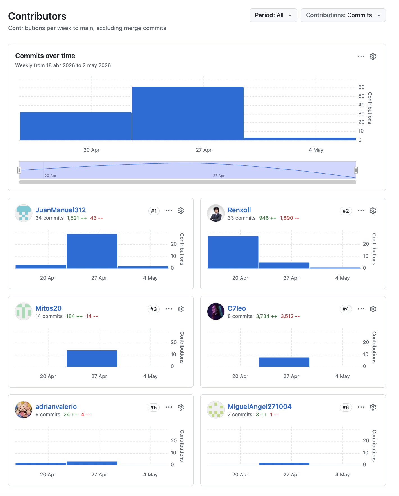
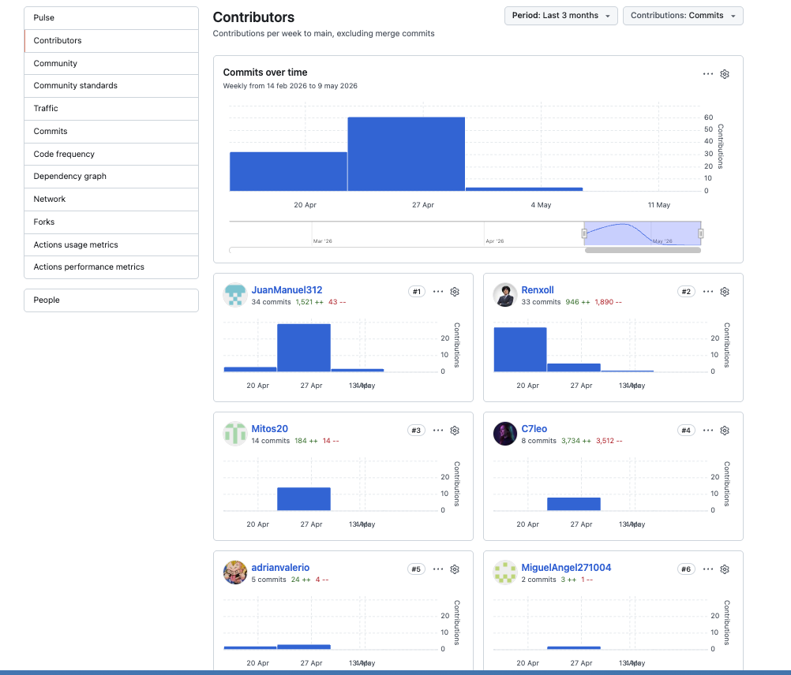
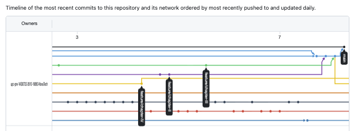
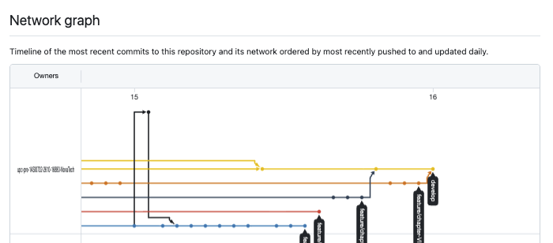

# Universidad Peruana de Ciencias Aplicadas

**Facultad de Ingeniería**

**Carrera de Ingeniería de Software**

**Periodo:** 202610

**NRC:** 18880

**Nombre del profesor:** Julio Manuel Noriega Melendez

### "Informe de Trabajo Final"

**Nombre del Startup:** NovaPeru Tech

**Nombre del Producto:** Veyra

**Integrantes:**

| Código     | Apellidos y Nombres             |
|------------|---------------------------------|
| u202312399 | Llerena Delgado Renzo Miguel    |
| u202214130 | Rentería Palacios Yasser        |
| u202214572 | Espinoza Vivas Camilla Leonor   |
| u20221a371 | Santos Torres Juan Manuel       |
| u202212897 | Román López Miguel Ángel Junior |
| u202210334 | Valerio Garcia Adrian Emanuel   |
|            |                                 | 
### Abril, 2026

---

## Registro de Versiones del Informe

| Versión | Fecha      | Autor                         | Descripción                                                                                                                                                                                                                                                                                                                                                                                                                                                                                                                                                |
| ------- | ---------- | ----------------------------- | ---------------------------------------------------------------------------------------------------------------------------------------------------------------------------------------------------------------------------------------------------------------------------------------------------------------------------------------------------------------------------------------------------------------------------------------------------------------------------------------------------------------------------------------------------------- |
| TB1     | 01/05/2026 | Todos los miembros del equipo | Desarrollo inicial del informe del proyecto Veyra. Se elaboraron los Capítulos 1, 2, 3, 4 y 5, incluyendo introducción del proyecto, análisis del problema, entrevistas y Needfinding, definición de épicas e historias de usuario, Product Backlog, diseño UX/UI, arquitectura de software, Landing Page y organización general de la propuesta tecnológica. Además, se realizaron revisiones colaborativas de redacción, coherencia y estructura del documento.                                                                                          |
| TP1     | 15/05/2026 | Todos los miembros del equipo | Actualización técnica y funcional del proyecto. Se incorporaron actividades relacionadas con pruebas unitarias, pruebas de integración, pruebas de sistema y escenarios BDD. Asimismo, se implementaron procesos de Continuous Integration (CI) y Continuous Delivery/Deployment (CD), incluyendo automatización de compilaciones, validaciones y despliegues. Finalmente, se realizaron correcciones generales del informe, mejoras de redacción, validación de diagramas, revisión de arquitectura y actualización de evidencias y commits del proyecto. |

---

## Project Report Collaboration Insights

**Link de los repositorios de la organización**: https://github.com/upc-pre-1ASI0732-2610-16880-NovaTech

**Link del repositorio-Informe**: https://github.com/upc-pre-1ASI0732-2610-16880-NovaTech/Veyra-Document-Report

**Reporte de colaboración de la entrega del TB1**:

Durante la primera fase de elaboración del informe, el equipo Veyra centró sus esfuerzos en la construcción de los fundamentos conceptuales, de investigación y diseño inicial del proyecto. Cada integrante asumió un rol activo en la redacción, modelado y documentación de secciones clave del reporte, asegurando una coherencia entre la teoría, la metodología y la propuesta tecnológica.

Finalmente, estos gráficos representan la cantidad de commits realizados por cada miembro del equipo en el repositorio del proyecto. Cada barra representa a un miembro del equipo y la altura de la barra indica el número total de commits realizados por esa persona.

**Reporte de colaboración de la entrega del TP1**:

Durante la segunda fase de desarrollo del proyecto, el equipo Veyra enfocó sus esfuerzos en la implementación técnica, validación y aseguramiento de calidad del sistema. Cada integrante participó activamente en actividades relacionadas con pruebas de software, integración continua, despliegue automatizado y verificación funcional de la aplicación, contribuyendo al fortalecimiento de la arquitectura y estabilidad de la plataforma.

Asimismo, se desarrollaron pruebas unitarias, pruebas de integración, pruebas de sistema y escenarios BDD para validar el correcto funcionamiento de los distintos componentes del sistema. De igual manera, se implementaron procesos de Continuous Integration (CI) y Continuous Delivery/Deployment (CD), permitiendo automatizar compilaciones, validaciones y despliegues del proyecto.

Finalmente, estos gráficos representan la cantidad de commits realizados por cada miembro del equipo en el repositorio del proyecto. Cada barra representa a un miembro del equipo y la altura de la barra indica el número total de commits realizados por esa persona.

**Ramificación del proyecto usando GitFlow:**

Este gráfico ofrece una visualización de las veces que se ha clonado nuestro repositorio, junto con las fechas correspondientes a cada evento. También muestran datos sobre el número de visitas que ha recibido el repositorio de nuestro equipo a lo largo del tiempo.

**TB1**

**TP1**

---

## Tabla de contenido

---
## ABET – EAC - Student Outcome 4

El curso contribuye al cumplimiento del Student Outcome ABET:
**ABET - EAC - Student Outcome 4**

**Criterio:**  La capacidad de reconocer responsabilidades éticas y
profesionales en situaciones de ingeniería y hacer juicios informados, que deben
considerar el impacto de las soluciones de ingeniería en contextos globales, económicos,
ambientales y sociales.

En el siguiente cuadro se describe las acciones realizadas y enunciados de conclusiones por parte del grupo, que permiten sustentar el haber alcanzado el logro del ABET - EAC - Student Outcome 3.

| Criterio específico                                                                                                                                          | Acciones realizadas                                                                                                                                                                                                                                                                                                                                                                                                                                                                                                                                                                                                                                                                                                                                                                                                                                                                                                                                                                                                                                                                                                                                                                                                                                                                                                                                                                                                                                                                                                                                                                                                                                                                                                                                                                                                                                                                                                                                                                                                                                                                                                                                                                                                                                                                                                                                                                                                                                                                                                                                                                                                                                                                                                                                                                                                                                                                                                                                                                                                                                                                                                                                                                                                                                                                                                                                                                                                                            | Conclusiones                                                                                                                                                                                                                                                                                                                                                                                                                                                                                                                                                                                                                                                                                                                                                                                                                                                                                                                                                                                                                                                                                                                                                                                                                                                                                                                                                                                                                                                                                                                                                                                                                                                                                                                                                                                                                                                                                                                                                                                                                                                                                                                                                                                                                                                                                                                                                                                                                                                                                                                   |
| ------------------------------------------------------------------------------------------------------------------------------------------------------------ | ---------------------------------------------------------------------------------------------------------------------------------------------------------------------------------------------------------------------------------------------------------------------------------------------------------------------------------------------------------------------------------------------------------------------------------------------------------------------------------------------------------------------------------------------------------------------------------------------------------------------------------------------------------------------------------------------------------------------------------------------------------------------------------------------------------------------------------------------------------------------------------------------------------------------------------------------------------------------------------------------------------------------------------------------------------------------------------------------------------------------------------------------------------------------------------------------------------------------------------------------------------------------------------------------------------------------------------------------------------------------------------------------------------------------------------------------------------------------------------------------------------------------------------------------------------------------------------------------------------------------------------------------------------------------------------------------------------------------------------------------------------------------------------------------------------------------------------------------------------------------------------------------------------------------------------------------------------------------------------------------------------------------------------------------------------------------------------------------------------------------------------------------------------------------------------------------------------------------------------------------------------------------------------------------------------------------------------------------------------------------------------------------------------------------------------------------------------------------------------------------------------------------------------------------------------------------------------------------------------------------------------------------------------------------------------------------------------------------------------------------------------------------------------------------------------------------------------------------------------------------------------------------------------------------------------------------------------------------------------------------------------------------------------------------------------------------------------------------------------------------------------------------------------------------------------------------------------------------------------------------------------------------------------------------------------------------------------------------------------------------------------------------------------------------------------------------- | ------------------------------------------------------------------------------------------------------------------------------------------------------------------------------------------------------------------------------------------------------------------------------------------------------------------------------------------------------------------------------------------------------------------------------------------------------------------------------------------------------------------------------------------------------------------------------------------------------------------------------------------------------------------------------------------------------------------------------------------------------------------------------------------------------------------------------------------------------------------------------------------------------------------------------------------------------------------------------------------------------------------------------------------------------------------------------------------------------------------------------------------------------------------------------------------------------------------------------------------------------------------------------------------------------------------------------------------------------------------------------------------------------------------------------------------------------------------------------------------------------------------------------------------------------------------------------------------------------------------------------------------------------------------------------------------------------------------------------------------------------------------------------------------------------------------------------------------------------------------------------------------------------------------------------------------------------------------------------------------------------------------------------------------------------------------------------------------------------------------------------------------------------------------------------------------------------------------------------------------------------------------------------------------------------------------------------------------------------------------------------------------------------------------------------------------------------------------------------------------------------------------------------ |
| 4.c.1 Reconoce responsabilidad ética y profesional en situaciones de ingeniería de software                                                                  | Camilla Espinoza   **AV1**   Aporté activamente en el desarrollo de los capítulos 1 y 2, contribuyendo con la organización del contenido, la redacción de secciones asignadas y el cumplimiento responsable de las tareas del equipo. Asimismo, apoyé en la elaboración de entrevistas del segmento 1, manteniendo una participación constante y comprometida con los objetivos del proyecto.   **TB1**   Implementé y documenté la configuración de Continuous Integration (CI), incluyendo herramientas y prácticas para automatizar procesos de compilación y validación del proyecto. Además, participé en la ejecución automática de pruebas y verificación de estabilidad del sistema antes de integrar cambios al repositorio principal.   **AV2**  Apoyé en la elaboración y organización de la presentación del proyecto, estructurando el contenido de las diapositivas de acuerdo con los capítulos desarrollados. Además, contribuí en la redacción, diseño visual y orden de la información para que la exposición sea clara, coherente y alineada con los objetivos del trabajo.  **TB2**  Realicé la auditoría funcional de la aplicación desarrollada por otro equipo, ejecutando los casos de prueba asignados de manera objetiva, registrando evidencias y documentando los resultados en el informe de auditoría. Asimismo, participé en la elaboración de la presentación final del proyecto, organizando y sintetizando los principales hallazgos para comunicar los resultados de forma clara, precisa y profesional.   Yasser Rentería   **TB1**   Aporté activamente en el trabajo en equipo durante el desarrollo de los capítulos 2 y 5, contribuyendo en la organización, elaboración de entrevistas y entrega de Needfinding con la debida responsabilidad de las tareas.   **TP1**   Realicé pruebas de sistema verificando el funcionamiento integral de la aplicación, evaluando la navegación, estabilidad y respuesta de las funcionalidades principales en distintos escenarios de uso.   **TB2**   Contribuí en el desarrollo de capítulo 6, capítulo 8, las entrevistas de validación de los diferentes segmentos objetivos y las evidencias de nuestras aplicaciones deslegadas y API.   Adrian Valerio   **TB1**   Contribuí en el desarrollo del Capítulo 3 y en la realización de entrevistas, cumpliendo responsablemente con las tareas asignadas y manteniendo una participación constante dentro del equipo.   **TP1**   Implementé pruebas de integración para validar la correcta interacción entre módulos, backend y base de datos, asegurando la consistencia de los flujos principales del sistema.   **TB2**   Participé en la realización de entrevistas de validación dirigidas a los diferentes segmentos objetivo del proyecto. Durante estas entrevistas, presenté las funcionalidades principales de la plataforma Veyra, recopilé las opiniones de los participantes e identifiqué observaciones y oportunidades de mejora para la aplicación. Asimismo, apoyé en la documentación de las evidencias y resultados obtenidos para el desarrollo de los capítulos 6 y 8 del informe final.   Renzo Llerena   **TB1**   Participé activamente en el desarrollo de los capítulos 1, 2 y 5. Asimismo, colaboré en la realización de las entrevistas para el segmento objetivo 2 y fui responsable de llevar a cabo el despliegue de los componentes de la plataforma Veyra.   **TP1**   Implementé pruebas unitarias para las funciones principales del sistema, validando métodos críticos, lógica de negocio y distintos escenarios de ejecución para garantizar el correcto funcionamiento del backend.   **TB2**   Coordiné el cierre y consolidación del informe final del proyecto, revisando la totalidad del Capítulo VIII para asegurar su coherencia con los capítulos previos.   Juan Manuel Santos Torres   **TB1**   Realicé el trabajo, diseño y construcción del Capítulo 3. Fui quien diseñó y construyó en su totalidad las épicas, historias de usuario e historias técnicas, garantizando su coherencia con el backend, frontend y landing page. Además, me encargué de forma íntegra de la creación y reorganización del Product Backlog.   **TP1**   Desarrollé escenarios de Behavior-Driven Development (BDD) para describir el comportamiento esperado de las funcionalidades principales del sistema, definiendo criterios de aceptación alineados con las necesidades del usuario.   **TB2**   **Lideré la validación de calidad del software estructurando las evidencias de las Testing Suites (Unitarias, de Integración y BDD). Además, asumí la responsabilidad profesional de evaluar la interfaz mediante heurísticas de usabilidad y ejecuté de forma integral las auditorías de experiencia de usuario (UX), documentando tanto la auditoría realizada al equipo asignado como la planificación de modificaciones para subsanar los hallazgos que recibimos.**   Miguel Ángel Junior Román López   **TB1**   Aporté activamente en el desarrollo de todo el capítulo 4, contribuyendo con la organización del contenido, la redacción de secciones asignadas y el cumplimiento responsable de las tareas del equipo, manteniendo una participación constante y comprometida con los objetivos del proyecto.   **TP1**   Implementé procesos de Continuous Delivery / Continuous Deployment (CD) para automatizar el despliegue y publicación de nuevas versiones del sistema en entornos de prueba y producción.   **TB2**   **Asumí la responsabilidad ética y profesional de estructurar, ejecutar y documentar las Auditorías de Experiencia de Usuario (UX), abarcando tanto la auditoría realizada a otros equipos como la auditoría recibida, incluyendo el resumen de modificaciones para subsanar los hallazgos. Además, garanticé la correcta documentación del proceso de Continuous Integration, detallando de forma transparente las herramientas, prácticas y componentes del pipeline (Build & Test Suite). ** | Camilla Espinoza   **AV1**   La participación en el desarrollo de capítulos y entrevistas fortaleció mi compromiso profesional y responsabilidad dentro del trabajo colaborativo del proyecto.   **TB1**   La configuración de procesos de integración continua permitió fortalecer el trabajo colaborativo y asegurar prácticas responsables de validación automática dentro del proyecto.   **AV2**   Participé en la elaboración y organización de la presentación del proyecto, analizando y sintetizando los resultados obtenidos para comunicar de forma clara el impacto de la solución propuesta en la optimización de procesos, la gestión de la información y la experiencia de los usuarios.  **TB2**   Realicé la auditoría funcional de la aplicación desarrollada por otro equipo, evaluando los hallazgos obtenidos y formulando recomendaciones sustentadas para mejorar la calidad, seguridad y usabilidad del software. Asimismo, contribuí en la elaboración de la presentación final, comunicando el impacto de estas mejoras en la eficiencia operativa, la confiabilidad del sistema y la satisfacción de los usuarios.   Yasser Rentería   **TB1**   El trabajo realizado en equipo permitió reforzar la responsabilidad y organización necesarias para cumplir adecuadamente con los objetivos del proyecto.   **TP1**   La ejecución de pruebas de sistema permitió reforzar el compromiso profesional con la calidad y estabilidad integral de la aplicación antes de su entrega final.   **TB2**   El desarrollo de las evidencias pudo hacer que identifiquemos muchas de las correciones y bug arreglados en las diferentes aplicaciones   Adrian Valerio   **TB1**   La participación en el desarrollo del capítulo y entrevistas fortaleció mi sentido de responsabilidad profesional y compromiso ético dentro del equipo de trabajo.   **TP1**   La participación en las pruebas de integración fortaleció mi responsabilidad profesional al garantizar la correcta comunicación entre componentes críticos del sistema.   **TB2**   Analicé los resultados obtenidos en las entrevistas de validación realizadas a los diferentes segmentos objetivo, identificando cómo la plataforma Veyra podría influir en la gestión de las casas de reposo y en la comunicación con los familiares de los residentes. A partir de las opiniones recopiladas, evalué el impacto social, operativo y económico de las funcionalidades propuestas, contribuyendo a priorizar mejoras que respondieran a las necesidades reales de los usuarios.   Renzo Llerena   **TB1**   La participación en entrevistas, capítulos y despliegue de la plataforma permitió fortalecer el compromiso con el trabajo responsable y la correcta ejecución de actividades técnicas del proyecto.   **TP1**   La implementación de pruebas unitarias permitió asegurar la calidad y confiabilidad de las funciones principales del sistema, fortaleciendo el compromiso ético con el desarrollo de software seguro y mantenible.   **TB2**   Coordinar el cierre del informe reforzó mi responsabilidad profesional de asegurar que la documentación final reflejara con honestidad el estado real de lo implementado.   Juan Manuel Santos Torres   **TB1**   El diseño de épicas, historias de usuario y backlog permitió fortalecer la organización y responsabilidad profesional en la planificación y desarrollo del proyecto.   **TP1**   El desarrollo de escenarios BDD permitió garantizar que las funcionalidades implementadas respondieran adecuadamente a los requerimientos y necesidades de los usuarios.   **TB2**   **La documentación rigurosa de las pruebas y auditorías de usabilidad reforzó mi ética profesional, demostrándome que la responsabilidad de un ingeniero de software no termina en la escritura del código, sino en garantizar de manera transparente que el producto final sea estable, seguro y cumpla con los más altos estándares de calidad antes de llegar al usuario final.**   Miguel Ángel Junior Román López   **TB1**   La participación en el desarrollo del capítulo 4 fortaleció el compromiso con la calidad del contenido, diseño y cumplimiento de los objetivos del equipo.   **TP1**   La automatización de despliegues y entregas continuas fortaleció las buenas prácticas de desarrollo responsable y mejoró la eficiencia del proceso de publicación del sistema.   **TB2**   **Documentar las auditorías UX y los procesos de integración continua reforzó mi compromiso ético con la calidad del producto. Comprendí que la responsabilidad profesional de un ingeniero abarca tanto asegurar una experiencia de usuario fluida y libre de fricciones como mantener una infraestructura de despliegue estable y automatizada. ** |
| 4.c.2 Emite juicios informados considerando el impacto de las soluciones de ingeniería de software en contextos globales, económicos, ambientales y sociales | Camilla Espinoza   **AV1**   Participé en el análisis y mejora del Capítulo 3, especialmente en la revisión de épicas, historias de usuario e historias técnicas, verificando su coherencia con el backend, frontend y landing page. Además, apoyé en la reorganización del Product Backlog y en la elaboración de la presentación PPT del proyecto.   **TB1**   Evalué el impacto técnico y operativo de automatizar procesos de compilación y pruebas mediante CI, permitiendo reducir errores humanos, optimizar tiempos de desarrollo y mejorar la estabilidad del software entregado a los usuarios.   **AV2**  Apoyé en la organización del contenido del proyecto y de la presentación, procurando que la información se mostrara de forma clara, coherente y ordenada. Además, contribuí a estructurar las ideas considerando el impacto de la solución en los usuarios, el contexto social y la utilidad del sistema para mejorar la gestión en casas de reposo.  **TB2**  Durante la auditoría del sistema de otro equipo, evalué objetivamente los hallazgos y emití conclusiones sustentadas sobre el impacto de las mejoras propuestas en la calidad, confiabilidad y usabilidad del software. Asimismo, contribuí a la presentación final, comunicando cómo las recomendaciones de la auditoría pueden optimizar los procesos de la organización, reducir riesgos operativos y mejorar la experiencia de los usuarios.   Yasser Rentería   **TB1**   Apoyé en la generación de valor para la solución, el alto impacto del proyecto y la organización de las ideas para futuros procesos.   **TP1**   Analicé el comportamiento integral del sistema mediante pruebas funcionales completas, identificando posibles riesgos que podrían afectar la experiencia y confiabilidad para los usuarios finales.   **TB2**   Contribuí en el desarrollo de capítulo 6, capítulo 8, las entrevistas de validación de los diferentes segmentos objetivos y las evidencias de nuestras aplicaciones deslegadas y API.   Adrian Valerio   **TB1**   Participé en el desarrollo del Capítulo 3 y análisis de entrevistas, identificando necesidades reales de los usuarios y considerando su impacto en la solución propuesta.   **TP1**   Realicé pruebas de integración considerando el impacto de posibles fallos de comunicación entre componentes, asegurando la continuidad y estabilidad de los servicios del sistema.   **TB2**   Implemente el desarrollo de capítulo 6, capítulo 8, las entrevistas de validación de los diferentes segmentos objetivos y las evidencias de nuestras aplicaciones deslegadas y API.  Renzo Llerena   **TB1**   Participé activamente en el desarrollo de los capítulos 1, 2 y 5. Asimismo, colaboré en la realización de las entrevistas para el segmento objetivo 2 y fui responsable de llevar a cabo el despliegue de los componentes de la plataforma Veyra.   **TP1**   Implementé pruebas unitarias orientadas a prevenir errores en funcionalidades críticas, reduciendo riesgos operativos y mejorando la confiabilidad del sistema para los usuarios y el equipo de desarrollo.   **TB2**   Redacté la Matriz de Evaluación Ética y de Impacto, sintetizando los juicios informados del equipo sobre las consecuencias éticas, sociales, económicas, ambientales y globales de las decisiones de ingeniería tomadas durante el proyecto.   Juan Manuel Santos Torres   **TB1**   Realicé el trabajo, diseño y construcción del Capítulo 3. Fui quien diseñó y construyó en su totalidad las épicas, historias de usuario e historias técnicas, garantizando su coherencia con el backend, frontend y landing page. Además, me encargué de forma íntegra de la creación y reorganización del Product Backlog.   **TP1**   Elaboré escenarios BDD alineados con las necesidades de los usuarios y criterios funcionales del sistema, permitiendo validar que las soluciones desarrolladas respondan correctamente al comportamiento esperado.   **TB2**   **Analicé el impacto directo de nuestra plataforma evaluando el cumplimiento de las heurísticas de usabilidad y gestionando el cruce de auditorías de UX. Esto me permitió emitir juicios críticos para priorizar las modificaciones necesarias en el sistema, enfocándome en cómo los errores de interacción o diseño afectan la experiencia real de los usuarios en su entorno de trabajo.**   Miguel Ángel Junior Román López   **TB1**   Participé en el análisis y mejora del Capítulo 4, especialmente en la Landing Page UI Design, Web Applications UX/UI Design, Web Applications Prototyping, Domain-Driven Software Architecture. Además, apoyé en la elaboración de la presentación PPT del proyecto y revisión general de todo el reporte y landing page.   **TP1**   Implementé procesos automatizados de despliegue continuo para mejorar la rapidez y confiabilidad en la publicación de nuevas versiones del sistema, reduciendo tiempos de inactividad y errores manuales.   **TB2**   **Analicé los resultados de las auditorías de UX cruzadas para emitir juicios críticos sobre cómo los fallos de interfaz afectan la productividad y adopción por parte de los usuarios, formulando un plan de modificaciones estratégicas. Asimismo, evalué el impacto técnico y económico de mantener pipelines eficientes de Continuous Integration (Build & Test Suites) para minimizar riesgos y costos operativos por fallos en producción. ** | Camilla Espinoza   **AV1**   El análisis de historias de usuario y backlog permitió comprender mejor el impacto de las decisiones de software en la organización y experiencia del usuario.   **TB1**   La implementación de integración continua permitió reducir riesgos técnicos y optimizar los procesos de desarrollo, generando una solución más confiable para los usuarios.   **AV2**   La elaboración de la presentación permitió analizar y comunicar los resultados del proyecto, identificando el impacto de la solución en la mejora de los procesos, la organización de la información y la experiencia de los usuarios, sustentando las conclusiones con los resultados obtenidos.  **TB2**   La auditoría realizada permitió emitir juicios fundamentados sobre la calidad del software a partir de la evidencia recopilada. Las recomendaciones propuestas contribuyen a mejorar la usabilidad, confiabilidad y eficiencia del sistema, generando un impacto positivo tanto para la organización como para sus usuarios.   Yasser Rentería   **TB1**   La participación en la generación de valor del proyecto permitió reconocer la importancia del impacto social y funcional de la solución propuesta.   **TP1**   Las pruebas de sistema ayudaron a identificar riesgos funcionales y mejorar la estabilidad general del sistema, favoreciendo una experiencia más segura para los usuarios finales.   **TB2**   El desarrollo de las evidencias pudo hacer que identifiquemos muchas de las correciones y bug arreglados en las diferentes aplicaciones    Adrian Valerio   **TB1**   El análisis de entrevistas permitió comprender mejor las necesidades reales de los usuarios y el impacto de las soluciones desarrolladas en su entorno.   **TP1**   El desarrollo de pruebas de integración permitió comprender la importancia de mantener una comunicación estable entre componentes para garantizar una experiencia confiable para los usuarios.   **TB2**   **[Placeholder – Adrian Valerio: completar conclusión/reflexión sobre el cierre del proyecto]**   Renzo Llerena   **TB1**   La participación en entrevistas y despliegue de la plataforma permitió comprender el impacto operativo y funcional que tiene el software en los usuarios y en la continuidad del servicio.   **TP1**   Las pruebas unitarias permitieron identificar tempranamente posibles errores críticos, contribuyendo a una solución más estable y sostenible para el proyecto.   **TB2**   Elaborar la Matriz Ética me permitió reconocer que el impacto de una solución de software debe evaluarse de forma explícita y documentada, y no darse por sentado como consecuencia automática de un buen diseño técnico.   Juan Manuel Santos Torres   **TB1**   La organización de épicas e historias de usuario permitió analizar de manera más precisa las necesidades del proyecto y su impacto en el desarrollo de la solución.   **TP1**   La aplicación de escenarios BDD permitió validar funcionalidades centradas en las necesidades reales de los usuarios y asegurar una mejor calidad funcional del sistema.   **TB2**   **El proceso de evaluación heurística y auditoría cruzada me enseñó a valorar el impacto social y económico del software. Comprendí que resolver problemas de experiencia de usuario e implementar flujos de validación accesibles es fundamental, ya que una interfaz intuitiva y libre de errores define si una herramienta tecnológica realmente facilita la vida de las personas o se convierte en un obstáculo operativo.**   Miguel Ángel Junior Román López   **TB1**   La participación en el diseño UI/UX y arquitectura permitió comprender cómo las decisiones tecnológicas impactan en la experiencia y accesibilidad para los usuarios.   **TP1**   La automatización de despliegues permitió optimizar la entrega de nuevas versiones del sistema y mejorar la continuidad operativa del proyecto.   **TB2**   **La gestión de las auditorías UX y de la integración continua me permitió comprender que las decisiones de ingeniería tienen un impacto directo en la sostenibilidad del proyecto. Entendí que resolver problemas de usabilidad evita la pérdida de tiempo para los usuarios, mientras que una integración continua bien configurada optimiza el uso de recursos tecnológicos, asegurando la escalabilidad a largo plazo. ** |
