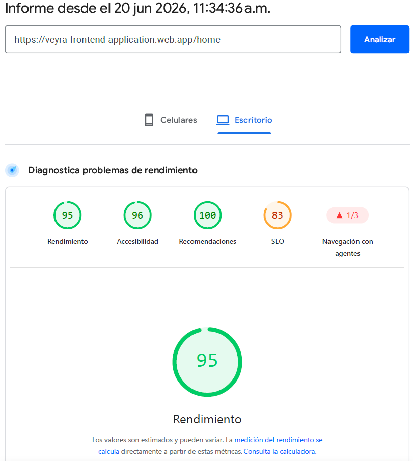
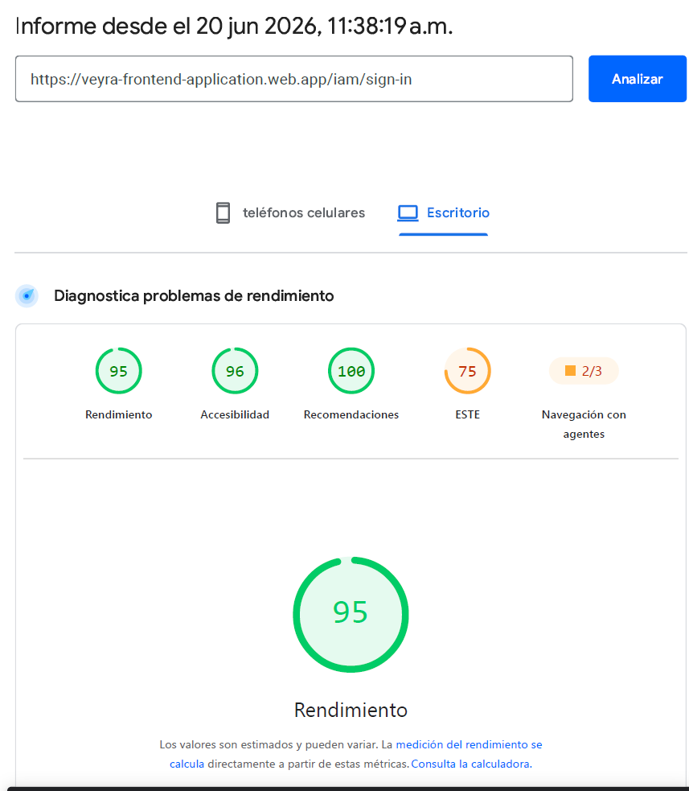

## Capitulo VIII: Desarrollo Guiado por Experimentos
### 8.1. Planeacion del Experimento
#### 8.1.1. Resumen As-Is
La plataforma Veyra actualmente ofrece funcionalidades centrales para la gestion de casas de reposo, residentes, medicamentos, seguimiento de salud y comunicacion con familiares. La solucion ya cubre el core operacional del negocio, pero todavia presenta oportunidades claras de aprendizaje sobre la experiencia real de los usuarios y el valor percibido de ciertas mejoras.

Desde la perspectiva del negocio, el sistema permite registrar instituciones, administrar residentes, controlar inventario de medicamentos y almacenar metricas de salud. Sin embargo, no todas las funcionalidades han sido evaluadas aun con suficiente evidencia de uso para confirmar si realmente resuelven los puntos mas criticos del flujo diario del personal, administradores y familiares.

Problemas identificados:

- Visibilidad limitada sobre la informacion mas usada por cada perfil de usuario.
- Posible friccion en tareas repetitivas como busqueda de residentes, registro de medicacion y seguimiento clinico.
- Falta de evidencia suficiente sobre la utilidad real de algunos elementos de interfaz y paneles de informacion.
- Necesidad de validar si ciertas mejoras aumentan la eficiencia del trabajo del personal y la confianza de los familiares.

Objetivos de mejora:

- Reducir el tiempo necesario para completar tareas frecuentes en el sistema.
- Mejorar la claridad de los flujos mas usados por administradores y personal asistencial.
- Validar si una mejor organizacion de la informacion incrementa la adopcion de la plataforma.
- Confirmar que las mejoras propuestas aportan valor medible al negocio y a la experiencia del usuario.

#### 8.1.2. Materia Prima: Suposiciones, Vacios de Conocimiento, Ideas, Afirmaciones
Suposiciones:

- Se asume que el personal de las casas de reposo necesita acceso mas rapido a informacion critica de residentes y medicamentos.
- Se asume que los familiares valoran notificaciones claras y actualizaciones frecuentes sobre el estado de sus seres queridos.
- Se asume que una interfaz mas ordenada y con jerarquia visual mas fuerte reduce errores operativos.
- Se asume que la centralizacion de metricas de salud mejora la toma de decisiones del personal asistencial.
- Se asume que una mejor navegacion dentro del sistema puede reducir la curva de aprendizaje de nuevos usuarios.

Vacios de conocimiento:

- No se conoce con exactitud que seccion de la plataforma consume mas tiempo durante el uso diario.
- Falta evidencia sobre que informacion consideran mas prioritaria los administradores frente al personal de cuidado.
- No esta claro si los familiares consultan con frecuencia el portal o si necesitan mas recordatorios y resuemenes.
- No se dispone aun de mediciones comparativas sobre tiempos de tarea antes y despues de una mejora de interfaz.
- Falta validar que elementos de la interfaz generan mas confianza y cuales generan confusion.

Ideas:

- Priorizar un dashboard con accesos rapidos a residentes, medicamentos y alertas de salud.
- Reorganizar la informacion critica para que los flujos frecuentes requieran menos clics.
- Implementar resuenos visuales mas claros para el estado de cada residente.
- Mejorar las notificaciones para familiares con mensajes mas utiles y faciles de entender.
- Aplicar ajustes de usabilidad para reducir errores y acelerar tareas repetitivas.

Afirmaciones:

- Un dashboard mejor estructurado puede reducir el tiempo de acceso a datos criticos.
- Mostrar resuenos de salud de forma mas visible puede mejorar la reaccion ante incidentes.
- Una navegacion mas simple puede aumentar la satisfaccion del personal que usa la plataforma a diario.
- Un sistema de notificaciones mas claro puede fortalecer la confianza de los familiares.
- Una mejor jerarquia visual puede disminuir errores durante registros operativos.

#### 8.1.3. Preguntas Listas para Experimentar

| Pregunta | Confianza | Riesgo | Impacto | Interes | Puntaje total |
|---|---:|---:|---:|---:|---:|
| Un dashboard mas visible reducira el tiempo necesario para acceder a informacion de residentes y salud? | 8 | 2 | 9 | 8 | 27 |
| Un flujo de navegacion mas simple mejorara la finalizacion de tareas para el personal? | 7 | 3 | 8 | 7 | 25 |
| Resumenes de salud mas claros mejoraran la toma de decisiones durante las rutinas diarias de cuidado? | 8 | 2 | 9 | 7 | 26 |
| Notificaciones para familiares mejoradas aumentaran la confianza y el uso del portal? | 7 | 3 | 8 | 8 | 26 |
| Una mejor jerarquia de informacion reducira errores operativos al registrar medicamentos y datos de salud? | 8 | 3 | 9 | 7 | 27 |

#### 8.1.4. Backlog de Preguntas

| Prioridad | Pregunta |
|---:|---|
| 1 | Un dashboard mas visible reducira el tiempo necesario para acceder a informacion de residentes y salud? |
| 1 | Una mejor jerarquia de informacion reducira errores operativos al registrar medicamentos y datos de salud? |
| 2 | Resumenes de salud mas claros mejoraran la toma de decisiones durante las rutinas diarias de cuidado? |
| 3 | Un flujo de navegacion mas simple mejorara la finalizacion de tareas para el personal? |
| 3 | Notificaciones para familiares mejoradas aumentaran la confianza y el uso del portal? |

#### 8.1.5. Tarjetas de Experimento

| Pregunta | Por que | Que | Hipotesis |
|---|---|---|---|
| Un dashboard mas visible reducira el tiempo necesario para acceder a informacion de residentes y salud? | Porque el personal necesita acceso rapido a datos criticos durante las rutinas diarias, y una jerarquia visual mas fuerte puede reducir el tiempo de busqueda. | Redisenar el dashboard principal para resaltar residentes, medicamentos, alertas y metricas recientes de salud como los primeros elementos visibles. | Se espera que el tiempo de acceso a tareas disminuya al menos 20 por ciento y que los usuarios reporten mayor claridad en el flujo principal. |
| Un flujo de navegacion mas simple mejorara la finalizacion de tareas para el personal? | Porque tareas repetitivas como la busqueda de residentes y el registro de medicamentos deben requerir la menor cantidad posible de pasos. | Simplificar la estructura de navegacion y reducir pantallas intermedias innecesarias para las acciones mas frecuentes. | Se espera que disminuya el numero promedio de clics por tarea y que aumente la tasa de finalizacion de los flujos frecuentes. |
| Resumenes de salud mas claros mejoraran la toma de decisiones durante las rutinas diarias de cuidado? | Porque las decisiones medicas y asistenciales dependen de una interpretacion rapida del estado relevante del residente. | Crear vistas de resumen del residente mas faciles de leer, con metricas destacadas, eventos recientes e indicadores de alerta. | Se espera que los usuarios identifiquen condiciones criticas mas rapido y tomen decisiones de rutina con mayor confianza. |
| Notificaciones para familiares mejoradas aumentaran la confianza y el uso del portal? | Porque las familias necesitan actualizaciones concisas y utiles para sentirse informadas e involucradas en el proceso de cuidado. | Redisenar los mensajes de notificacion para incluir contexto, estado y proximos pasos mas claros para los usuarios familiares. | Se espera que aumenten las aperturas de notificaciones y la interaccion con el portal despues de mejorar la claridad de los mensajes. |
| Una mejor jerarquia de informacion reducira errores operativos al registrar medicamentos y datos de salud? | Porque los diseños poco claros pueden llevar a registros incorrectos en tareas operativas de alta frecuencia. | Reorganizar formularios y pantallas para que los campos mas importantes aparezcan primero y las acciones criticas queden visualmente resaltadas. | Se espera que disminuyan los errores de entrada y las correcciones durante el registro de medicamentos y salud. |

### 8.2. Diseno del Experimento
#### 8.2.1. Hipotesis
La fase de experimentacion de Veyra fue disenada para validar si las mejoras propuestas realmente resuelven los problemas de usabilidad y operacion detectados durante la planeacion.

Las hipotesis principales son:

- Un dashboard mas claro reducira el tiempo necesario para acceder a informacion de residentes, medicamentos y salud.
- Un flujo de navegacion simplificado mejorara la finalizacion de tareas por parte del personal.
- Resumenes de salud mas claros mejoraran la toma de decisiones durante las rutinas diarias de cuidado.
- Notificaciones para familiares mejoradas aumentaran la confianza y el uso del portal.
- Una mejor jerarquia de informacion reducira errores operativos durante el registro de datos.

Estas hipotesis se seleccionaron porque estan directamente relacionadas con el valor central de la plataforma y pueden medirse mediante comportamiento observable de los usuarios y analitica del producto.

#### 8.2.2. Metricas de Negocio del Dominio
Las metricas de negocio de Veyra se definieron en torno a los resultados mas importantes de la plataforma de gestion de cuidados. El objetivo no es solo aumentar el uso, sino tambien mejorar la eficiencia operativa, la calidad de la informacion y la confianza de los usuarios.

| Metricas | Descripcion | Por que importa |
|---|---|---|
| Tiempo de finalizacion de tarea | Tiempo requerido para terminar acciones comunes como buscar, registrar o revisar | Mide la eficiencia en la operacion diaria |
| Tasa de error en formularios | Numero de envios incorrectos o incompletos | Indica la calidad de la interfaz y la validacion |
| Tasa de acceso a datos del residente | Frecuencia de acceso a perfiles y resumenes de residentes | Muestra si los datos criticos son faciles de encontrar |
| Tasa de exito en registros de medicamentos | Porcentaje de registros completados sin correccion | Refleja confiabilidad en un flujo critico |
| Interaccion en el portal familiar | Frecuencia de visitas e interaccion con notificaciones | Mide el valor percibido por los usuarios familiares |
| Visibilidad de alertas de salud | Rapidez con la que el personal nota informacion relevante de salud | Importante para decisiones de cuidado oportunas |

Estas metricas conectan la experiencia del producto con el valor de negocio porque Veyra se usa en un contexto donde la rapidez, la exactitud y la confianza son esenciales.

#### 8.2.3. Medidas
Para validar las hipotesis, Veyra usa una combinacion de medidas de comportamiento, rendimiento y percepcion. Esto permite observar no solo lo que hacen los usuarios, sino tambien como perciben la experiencia.

| Medida | Tipo | Como se captura |
|---|---|---|
| Tiempo en tarea | Cuantitativa | Tiempo entre abrir una pantalla y terminar la accion esperada |
| Numero de clics | Cuantitativa | Cantidad de interacciones necesarias para completar un flujo |
| Numero de errores en formularios | Cuantitativa | Cantidad de validaciones generadas por el usuario |
| Tasa de finalizacion | Cuantitativa | Porcentaje de tareas completadas con exito |
| Interaccion con notificaciones | Cuantitativa | Tasa de apertura o interaccion con alertas |
| Retroalimentacion de satisfaccion | Cualitativa | Comentarios del usuario despues de realizar la tarea |
| Claridad percibida | Cualitativa | Opinion del usuario sobre el orden visual y la jerarquia de informacion |

Las medidas elegidas se mantuvieron simples y practicas para poder compararlas antes y despues de los cambios propuestos.

#### 8.2.4. Condiciones
Las condiciones de experimentacion definen cuando y como debe evaluarse cada mejora para que los resultados puedan interpretarse con confianza.

| Condicion | Descripcion |
|---|---|
| Grupo de prueba | Los usuarios interactuan con la version mejorada del dashboard, la navegacion, los resumenes o las notificaciones |
| Grupo de control | Los usuarios interactuan con la version actual de la interfaz o del flujo |
| Mismo perfil de usuario | Las comparaciones se hacen entre roles similares como administrador, personal o familiar |
| Mismo alcance de tarea | Se usa la misma tarea en ambas condiciones para que la comparacion sea justa |
| Mismo entorno | La prueba se realiza en condiciones similares de dispositivo y red |
| Mismos criterios de exito | Ambas versiones se evaluan con la misma definicion de completado y error |

Estas condiciones ayudan a aislar el efecto del cambio y reducen el sesgo causado por factores externos.

#### 8.2.5. Calculos de Escala y Decisiones
La escala del experimento se selecciono segun el alcance del producto y el tipo de mejora que se esta probando. Como Veyra es una plataforma operativa, la experimentacion no requiere una muestra muy grande para comenzar a generar informacion util, pero si requiere suficiente cobertura para observar patrones en los perfiles principales de usuario.

Las reglas de decision son:

- Si un cambio reduce el tiempo de tarea y la tasa de error, se considera positivo.
- Si un cambio aumenta la interaccion sin generar confusion, se considera positivo.
- Si un cambio mejora la claridad pero agrega friccion en flujos criticos, debe revisarse antes de adoptarse.
- Si los resultados son mixtos, el equipo debe iterar sobre el diseno y volver a probar.

Para fines practicos, el experimento puede ejecutarse con un grupo pequeno a mediano de usuarios que represente las personas principales de la plataforma. El objetivo es detectar senales fuertes temprano y no esperar una gran muestra perfecta.

#### 8.2.6. Seleccion de Metodos
Los metodos seleccionados combinan validacion cualitativa y cuantitativa para que el equipo pueda entender tanto el comportamiento observado como las razones detras de el.

| Metodo | Proposito | Aplicado a |
|---|---|---|
| Pruebas de usabilidad | Observar como los usuarios completan tareas en la interfaz | Dashboard, navegacion, formularios, resumenes |
| Comparacion A/B | Comparar versiones actual y mejorada | Notificaciones, diseno, flujos de tarea |
| Seguimiento analitico | Medir comportamiento real de uso | Clics, tasa de finalizacion, tiempo en tarea |
| Entrevistas a usuarios | Recoger percepcion y retroalimentacion directa | Personal, administradores, familiares |
| Revision heuristica | Identificar problemas evidentes de usabilidad | Pantallas y flujos criticos |

Los metodos elegidos fueron seleccionados porque son ligeros, practicos y compatibles con la etapa actual de Veyra.

#### 8.2.7. Analitica de Datos: Objetivos, KPIs y Seleccion de Metricas
La estrategia de analitica para Veyra se enfoca en entender si las mejoras del producto realmente fortalecen la eficiencia operativa y la experiencia del usuario. El objetivo es comparar el comportamiento antes y despues de los cambios propuestos y detectar cuales mejoras generan valor medible.

Objetivos:

- Reducir el tiempo necesario para completar tareas importantes.
- Mejorar la claridad de la informacion presentada en la plataforma.
- Incrementar el uso de funcionalidades criticas por parte del personal y los familiares.
- Reducir errores operativos en formularios y registros diarios.
- Fortalecer la confianza en la plataforma mediante mejores notificaciones y resumenes.

KPIs:

| KPI | Definicion | Direccion objetivo |
|---|---|---|
| Tiempo promedio de finalizacion de tarea | Promedio de segundos necesarios para terminar una accion comun | Menor es mejor |
| Tasa de formularios sin error | Porcentaje de envios sin problemas de validacion | Mayor es mejor |
| Tasa de acceso al perfil del residente | Frecuencia con la que los usuarios abren los detalles del residente | Mayor es mejor |
| Tasa de interaccion con notificaciones | Proporcion de notificaciones que los usuarios abren o revisan | Mayor es mejor |
| Tasa de finalizacion de tareas | Porcentaje de flujos completados con exito | Mayor es mejor |
| Puntaje de claridad del usuario | Percepcion del usuario sobre lo claro que es el diseno | Mayor es mejor |

Seleccion de metricas:

- Tiempo en tarea para busqueda de residentes, registro de medicamentos y revision de salud.
- Longitud del recorrido de clics para identificar pasos de navegacion innecesarios.
- Errores de validacion en formularios que afecten la exactitud operativa.
- Frecuencia de acceso a resumenes del residente y alertas de salud.
- Interaccion con notificaciones para evaluar el valor de la comunicacion familiar.
- Retroalimentacion de usuarios recogida despues de cada sesion de prueba.

  
  
<em>Figura: Evidencia de rendimiento para la fase de experimentacion, mostrando comportamiento operativo relevante para los KPI seleccionados.</em>

  
  
<em>Figura: Evidencia de rendimiento adicional utilizada para interpretar tiempo, carga o comportamiento de interaccion durante el analisis.</em>

Estos artefactos apoyan la evaluacion del experimento al proporcionar evidencia que puede compararse con los objetivos y KPI seleccionados.

#### 8.2.8. Plan de Seguimiento Web y Movil
El plan de seguimiento define que debe observarse en la experiencia web y movil para que el equipo pueda medir el comportamiento de los usuarios de forma consistente en los principales escenarios de la plataforma.

| Evento | Disparador | Datos capturados |
|---|---|---|
| page_view_dashboard | El usuario abre el dashboard principal | Nombre de pantalla, rol de usuario, marca de tiempo |
| click_resident_search | El usuario inicia una busqueda de residente | Accion de busqueda, numero de resultados, marca de tiempo |
| submit_medication_form | El usuario envia un registro de medicamento | Tipo de formulario, estado de exito, errores de validacion |
| open_health_summary | El usuario abre un resumen de salud del residente | Id del residente, nombre de pantalla, marca de tiempo |
| open_notification | El usuario abre una notificacion familiar | Tipo de notificacion, estado de interaccion |
| click_navigation_item | El usuario selecciona un elemento del menu | Elemento de menu, transicion de pantalla, marca de tiempo |

Principios de seguimiento:

- Seguir solo eventos directamente relacionados con las hipotesis.
- Mantener el esquema de eventos simple y consistente.
- Separar el comportamiento de personal, administradores y familiares.
- Usar marcas de tiempo para apoyar el analisis de tiempo en tarea.
- Evitar recopilar datos personales innecesarios.

El plan de seguimiento da al equipo una forma clara de conectar el comportamiento del usuario con las metricas de negocio definidas para el experimento.

### 8.3. Experimentacion
#### 8.3.1. Historias de Usuario To-Be
La etapa de experimentacion traduce las ideas de mejora validadas en historias de usuario To-Be concretas. Estas historias representan la siguiente version de Veyra despues de considerar los hallazgos de la planeacion y el diseno.

| ID | Historia de usuario | Valor esperado |
|---|---|---|
| TB-US01 | Como administrador, quiero un dashboard mas claro para acceder mas rapido a la informacion critica de residentes y medicamentos. | Toma de decisiones mas rapida y menor tiempo de busqueda |
| TB-US02 | Como miembro del personal, quiero un flujo de navegacion mas simple para completar las tareas diarias con menos pasos. | Mayor eficiencia en la finalizacion de tareas |
| TB-US03 | Como profesional de cuidado, quiero que los resumenes de salud del residente sean mas faciles de leer para reaccionar rapido ante situaciones criticas. | Mejor conciencia clinica |
| TB-US04 | Como familiar, quiero notificaciones mas claras para entender mejor las actualizaciones sobre mi ser querido. | Mayor confianza e interaccion |
| TB-US05 | Como usuario que registra datos de salud o medicamentos, quiero una mejor jerarquia de informacion para evitar errores. | Menos errores y correcciones |

Estas historias To-Be alinean la direccion del producto con las hipotesis y con los resultados de negocio mas relevantes.

#### 8.3.2. Backlog de Producto To-Be
El backlog de producto To-Be contiene las mejoras que deberian implementarse despues de que la experimentacion confirme su valor. El backlog fue priorizado segun impacto de negocio, relevancia operativa y beneficio esperado para el usuario.

| Prioridad | ID | Elemento To-Be | Descripcion |
|---:|---|---|---|
| 1 | TB-01 | Rediseno del dashboard | Resaltar residentes, medicamentos, alertas y metricas recientes de salud en la pantalla principal |
| 1 | TB-02 | Actualizacion de la jerarquia de informacion | Mejorar el orden visual de formularios y resumenes para reducir confusion |
| 2 | TB-03 | Simplificacion de navegacion | Reducir pasos innecesarios en los flujos habituales del personal |
| 2 | TB-04 | Mejora del resumen de salud | Hacer mas faciles de leer e interpretar los indicadores de salud del residente |
| 3 | TB-05 | Rediseno de notificaciones | Mejorar la claridad y utilidad de las notificaciones para familiares |

El backlog refleja la direccion del producto que deberia seguirse si los resultados del experimento confirman los beneficios esperados. Esto mantiene el esfuerzo de desarrollo enfocado en las mejoras que generan mayor valor para la plataforma.
