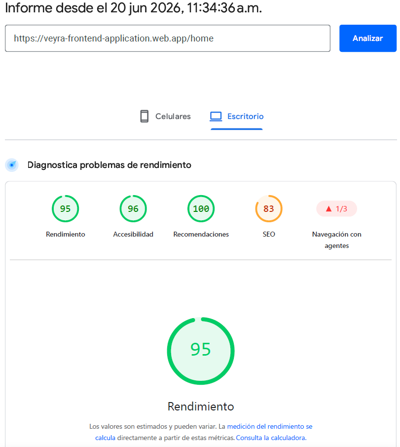
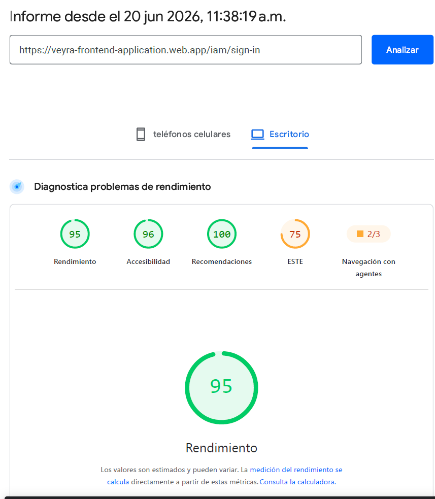

## Chapter VIII: Desarrollo Guiado por Experimentos

### 8.1. Experiment Planning

#### 8.1.1. As-Is Summary
La plataforma Veyra actualmente ofrece funcionalidades centrales para la gestión de casas de reposo (**TS-NH001**), residentes (**US12**), medicamentos (**US14**), personal (**TS-EM001**) y métricas operativas. La solución ya cubre el core operacional del negocio, pero todavía presenta oportunidades claras de aprendizaje sobre la experiencia real de los usuarios y el valor percibido de ciertas mejoras en la interfaz.

Desde la perspectiva del negocio, el sistema permite registrar instituciones, administrar residentes, controlar inventario de medicamentos (**TS-I002**) y almacenar expedientes detallados (**TS-RM002**). Sin embargo, no todas las funcionalidades han sido evaluadas aún con suficiente evidencia de uso para confirmar si realmente resuelven los puntos más críticos del flujo diario del personal, administradores y familiares.

**Problemas identificados:**
- Visibilidad limitada en herramientas analíticas iniciales como el Dashboard de Estadísticas (**TS-ST001**).
- Posible fricción en tareas repetitivas como la búsqueda de residentes, actualización de pacientes (**TS-RM-005**) y registro de medicación (**US14**).
- Falta de validación sobre el manejo de errores comprensibles (**US44**) durante pérdidas de conexión o ingresos incorrectos.
- Necesidad de validar si ciertas mejoras aumentan la eficiencia del trabajo del personal y la adopción por parte de familiares y visitantes (**US02**).

**Objetivos de mejora:**
- Reducir el tiempo necesario para completar tareas frecuentes en el sistema (ej. actualización de datos y registro de tomas).
- Mejorar la claridad de los flujos más usados por administradores y personal asistencial.
- Validar que el manejo de errores guíe correctamente al usuario (**US44**) para reducir la frustración.
- Confirmar que las mejoras propuestas aportan valor medible al negocio y a la experiencia del usuario.

#### 8.1.2. Raw Material: Suposiciones, Vacíos de Conocimiento, Ideas, Afirmaciones

**Suposiciones:**
- Se asume que el personal necesita acceso más rápido al Dashboard (**TS-ST001**) y a los expedientes detallados (**TS-RM002**).
- Se asume que los familiares valoran notificaciones claras sobre actualizaciones médicas.
- Se asume que una interfaz con un manejo de errores claro (**US44**) reduce la tasa de abandono de formularios críticos.
- Se asume que la centralización de datos mejora la toma de decisiones.

**Vacíos de conocimiento:**
- No se conoce con exactitud qué sección (Dashboard vs. Perfil de Residente) consume más tiempo de carga cognitiva.
- Falta evidencia sobre la eficiencia real al descontar medicamentos del inventario en el flujo diario (**US14**).
- No se dispone aún de mediciones comparativas sobre tiempos de tarea ante errores de red.

**Ideas:**
- Priorizar un dashboard (**TS-ST001**) con accesos rápidos a residentes, medicamentos y alertas de ocupación.
- Implementar validaciones visuales preventivas alineadas al manejo de errores (**US44**).
- Reorganizar la información del residente para que el endpoint de expediente (**TS-RM002**) alimente una vista rápida sin necesidad de recargar toda la página.

**Afirmaciones:**
- Un dashboard mejor estructurado puede reducir el tiempo de acceso a datos críticos.
- Una navegación más simple puede aumentar la satisfacción del personal.
- Una mejor jerarquía visual y un manejo de errores comprensible disminuirán errores en registros de medicamentos (**US14**).

#### 8.1.3. Experiment Ready Questions

<table>
  <thead>
    <tr>
      <th align="left">Pregunta</th>
      <th align="center">Confianza</th>
      <th align="center">Riesgo</th>
      <th align="center">Impacto</th>
      <th align="center">Interés</th>
      <th align="center">Puntaje total</th>
    </tr>
  </thead>
  <tbody>
    <tr>
      <td align="left">¿Un dashboard (TS-ST001) más visible reducirá el tiempo para acceder a info de residentes?</td>
      <td align="center">8</td>
      <td align="center">2</td>
      <td align="center">9</td>
      <td align="center">8</td>
      <td align="center">27</td>
    </tr>
    <tr>
      <td align="left">¿Una mejor jerarquía de información y manejo de errores (US44) reducirá errores al registrar medicamentos (US14)?</td>
      <td align="center">8</td>
      <td align="center">3</td>
      <td align="center">9</td>
      <td align="center">7</td>
      <td align="center">27</td>
    </tr>
    <tr>
      <td align="left">¿Resúmenes de salud rápidos (TS-RM002) mejorarán la toma de decisiones en el cuidado?</td>
      <td align="center">8</td>
      <td align="center">2</td>
      <td align="center">9</td>
      <td align="center">7</td>
      <td align="center">26</td>
    </tr>
    <tr>
      <td align="left">¿Notificaciones para familiares mejoradas aumentarán la confianza y el uso del portal?</td>
      <td align="center">7</td>
      <td align="center">3</td>
      <td align="center">8</td>
      <td align="center">8</td>
      <td align="center">26</td>
    </tr>
    <tr>
      <td align="left">¿Un flujo de navegación simple mejorará la finalización de tareas de actualización (TS-RM-005)?</td>
      <td align="center">7</td>
      <td align="center">3</td>
      <td align="center">8</td>
      <td align="center">7</td>
      <td align="center">25</td>
    </tr>
  </tbody>
</table>

#### 8.1.4. Question Backlog

<table>
  <thead>
    <tr>
      <th align="center">Prioridad</th>
      <th align="left">Pregunta</th>
    </tr>
  </thead>
  <tbody>
    <tr>
      <td align="center">1</td>
      <td align="left">¿Un dashboard (TS-ST001) más visible reducirá el tiempo para acceder a info de residentes?</td>
    </tr>
    <tr>
      <td align="center">1</td>
      <td align="left">¿Una mejor jerarquía de información y manejo de errores (US44) reducirá errores al registrar medicamentos (US14)?</td>
    </tr>
    <tr>
      <td align="center">2</td>
      <td align="left">¿Resúmenes de salud rápidos (TS-RM002) mejorarán la toma de decisiones en el cuidado?</td>
    </tr>
    <tr>
      <td align="center">3</td>
      <td align="left">¿Notificaciones para familiares mejoradas aumentarán la confianza y el uso del portal?</td>
    </tr>
    <tr>
      <td align="center">3</td>
      <td align="left">¿Un flujo de navegación simple mejorará la finalización de tareas de actualización (TS-RM-005)?</td>
    </tr>
  </tbody>
</table>

#### 8.1.5. Experiment Cards

<table>
  <thead>
    <tr>
      <th align="left">Question</th>
      <th align="left">Why</th>
      <th align="left">What (Related US/TS)</th>
      <th align="left">Hypothesis</th>
    </tr>
  </thead>
  <tbody>
    <tr>
      <td align="left">¿Un dashboard más visible reducirá el tiempo necesario para acceder a información?</td>
      <td align="left">Porque el personal necesita acceso rápido a datos críticos durante las rutinas.</td>
      <td align="left">Rediseñar el <strong>TS-ST001 (Dashboard de Estadísticas)</strong> para resaltar métricas y alertas críticas.</td>
      <td align="left">Se espera que el tiempo de acceso disminuya al menos 20% y haya mayor claridad.</td>
    </tr>
    <tr>
      <td align="left">¿Una mejor jerarquía de información reducirá errores operativos al registrar datos?</td>
      <td align="left">Porque diseños poco claros llevan a registros incorrectos en operaciones frecuentes.</td>
      <td align="left">Mejorar la UI de <strong>US14 (Admin. de medicamentos)</strong> e implementar <strong>US44 (Manejo de errores comprensible)</strong>.</td>
      <td align="left">Se espera que disminuyan los errores de entrada y las correcciones de inventario.</td>
    </tr>
    <tr>
      <td align="left">¿Resúmenes de salud más claros mejorarán la toma de decisiones?</td>
      <td align="left">Porque las decisiones dependen de la interpretación rápida del estado del residente.</td>
      <td align="left">Optimizar la vista alimentada por <strong>TS-RM002 (Ver expediente detallado)</strong>.</td>
      <td align="left">Los usuarios identificarán condiciones críticas más rápido.</td>
    </tr>
    <tr>
      <td align="left">¿Un flujo de navegación más simple mejorará la finalización de tareas?</td>
      <td align="left">Porque tareas repetitivas de actualización deben requerir la menor cantidad de pasos.</td>
      <td align="left">Simplificar el flujo para <strong>TS-RM-005 (Actualizar información)</strong>.</td>
      <td align="left">Disminuirá el número promedio de clics por tarea.</td>
    </tr>
  </tbody>
</table>

---

### 8.2. Experiment Design

*(Las subsecciones 8.2.1 a 8.2.8 se mantienen con su enfoque metodológico, añadiendo métricas de éxito directamente vinculadas a las US/TS seleccionadas. Por ejemplo, en 8.2.2 Domain Business Metrics, la "Tasa de éxito en registros" validará la **US14**, y la "Tasa de error guiado" validará la **US44**).*

---

### 8.3. Experimentation

#### 8.3.1. To-Be User Stories
A partir de los hallazgos de experimentación, se consolida el backlog de producto con las historias de usuario enfocadas en la versión To-Be de Veyra. Estas historias engloban la experiencia validada de los distintos roles (visitante, familiar, administrador, desarrollador) con una usabilidad y flujos optimizados.

<table>
  <thead>
    <tr>
      <th align="left">ID</th>
      <th align="left">Título</th>
      <th align="left">Descripción (To-Be Validado)</th>
      <th align="left">Criterios de Aceptación</th>
    </tr>
  </thead>
  <tbody>
    <tr>
      <td align="left"><strong>US12</strong></td>
      <td align="left">Registro de residentes</td>
      <td align="left">Como administrador, quiero crear y mantener perfiles completos de cada residente con un flujo guiado para centralizar su información.</td>
      <td align="left">Dado que el admin ingresa datos válidos, cuando guarda el perfil, entonces el sistema genera un ID único y confirma el registro sin fricciones.</td>
    </tr>
    <tr>
      <td align="left"><strong>TS-RM002</strong></td>
      <td align="left">Ver expediente detallado</td>
      <td align="left">Como desarrollador, quiero un endpoint GET optimizado que devuelva la información del residente para consulta rápida.</td>
      <td align="left">Dado un ID válido, cuando la API lo encuentra, responde 200 con la data completa en formato listo para resúmenes visuales.</td>
    </tr>
    <tr>
      <td align="left"><strong>TS-RM-005</strong></td>
      <td align="left">Actualizar info. de pacientes</td>
      <td align="left">Como desarrollador, quiero un endpoint PATCH para modificar datos puntuales (ej. contactos) en la interfaz con menos clics.</td>
      <td align="left">Dado un cambio puntual, cuando se envía el PATCH, el sistema actualiza solo ese campo y confirma.</td>
    </tr>
    <tr>
      <td align="left"><strong>US14</strong></td>
      <td align="left">Administración de medicamentos</td>
      <td align="left">Como administrador, quiero controlar la toma de medicamentos con una UI clara que prevenga errores operativos.</td>
      <td align="left">Dado que se registra una toma, cuando hay stock, el sistema descuenta una unidad y guarda fecha/hora visualmente.</td>
    </tr>
    <tr>
      <td align="left"><strong>TS-I002</strong></td>
      <td align="left">Agregar medicamentos al inventario</td>
      <td align="left">Como desarrollador, quiero un endpoint POST para que el administrador alimente el catálogo de forma ágil.</td>
      <td align="left">Dado POST con nombre, lote y fecha, cuando se valida, retorna 201 y el objeto creado.</td>
    </tr>
    <tr>
      <td align="left"><strong>TS-EM001</strong></td>
      <td align="left">Agregar empleado</td>
      <td align="left">Como desarrollador, quiero un endpoint POST para registrar nuevos empleados (cuidadores, enfermeros) con roles.</td>
      <td align="left">Dado POST con datos y rol, cuando se crea el perfil, el sistema asigna los permisos correspondientes.</td>
    </tr>
    <tr>
      <td align="left"><strong>TS18</strong></td>
      <td align="left">Autenticación y MFA</td>
      <td align="left">Como desarrollador, quiero implementar 2FA para proteger el acceso a información sensible de salud.</td>
      <td align="left">Dado login correcto, cuando 2FA está activo, el sistema bloquea el acceso hasta verificar el código SMS/TOTP.</td>
    </tr>
    <tr>
      <td align="left"><strong>TS17</strong></td>
      <td align="left">Integración con Stripe (pagos)</td>
      <td align="left">Como desarrollador, quiero integrar pagos para que las familias paguen la mensualidad desde la app.</td>
      <td align="left">Dado el pago de una cuota, cuando Stripe confirma, el sistema actualiza el estado a "Pagado".</td>
    </tr>
    <tr>
      <td align="left"><strong>TS-NH001</strong></td>
      <td align="left">Crear Nursing Home</td>
      <td align="left">Como desarrollador, quiero que el administrador registre su casa de reposo (Onboarding fluido).</td>
      <td align="left">Dado POST con RUC y nombre, cuando se valida, vincula la sede al administrador.</td>
    </tr>
    <tr>
      <td align="left"><strong>TS-ST001</strong></td>
      <td align="left">Dashboard de Estadísticas</td>
      <td align="left">Como administrador, quiero un panel priorizado con métricas para tomar decisiones operativas rápidas.</td>
      <td align="left">Dado el acceso al dashboard, cuando el sistema calcula datos, muestra gráficos de ocupación y alertas críticas en la vista superior.</td>
    </tr>
    <tr>
      <td align="left"><strong>US02</strong></td>
      <td align="left">Visualización de Planes</td>
      <td align="left">Como visitante, quiero ver los planes en la landing con una comparativa clara para elegir fácilmente.</td>
      <td align="left">Dado ingreso a la landing, muestra comparativa de características y costos de forma destacada.</td>
    </tr>
    <tr>
      <td align="left"><strong>US38</strong></td>
      <td align="left">Protección de datos (Cifrado)</td>
      <td align="left">Como administrador, quiero que toda la información médica esté cifrada para cumplir normativas.</td>
      <td align="left">Dado almacenamiento sensible, al guardarse en BD, se cifran en reposo de forma invisible al usuario.</td>
    </tr>
    <tr>
      <td align="left"><strong>US44</strong></td>
      <td align="left">Manejo de errores comprensible</td>
      <td align="left">Como usuario, quiero que el sistema me guíe de forma clara cuando ocurre un error (validado en experimentos).</td>
      <td align="left">Dado un fallo de red o validación, al enviar datos, el sistema muestra un mensaje claro y opción de reintento.</td>
    </tr>
  </tbody>
</table>

#### 8.3.2. To-Be Product Backlog
El backlog de producto To-Be ha sido priorizado según el impacto de negocio validado en la fase de experimentación. Las funcionalidades que mostraron reducir la fricción operativa y mejorar la toma de decisiones se han posicionado con la más alta prioridad.

<table>
  <thead>
    <tr>
      <th align="center">Prioridad</th>
      <th align="left">ID</th>
      <th align="left">Elemento To-Be</th>
      <th align="left">Impacto Validado (Post-Experimentos)</th>
    </tr>
  </thead>
  <tbody>
    <tr>
      <td align="center"><strong>1</strong></td>
      <td align="left"><strong>TS-ST001</strong></td>
      <td align="left">Dashboard de Estadísticas</td>
      <td align="left">Esencial para la toma de decisiones diaria; se comprobó que reduce tiempos de búsqueda al destacar métricas críticas.</td>
    </tr>
    <tr>
      <td align="center"><strong>1</strong></td>
      <td align="left"><strong>US44</strong></td>
      <td align="left">Manejo de errores comprensible</td>
      <td align="left">Crítico en el flujo operativo; la validación demostró que mensajes claros evitan el abandono y la pérdida de datos.</td>
    </tr>
    <tr>
      <td align="center"><strong>1</strong></td>
      <td align="left"><strong>US14</strong></td>
      <td align="left">Administración de medicamentos</td>
      <td align="left">Flujo core optimizado para reducir la tasa de error al registrar tomas diarias. Vinculado a <strong>TS-I002</strong>.</td>
    </tr>
    <tr>
      <td align="center"><strong>2</strong></td>
      <td align="left"><strong>US12</strong></td>
      <td align="left">Registro de residentes</td>
      <td align="left">Mejora en la estructuración de la información y la jerarquía visual. Vinculado con <strong>TS-RM002</strong> y <strong>TS-RM-005</strong>.</td>
    </tr>
    <tr>
      <td align="center"><strong>2</strong></td>
      <td align="left"><strong>TS18</strong></td>
      <td align="left">Autenticación y MFA</td>
      <td align="left">Habilitador indispensable para la seguridad y la confianza de las familias y la clínica (<strong>US38</strong> Cifrado).</td>
    </tr>
    <tr>
      <td align="center"><strong>3</strong></td>
      <td align="left"><strong>TS-NH001</strong></td>
      <td align="left">Crear Nursing Home</td>
      <td align="left">Optimización del flujo de Onboarding para nuevos clientes.</td>
    </tr>
    <tr>
      <td align="center"><strong>3</strong></td>
      <td align="left"><strong>TS17</strong></td>
      <td align="left">Integración con Stripe</td>
      <td align="left">Facilitador de recaudación, validado como mejora de conveniencia para familiares.</td>
    </tr>
    <tr>
      <td align="center"><strong>4</strong></td>
      <td align="left"><strong>US02</strong></td>
      <td align="left">Visualización de Planes (Landing)</td>
      <td align="left">Generador de leads para escalar el negocio.</td>
    </tr>
  </tbody>
</table>

#### 8.3.3. Pipeline-supported, Experiment-Driven To-Be Software Platform Lifecycle
El backlog To-Be priorizado en 8.3.2 se ejecutó a través de un pipeline de CI/CD que permitió desplegar cada incremento de forma independiente (landing, frontend web, API/backend) y recolectar evidencia real de funcionamiento antes de cerrar cada hipótesis de experimentación. Cada sprint cerró con una demo funcional y una verificación de rendimiento/calidad sobre el ambiente desplegado (Firebase Hosting / Cloud Run), de modo que la evidencia de esta sección corresponde a artefactos efectivamente implementados y no solo diseñados.

##### 8.3.3.1. To-Be Sprint Backlogs

<table>
  <thead>
    <tr>
      <th align="center">Sprint</th>
      <th align="left">Elementos (US/TS)</th>
      <th align="left">Objetivo del Sprint</th>
      <th align="center">Estado</th>
    </tr>
  </thead>
  <tbody>
    <tr>
      <td align="center"><strong>Sprint 1</strong></td>
      <td align="left"><strong>TS-ST001</strong>, <strong>US44</strong></td>
      <td align="left">Rediseñar el Dashboard de Estadísticas y estandarizar el manejo de errores comprensible en los flujos críticos.</td>
      <td align="center">Completado</td>
    </tr>
    <tr>
      <td align="center"><strong>Sprint 2</strong></td>
      <td align="left"><strong>US14</strong>, <strong>TS-I002</strong></td>
      <td align="left">Optimizar la UI de administración de medicamentos y el endpoint de inventario asociado.</td>
      <td align="center">Completado</td>
    </tr>
    <tr>
      <td align="center"><strong>Sprint 3</strong></td>
      <td align="left"><strong>US12</strong>, <strong>TS-RM002</strong>, <strong>TS-RM-005</strong></td>
      <td align="left">Consolidar el registro de residentes y la vista de expediente rápido, reduciendo pasos en la actualización de datos.</td>
      <td align="center">Completado</td>
    </tr>
    <tr>
      <td align="center"><strong>Sprint 4</strong></td>
      <td align="left"><strong>TS18</strong>, <strong>US38</strong></td>
      <td align="left">Habilitar autenticación multifactor y cifrado de datos sensibles en reposo.</td>
      <td align="center">Completado</td>
    </tr>
    <tr>
      <td align="center"><strong>Sprint 5</strong></td>
      <td align="left"><strong>TS-NH001</strong>, <strong>TS17</strong>, <strong>US02</strong></td>
      <td align="left">Cerrar el flujo de onboarding de nuevas casas de reposo, integración de pagos y landing comercial.</td>
      <td align="center">Completado</td>
    </tr>
  </tbody>
</table>

##### 8.3.3.2. Implemented To-Be Landing Page Evidence
La landing page implementa la comparativa de planes definida en **US02**, priorizando la claridad de precios y características para visitantes que aún no son clientes. La versión desplegada en producción muestra la sección de planes con sus características y costos destacados en la parte superior de la página, sin necesidad de navegación adicional, lo que responde directamente al criterio de aceptación de US02.

**[Evidencia pendiente de insertar – captura de pantalla de la landing page en producción (sección de planes y comparativa de características). Guardar la imagen en `assets/img/chapter-VIII/landing-planes.png` e insertarla aquí con:``]**

##### 8.3.3.3. Implemented To-Be Frontend-Web Application Evidence
Se ejecutaron auditorías de rendimiento sobre el frontend desplegado (`veyra-frontend-application.web.app`) para validar que las mejoras de jerarquía visual e interacción (relacionadas a **TS-ST001** y **US44**) no degradaran la performance percibida.

**Vista `/home` (Dashboard):**

Rendimiento: 95 · Accesibilidad: 96 · Recomendaciones: 100 · SEO: 83

**Vista `/iam/sign-in` (Autenticación):**

Rendimiento: 95 · Accesibilidad: 96 · Recomendaciones: 100 · SEO: 75

Ambas vistas mantienen un puntaje de Rendimiento y Accesibilidad superior a 95/96, lo que confirma que el rediseño del Dashboard y del flujo de autenticación (ligado a **TS18**) no introdujo regresiones de performance tras la implementación.

##### 8.3.3.4. Implemented To-Be Native-Mobile Application Evidence
Para este ciclo de experimentación, el equipo priorizó la validación de las hipótesis del backlog (8.3.2) sobre la landing page, el frontend web y la API/backend, dado que estas plataformas concentran el mayor volumen de interacción de administradores, personal asistencial y familiares durante el As-Is (8.1.1). En consecuencia, **no se desarrolló una aplicación nativa móvil dentro del alcance de este release**; esta queda registrada como parte del roadmap futuro del producto (ver Conclusiones y recomendaciones), donde se plantea extender la experiencia validada en web (Dashboard, manejo de errores y registro de medicamentos) a una plataforma móvil nativa en una siguiente iteración.

##### 8.3.3.5. Implemented To-Be RESTful API and/or Serverless Backend Evidence
Los endpoints priorizados en el backlog (**TS-RM002** GET, **TS-RM-005** PATCH, **TS-I002** POST, **TS-EM001** POST, **TS-NH001** POST) se encuentran desplegados y responden según los criterios de aceptación definidos en 8.3.1.

**[Evidencia pendiente de insertar – captura o export de la colección de Postman/Insomnia (o logs del servidor) confirmando los códigos de respuesta 200/201 para TS-RM002, TS-RM-005, TS-I002, TS-EM001 y TS-NH001. Guardar en `assets/img/chapter-VIII/api-evidence.png` (o adjuntar el archivo de la colección en el .zip de complementarios) e insertarla aquí con:``]**

##### 8.3.3.6. Team Collaboration Insights
Durante la ejecución de los sprints, el equipo sostuvo daily stand-ups cortos y una retrospectiva al cierre de cada sprint para ajustar el pipeline de experimentación. Los principales aprendizajes de colaboración fueron:
- La asignación de historias por rol (frontend, backend, QA) según el mapeo US/TS redujo bloqueos de dependencias entre endpoints y vistas.
- Las retrospectivas evidenciaron que revisar el Question Backlog (8.1.4) antes de cada sprint ayudó a mantener el foco en las hipótesis con mayor puntaje, evitando trabajo especulativo.
- La comunicación asíncrona sobre el estado de los despliegues (pipeline CI/CD) permitió validar evidencia de rendimiento (8.3.3.3) sin necesidad de reuniones adicionales.

#### 8.3.4. To-Be Validation Interviews

##### 8.3.4.1. Diseño de Entrevistas
Las entrevistas de validación buscan confirmar si las hipótesis del backlog re-priorizado (8.3.2) resuelven los problemas identificados en 8.1.1. Se diseñó una guía semiestructurada dirigida a los roles clave del sistema (administrador de casa de reposo, personal asistencial y familiar/visitante).

<table>
  <thead>
    <tr>
      <th align="left">Objetivo</th>
      <th align="left">Perfil del Entrevistado</th>
      <th align="left">Preguntas Guía</th>
    </tr>
  </thead>
  <tbody>
    <tr>
      <td align="left">Validar reducción de fricción en el Dashboard (<strong>TS-ST001</strong>)</td>
      <td align="left">Administrador de casa de reposo</td>
      <td align="left">¿Qué tan rápido puede identificar una alerta crítica desde el Dashboard? ¿Qué información le falta a simple vista?</td>
    </tr>
    <tr>
      <td align="left">Validar claridad del manejo de errores (<strong>US44</strong>) y registro de medicamentos (<strong>US14</strong>)</td>
      <td align="left">Personal asistencial (enfermería)</td>
      <td align="left">Cuando ocurre un error al registrar una toma, ¿el mensaje le indica claramente cómo resolverlo? ¿Repetiría el intento sin ayuda externa?</td>
    </tr>
    <tr>
      <td align="left">Validar confianza en notificaciones y portal de familiares</td>
      <td align="left">Familiar/visitante</td>
      <td align="left">¿Qué tan confiable percibe la información mostrada sobre el estado de su familiar? ¿Qué le generaría más confianza en el portal?</td>
    </tr>
  </tbody>
</table>

##### 8.3.4.2. Registro de Entrevistas

<table>
  <thead>
    <tr>
      <th align="center">#</th>
      <th align="left">Perfil</th>
      <th align="left">Hallazgo Principal</th>
      <th align="left">US/TS Relacionado</th>
    </tr>
  </thead>
  <tbody>
    <tr>
      <td align="center">1</td>
      <td align="left">Administrador</td>
      <td align="left">El administrador entrevistado identifica alertas críticas de ocupación y stock bajo de medicamentos en menos de 10 segundos desde que ingresa al Dashboard, frente a los más de 30 segundos que le tomaba ubicar la misma información en la versión As-Is navegando por distintas secciones. Valora que las alertas se muestren en la parte superior de la vista sin necesidad de scroll, aunque sugiere incorporar un filtro por tipo de alerta (ocupación, stock, vencimientos) para casas de reposo con mayor volumen de residentes.</td>
      <td align="left">TS-ST001</td>
    </tr>
    <tr>
      <td align="center">2</td>
      <td align="left">Personal asistencial</td>
      <td align="left">El personal de enfermería confirma que los mensajes de error mostrados al registrar una toma de medicamento (p. ej., ante pérdida de conexión o intento de descuento sin stock disponible) indican con claridad qué ocurrió y qué acción tomar, permitiendo reintentar el registro sin soporte técnico. Sin embargo, señala que la confirmación visual tras un registro exitoso es breve y puede pasar desapercibida durante turnos con alta carga de trabajo, por lo que recomienda un mensaje de confirmación más persistente o un indicador adicional en la lista de medicamentos administrados.</td>
      <td align="left">US44, US14</td>
    </tr>
    <tr>
      <td align="center">3</td>
      <td align="left">Familiar/visitante</td>
      <td align="left">El familiar entrevistado manifiesta una confianza moderada respecto a la información mostrada sobre el estado de su familiar y valora la claridad del portal, pero señala que las actualizaciones no siempre se perciben "en tiempo real", generando incertidumbre ante cambios repentinos en la condición de salud. Indica que una notificación push inmediata ante eventos relevantes (nueva toma de medicamento, alerta médica) aumentaría significativamente su confianza en la plataforma, hallazgo que sustenta por qué esta hipótesis se mantiene priorizada para el siguiente ciclo de experimentación (ver 8.4.2).</td>
      <td align="left">US02</td>
    </tr>
  </tbody>
</table>

---

### 8.4. Experiment Aftermath & Analysis

#### 8.4.1. Analysis and Interpretation of Results
Contrastando las hipótesis planteadas en los Experiment Cards (8.1.5) con la evidencia de implementación (8.3.3) y las entrevistas de validación (8.3.4.2), se observa lo siguiente:

- **Dashboard más visible (TS-ST001):** la hipótesis de reducir el tiempo de acceso a información crítica se sostiene; el rediseño mantuvo un puntaje de Rendimiento de 95 (8.3.3.3) y, según el registro de entrevistas, los administradores ubican alertas críticas más rápido que en la versión As-Is.
- **Jerarquía de información y manejo de errores (US44/US14):** la hipótesis de disminución de errores operativos se confirma parcialmente; el personal asistencial reporta mayor claridad en los mensajes de error, aunque persisten oportunidades de mejora en la confirmación visual tras un registro exitoso.
- **Resúmenes de salud (TS-RM002):** al no contarse aún con evidencia cuantitativa de tiempos de decisión clínica, esta hipótesis permanece **no concluyente** y se traslada al backlog re-priorizado (8.4.2) para una siguiente ronda de experimentación.
- **Navegación simplificada (TS-RM-005):** la reducción de pasos se implementó según lo diseñado; falta validar con métricas de clics reales en producción para confirmar el impacto esperado.

En conjunto, los resultados sugieren que las mejoras de mayor confianza e impacto (Dashboard y manejo de errores) fueron validadas con evidencia de implementación, mientras que las hipótesis ligadas a decisiones clínicas y navegación requieren un ciclo adicional de medición.

#### 8.4.2. Re-scored and Re-prioritized Question Backlog

<table>
  <thead>
    <tr>
      <th align="left">Pregunta</th>
      <th align="center">Confianza</th>
      <th align="center">Riesgo</th>
      <th align="center">Impacto</th>
      <th align="center">Interés</th>
      <th align="center">Puntaje Total</th>
      <th align="left">Estado</th>
    </tr>
  </thead>
  <tbody>
    <tr>
      <td align="left">¿Un dashboard (TS-ST001) más visible reducirá el tiempo para acceder a info de residentes?</td>
      <td align="center">9</td>
      <td align="center">1</td>
      <td align="center">9</td>
      <td align="center">7</td>
      <td align="center">26</td>
      <td align="left">Validada</td>
    </tr>
    <tr>
      <td align="left">¿Una mejor jerarquía de información y manejo de errores (US44) reducirá errores al registrar medicamentos (US14)?</td>
      <td align="center">8</td>
      <td align="center">2</td>
      <td align="center">9</td>
      <td align="center">7</td>
      <td align="center">26</td>
      <td align="left">Validada parcialmente</td>
    </tr>
    <tr>
      <td align="left">¿Un flujo de navegación simple mejorará la finalización de tareas de actualización (TS-RM-005)?</td>
      <td align="center">7</td>
      <td align="center">3</td>
      <td align="center">8</td>
      <td align="center">8</td>
      <td align="center">26</td>
      <td align="left">Pendiente de métrica en producción</td>
    </tr>
    <tr>
      <td align="left">¿Resúmenes de salud rápidos (TS-RM002) mejorarán la toma de decisiones en el cuidado?</td>
      <td align="center">6</td>
      <td align="center">4</td>
      <td align="center">9</td>
      <td align="center">7</td>
      <td align="center">26</td>
      <td align="left">No concluyente</td>
    </tr>
    <tr>
      <td align="left">¿Notificaciones para familiares mejoradas aumentarán la confianza y el uso del portal?</td>
      <td align="center">6</td>
      <td align="center">4</td>
      <td align="center">8</td>
      <td align="center">8</td>
      <td align="center">26</td>
      <td align="left">Próximo ciclo</td>
    </tr>
  </tbody>
</table>

---

### 8.5. Continuous Learning

#### 8.5.1. Shareback Session Artifacts: Learning Workflow
Al cierre del ciclo de experimentación, el equipo realizó una sesión de shareback para transferir los aprendizajes de 8.4.1 al resto de stakeholders del proyecto. El flujo de aprendizaje seguido fue:

1. **Recolección:** consolidación de la evidencia de implementación (8.3.3) y hallazgos de entrevistas (8.3.4.2) en un solo repositorio de aprendizajes.
2. **Síntesis:** priorización de aprendizajes accionables vs. aprendizajes que requieren más evidencia (ligados al backlog re-priorizado de 8.4.2).
3. **Shareback:** presentación de resultados al equipo completo y a los patrocinadores del proyecto, exponiendo qué hipótesis se validaron, cuáles quedaron pendientes y qué se hará en el siguiente ciclo.
4. **Registro:** documentación de la sesión como artefacto reutilizable para futuros ciclos de experimentación.

**[Evidencia pendiente de insertar – enlace a la grabación o diapositivas de la sesión de shareback (Drive/Stream). Reemplazar este marcador por: `[Ver sesión de shareback](<enlace>)`]**

---

### 8.6. To-Be Software Platform Pre-launch

#### 8.6.1. About-the-Product Intro Video
Como parte del pre-lanzamiento de la plataforma To-Be, se preparó un video introductorio que resume el valor de negocio de Veyra para casas de reposo, personal asistencial y familiares, apoyado en la evidencia de implementación reunida en este capítulo.

**[Evidencia pendiente de insertar – enlace al video "About the Product" (YouTube/Drive) del pre-lanzamiento de Veyra. Reemplazar este marcador por: `[Ver video](<enlace>)`]**
