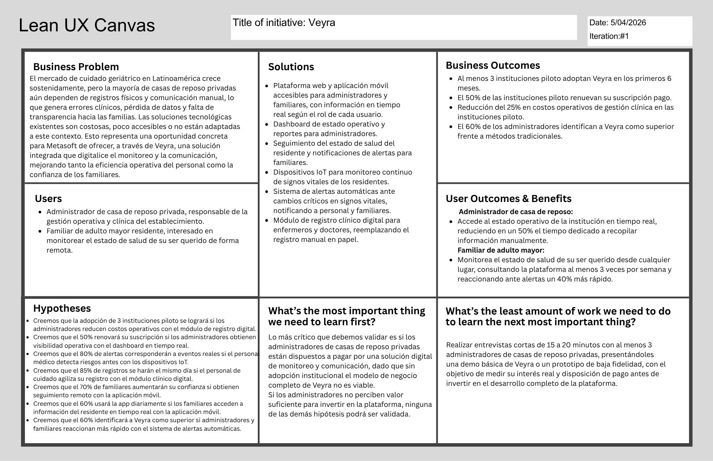

## Capítulo I: Introducción
El presente proyecto tiene como finalidad el diseño, desarrollo e implementación de una solución Saas, incluyendo una aplicación web y una aplicación movil, con el objetivo de resolver problemáticas reales en contextos productivos. Esta solución se construye bajo un enfoque de ingeniería de software moderna, incorporando metodologías ágiles, diseño centrado en el usuario (Lean UX) y arquitecturas escalables orientadas a servicios.

En el contexto actual, las organizaciones enfrentan desafíos relacionados con la captura, procesamiento y análisis de datos en tiempo real, especialmente en entornos donde aún predominan procesos manuales o semi-digitalizados. Estas limitaciones generan ineficiencias operativas, retrasos en la toma de decisiones y pérdida de información relevante.

Frente a este escenario, el presente proyecto propone el desarrollo de un ecosistema digital que permita la automatización de la recolección de datos mediante dispositivos IoT, su procesamiento inteligente y su visualización a través de aplicaciones web y móviles, contribuyendo a la mejora de la eficiencia operativa y la toma de decisiones basada en datos.
### 1.1. Startup Profile
La presente sección describe el contexto general de la startup responsable del desarrollo de la solución propuesta. Se presenta una visión general de la organización, su enfoque tecnológico y propuesta de valor, así como la caracterización de los integrantes del equipo, destacando sus perfiles y roles dentro del proyecto.
#### 1.1.1. Descripción de la Startup
NovaTech desarrolla soluciones integrales que combinan dispositivos inteligentes, sistemas backend escalables y aplicaciones web y móviles, priorizando la interoperabilidad con sistemas existentes y la adaptabilidad a distintos contextos empresariales. Su modelo de negocio es inherentemente escalable: diseñado para crecer de forma exponencial mediante la incorporación de nuevas instituciones y usuarios sin incrementos proporcionales en los costos operativos, lo que le permite expandirse a múltiples segmentos del mercado geriátrico latinoamericano.

En el marco de este proyecto, la startup desarrolla una solución orientada al sector salud, enfocada en el monitoreo remoto de pacientes en entornos de cuidado especializado.

##### Misión
Desarrollar soluciones tecnológicas innovadoras que permitan a las organizaciones optimizar sus procesos mediante el uso de datos, automatización e integración de tecnologías emergentes.

##### Visión
Ser una startup referente en el desarrollo de soluciones IoT y plataformas inteligentes en Latinoamérica, destacando por su capacidad de innovación, escalabilidad y enfoque centrado en el usuario.

#### 1.1.2. Perfiles de integrantes del equipo
### 1.2. Solution Profile
Veyra es una plataforma digital integral diseñada para mejorar la gestión de información clínica y operativa en casas de reposo, facilitando el acceso remoto a datos relevantes para familiares y personal de cuidado. Para fundamentar la propuesta de valor de nuestra startup, empleamos la técnica 5W y 2H. 
#### 1.2.1. Antecedentes y problemática

**1. ANTECEDENTES**

La población mundial envejece rápidamente, y América Latina no es la excepción. En 2022 había unos 88,6 millones de personas de 60 años o más en la región (13,4% de la población). En Perú, este fenómeno demográfico se refleja en que actualmente el 13,9% de la población (≈4 748 000 personas) tiene 60 años o más. Esta proporción crece a un ritmo sostenido (≈2,7% anual) y se estima que para el 2050 cerca del 25% de los peruanos formará parte de la comunidad de adultos mayores. De manera complementaria, el Instituto Nacional de Estadística e Informática (INEI, 2026) reporta que la proporción de población adulta mayor ha aumentado de 5,7% en 1950 a 14,6% en 2026, evidenciando un proceso sostenido de envejecimiento poblacional. Este cambio estructural incrementa la demanda de servicios geriátricos (casas de reposo, centros de día, atención domiciliaria, etc.) y plantea retos en salud, pensiones y cuidado social.

Además, muchas personas adultas mayores conviven con problemas de salud que requieren seguimiento permanente. Según el INEI (2026), el 79,3% de esta población presenta al menos una condición crónica. Esto hace que, en entornos de cuidado continuo, sea cada vez más importante contar con un monitoreo oportuno, una trazabilidad clínica adecuada y una comunicación fluida entre las instituciones y las familias.

Al mismo tiempo, el sistema de salud peruano mantiene limitaciones estructurales relacionadas con la fragmentación de la información y la limitada interoperabilidad entre actores e instituciones. De acuerdo con la OCDE (2025), esta fragmentación genera desigualdades en el acceso a la atención y dificulta la integración de la información clínica entre distintos niveles de atención. Esto complica disponer de datos clínicos oportunos, integrados y accesibles para la toma de decisiones, especialmente cuando el cuidado del adulto mayor involucra a personal asistencial, responsables administrativos y familiares.

En este contexto, las casas de reposo cumplen un rol crucial en el bienestar de los mayores, pero su gestión enfrenta limitaciones tecnológicas. Tradicionalmente, ingresar a una residencia era visto como "apartar" al anciano, pero hoy se reconoce que la familia sigue teniendo un rol activo en el cuidado. Sin embargo, la modernización digital del sector es incipiente: muchas residencias aún manejan la información clínica y administrativa en papel o en sistemas aislados. De hecho, incluso en el sistema de salud peruano en general "muchos hospitales y postas aún registran a mano la información del paciente" y la compartición de datos es limitada, pues cada institución (MINSA, EsSalud, FF.AA., FFAA, sector privado) opera con historiales fragmentados. Solo unas pocas residencias pioneras habían iniciado planes de transformación digital antes de la pandemia, siendo la COVID-19 un catalizador que "agilizó la necesidad de un gran cambio" tecnológico en los centros geriátricos. Esta falta de digitalización contribuye a la desconexión informativa entre las casas de reposo y los familiares. En la práctica, la comunicación suele limitarse a llamadas telefónicas esporádicas o visitas puntuales, sin un canal permanente de intercambio de datos. Esta brecha se traduce en frustración y ansiedad: los familiares desean recibir información puntual sobre la salud, actividades y necesidades de sus seres queridos, pero carecen de medios eficientes para ello. De hecho, expertos han señalado "la necesidad de la creación de una plataforma" que aproveche las últimas tecnologías para facilitar la interacción continua entre los familiares y el centro de cuidado.

**2. PROBLEMÁTICA**

Comunicación deficiente: El personal de las residencias de adultos mayores suele tener una alta carga de trabajo, lo que limita el tiempo disponible para informar a las familias. Se ha documentado que "en muchas residencias, el personal de atención directa se encuentra bajo una presión de tiempo que dificulta tener conversaciones con los miembros de la familia". Esta situación genera malentendidos, desconfianza y estrés emocional en los parientes, que a menudo no saben a quién recurrir o deben esperar largas horas para recibir respuestas básicas.

Falta de acceso a información en tiempo real: Los familiares no disponen de un medio seguro para consultar el estado clínico o las actividades diarias del residente de manera instantánea. La carencia de un portal o aplicación web significa que no pueden verificar datos como medicación administrada, citas médicas, registro de tratamientos o estado de ánimo sin depender de consultas directas al personal. En la práctica esto implica que las familias deben realizar numerosas llamadas telefónicas o visitas recurrentes para obtener actualizaciones, lo que aumenta la carga de trabajo de los cuidadores y mantiene a los parientes en incertidumbre. (Por el contrario, el uso de herramientas digitales permitiría "acceso constante a información actualizada", reduciendo la ansiedad y las llamadas repetitivas). Datos clínicos fragmentados: Los registros sanitarios de cada residente suelen estar dispersos en historias clínicas físicas o sistemas locales no integrados. Esto provoca duplicidad de información y dificulta el seguimiento longitudinal de la salud del adulto mayor. Por ejemplo, si un centro no cuenta con un expediente único digital, las anotaciones de enfermería, el historial médico y los reportes de actividades pueden quedar desorganizados o inaccesibles desde la distancia, lo que complica la coordinación entre médicos, enfermeras y familia.

Ausencia de plataformas integradas: Actualmente, no existe en el sector una solución web centralizada que unifique la gestión clínica, administrativa y comunicacional en residencias peruanas. Muchas tareas administrativas –como el control de pagos, el registro de recetas o los reportes diarios– se realizan de forma manual o en hojas de cálculo, sin interoperabilidad. Esta falta de automatización genera lentitud en los procesos y riesgo de errores, afectando la eficiencia del personal y reduciendo la transparencia hacia los familiares.

Baja adopción tecnológica: A diferencia de otros sectores de salud, las casas de reposo en Perú han incorporado la tecnología de forma limitada. Aunque en otros países especialistas destacan que la digitalización ofrece mejoras significativas en la calidad asistencial, en nuestro entorno las iniciativas tecnológicas (como teleasistencia o software de gestión) son incipientes. Esta baja adopción implica que los centros dependen de métodos tradicionales, lo que aumenta la brecha con las expectativas modernas de atención y comunicación.

**Análisis 5W+2H:**

**What (¿Qué?):** El problema se centra en la falta de acceso oportuno y confiable a la información sobre el estado de salud de los residentes en casas de reposo. Esta situación afecta tanto a las instituciones, que necesitan gestionar y dar seguimiento al cuidado de manera ordenada, como a los familiares, que requieren visibilidad sobre la condición de sus seres queridos.

**Why (¿Por qué?):** Es importante abordar este problema para mejorar la calidad de vida de los adultos mayores y dar tranquilidad a sus familias. Al centralizar la información y ofrecer acceso en línea, Veyra reduce el estrés familiar, aumenta la transparencia en la atención y optimiza las tareas del personal. En un contexto de rápido envejecimiento poblacional, la solución contribuye a que las residencias operen de manera más eficiente y moderna, alineándose con estándares actuales de cuidado y facilitando el cumplimiento de las normativas de salud.

**Who (¿Quién?):** Afecta principalmente a dos grupos: el personal técnico y administrativo de las instituciones geriátricas, que necesitan gestionar datos clínicos y operativos de forma ordenada; y los familiares de los residentes, quienes demandan información actualizada y comunicación efectiva. Veyra beneficiará asimismo a los mismos adultos mayores al garantizar un seguimiento más riguroso de su atención médica, aunque ellos no serán usuarios directos de la plataforma (la interfaz está diseñada para personal técnico y familiares).

**When (¿Cuándo?):** Esta necesidad es especialmente crítica en la actualidad, debido a que el envejecimiento de la población ya supera ciertos umbrales y seguirá aumentando en las próximas décadas. Además, situaciones cotidianas como emergencias médicas, cambios de tratamiento o eventos familiares resaltan la urgencia de tener información actualizada en tiempo real. En consecuencia, el momento más crítico es el presente y el futuro inmediato, cuando las residencias busquen modernizar sus procesos y ofrecer mejores servicios ante el aumento sostenido de adultos mayores.

**Where (¿Dónde?):** Ocurre principalmente en el ámbito de casas de reposo, residencias geriátricas y centros de atención diurna en Perú (especialmente en las zonas urbanas con más población envejecida), así como en cualquier institución similar de Latinoamérica interesada en mejorar su gestión. También implica el contexto familiar de esos residentes, quienes pueden estar localizados tanto en la misma ciudad como en regiones distantes, requiriendo acceso remoto a la información.

**How (¿Cómo?):** Este problema puede abordarse mediante una solución digital integrada que centralice la información clínica y operativa del residente, facilite el acceso remoto a los datos relevantes y permita mejorar el seguimiento del estado de salud. Bajo esta aproximación, la tecnología se plantea como un medio para fortalecer la trazabilidad, la comunicación y la capacidad de respuesta en el cuidado continuo.

**How much (¿Cuánto?):** Desde una perspectiva preliminar, el problema también involucra una dimensión económica y operativa, ya que cualquier propuesta de mejora debe ser viable para instituciones con distintos niveles de capacidad y adaptarse a modelos sostenibles de implementación y mantenimiento.

#### 1.2.2. Lean UX Process
El Lean UX es un enfoque que permite validar las soluciones propuestas para problemas identificados. Este enfoque se centra en las personas que utilizarán nuestro producto. Una vez identificada la problemática a resolver, se empleó este proceso para reconocer áreas clave que contribuirán a dar forma al producto propuesto.
##### 1.2.2.1. Lean UX Problem Statements
El cuidado geriátrico en Perú enfrenta un déficit de gestión clínica: el 14.6% de la población es adulta mayor y el 80% padece enfermedades crónicas (INEI, 2024). Actualmente, las casas de reposo operan con procesos manuales que generan alta incertidumbre operativa y falta de trazabilidad de datos.
Esta deficiencia afecta a dos segmentos: administradores/personal clínico, que carecen de herramientas de respuesta rápida, y familiares, que dependen de comunicación reactiva para conocer el estado de salud del residente. El impacto es crítico: el personal no detecta anomalías a tiempo y el 65% de los familiares desconfía de la calidad del cuidado por falta de transparencia (APESEG, 2023).

No existe en el mercado local una solución que integre monitoreo continuo (IoT), gestión centralizada y acceso remoto. Veyra capitaliza la alta penetración de smartphones (85%, BID) para modernizar este sector mediante un ecosistema digital distribuido de captura de datos en tiempo real.

La gestión actual en casas de reposo no satisface las expectativas de transparencia de las familias ni la eficiencia operativa del personal, elevando los riesgos ante emergencias. 

**¿Cómo podríamos mejorar la visibilidad del estado de salud del residente para que el personal actúe preventivamente y los familiares obtengan tranquilidad mediante datos verificables en tiempo real?**

##### 1.2.2.2. Lean UX Assumptions
En esta sección se declaran las creencias fundamentales del equipo sobre las que se construye la propuesta de valor de Veyra. Bajo el marco de trabajo Lean UX, estos supuestos identifican las áreas de mayor riesgo e incertidumbre, sirviendo como base estratégica para la creación de hipótesis y experimentos de validación.

**Assumptions Worksheet (Síntesis del Proyecto)**

| #  | Supuesto Estratégico aplicado a Veyra |
|----|---------------------------------------|
| 1  | Creemos que los familiares de adultos mayores experimentan altos niveles de ansiedad debido a la opacidad y lentitud de los reportes tradicionales de salud. |
| 2  | Asumimos que los administradores de casas de reposo ven en la transparencia de datos una ventaja competitiva clave para justificar sus tarifas y mejorar su reputación. |
| 3  | La necesidad de visibilidad se resolverá con un ecosistema IoT + Cloud que automatice la captura de data crítica, eliminando el sesgo y error del registro manual. |
| 4  | El modelo de ingresos será un SaaS B2B escalable por número de residentes monitoreados, complementado con accesos premium para familiares. |
| 5  | El mayor riesgo de adopción es la resistencia al cambio del personal asistencial; se mitigará mediante interfaces de baja fricción y automatización de toma de datos. |

**Supuestos por Dimensión**

**Business Assumptions (Viabilidad y Mercado)**

* Asumimos que las casas de reposo privadas en zonas urbanas están dispuestas a invertir en tecnología para diferenciarse de la competencia informal y mejorar su estándar de servicio.
* Asumimos que el modelo de suscripción escalonado permite la captación de instituciones pequeñas y medianas sin comprometer la rentabilidad operativa.
* Asumimos que la propuesta de valor integrada (Web/Móvil/IoT) justifica el costo de implementación frente a soluciones de software tradicionales.

**User Assumptions (Comportamiento y Segmentación)**

* **Personal Asistencial:** Asumimos que adoptarán el registro digital solo si este reduce su carga administrativa operativa al cierre de cada turno.
* **Administradores:** Asumimos que requieren una visión centralizada del estado de salud de todos los residentes para mitigar riesgos legales y operativos.
* **Familiares:** Asumimos que prefieren el autoservicio de información a través de una aplicación móvil que depender de llamadas telefónicas o mensajes de WhatsApp.

**Problem Assumptions (Deseabilidad y Dolores)**

* Creemos que la dependencia de registros manuales y comunicación informal (papel/voz) genera pérdida de trazabilidad y lentitud en la detección de crisis.
* Asumimos que existe una brecha de confianza entre la institución y la familia debido a la falta de pruebas objetivas sobre la frecuencia y calidad del cuidado.
* Creemos que el personal médico gasta tiempo crítico en tareas de digitación manual que restan calidad a la atención directa del residente.

**Solution Assumptions (Factibilidad y Valor)**

* Creemos que la captura automática vía dispositivos IoT proporcionará una fuente de verdad única que reducirá fricciones y reclamos por parte de los familiares.
* Asumimos que una plataforma en la nube facilitará la gestión de alertas preventivas, permitiendo una reacción médica hasta un 40% más rápida.
* Creemos que el acceso remoto continuo aumentará la percepción de valor del servicio prestado por la casa de reposo.

**Assumptions Priority (Matriz de Riesgo x Incertidumbre)**

| Prioridad | Supuesto a validar | Riesgo | Incertidumbre |
|----------:|--------------------|:------:|:-------------:|
| 1 | El personal asistencial adoptará el registro digital continuo sin afectar su flujo operativo actual. | Alto | Alto |
| 2 | Los sensores IoT mantendrán la precisión y conectividad necesaria para generar alertas confiables. | Alto | Medio |
| 3 | Las instituciones aceptarán el modelo de suscripción SaaS por el valor percibido de la transparencia. | Medio | Alto |
| 4 | Los familiares usarán la plataforma de forma recurrente como canal principal de seguimiento. | Medio | Bajo |

**Outcomes Esperados (Métricas de Éxito)**

*Business Outcomes:*

* Lograr que al menos 3 instituciones piloto completen el ciclo de validación de 6 meses.
* Reducir en un 25% los costos operativos relacionados con la gestión de información clínica.
* Incrementar en un 15% la tasa de captación de nuevos residentes tras la implementación tecnológica.

*User Outcomes:*

* Reducir el tiempo de registro manual del personal asistencial en un 35% por turno.
* Lograr que los familiares consulten la plataforma un promedio de 3 veces por semana, reduciendo las llamadas de consulta externa.
* Disminuir el tiempo de respuesta ante alertas críticas en al menos un 40%.

**Features mínimas para validación (MVP)**

1. **Dashboard de Monitoreo:** Panel centralizado para administradores con el estado de salud global.
2. **Registro de Signos Vitales IoT:** Captura y visualización en tiempo real de data biométrica.
3. **Módulo de Alertas:** Notificaciones automáticas ante variaciones críticas de salud.
4. **Portal Familiar:** Aplicación de consulta de historial clínico, medicación y actividades diarias.

##### 1.2.2.3. Lean UX Hypothesis Statements

En esta sección se formulan las hipótesis del producto a partir de los supuestos previamente definidos. Estas hipótesis permiten validar, mediante experimentación, si la solución propuesta genera los resultados esperados en los usuarios y en el negocio. Cada hipótesis se estructura en términos de segmento de usuario, solución propuesta, resultado esperado y métrica de validación.

**Hypothesis 1 – Transparencia y confianza**

**Creemos que** implementar una plataforma web y móvil con acceso en tiempo real a la información clínica de los residentes aumentará el nivel de confianza de los familiares en el servicio de la casa de reposo.

**Sabremos que** hemos tenido éxito.

**Cuando veamos** que al menos el 70% de los familiares acceden a la plataforma un mínimo de 3 veces por semana y reportan una mejora en su percepción de confianza en encuestas de satisfacción.

**Hypothesis 2 – Monitoreo IoT en tiempo real**

**Creemos que** incorporar dispositivos IoT para el monitoreo continuo de signos vitales mejorará la detección temprana de riesgos de salud en residentes de casas de reposo.

**Sabremos que** hemos tenido éxito.

**Cuando veamos** que al menos el 80% de las alertas críticas generadas corresponden a eventos confirmados por el personal y se reduce la cantidad de incidentes no detectados.

**Hypothesis 3 – Adopción por parte del personal**

**Creemos que** implementar un sistema simple e integrado para el registro de información clínica aumentará la frecuencia y calidad del registro de datos por parte del personal de cuidado.

**Sabremos que** hemos tenido éxito.

**Cuando veamos** que al menos el 85% de los registros se realizan dentro del mismo día y los errores de registro se reducen en un 30%.

**Hypothesis 4 – Uso de la aplicación móvil**

**Creemos que** ofrecer una aplicación móvil intuitiva con acceso a información en tiempo real aumentará el uso recurrente de la solución entre los familiares de residentes.

**Sabremos que** hemos tenido éxito.

**Cuando veamos** que al menos el 60% de los usuarios activos utilizan la app diariamente o varias veces por semana.

**Hypothesis 5 – Alertas y reacción oportuna**

**Creemos que** implementar un sistema de alertas automáticas ante cambios en signos vitales permitirá una respuesta más rápida ante eventos críticos por parte del personal médico y los familiares.

**Sabremos que** hemos tenido éxito.

**Cuando veamos** que el tiempo promedio de respuesta ante alertas se reduce en al menos un 40% respecto a la situación actual.

**Hypothesis 6 – Valor percibido y disposición de pago**

**Creemos que** ofrecer una solución que combine monitoreo en tiempo real, acceso remoto y comunicación directa validará la disposición de pago de los administradores de casas de reposo.

**Sabremos que** hemos tenido éxito.

**Cuando veamos** que al menos el 50% de las instituciones piloto aceptan continuar con un plan de suscripción al finalizar el período de prueba.

**Hypothesis 7 – Diferenciación en el mercado**

**Creemos que** ofrecer una solución integrada (web + móvil + IoT) nos diferenciará de las soluciones tradicionales disponibles para casas de reposo privadas.

**Sabremos que** hemos tenido éxito.

**Cuando veamos** que al menos el 60% de los decisores entrevistados en sesiones de validación comercial identifican el monitoreo en tiempo real como el principal valor diferencial de la solución.
##### 1.2.2.4. Lean UX Canvas

### 1.3. Segmentos objetivo

#### Segmento Objetivo 1: Administradores o directores de casas de reposo 

Características demográficas:

Edad: Entre 35 y 65 años.

Género: Indistinto.

Ocupación: Administradores, directores o gerentes de casas de reposo privadas o centros geriátricos.

Nivel educativo: Profesionales con grado universitario en administración, enfermería, gerontología o afines.

Ubicación geográfica: Principalmente áreas urbanas del Perú.

Información estadística de sustento:

Según la Superintendencia Nacional de Salud (SUSALUD) (2023), existen ≈320 casas de reposo registradas en Perú, con un crecimiento del 12% anual debido al envejecimiento poblacional.

El INEI reporta que el 13.1% de la población peruana son adultos mayores (≥60 años), y se proyecta que alcance el 20% para 2050. Esto incrementa la demanda de servicios geriátricos formales.

Un estudio de la Cámara de Comercio de Lima (2022) indica que el 75% de estas residencias utiliza métodos manuales (papel o Excel) para gestionar información, lo que genera ineficiencias y errores.

#### Segmento Objetivo 2: Familiares de adultos mayores 

Características demográficas:

Edad: Entre 35 y 65 años (hijos o cuidadores principales de adultos mayores).

Género: Mayormente, mujeres (70%), quienes asumen roles de cuidado en Perú (INEI, 2023).

Ocupación: Profesionales, trabajadores independientes o empleados con tiempo limitado.

Nivel socioeconómico: Medio y medio-alto, con capacidad de pago para residencias privadas.

Ubicación geográfica: Zonas urbanas de Perú, especialmente Lima Metropolitana (50%) y capitales regionales.

Información estadística de sustento:

El INEI reporta que el 30% de adultos mayores peruanos vive en hogares multigeneracionales, pero la migración laboral y la urbanización han aumentado la demanda de residencias geriátricas.

Un estudio de APESEG (2023) muestra que el 65% de familiares percibe desconfianza en la calidad del cuidado en residencias, debido a la falta de transparencia en la comunicación.

El Banco Interamericano de Desarrollo (BID) destaca que el 85% de peruanos usa smartphones, lo que facilita la adopción de soluciones digitales para monitoreo remoto.
