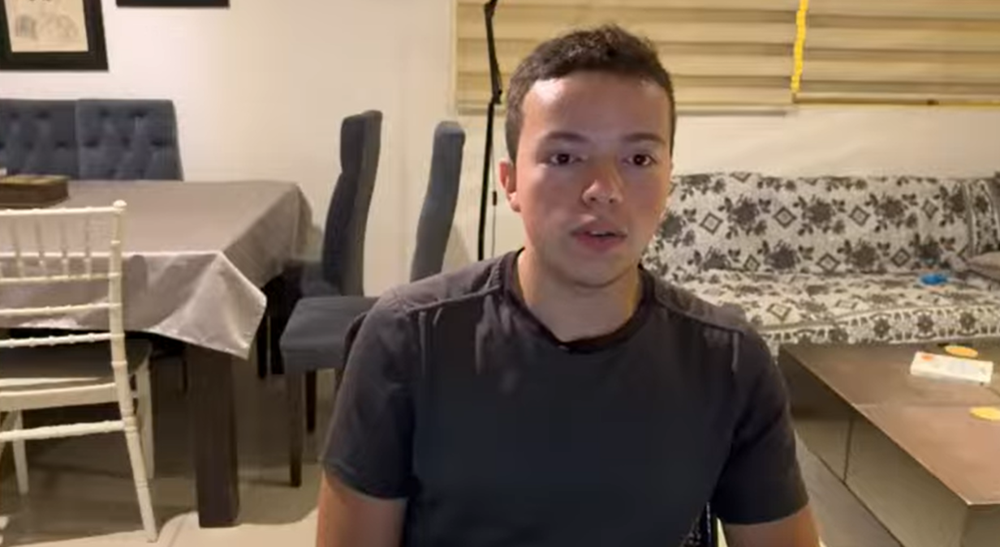
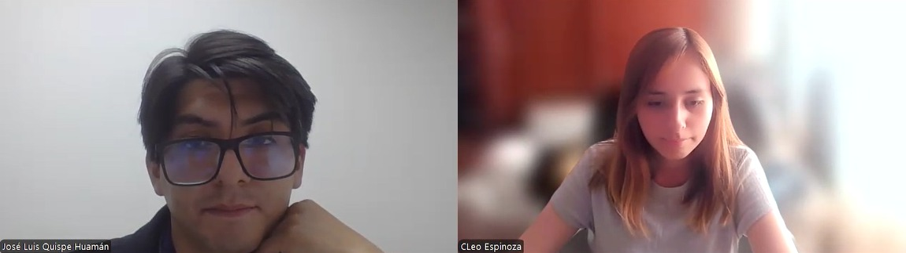
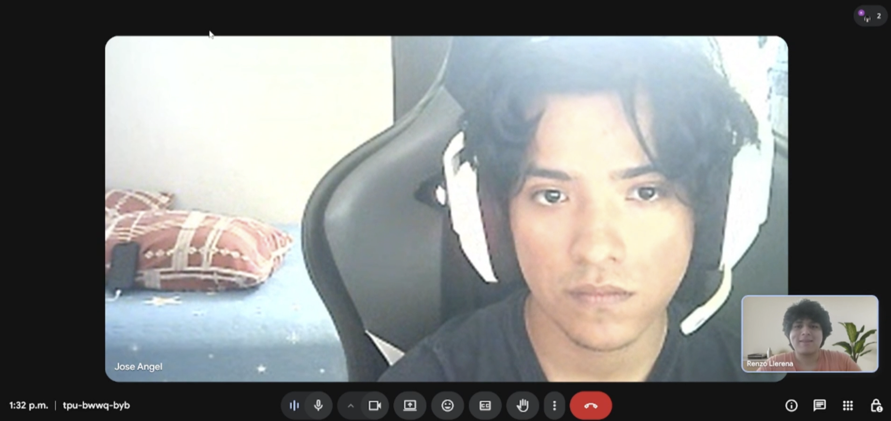
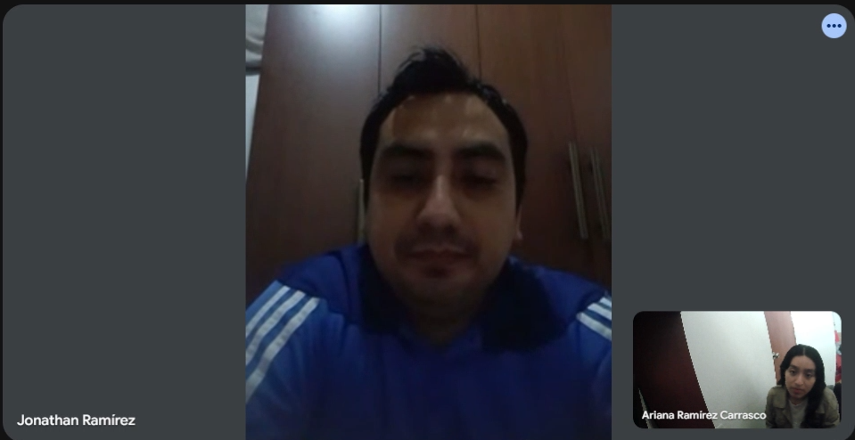
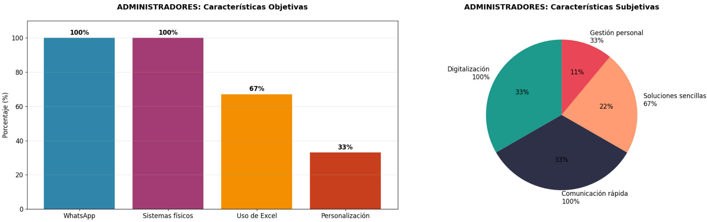
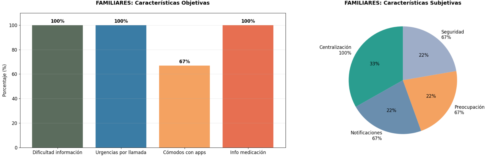
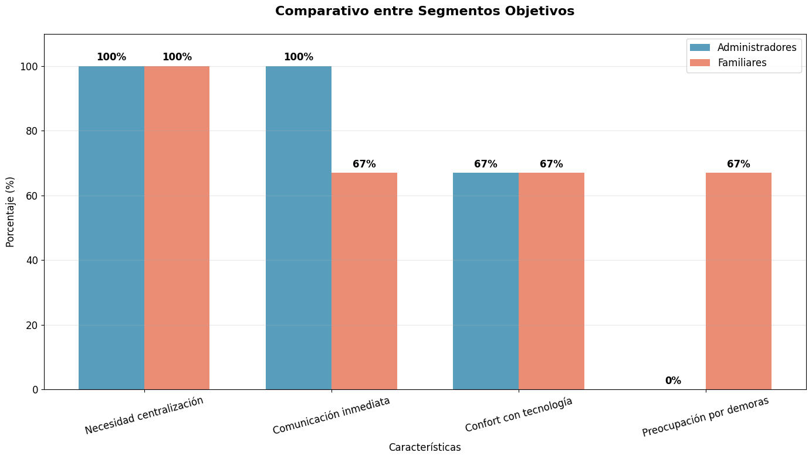
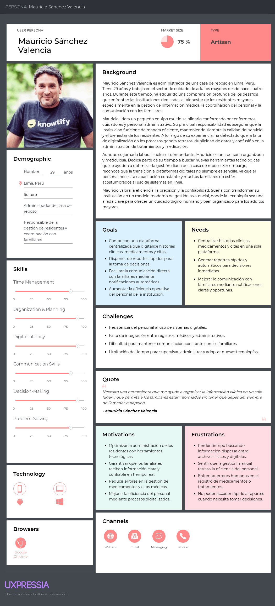
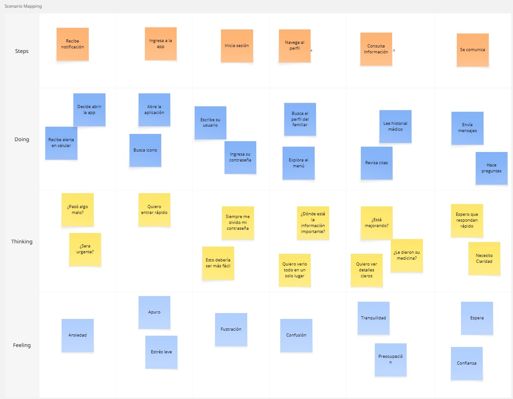
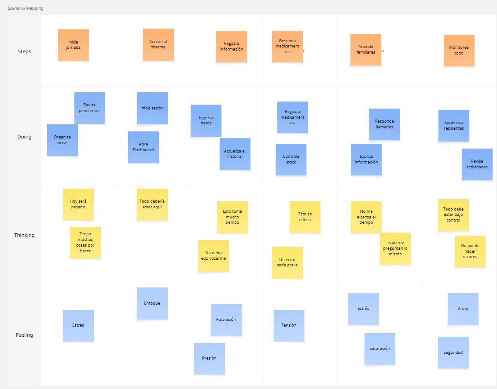

## 2.1. Competidores. 
La mejor forma de diseñar un producto útil es escuchando a quienes lo usarán día a día. En esta etapa de la investigación, dejamos de lado las suposiciones y buscamos evidencia real a través de entrevistas. Esto nos permite conectar con los "puntos de dolor" (pain points) de los administradores y cuidadores.

### 2.1.1. Análisis competitivo. 
Para lograr una recolección de información valiosa y estructurada, hemos diseñado guías de entrevista específicas para nuestros segmentos objetivo. El cuestionario busca explorar no solo datos demográficos, sino también la experiencia tecnológica del usuario y sus frustraciones actuales. A continuación, se presenta el diseño de preguntas para nuestros segmentos clave: administradores de casas de reposo y familiares de residentes.

<table border="1" cellpadding="4" cellspacing="0" 
style="margin:auto; font-size:11px; font-family:sans-serif; table-layout:fixed; width:100%; word-wrap:break-word;">
<tr>
<th colspan="6">Competitive Analysis Landscape</th>
</tr>

<tr>
<td colspan="2"><b>¿Por qué este análisis?</b></td>
<td colspan="4">
Comparar posicionamiento de Veyra en valor, marketing, producto y estrategia; identificar fortalezas, debilidades, oportunidades y amenazas frente a competidores.
</td>
</tr>

<tr>
<td colspan="2"><b>Competidores</b></td>
<td><b>Veyra</b></td>
<td><b>StoriiCare</b></td>
<td><b>SeniorSoft</b></td>
<td><b>CareCloud</b></td>
</tr>

<tr>
<td rowspan="2"><b>Perfil</b></td>
<td>Overview</td>
<td>Plataforma SaaS integral enfocada en la gestión de casas de reposo y conexión con familias en Perú y Latinoamérica.</td>
<td>Software SaaS global para residencias de adultos mayores, fundado en Reino Unido con presencia internacional.</td>
<td>Software de escritorio dirigido a grandes clínicas y residencias geriátricas.</td>
<td>Plataforma cloud para la gestión de salud general (EE.UU.) con EHR, facturación y portal de pacientes.</td>
</tr>

<tr>
<td>Ventaja competitiva</td>
<td>Especialización regional, modelo escalable, acceso familiar bidireccional y preparación para IoT.</td>
<td>Portal familiar avanzado con historias de vida y enfoque centrado en la persona.</td>
<td>Gestión operativa completa: historial clínico, facturación, inventario y camas.</td>
<td>Suite clínica y administrativa completa con integración de pagos.</td>
</tr>

<tr>
<td rowspan="2"><b>Marketing</b></td>
<td>Mercado objetivo</td>
<td>Casas de reposo medianas/pequeñas y familias en LATAM.</td>
<td>Residencias en UK, US, Australia y Canadá.</td>
<td>Grandes clínicas geriátricas.</td>
<td>Centros de salud en EE.UU.</td>
</tr>

<tr>
<td>Estrategias</td>
<td>Marketing digital, alianzas y precios flexibles.</td>
<td>Marketing de contenidos, redes sociales y testimonios.</td>
<td>Ventas directas institucionales.</td>
<td>Marketing especializado en salud.</td>
</tr>

<tr>
<td rowspan="3"><b>Producto</b></td>
<td>Servicios</td>
<td>Plataforma web y app móvil.</td>
<td>Web y app para familias.</td>
<td>Software de escritorio.</td>
<td>Suite CareCloud.</td>
</tr>

<tr>
<td>Precios</td>
<td>Modelo modular: gratuito, estándar y premium.</td>
<td>No transparentes.</td>
<td>No públicos.</td>
<td>Altos, bajo cotización.</td>
</tr>

<tr>
<td>Distribución</td>
<td>Web, móvil y API.</td>
<td>Web y móvil.</td>
<td>Instalación local.</td>
<td>Web y móvil.</td>
</tr>

<tr>
<td rowspan="4"><b>SWOT</b></td>
<td>Fortalezas</td>
<td>Especialización local y escalabilidad.</td>
<td>Experiencia de usuario familiar.</td>
<td>Gestión operativa sólida.</td>
<td>Producto robusto.</td>
</tr>

<tr>
<td>Debilidades</td>
<td>Marca nueva.</td>
<td>No adaptado a LATAM.</td>
<td>Tecnología obsoleta.</td>
<td>Costoso y complejo.</td>
</tr>

<tr>
<td>Oportunidades</td>
<td>Crecimiento del sector en LATAM.</td>
<td>Expansión global.</td>
<td>Migración a la nube.</td>
<td>Grandes cadenas.</td>
</tr>

<tr>
<td>Amenazas</td>
<td>Competidores globales.</td>
<td>Competencia local.</td>
<td>Soluciones cloud.</td>
<td>Opciones económicas.</td>
</tr>
</table>

### 2.1.2. Estrategias y tácticas frente a competidores

Una vez identificados los actores del mercado, el siguiente paso es definir cómo Veyra se abrirá paso entre ellos. No basta con conocer a la competencia; necesitamos un plan de acción que aproveche nuestras ventajas y blinde nuestras debilidades. Para lograrlo, utilizamos la Matriz CAME, una herramienta que nos permite "traducir" el análisis FODA previo en decisiones estratégicas reales.

A través de este análisis, establecemos tácticas ofensivas para explotar nuestra especialización en el mercado latinoamericano, y acciones de supervivencia para mitigar los riesgos de ser una marca nueva. Este enfoque nos asegura que cada funcionalidad de nuestro sistema tenga un propósito estratégico detrás.

**Estrategia FO (Ofensiva):**
- Priorizar el desarrollo de la aplicación web y móvil con funcionalidades centradas en comunicación en tiempo real, historial del residente y gestión administrativa.
- Implementar modelo freemium → premium para facilitar la adopción.
- Posicionarse como solución especializada en LATAM con enfoque en familias y residencias.

**Estrategia FA (Defensiva):**
- Reforzar seguridad y protección de datos.
- Ofrecer soporte local y SLA competitivo.
- Incluir funcionalidades offline o de baja conectividad en la app.

**Estrategia DO (Reorientación):**
- Validación rápida con usuarios reales mediante prototipos web/móvil.
- Desarrollo de APIs para integración con sistemas existentes.
- Generación de contenido técnico y casos de éxito.

**Estrategia DA (Supervivencia):**
- Infraestructura robusta (backups, alta disponibilidad).
- Precios competitivos para penetración de mercado.
- Certificaciones y auditorías para generar confianza.

## 2.2. Entrevistas. 

Para que Veyra pase de ser una idea a una solución útil, necesitamos salir de la oficina y validar nuestras hipótesis con las personas que viven el día a día del cuidado geriátrico. La recolección de información mediante entrevistas directas nos permite entender no solo qué funciones necesitan los usuarios, sino cómo se sienten y qué problemas reales enfrentan.

En esta sección, dejamos de lado las suposiciones para escuchar la voz de los administradores y familiares, asegurando que nuestra propuesta tecnológica sea intuitiva y genere un impacto positivo en su rutina.

### 2.2.1. Diseño de entrevistas. 
Para que las conversaciones sean productivas y comparables, hemos estructurado guías de entrevista específicas para cada segmento. El objetivo no es solo obtener datos demográficos, sino identificar "puntos de dolor" críticos, como la fragmentación de la información clínica o la ansiedad de los familiares por la falta de comunicación. A continuación, presentamos los cuestionarios diseñados para Administradores y Familiares:
#### Segmento objetivo: Administrador de casa de reposo

#### Preguntas Personales:

¿Cuál es su nombre?

¿Cuál es su edad?

¿Qué marca de celular usa?

¿Cuál es su rol dentro de la casa de reposo?

¿Cuántos años de experiencia tiene en el sector de casas de reposo?

#### Preguntas específicas:

¿Cómo se comunican actualmente con los familiares para informarles sobre el estado de salud, citas médicas o incidencias?

¿Qué tipo de dispositivo (PC, laptop, tablet, teléfono, sistema interno, apps) utiliza para realizar sus actividades administrativas diarias?

¿Que navegador web utiliza con más frecuencia?

¿Cuáles son los mayores desafíos o inconvenientes que enfrentan en la gestión diaria de la información y el cuidado de los residentes?

¿Qué sistema o método utilizan actualmente para gestionar la información de los residentes (historias clínicas, medicamentos, citas, alertas)?

¿Qué funcionalidades consideran esenciales en una plataforma de gestión para mejorar sus operaciones?

¿Qué procesos considera más urgentes de digitalizar o automatizar dentro de la casa de reposo?

#### Segmento objetivo: Familiares de adultos mayores

#### Preguntas Personales:

¿Cuál es su nombre?

¿Cuál es su edad?

¿Qué marca de celular usa?

¿Usa computadora de escritorio o laptop?

¿Cuál es su relación con el adulto mayor que reside en la casa de reposo?

¿Cuál es su ocupación?

¿Dónde reside actualmente?

#### Preguntas específicas :

¿Qué dificultades ha tenido para acceder a información sobre la salud o atención de su familiar?

¿Qué tipo de información le gustaría poder consultar de manera más frecuente y organizada?

¿Qué tan cómodo se sentiría utilizando plataformas web o aplicaciones móviles para consultar información médica sobre su adulto mayor?

Cuando ocurre una urgencia médica, ¿cómo suele enterarse y cuánto tiempo demora en recibir la notificación?

¿Qué aspectos le generarían más confianza al usar una plataforma de este tipo?

¿Qué tipo de dispositivo utiliza con más frecuencia para comunicarse con la casa de reposo o revisar información (celular, laptop, tablet, PC)?

¿Por qué medio prefiere recibir notificaciones importantes? (WhatsApp, SMS, llamada, correo, app)

### 2.2.2. Registro de entrevistas. 

**Segmento 1: Administrador de casas de reposo**

**Entrevista 1**

| Campo                             | Información |
|----------------------------------|-------------|
| Entrevista                       | #1 |
| Nombre                           | Jorge  |
| Apellidos                        | Santos |
| Edad                             | 21 años  |
| Distrito                         | Santiago de Surco |
| Evidencia                        |  |
| Link                             | [Link Entrevistas](https://youtu.be/LLKccTrdLM0) |
| Inicio de la entrevista          | 00:00 min |
| Duración de la entrevista        | 03:48 min |
| Resumen                          | **Perfil y Frustración:** Joven de perfil administrativo, optimizador y orientado a la eficiencia (rasgos influenciados por su ocupación como Coordinador de Gestión y Procesos Administrativos en una casa de reposo). Su principal frustración es la fragmentación de la información (dependencia del papel y archivos separados) y la lentitud que esto genera para encontrar historiales médicos completos o listas de medicamentos ante una emergencia.  **Comportamiento y Necesidades:** Desea tener un tablero de control centralizado y contar con alertas automáticas en tiempo real para la toma de medicamentos. Valora la reducción del margen de error mediante la digitalización y exige que las historias clínicas sean accesibles de forma segura desde cualquier dispositivo, buscando reducir el trabajo manual para dedicar más tiempo de calidad a los residentes.  **Tecnología, Marcas y Canales:** Es un usuario digital versátil. Su ecosistema de hardware principal se basa en una laptop para tareas pesadas de oficina y un smartphone marca OPPO para movilidad y consultas rápidas. A nivel de software e influencias de marca, prefiere Google Chrome por su excelente sincronización con sus herramientas de trabajo. Actualmente utiliza llamadas telefónicas y grupos de WhatsApp, pero requiere un módulo de comunicación directa integrado que elimine la informalidad y permita mantener un historial de comunicación claro con los familiares. | |

**Entrevista 2**

| Campo                             | Detalle |
|----------------------------------|---------|
| **Nombre**                       | Jose Luis |
| **Apellidos**                    | Quispe Huamam  |
| **Edad**                         | 29 años |
| **Distrito**                     | Chorrillos |
| **Evidencia**                    |  |
| **Link**                         | |
| **Inicio de la entrevista**      | 03:49 min |
| **Duración**                     | 05:04 min |
| **Resumen**                      | **Perfil y Frustración**: Administrador de casa de reposo con enfoque organizativo, operativo y orientado a mejorar la eficiencia en la atención de los residentes. Su principal frustración es que la información se encuentra dispersa entre fichas físicas, archivos Excel, cuadernos y mensajes de WhatsApp, lo que genera demoras, confusión y riesgo de errores al momento de consultar datos importantes como historiales médicos, medicamentos, citas o incidencias.  **Comportamiento y Necesidades**: Busca contar con una plataforma digital que centralice la información de los residentes y permita acceder rápidamente a datos actualizados. Necesita funciones como registro de residentes, historial médico, control de medicamentos, alertas de citas médicas, registro de incidencias y reportes diarios. Valora especialmente la automatización de procesos críticos para reducir el trabajo manual y mejorar la coordinación entre administrador, cuidadores, enfermeros y familiares.  **Tecnología, Marcas y Canales**: Utiliza principalmente una laptop para actividades administrativas y un celular Samsung para comunicación rápida y coordinación diaria. Su navegador más usado es Google Chrome. Actualmente se comunica con los familiares mediante WhatsApp y llamadas telefónicas, pero considera necesario contar con un canal más formal e integrado que permita enviar reportes, alertas e incidencias de manera ordenada y segura. |

**Segmento 2: Familiares de adultos mayores**

**Entrevista 1**

| Campo                             | Información                                                                                                                                                                                                                                                                                                                                                                                                                                                                                                                                                                                                                                                                                                                                                                                                                                                                                                                                                                                                                                                                                 |
|----------------------------------|---------------------------------------------------------------------------------------------------------------------------------------------------------------------------------------------------------------------------------------------------------------------------------------------------------------------------------------------------------------------------------------------------------------------------------------------------------------------------------------------------------------------------------------------------------------------------------------------------------------------------------------------------------------------------------------------------------------------------------------------------------------------------------------------------------------------------------------------------------------------------------------------------------------------------------------------------------------------------------------------------------------------------------------------------------------------------------------------|
| Entrevista                       | #1                                                                                                                                                                                                                                                                                                                                                                                                                                                                                                                                                                                                                                                                                                                                                                                                                                                                                                                                                                                                                                                                                          |
| Nombre                           | José Carlos                                                                                                                                                                                                                                                                                                                                                                                                                                                                                                                                                                                                                                                                                                                                                                                                                                                                                                                                                                                                                                                                                 |
| Apellidos                        | Vargas Enríquez                                                                                                                                                                                                                                                                                                                                                                                                                                                                                                                                                                                                                                                                                                                                                                                                                                                                                                                                                                                                                                                                             |
| Edad                             | 25 años                                                                                                                                                                                                                                                                                                                                                                                                                                                                                                                                                                                                                                                                                                                                                                                                                                                                                                                                                                                                                                                                                     |
| Distrito                         | Chorrillos                                                                                                                                                                                                                                                                                                                                                                                                                                                                                                                                                                                                                                                                                                                                                                                                                                                                                                                                                                                                                                                                                  |
| Evidencia                        |                                                                                                                                                                                                                                                                                                                                                                                                                                                                                                                                                                                                                                                                                                                                                                                                                                                                                                                                                                                                                            |
| Link                             | [Link Entrevistas](https://shorturl.at/vQBoO)                                                                                                                                                                                                                                                                                                                                                                                                                                                                                                                                                                                                                                                                                                                                                                                                                                                                                                                                                                                                                                               |
| Inicio de la entrevista          | 13:32 min                                                                                                                                                                                                                                                                                                                                                                                                                                                                                                                                                                                                                                                                                                                                                                                                                                                                                                                                                                                                                                                                                   |
| Duración de la entrevista        | 03:32 min                                                                                                                                                                                                                                                                                                                                                                                                                                                                                                                                                                                                                                                                                                                                                                                                                                                                                                                                                                                                                                                                                   |
| Resumen                          | Joven de perfil analítico, protector y orientado a la eficiencia (rasgos influenciados por su ocupación como Ingeniero de Software en el sector bancario). Su principal frustración es la incertidumbre y la falta de inmediatez en la comunicación tradicional (llamadas) con la casa de reposo de su abuelo.  **Comportamiento y Necesidades:** Desea tener control y visibilidad sobre el estado de salud, medicaciones y reportes médicos semanales. Valora la rapidez y exige que la información médica tenga un respaldo profesional constante para sentir confianza.  **Tecnología, Marcas y Canales:** Es un usuario altamente digital. Su ecosistema de hardware principal se basa en PC de escritorio y smartphone. A nivel de software e influencias de marca, prefiere navegadores orientados a la privacidad y rendimiento (Brave, Chrome) y exige que los canales de interacción para urgencias sean directos y de uso diario, eligiendo WhatsApp o notificaciones push de una App nativa por encima de medios tradicionales como el SMS o el correo electrónico. |

**Entrevista 2**

| Campo                             | Detalle |
|----------------------------------|---------|
| **Nombre**                       | Leo Gerardo |
| **Apellidos**                    | Gómez Ferrua |
| **Edad**                         | 30 años |
| **Distrito**                     | Chorrillos |
| **Evidencia**                    |  |
| **Link**                         | https://shorturl.at/uoNBn |
| **Inicio de la entrevista**      | 14:47 min |
| **Duración**                     | 05:41 min |
| **Resumen**                      | Leo Gómez, de 30 años, es el responsable del cuidado de su abuela. Durante la entrevista, se describió como una persona analítica, racional y metódica, con alta afinidad por la tecnología. Expresó que la comunicación con el centro geriátrico resulta ineficiente, ya que debe realizar varias llamadas para obtener información que suele llegar incompleta o dispersa.    Indicó que utiliza de manera regular un smartphone, una laptop y una tablet, tanto para su trabajo como para el seguimiento del estado de su familiar. Señaló que sus navegadores principales son Google Chrome y Safari, y que está familiarizado con herramientas digitales como Google Drive, Zoom y Gmail, las cuales usa a diario.    Manifestó que su principal frustración es la falta de reportes médicos completos y oportunos. Expresó que desea acceder a información detallada sobre medicación, chequeos médicos, alimentación y actividades recreativas, dentro de una plataforma segura. También afirmó que le gustaría recibir notificaciones inmediatas en caso de cambios en el estado de salud o situaciones de emergencia.    Finalmente, indicó que confiaría plenamente en un sistema siempre que garantice seguridad, acceso restringido y comunicación directa con el personal. Representa al segmento de familiares jóvenes y con alta alfabetización digital, que demandan transparencia y actualización constante de la información. |

### 2.2.3. Análisis de entrevistas. 

En esta sección se presenta el análisis detallado de la información recolectada. Para cada segmento, se explican primero los hallazgos estadísticos objetivos y subjetivos, seguidos de la evidencia gráfica correspondiente.

#### Segmento 1: Administradores de Casas de Reposo

**Análisis de Características Objetivas y Subjetivas:**

El análisis revela una digitalización precaria. Como se detalla en el gráfico a continuación, el **100%** de los administradores utiliza **WhatsApp** como canal principal y el **100%** gestiona la información clínica en **sistemas físicos** (papel). Si bien un **67%** se apoya en **Excel**, la falta de integración es crítica.
A nivel subjetivo, el **100%** valora la **comunicación rápida** y la **digitalización**. Sin embargo, existe una restricción clara: el **67%** demanda **soluciones sencillas**, rechazando herramientas complejas, y un **33%** aún prioriza la gestión personal directa.

#### Segmento 2: Familiares de Adultos Mayores

**Análisis de Características Objetivas y Subjetivas:**

Los datos confirman una experiencia actual deficiente. El **100%** reporta **dificultad para acceder a información** y el **100%** indica que se enteran de las **urgencias mediante llamadas**, lo cual consideran tardío e ineficiente. Un **100%** manifiesta la necesidad de ver la **info de medicación**.
Subjetivamente, el dolor principal es la incertidumbre: el **67%** siente **preocupación por demoras**, por lo que el **100%** solicita la **centralización** de datos. Afortunadamente, el **67%** se siente **cómodo usando apps**, validando la viabilidad de una solución móvil.

#### Análisis Comparativo

**Contrastación de Segmentos:**

Al comparar ambos grupos, encontramos coincidencias vitales para el producto: ambos tienen un **100% de necesidad de centralización** de información. Sin embargo, existe una brecha notable en la percepción de "preocupación": mientras los administradores priorizan la operatividad (0% de preocupación personal por demoras), para el **67%** de los familiares es una fuente de ansiedad crítica. Esto define nuestra propuesta de valor: eficiencia para el administrador y tranquilidad para el familiar.

### Conclusiones y Definición de Arquetipos

Basado en el análisis estadístico, se definen los siguientes perfiles para los User Personas:

1.  **User Persona Administrador ("El Gestor Operativo"):**
    * **Rasgo clave:** Busca eficiencia, pero teme a la tecnología compleja.
    * **Sustento:** El 67% exige "soluciones sencillas" y el 100% ya usa WhatsApp. La solución debe tener una curva de aprendizaje mínima.
2.  **User Persona Familiar ("El Monitor Preocupado"):**
    * **Rasgo clave:** Necesita control y transparencia para reducir ansiedad.
    * **Sustento:** El 100% pide información de medicación y el 67% sufre por la demora en noticias. La solución debe centrarse en notificaciones en tiempo real.

## 2.3. Needfinding. 

### 2.3.1. User Personas. 

A partir del análisis de entrevistas y la recolección de información sobre las dinámicas en casas de reposo, se identificaron los principales perfiles de usuarios que interactúan directamente con la solución Veyra. Estos perfiles representan los segmentos clave para el sistema, ya que concentran tanto la necesidad de gestión operativa como la necesidad de acceso confiable a información médica en tiempo real. La construcción de los *User Persona* permite al equipo de desarrollo comprender mejor sus motivaciones, frustraciones y hábitos, lo que resulta esencial para diseñar funcionalidades adecuadas y experiencias de usuario efectivas.

**1) Segmento 1: Administradores de casas de reposo**

Para los administradores se elaboró el User Persona **Mauricio Sánchez Valencia**. Se consideraron factores como su edad, rol en la gestión de una casa de reposo, experiencia en la administración del cuidado de adultos mayores y su necesidad de optimizar procesos de comunicación y gestión de la información. Sus principales frustraciones giran en torno a la falta de un sistema centralizado para el control de historias clínicas, medicamentos y citas médicas, lo que genera demoras en la comunicación con familiares y dificultades en el seguimiento de residentes. Asimismo, se tomó en cuenta su familiaridad con herramientas digitales básicas y la necesidad de contar con una plataforma moderna, intuitiva y segura que le permita centralizar toda la información de manera ágil y confiable.

**2) Segmento 2: Familiares de adultos mayores**

Para los familiares se elaboró el User Persona **Carmen Morales Quispe**. Se consideraron aspectos como su edad, ocupación y su rol como familiar de un adulto mayor residente en una casa de reposo. Sus principales motivaciones están orientadas a mantenerse informada en tiempo real sobre el estado de salud, el tratamiento y la administración de medicamentos de su familiar, incluso mientras desarrolla sus actividades laborales. Entre sus frustraciones se encuentra la falta de información clara, la demora en las notificaciones sobre urgencias y la necesidad de depender de llamadas o visitas presenciales. Su perfil refleja una predisposición positiva hacia el uso de soluciones digitales, siempre que estas sean rápidas, confiables y fáciles de utilizar.

### 2.3.2. User Task Matrix. 

El User Task Matrix presenta las tareas que realizan los User Persona para cumplir sus objetivos en su día a día, independientemente de si usan nuestro software o no. Se evalúa la frecuencia y la importancia de cada tarea para identificar dónde aportar valor.

| Tarea (Task)                                   | Administrador (Mauricio) |                 | Familiar (Carmen) |                 |
|------------------------------------------------|--------------------------|-----------------|-------------------|-----------------|
|                                                | **Frecuencia**           | **Importancia** | **Frecuencia**    | **Importancia** |
| Mantener actualizado el registro de residentes | Often                    | High            | Rarely            | Low             |
| Planificar citas médicas y terapias            | Often                    | High            | Occasionally      | Medium          |
| Comunicar incidencias o urgencias a la familia | Occasionally             | High            | Rarely            | High            |
| Supervisar el cumplimiento de la medicación    | Often                    | High            | Often             | High            |
| Consultar el estado de salud y evolución       | Often                    | Medium          | Often             | High            |
| Coordinar turnos del personal de cuidado       | Often                    | Medium          | Rarely            | Low             |
| Realizar pagos o cobros de mensualidad         | Monthly                  | High            | Monthly           | High            |

**Análisis del Task Matrix:**

Se observa que la tarea **"Supervisar cumplimiento de medicación"** y **"Consultar estado de salud"** tienen una Importancia **High** y Frecuencia **Often** para ambos segmentos (el administrador para controlar, el familiar para saber). Esto confirma que estas tareas son el "Core" del negocio y deben ser priorizadas. Además, la tarea crítica de **"Comunicar incidencias"** es de alta importancia para ambos, validando la necesidad de un sistema de alertas.

### 2.3.3. User Journey Mapping. 

**Segmento 1 – Administrador de casa de reposo (Mauricio Sánchez Valencia)**

El User Journey Mapping de Mauricio representa el recorrido actual que experimenta como administrador de una casa de reposo, en la gestión diaria de información médica, coordinación con el personal y comunicación con familiares de los residentes.
El mapa ilustra el proceso end-to-end, desde la recolección de datos de los pacientes hasta la generación de reportes y la respuesta a consultas externas.

En la situación **As-Is**, Mauricio enfrenta un flujo de trabajo manual y fragmentado: revisa documentos físicos, consolida información en hojas de cálculo y mantiene la comunicación por canales informales como llamadas o mensajes.
Esto genera demoras, sobrecarga de tareas y posibles errores en la actualización de datos.

El Journey busca evidenciar los puntos críticos de su experiencia actual, identificando las emociones, tareas, fricciones y oportunidades de mejora a lo largo de cada etapa (Awareness, Data Collection, Daily Management, Communication, Reporting y Decision-Making).
Este análisis servirá como base para diseñar una solución tecnológica que automatice procesos, mejore la eficiencia y facilite la interacción entre administración, personal y familiares.

**Segmento 2 – Familiar de adulto mayor (Carmen Morales Quispe)**

El User Journey Mapping de Carmen describe la experiencia completa que vive como familiar de un adulto mayor residente en la casa de reposo, desde el momento en que busca información sobre su ser querido hasta que recibe actualizaciones sobre su estado de salud.
El mapa detalla las etapas de su recorrido end-to-end, reflejando las acciones, pensamientos, emociones y frustraciones que enfrenta actualmente sin contar con una plataforma digital centralizada.

En la situación **As-Is**, Carmen depende de medios tradicionales como llamadas telefónicas, correos o mensajes de WhatsApp para comunicarse con el personal del centro.
Esto provoca demoras, pérdida de información y una sensación constante de incertidumbre sobre el bienestar de su familiar.

El Journey permite comprender su perspectiva emocional y sus puntos de dolor, mostrando los momentos clave en los que necesita información rápida, confiable y accesible.
Este análisis busca sentar las bases para una futura solución tecnológica que le brinde tranquilidad, transparencia y confianza, fortaleciendo su vínculo con el centro y con el cuidado de su familiar.

### 2.3.4. Empathy Mapping. 

Para la elaboración de los *Empathy Maps*, el equipo partió del conocimiento y observaciones recolectadas durante el análisis de los User Persona. Se colocó al centro de cada mapa al usuario correspondiente (Mauricio Sánchez Valencia y Carmen Morales Quispe) y se respondieron las preguntas claves sobre su entorno, emociones, comportamientos y necesidades.

**Segmento 1: Administradores de casas de reposo**

En este mapa se analizó a Mauricio Sánchez Valencia, un administrador joven con la responsabilidad de garantizar la calidad del servicio en una casa de reposo. Se identificó que piensa constantemente en la necesidad de organizar y centralizar la información médica y operativa de los residentes, ya que le preocupa que los procesos manuales generen errores y retrasos. Escucha las quejas de familiares por falta de comunicación oportuna y observa cómo sus colegas deben invertir tiempo en tareas repetitivas en lugar de enfocarse en el bienestar de los residentes. Mauricio expresa la necesidad de contar con una solución moderna que mejore la gestión y actúa implementando estrategias de control básicas con las herramientas disponibles, aunque estas son limitadas. Su dolor principal es la sobrecarga administrativa y la falta de un sistema ágil, mientras que su ganancia esperada es lograr eficiencia en la gestión, confianza de los familiares y un mejor control de la información.

**Segmento 2: Familiares de adultos mayores**

En este mapa se analizó a Carmen Morales Quispe, una comerciante que busca mantenerse informada sobre el estado de salud de su familiar mientras desarrolla sus actividades diarias. Ella piensa en la tranquilidad que le daría tener acceso rápido y claro a la evolución médica, medicación y tratamientos de su ser querido. Escucha a otros familiares compartir la frustración por la falta de información y observa que depender de llamadas o visitas no siempre es suficiente. Carmen suele expresar la necesidad de contar con una aplicación confiable y fácil de usar, y actúa buscando cualquier canal de comunicación disponible para mantenerse al tanto. Su dolor principal es la incertidumbre y la demora en recibir notificaciones sobre emergencias, mientras que su ganancia esperada es tener confianza, tranquilidad y control al poder consultar la información médica en tiempo real desde cualquier lugar.

### 2.3.5. As-is Scenario Mapping. 

Actualmente, los familiares obtienen información sobre sus seres queridos a través de llamadas, mensajes o visitas, lo que genera una comunicación fragmentada y no inmediata. La ausencia de una plataforma centralizada impide el acceso en tiempo real a datos relevantes como estado de salud, actividades o tratamientos. Esta dependencia del personal provoca retrasos, información incompleta y altos niveles de ansiedad, evidenciando la necesidad de un sistema más transparente y accesible.

En la actualidad, los administradores gestionan la información mediante registros manuales, hojas de cálculo y sistemas no integrados, lo que dificulta la organización y actualización de datos críticos. Además, la comunicación con familiares se realiza de forma individual y manual, generando una alta carga operativa y riesgo de errores. Esta situación limita la eficiencia del personal y resalta la necesidad de una solución tecnológica que centralice procesos y optimice la gestión.

## 2.4. Ubiquitous Language. 

In this project, whose main objective is to improve transparency and efficiency in elderly care within nursing homes through a web platform,
the following **ubiquitous language** has been defined to ensure clarity and consistency among users, developers, and stakeholders:

| Term                   | Definition                                                                                                                         |
|------------------------|------------------------------------------------------------------------------------------------------------------------------------|
| Resident               | Elderly person living in a nursing home whose clinical care, activities, and well-being are managed on the platform.               |
| Family Member          | Authorized user who accesses the resident's information, receives notifications, and participates in the supervision of care.      |
| Administrator          | Responsible for the overall management of the nursing home; manages residents, staff, subscription plans, and reports.             |
| Care Staff             | Doctors, nurses, or caregivers who record health data, treatments, appointments, and observations in the platform.                 |
| Digital Medical Record | Centralized record with the resident's medical information (diagnoses, allergies, medications, check-ups, notes).                  |
| Treatment              | Prescribed medical plan that may include medications, therapies, and periodic appointments.                                        |
| Medical Schedule       | Set of appointments, reminders, and scheduled activities for the resident; accessible to staff and family members.                 |
| Medical Alert          | Automatic notification generated by the system (e.g., medication reminder, emergency, upcoming appointment).                       |
| Clinical Report        | Digital document automatically generated with consolidated information on the resident's care and progress.                        |
| Notification           | Message sent to family members or staff about relevant events (medication, visits, clinical changes).                              |
| Control Panel          | Main view for administrators and staff, showing metrics, reports, and the overall status of residents.                             |
| Subscription Plan      | Access modality to the platform (Individual, Standard, Premium) that defines available functionalities depending on the residence. |
| Session                | Authenticated period in which a user (administrator, family member, or staff) accesses the system with secure credentials.         |
| Family Dashboard       | Simplified interface for family members, where they can check health status, appointments, and relevant notifications.             |
| Roles and Permissions  | Validations that ensure each profile (administrator, staff, family) only accesses the operations they are authorized for.          |

**Expected benefits of the ubiquitous language:**

- Facilitates communication among developers, users, and system administrators.
- Improves understanding of the system's main functionalities.
- Avoids ambiguities and interpretation errors in design and implementation.
- Ensures consistency in documentation, interfaces, and project processes.