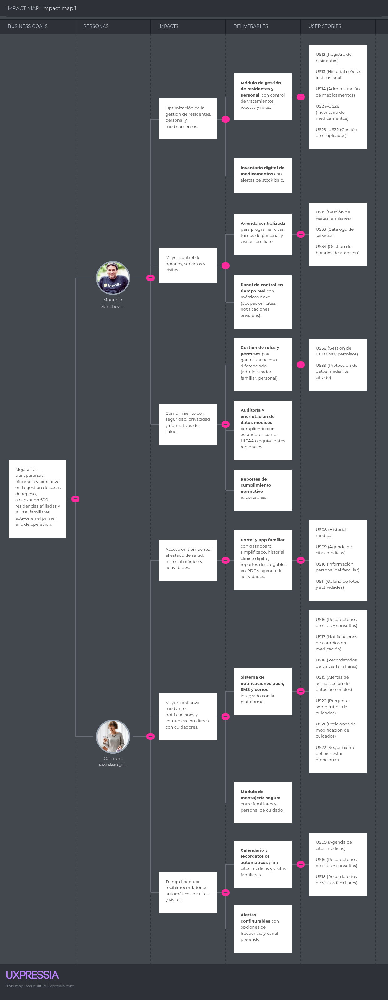

## 3.1. User Stories. 

Para la especificación de requisitos de los usuarios, se desarrollaron las historias de usuario que describen cada requisito y funcionalidad que debe estar implementado en el desarrollo del producto final para satisfacer las necesidades del público objetivo. A continuación se presentan las historias de usuario relacionadas con la plataforma "Veyra". Esta sección reúne historias de usuario centradas en la experiencia de los distintos roles: el visitante, el familiar del adulto mayor y el administrador de la casa de reposo. Aquí se definen las necesidades clave para cada uno, desde la navegación inicial y contacto, hasta la gestión detallada de residentes, personal y medicamentos.

**Tabla de Epics**

<table class="epics">
<thead><tr><th>Epic ID</th><th>Título</th><th>Descripción</th></tr></thead>
<tbody>
<tr>
<td>EP01</td>
<td>Navegación en la Landing Page</td>
<td>Como visitante quiero tener una experiencia fluida y completa en el sitio web para conocer los servicios y tomar decisiones informadas.</td>
</tr>
<tr>
<td>EP02</td>
<td>Soporte y contacto</td>
<td>Como visitante de la Landing Page, quiero poder contactar a Veyra fácilmente, para resolver dudas o interactuar.</td>
</tr>
<tr>
<td>EP03</td>
<td>Acceso a Información</td>
<td>Como familiar del adulto mayor quiero poder tener acceso a toda la información de mi familiar para estar informado de su estado.</td>
</tr>
<tr>
<td>EP04</td>
<td>Gestión de adultos mayores</td>
<td>Como administrador de casa de reposo quiero gestionar perfiles de los adultos mayores para tener un mayor control.</td>
</tr>
<tr>
<td>EP05</td>
<td>Notificaciones automáticas</td>
<td>Como familiar de un adulto mayor, quiero recibir notificaciones automáticas sobre cambios en su estado o recordatorios importantes, para estar siempre informado sin tener que consultar manualmente la plataforma.</td>
</tr>
<tr>
<td>EP06</td>
<td>Comunicación con cuidadores</td>
<td>Como familiar, quiero disponer de un canal de comunicación directo con los cuidadores o el personal de la casa de reposo, para hacer preguntas y recibir respuestas rápidas sobre el cuidado de mi adulto mayor.</td>
</tr>
<tr>
<td>EP07</td>
<td>Gestión de medicamentos</td>
<td>Como administrador quiero gestionar los medicamentos de la casa de reposo para garantizar que cumplan con todos los controles necesarios.</td>
</tr>
<tr>
<td>EP08</td>
<td>Gestión de personal</td>
<td>Como administrador de la casa de reposo, quiero gestionar la información del personal para organizar los turnos de trabajo de los cuidadores y garantizar que siempre haya atención adecuada disponible para los residentes.</td>
</tr>
<tr>
<td>EP09</td>
<td>Gestión de información de la casa de reposo</td>
<td>Como administrador quiero gestionar la información general de la casa de reposo para mantener datos actualizados sobre la institución.</td>
</tr>
<tr>
<td>EP10</td>
<td>Seguridad y privacidad</td>
<td>Como administrador, quiero garantizar la seguridad y privacidad de los datos personales y médicos para proteger la información sensible de los residentes y familiares, cumpliendo con las normativas correspondientes.</td>
</tr>
<tr>
<td>EP11</td>
<td>Diseño de interfaz</td>
<td>Como usuario, quiero una interfaz bien diseñada para navegar y usar el sistema sin dificultades.</td>
</tr>
<tr>
<td>EP12</td>
<td>Gestión de Actividades</td>
<td>Como administrador de la casa de reposo, quiero planificar, publicar y gestionar actividades (recreativas, médicas, sociales) para residentes, con inscripción y control de aforo, para mejorar adherencia y bienestar.</td>
</tr>
<tr>
<td>EP13</td>
<td>Analítica y Estadísticas Operativas</td>
<td>Como administrador de la casa de reposo, quiero un panel con métricas clave (residentes, personal, inventario, ocupación, actividades) para tomar decisiones informadas y priorizar acciones.</td>
</tr>
<tr>
<td>EP14</td>
<td>Integraciones Externas</td>
<td>Como administrador de la casa de reposo, quiero que el sistema integre servicios externos (Google Maps, Stripe y SMS/TOTP) para validar direcciones, procesar pagos seguros y proteger el acceso con MFA, de modo que la operación sea confiable y trazable con auditoría y métricas unificadas.</td>
</tr>
<tr>
<td>EP15</td>
<td>Monitoreo IoT y Wearables</td>
<td>Como personal médico, quiero que el sistema procese la información de las bandas médicas y la compare con los registros de salud para detectar inestabilidades automáticamente.</td>
</tr>
</tbody></table>

**User Stories / Technical Stories**

<table class="story-card">
  <tr class="head">
    <th>Story ID</th>
    <th>User</th>
    <th>Priority</th>
    <th>Epic</th>
  </tr>
  <tr>
    <td>US01</td>
    <td>visitante de la Landing Page,</td>
    <td>Alta</td>
    <td>EP01 - Navegación en la Landing Page</td>
  </tr>
  <tr>
    <th class="label">Title</th>
    <td colspan="3" class="title-cell">Menú de navegación</td>
  </tr>
  <tr>
    <th colspan="4" class="label">Description</th>
  </tr>
  <tr>
    <td colspan="4" class="desc-cell">Como visitante de la Landing Page, quiero poder acceder a un menú de navegación en la parte superior de la página, para explorar fácilmente las secciones como &quot;Login&quot;, &quot;Sign up&quot;, &quot;Planes&quot;, &quot;Contacto&quot;,etc.</td>
  </tr>
  <tr>
    <th colspan="4" class="label">Acceptance Criteria</th>
  </tr>
  <tr>
    <td colspan="4" class="criteria-cell"><strong>Escenario 1: Navegación exitosa a través del menú</strong> 
<strong>Dado que</strong> el visitante está en la landing page 
<strong>Cuando</strong> el menú de navegación está disponible 
<strong>Entonces</strong> el usuario puede ver los enlaces principales y navegar a las secciones correspondientes.  
<strong>Escenario 2: Menú no disponible</strong> 
<strong>Dado que</strong> el visitante está en la landing page 
<strong>Cuando</strong> el menú de navegación no se carga correctamente 
<strong>Entonces</strong> el usuario recibe un mensaje de error y tiene opciones alternativas de navegación.</td>
  </tr>
</table>

<table class="story-card">
  <tr class="head">
    <th>Story ID</th>
    <th>User</th>
    <th>Priority</th>
    <th>Epic</th>
  </tr>
  <tr>
    <td>US02</td>
    <td>visitante de la Landing Page,</td>
    <td>Alta</td>
    <td>EP01 - Navegación en la Landing Page</td>
  </tr>
  <tr>
    <th class="label">Title</th>
    <td colspan="3" class="title-cell">Visualización de Planes</td>
  </tr>
  <tr>
    <th colspan="4" class="label">Description</th>
  </tr>
  <tr>
    <td colspan="4" class="desc-cell">Como visitante de la Landing Page, quiero ver los planes de suscripción junto a su precio y características, para poder elegir el que mejor se adapte a mis necesidades.</td>
  </tr>
  <tr>
    <th colspan="4" class="label">Acceptance Criteria</th>
  </tr>
  <tr>
    <td colspan="4" class="criteria-cell"><strong>Escenario 1: Visualización de planes disponibles</strong> 
<strong>Dado que</strong> el visitante navega a la sección de planes 
<strong>Cuando</strong> los planes están disponibles en el sistema 
<strong>Entonces</strong> el usuario puede ver la lista de planes con sus precios y características para compararlos.  
<strong>Escenario 2: Planes no disponibles</strong> 
<strong>Dado que</strong> el visitante navega a la sección de planes 
<strong>Cuando</strong> no hay planes disponibles o ocurre un error de carga 
<strong>Entonces</strong> el usuario recibe un mensaje informativo sobre la indisponibilidad.</td>
  </tr>
</table>

<table class="story-card">
  <tr class="head">
    <th>Story ID</th>
    <th>User</th>
    <th>Priority</th>
    <th>Epic</th>
  </tr>
  <tr>
    <td>US03</td>
    <td>visitante de la Landing Page,</td>
    <td>Media</td>
    <td>EP01 - Navegación en la Landing Page</td>
  </tr>
  <tr>
    <th class="label">Title</th>
    <td colspan="3" class="title-cell">Visualización de creadores</td>
  </tr>
  <tr>
    <th colspan="4" class="label">Description</th>
  </tr>
  <tr>
    <td colspan="4" class="desc-cell">Como visitante de la Landing Page, quiero ver a los creadores de la aplicación, para conocer al equipo detrás del producto y generar confianza en el servicio.</td>
  </tr>
  <tr>
    <th colspan="4" class="label">Acceptance Criteria</th>
  </tr>
  <tr>
    <td colspan="4" class="criteria-cell"><strong>Escenario 1: Acceso a información del equipo</strong> 
<strong>Dado que</strong> el visitante navega a la sección "Equipo" 
<strong>Cuando</strong> la información del equipo está disponible 
<strong>Entonces</strong> el usuario puede ver los detalles de los creadores incluyendo nombres, roles e información de contacto.  
<strong>Escenario 2: Información del equipo no disponible</strong> 
<strong>Dado que</strong> el visitante navega a la sección "Equipo" 
<strong>Cuando</strong> la información no está disponible 
<strong>Entonces</strong> el usuario recibe un mensaje informativo sobre la indisponibilidad temporal.</td>
  </tr>
</table>

<table class="story-card">
  <tr class="head">
    <th>Story ID</th>
    <th>User</th>
    <th>Priority</th>
    <th>Epic</th>
  </tr>
  <tr>
    <td>US05</td>
    <td>visitante de la Landing Page</td>
    <td>Media</td>
    <td>EP01 - Navegación en la Landing Page</td>
  </tr>
  <tr>
    <th class="label">Title</th>
    <td colspan="3" class="title-cell">Cambio de idioma</td>
  </tr>
  <tr>
    <th colspan="4" class="label">Description</th>
  </tr>
  <tr>
    <td colspan="4" class="desc-cell">Como visitante de la Landing Page quiero en el menú un botón para cambiar de idioma entre español e inglés para entender mejor de que trata Veyra.</td>
  </tr>
  <tr>
    <th colspan="4" class="label">Acceptance Criteria</th>
  </tr>
  <tr>
    <td colspan="4" class="criteria-cell"><strong>Escenario 1: Cambio exitoso de idioma</strong> 
<strong>Dado que</strong> el visitante selecciona un idioma disponible 
<strong>Cuando</strong> confirma el cambio de idioma 
<strong>Entonces</strong> la interfaz se actualiza al idioma seleccionado y mantiene la preferencia.  
<strong>Escenario 2: Idioma no disponible</strong> 
<strong>Dado que</strong> el visitante intenta cambiar a un idioma 
<strong>Cuando</strong> el idioma seleccionado no está disponible 
<strong>Entonces</strong> el sistema mantiene el idioma actual y muestra un mensaje informativo.</td>
  </tr>
</table>

<table class="story-card">
  <tr class="head">
    <th>Story ID</th>
    <th>User</th>
    <th>Priority</th>
    <th>Epic</th>
  </tr>
  <tr>
    <td>US06</td>
    <td>visitante de la landing page</td>
    <td>Baja</td>
    <td>EP01 - Navegación en la Landing Page</td>
  </tr>
  <tr>
    <th class="label">Title</th>
    <td colspan="3" class="title-cell">Términos y condiciones</td>
  </tr>
  <tr>
    <th colspan="4" class="label">Description</th>
  </tr>
  <tr>
    <td colspan="4" class="desc-cell">Como visitante de la landing page quiero poder acceder a los términos y condiciones de uso para conocer las políticas legales antes de contratar los servicios.</td>
  </tr>
  <tr>
    <th colspan="4" class="label">Acceptance Criteria</th>
  </tr>
  <tr>
    <td colspan="4" class="criteria-cell"><strong>Escenario 1: Acceso a términos y condiciones</strong> 
<strong>Dado que</strong> el visitante solicita ver los términos y condiciones 
<strong>Cuando</strong> el documento está disponible 
<strong>Entonces</strong> el usuario puede acceder al documento completo y actualizado.  
<strong>Escenario 2: Términos actualizados requieren aceptación</strong> 
<strong>Dado que</strong> existen términos y condiciones actualizados 
<strong>Cuando</strong> un usuario existente accede al sistema 
<strong>Entonces</strong> el sistema requiere la revisión y aceptación de los nuevos términos antes de continuar.</td>
  </tr>
</table>

<table class="story-card">
  <tr class="head">
    <th>Story ID</th>
    <th>User</th>
    <th>Priority</th>
    <th>Epic</th>
  </tr>
  <tr>
    <td>US04</td>
    <td>visitante de la landing page</td>
    <td>Media</td>
    <td>EP02 - Soporte y contacto</td>
  </tr>
  <tr>
    <th class="label">Title</th>
    <td colspan="3" class="title-cell">Redes sociales</td>
  </tr>
  <tr>
    <th colspan="4" class="label">Description</th>
  </tr>
  <tr>
    <td colspan="4" class="desc-cell">Como visitante de la landing page quiero poder acceder fácilmente a sus redes sociales de Veyra para conocer más sobre la empresa y tener canales adicionales de contacto.</td>
  </tr>
  <tr>
    <th colspan="4" class="label">Acceptance Criteria</th>
  </tr>
  <tr>
    <td colspan="4" class="criteria-cell"><strong>Escenario 1: Acceso a redes sociales</strong> 
<strong>Dado que</strong> el visitante busca los enlaces de redes sociales 
<strong>Cuando</strong> los enlaces están disponibles 
<strong>Entonces</strong> el usuario puede acceder a las páginas oficiales de las redes sociales.  
<strong>Escenario 2: Enlaces no funcionales</strong> 
<strong>Dado que</strong> el visitante intenta acceder a una red social 
<strong>Cuando</strong> el enlace no está funcionando 
<strong>Entonces</strong> el usuario recibe un mensaje informativo sobre el problema.</td>
  </tr>
</table>

<table class="story-card">
  <tr class="head">
    <th>Story ID</th>
    <th>User</th>
    <th>Priority</th>
    <th>Epic</th>
  </tr>
  <tr>
    <td>US07</td>
    <td>administrador de casa de reposo</td>
    <td>Alta</td>
    <td>EP04 - Gestión de adultos mayores</td>
  </tr>
  <tr>
    <th class="label">Title</th>
    <td colspan="3" class="title-cell">Registro de residentes</td>
  </tr>
  <tr>
    <th colspan="4" class="label">Description</th>
  </tr>
  <tr>
    <td colspan="4" class="desc-cell">Como administrador de casa de reposo quiero crear y mantener perfiles completos de cada residente para centralizar toda su información personal y médica.</td>
  </tr>
  <tr>
    <th colspan="4" class="label">Acceptance Criteria</th>
  </tr>
  <tr>
    <td colspan="4" class="criteria-cell"><strong>Escenario 1: Creación exitosa de perfil</strong> 
<strong>Dado que</strong> el administrador proporciona información completa del residente 
<strong>Cuando</strong> envía el formulario de registro 
<strong>Entonces</strong> el sistema crea el perfil y genera un ID único para el residente.  
<strong>Escenario 2: Datos requeridos faltantes</strong> 
<strong>Dado que</strong> el administrador intenta crear un perfil 
<strong>Cuando</strong> faltan datos críticos requeridos 
<strong>Entonces</strong> el sistema muestra mensajes específicos indicando los campos obligatorios.</td>
  </tr>
</table>

<table class="story-card">
  <tr class="head">
    <th>Story ID</th>
    <th>User</th>
    <th>Priority</th>
    <th>Epic</th>
  </tr>
  <tr>
    <td>US08</td>
    <td>administrador</td>
    <td>Alta</td>
    <td>EP04 - Gestión de adultos mayores</td>
  </tr>
  <tr>
    <th class="label">Title</th>
    <td colspan="3" class="title-cell">Historial médico institucional</td>
  </tr>
  <tr>
    <th colspan="4" class="label">Description</th>
  </tr>
  <tr>
    <td colspan="4" class="desc-cell">Como administrador quiero gestionar el historial médico completo de cada residente para asegurar continuidad en el cuidado y cumplir con regulaciones sanitarias.</td>
  </tr>
  <tr>
    <th colspan="4" class="label">Acceptance Criteria</th>
  </tr>
  <tr>
    <td colspan="4" class="criteria-cell"><strong>Escenario 1: Gestión de historial médico</strong> 
<strong>Dado que</strong> el administrador tiene permisos médicos 
<strong>Cuando</strong> accede al historial médico de un residente 
<strong>Entonces</strong> puede ver, agregar y actualizar información médica con registro de fecha y responsable.  
<strong>Escenario 2: Acceso sin permisos médicos</strong> 
<strong>Dado que</strong> un usuario intenta acceder al historial médico 
<strong>Cuando</strong> no tiene los permisos necesarios 
<strong>Entonces</strong> el sistema restringe el acceso y muestra un mensaje explicativo.</td>
  </tr>
</table>

<table class="story-card">
  <tr class="head">
    <th>Story ID</th>
    <th>User</th>
    <th>Priority</th>
    <th>Epic</th>
  </tr>
  <tr>
    <td>US09</td>
    <td>administrador</td>
    <td>Alta</td>
    <td>EP04 - Gestión de adultos mayores</td>
  </tr>
  <tr>
    <th class="label">Title</th>
    <td colspan="3" class="title-cell">Administración de medicamentos</td>
  </tr>
  <tr>
    <th colspan="4" class="label">Description</th>
  </tr>
  <tr>
    <td colspan="4" class="desc-cell">Como administrador quiero controlar la administración de medicamentos de todos los residentes para garantizar cumplimiento de tratamientos y evitar errores médicos.</td>
  </tr>
  <tr>
    <th colspan="4" class="label">Acceptance Criteria</th>
  </tr>
  <tr>
    <td colspan="4" class="criteria-cell"><strong>Escenario 1: Registro de administración de medicamentos</strong> 
<strong>Dado que</strong> el administrador registra la administración de un medicamento 
<strong>Cuando</strong> el medicamento está disponible en inventario 
<strong>Entonces</strong> el sistema registra la administración con hora exacta y observaciones.  
<strong>Escenario 2: Medicamento no disponible</strong> 
<strong>Dado que</strong> el administrador intenta registrar una administración 
<strong>Cuando</strong> el medicamento no está disponible en inventario 
<strong>Entonces</strong> el sistema muestra una alerta de falta de stock.</td>
  </tr>
</table>

<table class="story-card">
  <tr class="head">
    <th>Story ID</th>
    <th>User</th>
    <th>Priority</th>
    <th>Epic</th>
  </tr>
  <tr>
    <td>US10</td>
    <td>administrador</td>
    <td>Alta</td>
    <td>EP08 - Gestión de personal</td>
  </tr>
  <tr>
    <th class="label">Title</th>
    <td colspan="3" class="title-cell">Gestión de perfiles de empleados</td>
  </tr>
  <tr>
    <th colspan="4" class="label">Description</th>
  </tr>
  <tr>
    <td colspan="4" class="desc-cell">Como administrador quiero registrar y mantener los perfiles completos del personal para tener información actualizada de todos los empleados.</td>
  </tr>
  <tr>
    <th colspan="4" class="label">Acceptance Criteria</th>
  </tr>
  <tr>
    <td colspan="4" class="criteria-cell"><strong>Escenario 1: Registro exitoso de empleado</strong> 
<strong>Dado que</strong> el administrador registra un nuevo empleado 
<strong>Cuando</strong> completa la información requerida 
<strong>Entonces</strong> el sistema crea el perfil y asigna permisos según el rol.  
<strong>Escenario 2: Información incompleta de empleado</strong> 
<strong>Dado que</strong> el administrador registra un empleado 
<strong>Cuando</strong> faltan datos críticos requeridos 
<strong>Entonces</strong> el sistema indica qué información falta y no activa permisos.</td>
  </tr>
</table>

<table class="story-card">
  <tr class="head">
    <th>Story ID</th>
    <th>User</th>
    <th>Priority</th>
    <th>Epic</th>
  </tr>
  <tr>
    <td>US11</td>
    <td>administrador</td>
    <td>Media</td>
    <td>EP08 - Gestión de personal</td>
  </tr>
  <tr>
    <th class="label">Title</th>
    <td colspan="3" class="title-cell">Búsqueda y filtrado de empleados</td>
  </tr>
  <tr>
    <th colspan="4" class="label">Description</th>
  </tr>
  <tr>
    <td colspan="4" class="desc-cell">Como administrador quiero filtrar y buscar empleados según diferentes criterios para encontrar rápidamente personal específico.</td>
  </tr>
  <tr>
    <th colspan="4" class="label">Acceptance Criteria</th>
  </tr>
  <tr>
    <td colspan="4" class="criteria-cell"><strong>Escenario 1: Búsqueda de empleados</strong> 
<strong>Dado que</strong> el administrador busca empleados 
<strong>Cuando</strong> utiliza filtros de búsqueda 
<strong>Entonces</strong> el sistema retorna lista precisa de empleados según criterios.  
<strong>Escenario 2: Filtros sin resultados</strong> 
<strong>Dado que</strong> el administrador aplica filtros específicos 
<strong>Cuando</strong> la combinación no coincide con empleados 
<strong>Entonces</strong> el sistema muestra mensaje "sin resultados".</td>
  </tr>
</table>

<table class="story-card">
  <tr class="head">
    <th>Story ID</th>
    <th>User</th>
    <th>Priority</th>
    <th>Epic</th>
  </tr>
  <tr>
    <td>US12</td>
    <td>administrador</td>
    <td>Media</td>
    <td>EP09 - Gestión de información de la casa de reposo</td>
  </tr>
  <tr>
    <th class="label">Title</th>
    <td colspan="3" class="title-cell">Gestión de horarios de atención</td>
  </tr>
  <tr>
    <th colspan="4" class="label">Description</th>
  </tr>
  <tr>
    <td colspan="4" class="desc-cell">Como administrador quiero configurar los horarios de atención y servicios para informar claramente a familias sobre disponibilidad.</td>
  </tr>
  <tr>
    <th colspan="4" class="label">Acceptance Criteria</th>
  </tr>
  <tr>
    <td colspan="4" class="criteria-cell"><strong>Escenario 1: Configuración de horarios</strong> 
<strong>Dado que</strong> el administrador configura horarios de atención 
<strong>Cuando</strong> establece horarios por servicio y día 
<strong>Entonces</strong> el sistema actualiza los horarios en la plataforma.  
<strong>Escenario 2: Cambio de horarios por emergencia</strong> 
<strong>Dado que</strong> el administrador modifica horarios por emergencia 
<strong>Cuando</strong> debe cambiar horarios por situaciones imprevistas 
<strong>Entonces</strong> el sistema permite cambios inmediatos con notificación automática.</td>
  </tr>
</table>

<table class="story-card">
  <tr class="head">
    <th>Story ID</th>
    <th>User</th>
    <th>Priority</th>
    <th>Epic</th>
  </tr>
  <tr>
    <td>US13</td>
    <td>administrador</td>
    <td>Media</td>
    <td>EP09 - Gestión de información de la casa de reposo</td>
  </tr>
  <tr>
    <th class="label">Title</th>
    <td colspan="3" class="title-cell">Datos de contacto institucional</td>
  </tr>
  <tr>
    <th colspan="4" class="label">Description</th>
  </tr>
  <tr>
    <td colspan="4" class="desc-cell">Como administrador quiero gestionar la información de contacto de la casa de reposo para que familias y autoridades tengan acceso a datos actualizados.</td>
  </tr>
  <tr>
    <th colspan="4" class="label">Acceptance Criteria</th>
  </tr>
  <tr>
    <td colspan="4" class="criteria-cell"><strong>Escenario 1: Actualización de información de contacto</strong> 
<strong>Dado que</strong> el administrador actualiza datos de contacto 
<strong>Cuando</strong> modifica teléfonos, emails o dirección 
<strong>Entonces</strong> el sistema actualiza la información en toda la plataforma.  
<strong>Escenario 2: Información de contacto de emergencia</strong> 
<strong>Dado que</strong> existe una situación de emergencia 
<strong>Cuando</strong> familias necesitan contactar urgentemente 
<strong>Entonces</strong> tienen acceso inmediato a números de emergencia 24/7.</td>
  </tr>
</table>

<table class="story-card">
  <tr class="head">
    <th>Story ID</th>
    <th>User</th>
    <th>Priority</th>
    <th>Epic</th>
  </tr>
  <tr>
    <td>US14</td>
    <td>administrador</td>
    <td>Alta</td>
    <td>EP10 - Seguridad y privacidad</td>
  </tr>
  <tr>
    <th class="label">Title</th>
    <td colspan="3" class="title-cell">Gestión de usuarios y permisos</td>
  </tr>
  <tr>
    <th colspan="4" class="label">Description</th>
  </tr>
  <tr>
    <td colspan="4" class="desc-cell">Como administrador quiero saber quién tiene acceso al sistema y qué información puede ver cada usuario para proteger la privacidad de los datos.</td>
  </tr>
  <tr>
    <th colspan="4" class="label">Acceptance Criteria</th>
  </tr>
  <tr>
    <td colspan="4" class="criteria-cell"><strong>Escenario 1: Configuración de permisos de usuario</strong> 
<strong>Dado que</strong> el administrador gestiona accesos 
<strong>Cuando</strong> asigna roles y permisos específicos a usuarios 
<strong>Entonces</strong> cada usuario accede únicamente a la información autorizada para su rol.  
<strong>Escenario 2: Intento de acceso no autorizado</strong> 
<strong>Dado que</strong> un usuario intenta acceder a información 
<strong>Cuando</strong> intenta ver datos que no le corresponden según su rol 
<strong>Entonces</strong> el sistema bloquea el acceso y registra el intento.</td>
  </tr>
</table>

<table class="story-card">
  <tr class="head">
    <th>Story ID</th>
    <th>User</th>
    <th>Priority</th>
    <th>Epic</th>
  </tr>
  <tr>
    <td>US15</td>
    <td>administrador</td>
    <td>Alta</td>
    <td>EP10 - Seguridad y privacidad</td>
  </tr>
  <tr>
    <th class="label">Title</th>
    <td colspan="3" class="title-cell">Protección de datos mediante cifrado</td>
  </tr>
  <tr>
    <th colspan="4" class="label">Description</th>
  </tr>
  <tr>
    <td colspan="4" class="desc-cell">Como administrador quiero que toda la información sensible esté cifrada para proteger los datos personales y médicos de accesos no autorizados.</td>
  </tr>
  <tr>
    <th colspan="4" class="label">Acceptance Criteria</th>
  </tr>
  <tr>
    <td colspan="4" class="criteria-cell"><strong>Escenario 1: Cifrado de datos sensibles</strong> 
<strong>Dado que</strong> el sistema almacena información personal y médica 
<strong>Cuando</strong> se guardan datos sensibles o se comunican 
<strong>Entonces</strong> toda la información se cifra automáticamente antes del almacenamiento y transmisión.  
<strong>Escenario 2: Intento de acceso a datos cifrados sin autorización</strong> 
<strong>Dado que</strong> hay un intento de acceso directo a datos cifrados 
<strong>Cuando</strong> alguien intenta acceder sin autorización apropiada 
<strong>Entonces</strong> los datos permanecen inaccesibles y se activan alertas de seguridad.</td>
  </tr>
</table>

<table class="story-card">
  <tr class="head">
    <th>Story ID</th>
    <th>User</th>
    <th>Priority</th>
    <th>Epic</th>
  </tr>
  <tr>
    <td>US16</td>
    <td>usuario</td>
    <td>Media</td>
    <td>EP11 - Diseño de interfaz</td>
  </tr>
  <tr>
    <th class="label">Title</th>
    <td colspan="3" class="title-cell">Menú de navegación consistente</td>
  </tr>
  <tr>
    <th colspan="4" class="label">Description</th>
  </tr>
  <tr>
    <td colspan="4" class="desc-cell">Como usuario quiero un menú de navegación claro y consistente en todas las páginas para encontrar fácilmente las funciones que necesito.</td>
  </tr>
  <tr>
    <th colspan="4" class="label">Acceptance Criteria</th>
  </tr>
  <tr>
    <td colspan="4" class="criteria-cell"><strong>Escenario 1: Navegación consistente</strong> 
<strong>Dado que</strong> el usuario se encuentra en cualquier página 
<strong>Cuando</strong> utiliza el menú de navegación 
<strong>Entonces</strong> encuentra las mismas opciones organizadas idénticamente.  
<strong>Escenario 2: Menú adaptado a permisos</strong> 
<strong>Dado que</strong> usuarios con diferentes roles acceden al sistema 
<strong>Cuando</strong> navegan por la plataforma 
<strong>Entonces</strong> ven solo las opciones de menú apropiadas para su rol.</td>
  </tr>
</table>

<table class="story-card">
  <tr class="head">
    <th>Story ID</th>
    <th>User</th>
    <th>Priority</th>
    <th>Epic</th>
  </tr>
  <tr>
    <td>US17</td>
    <td>usuario</td>
    <td>Baja</td>
    <td>EP11 - Diseño de interfaz</td>
  </tr>
  <tr>
    <th class="label">Title</th>
    <td colspan="3" class="title-cell">Paleta de colores y tipografía</td>
  </tr>
  <tr>
    <th colspan="4" class="label">Description</th>
  </tr>
  <tr>
    <td colspan="4" class="desc-cell">Como usuario quiero una interfaz con colores y tipografía consistentes para tener una experiencia visual agradable y fácil de leer.</td>
  </tr>
  <tr>
    <th colspan="4" class="label">Acceptance Criteria</th>
  </tr>
  <tr>
    <td colspan="4" class="criteria-cell"><strong>Escenario 1: Aplicación consistente de diseño visual</strong> 
<strong>Dado que</strong> se muestra cualquier página de la plataforma 
<strong>Cuando</strong> el usuario navega por diferentes secciones 
<strong>Entonces</strong> encuentra colores y tipografía consistentes y legibles.  
<strong>Escenario 2: Adaptación para necesidades especiales</strong> 
<strong>Dado que</strong> usuarios con dificultades visuales acceden 
<strong>Cuando</strong> acceden a la plataforma 
<strong>Entonces</strong> pueden utilizar funciones de alto contraste o aumento de texto.</td>
  </tr>
</table>

<table class="story-card">
  <tr class="head">
    <th>Story ID</th>
    <th>User</th>
    <th>Priority</th>
    <th>Epic</th>
  </tr>
  <tr>
    <td>US18</td>
    <td>usuario</td>
    <td>Media</td>
    <td>EP11 - Diseño de interfaz</td>
  </tr>
  <tr>
    <th class="label">Title</th>
    <td colspan="3" class="title-cell">Diseño de formularios usables</td>
  </tr>
  <tr>
    <th colspan="4" class="label">Description</th>
  </tr>
  <tr>
    <td colspan="4" class="desc-cell">Como usuario quiero formularios claros y fáciles de completar para ingresar información sin confusión ni errores.</td>
  </tr>
  <tr>
    <th colspan="4" class="label">Acceptance Criteria</th>
  </tr>
  <tr>
    <td colspan="4" class="criteria-cell"><strong>Escenario 1: Completar formularios</strong> 
<strong>Dado que</strong> el usuario completa un formulario 
<strong>Cuando</strong> ingresa información requerida 
<strong>Entonces</strong> recibe validación en tiempo real y confirmación al enviar.  
<strong>Escenario 2: Formulario con errores de validación</strong> 
<strong>Dado que</strong> el usuario envía un formulario con información incorrecta 
<strong>Cuando</strong> existen errores en los datos ingresados 
<strong>Entonces</strong> recibe mensajes de error específicos para cada campo.</td>
  </tr>
</table>

<table class="story-card">
  <tr class="head">
    <th>Story ID</th>
    <th>User</th>
    <th>Priority</th>
    <th>Epic</th>
  </tr>
  <tr>
    <td>US19</td>
    <td>usuario</td>
    <td>Baja</td>
    <td>EP11 - Diseño de interfaz</td>
  </tr>
  <tr>
    <th class="label">Title</th>
    <td colspan="3" class="title-cell">Patrones de diseño coherentes</td>
  </tr>
  <tr>
    <th colspan="4" class="label">Description</th>
  </tr>
  <tr>
    <td colspan="4" class="desc-cell">Como usuario quiero que todas las pantallas sigan patrones de diseño similares para predecir dónde encontrar funciones y cómo interactuar.</td>
  </tr>
  <tr>
    <th colspan="4" class="label">Acceptance Criteria</th>
  </tr>
  <tr>
    <td colspan="4" class="criteria-cell"><strong>Escenario 1: Interacción predecible</strong> 
<strong>Dado que</strong> el usuario está familiarizado con una sección 
<strong>Cuando</strong> navega a nuevas secciones 
<strong>Entonces</strong> encuentra patrones de interacción similares y predecibles.  
<strong>Escenario 2: Nuevos usuarios aprendiendo la interfaz</strong> 
<strong>Dado que</strong> un nuevo usuario accede por primera vez 
<strong>Cuando</strong> explora diferentes funcionalidades 
<strong>Entonces</strong> puede predecir cómo funcionarán nuevas secciones.</td>
  </tr>
</table>

<table class="story-card">
  <tr class="head">
    <th>Story ID</th>
    <th>User</th>
    <th>Priority</th>
    <th>Epic</th>
  </tr>
  <tr>
    <td>US20</td>
    <td>usuario</td>
    <td>Media</td>
    <td>EP11 - Diseño de interfaz</td>
  </tr>
  <tr>
    <th class="label">Title</th>
    <td colspan="3" class="title-cell">Manejo de errores comprensible</td>
  </tr>
  <tr>
    <th colspan="4" class="label">Description</th>
  </tr>
  <tr>
    <td colspan="4" class="desc-cell">Como usuario quiero que los errores se presenten de forma clara y con soluciones sugeridas para resolver problemas sin frustración.</td>
  </tr>
  <tr>
    <th colspan="4" class="label">Acceptance Criteria</th>
  </tr>
  <tr>
    <td colspan="4" class="criteria-cell"><strong>Escenario 1: Error del sistema con guía de resolución</strong> 
<strong>Dado que</strong> ocurre un error técnico 
<strong>Cuando</strong> el usuario lo experimenta 
<strong>Entonces</strong> recibe un mensaje claro explicando qué ocurrió y pasos para resolverlo.  
<strong>Escenario 2: Error de usuario con orientación</strong> 
<strong>Dado que</strong> el usuario comete un error 
<strong>Cuando</strong> realiza una acción no permitida 
<strong>Entonces</strong> recibe una explicación clara y orientación sobre la forma correcta.</td>
  </tr>
</table>

<table class="story-card">
  <tr class="head">
    <th>Story ID</th>
    <th>User</th>
    <th>Priority</th>
    <th>Epic</th>
  </tr>
  <tr>
    <td>US21</td>
    <td>enfermero,</td>
    <td>Alta</td>
    <td>EP15 - Monitoreo IoT y Wearables</td>
  </tr>
  <tr>
    <th class="label">Title</th>
    <td colspan="3" class="title-cell">Vinculación de banda de monitoreo</td>
  </tr>
  <tr>
    <th colspan="4" class="label">Description</th>
  </tr>
  <tr>
    <td colspan="4" class="desc-cell">Como enfermero, quiero vincular una banda médica (wearable) al perfil de un residente para asegurar que los datos de signos vitales capturados por el dispositivo se almacenen en el sistema Tracking asociados al paciente correcto.</td>
  </tr>
  <tr>
    <th colspan="4" class="label">Acceptance Criteria</th>
  </tr>
  <tr>
    <td colspan="4" class="criteria-cell"><strong>Escenario 1: Vinculación de dispositivo disponible</strong> 
<strong>Dado que</strong> la banda médica está activa y sin una asignación previa en el sistema 
<strong>Cuando</strong> el enfermero selecciona al residente y registra el identificador único de la banda (device_id) 
<strong>Entonces</strong> el sistema confirma la vinculación, guarda la relación residente–dispositivo y habilita la recepción de mediciones futuras desde esa banda.  
<strong>Escenario 2: Banda ya asignada</strong> 
<strong>Dado que</strong> se intenta vincular una banda que ya está asociada a otro residente 
<strong>Cuando</strong> el sistema Tracking valida el device_id 
<strong>Entonces</strong> se rechaza la operación, se informa que la banda ya está vinculada y no se modifica la asociación existente..</td>
  </tr>
</table>

<table class="story-card">
  <tr class="head">
    <th>Story ID</th>
    <th>User</th>
    <th>Priority</th>
    <th>Epic</th>
  </tr>
  <tr>
    <td>US22</td>
    <td>médico,</td>
    <td>Alta</td>
    <td>EP15 - Monitoreo IoT y Wearables</td>
  </tr>
  <tr>
    <th class="label">Title</th>
    <td colspan="3" class="title-cell">Validación de estabilidad de signos vitales</td>
  </tr>
  <tr>
    <th colspan="4" class="label">Description</th>
  </tr>
  <tr>
    <td colspan="4" class="desc-cell">Como médico, quiero que las mediciones biométricas almacenadas por Tracking sean evaluadas automáticamente contra los parámetros de salud registrados en los Health Records, para identificar si el residente se encuentra estable o presenta riesgo.</td>
  </tr>
  <tr>
    <th colspan="4" class="label">Acceptance Criteria</th>
  </tr>
  <tr>
    <td colspan="4" class="criteria-cell"><strong>Escenario 1: Signos vitales estables</strong> 
<strong>Dado que</strong> el sistema Tracking ha recibido y almacenado una medición con datos como presión arterial, frecuencia cardiaca, saturación de oxígeno y temperatura 
<strong>Cuando</strong> el servicio de evaluación compara los valores con los rangos permitidos definidos en el Health Record del residente 
<strong>Entonces</strong> clasifica la medición como “estable”, registra el resultado de la evaluación y no genera incidencias.  
<strong>Escenario 2: Detección de inestabilidad</strong> 
<strong>Dado que</strong> se registra una nueva medición en Tracking 
<strong>Cuando</strong> uno o más valores (por ejemplo, heart_rate, systolic, oxygen_saturation) se encuentran fuera de los rangos configurados en el Health Record 
<strong>Entonces</strong> la medición se marca como “inestable” y se genera un evento para iniciar el protocolo de notificación hacia el personal de cuidado.</td>
  </tr>
</table>

<table class="story-card">
  <tr class="head">
    <th>Story ID</th>
    <th>User</th>
    <th>Priority</th>
    <th>Epic</th>
  </tr>
  <tr>
    <td>TS-RM001</td>
    <td>desarrollador backend en NovaPeru tech</td>
    <td>Alta</td>
    <td>EP04 - Gestión de adultos mayores</td>
  </tr>
  <tr>
    <th class="label">Title</th>
    <td colspan="3" class="title-cell">Agregar pacientes</td>
  </tr>
  <tr>
    <th colspan="4" class="label">Description</th>
  </tr>
  <tr>
    <td colspan="4" class="desc-cell">Como desarrollador backend en NovaPeru tech quiero implementar un endpoint POST para permitir que el administrador registre nuevos residentes con validaciones obligatorias y que se genere un ID único por residente.</td>
  </tr>
  <tr>
    <th colspan="4" class="label">Acceptance Criteria</th>
  </tr>
  <tr>
    <td colspan="4" class="criteria-cell"><strong>Escenario 1: Creación exitosa</strong> 
                - <strong>Dado</strong> que se recibe una solicitud POST a <code>/api/v1/residents-management/{nursingHomeId}/residents</code> con los datos validos 
                - <strong>Cuando</strong> la API válida permisos y persiste el residente 
                - <strong>Entonces</strong> la API responde con <code>201 Created</code> y retorna el residente con: id (Long), nursingHomeId (Long), residentCode (String), firstName, lastName, dateOfBirth, age, gender, bloodType, emergencyContact, emergencyPhone, medicalConditions, allergies, admissionDate, status, createdAt.  
<strong>Escenario 2: Error de validación</strong> 
                - <strong>Dado</strong> que se recibe una solicitud con datos inválidos 
                - <strong>Cuando</strong> la API detecta errores 
                - <strong>Entonces</strong> la API responde con <code>400 Bad Request</code> con detalles de errores.</td>
  </tr>
</table>

<table class="story-card">
  <tr class="head">
    <th>Story ID</th>
    <th>User</th>
    <th>Priority</th>
    <th>Epic</th>
  </tr>
  <tr>
    <td>TS-RM002</td>
    <td>desarrollador backend en NovaPeru tech</td>
    <td>Alta</td>
    <td>EP04 - Gestión de adultos mayores</td>
  </tr>
  <tr>
    <th class="label">Title</th>
    <td colspan="3" class="title-cell">Ver información detallada de los pacientes</td>
  </tr>
  <tr>
    <th colspan="4" class="label">Description</th>
  </tr>
  <tr>
    <td colspan="4" class="desc-cell">Como desarrollador backend en NovaPeru tech quiero crear un endpoint GET que devuelva la información completa del residente para que el personal autorizado pueda consultar fácilmente el expediente.</td>
  </tr>
  <tr>
    <th colspan="4" class="label">Acceptance Criteria</th>
  </tr>
  <tr>
    <td colspan="4" class="criteria-cell"><strong>Escenario 1: Obtener residente específico</strong> 
                - <strong>Dado</strong> que se recibe una solicitud GET a <code>/api/v1/resident-managment/{nursingHomeId}/residents/{residentId}</code> 
                - <strong>Cuando</strong> la API encuentra el residente y valida que pertenece al nursing home especificado 
                - <strong>Entonces</strong> la API responde con <code>200 resident found</code> y retorna la información completa del residente.  
<strong>Escenario 2: Residente no encontrado</strong> 
                - <strong>Dado</strong> que el <code>{residentId}</code> no existe 
                - <strong>Cuando</strong> la API busca el residente 
                - <strong>Entonces</strong> la API responde con <code>404 Not Found</code>.</td>
  </tr>
</table>

<table class="story-card">
  <tr class="head">
    <th>Story ID</th>
    <th>User</th>
    <th>Priority</th>
    <th>Epic</th>
  </tr>
  <tr>
    <td>TS-RM003</td>
    <td>desarrollador backend en NovaPeru tech</td>
    <td>Alta</td>
    <td>EP04 - Gestión de adultos mayores</td>
  </tr>
  <tr>
    <th class="label">Title</th>
    <td colspan="3" class="title-cell">Ver  información detallada de todo  los pacientes</td>
  </tr>
  <tr>
    <th colspan="4" class="label">Description</th>
  </tr>
  <tr>
    <td colspan="4" class="desc-cell">Como desarrollador backend en NovaPeru tech quiero crear un endpoint GET para listar todos los residentes de un nursing home.</td>
  </tr>
  <tr>
    <th colspan="4" class="label">Acceptance Criteria</th>
  </tr>
  <tr>
    <td colspan="4" class="criteria-cell"><strong>Escenario 1: Listar todos los residentes del nursing home</strong> 
                - <strong>Dado</strong> que se recibe GET a <code>/api/v1/resident-managment/{nursingHomeId}/residents</code> 
                - <strong>Cuando</strong> la API busca residentes 
                - <strong>Entonces</strong> la API responde con <code>200 OK</code> y retorna solo residentes de este nursing home.</td>
  </tr>
</table>

<table class="story-card">
  <tr class="head">
    <th>Story ID</th>
    <th>User</th>
    <th>Priority</th>
    <th>Epic</th>
  </tr>
  <tr>
    <td>TS-RM004</td>
    <td>desarrollador backend en NovaPeru tech</td>
    <td>Alta</td>
    <td>EP04 - Gestión de adultos mayores</td>
  </tr>
  <tr>
    <th class="label">Title</th>
    <td colspan="3" class="title-cell">Eliminar paciente</td>
  </tr>
  <tr>
    <th colspan="4" class="label">Description</th>
  </tr>
  <tr>
    <td colspan="4" class="desc-cell">Como desarrollador backend en NovaPeru tech quiero implementar un endpoint DELETE que realice una eliminación controlada del residente.</td>
  </tr>
  <tr>
    <th colspan="4" class="label">Acceptance Criteria</th>
  </tr>
  <tr>
    <td colspan="4" class="criteria-cell"><strong>Escenario 2: Eliminación lógica exitosa</strong> 
                - <strong>Dado</strong> que se recibe DELETE a <code>/api/v1/resident-management/{nursingHomeId}/residents/{residentId}</code> 
                - <strong>Cuando</strong> la API válida que el residente pertenece a este nursing home y realiza soft delete 
                - <strong>Entonces</strong> la API responde con <code>200 OK</code> con mensaje de confirmación.  
<strong>Escenario: Residente no encontrado</strong> 
                - <strong>Dado</strong> que el <code>{residentId}</code> no existe 
                - <strong>Entonces</strong> la API responde con <code>404 Not Found</code>.</td>
  </tr>
</table>

<table class="story-card">
  <tr class="head">
    <th>Story ID</th>
    <th>User</th>
    <th>Priority</th>
    <th>Epic</th>
  </tr>
  <tr>
    <td>TS-RM005</td>
    <td>desarrollador backend en NovaPeru tech</td>
    <td>Alta</td>
    <td>EP04 - Gestión de adultos mayores</td>
  </tr>
  <tr>
    <th class="label">Title</th>
    <td colspan="3" class="title-cell">Actualizar información de los pacientes</td>
  </tr>
  <tr>
    <th colspan="4" class="label">Description</th>
  </tr>
  <tr>
    <td colspan="4" class="desc-cell">Como desarrollador backend en NovaPeru tech quiero crear un endpoint PATCH para actualizar campos del perfil del residente para que las modificaciones queden registradas y sean reversibles si es necesario.</td>
  </tr>
  <tr>
    <th colspan="4" class="label">Acceptance Criteria</th>
  </tr>
  <tr>
    <td colspan="4" class="criteria-cell"><strong>Escenario 1: Actualización exitosa</strong> 
                - <strong>Dado</strong> que se recibe PUT/PATCH a <code>/api/v1/resident-managment/{nursingHomeId}/residents/{residentId}</code> con datos válidos 
                - <strong>Cuando</strong> la API valida que el residente pertenece a este nursing home y actualiza 
                - <strong>Entonces</strong> la API responde con <code>200 OK</code> con el residente actualizado.  
<strong>Escenario 2: Error de validación</strong> 
                - <strong>Dado</strong> que se recibe datos inválidos 
                - <strong>Entonces</strong> la API responde con <code>400 Bad Request</code>.</td>
  </tr>
</table>

<table class="story-card">
  <tr class="head">
    <th>Story ID</th>
    <th>User</th>
    <th>Priority</th>
    <th>Epic</th>
  </tr>
  <tr>
    <td>TS-I001</td>
    <td>desarrollador backend en NovaPeru Tech</td>
    <td>Alta</td>
    <td>EP07 - Gestión de medicamentos</td>
  </tr>
  <tr>
    <th class="label">Title</th>
    <td colspan="3" class="title-cell">Ver información de un medicamento</td>
  </tr>
  <tr>
    <th colspan="4" class="label">Description</th>
  </tr>
  <tr>
    <td colspan="4" class="desc-cell">Como desarrollador backend en NovaPeru Tech quiero crear una función para ver la información del medicamento a través de una Api.</td>
  </tr>
  <tr>
    <th colspan="4" class="label">Acceptance Criteria</th>
  </tr>
  <tr>
    <td colspan="4" class="criteria-cell"><strong>Escenario 1: Obtener medicamento específico</strong> 
                - <strong>Dado</strong> que se recibe una solicitud GET a <code>/api/v1/inventories/{nursingHomeId}/medications/{medicationId}</code> 
                - <strong>Cuando</strong> la API encuentra el medicamento y valida que pertenece al nursing home especificado 
                - <strong>Entonces</strong> la API responde con <code>200 medication found</code> y retorna el medicamento con los atributos completos.  
<strong>Escenario 2: Medicamento no encontrado</strong> 
                - <strong>Dado</strong> que se recibe una solicitud para un <code>{medicationId}</code> inexistente 
                - <strong>Cuando</strong> la API no encuentra el medicamento 
                - <strong>Entonces</strong> la API responde con <code>404 Not Found</code> y retorna un payload de error.</td>
  </tr>
</table>

<table class="story-card">
  <tr class="head">
    <th>Story ID</th>
    <th>User</th>
    <th>Priority</th>
    <th>Epic</th>
  </tr>
  <tr>
    <td>TS-EM001</td>
    <td>desarrollador backend en NovaPeru tech</td>
    <td>Alta</td>
    <td>EP08 - Gestión de personal</td>
  </tr>
  <tr>
    <th class="label">Title</th>
    <td colspan="3" class="title-cell">Agregar empleado</td>
  </tr>
  <tr>
    <th colspan="4" class="label">Description</th>
  </tr>
  <tr>
    <td colspan="4" class="desc-cell">Como desarrollador backend en NovaPeru tech quiero implementar un endpoint POST para que registre nuevos empleados.</td>
  </tr>
  <tr>
    <th colspan="4" class="label">Acceptance Criteria</th>
  </tr>
  <tr>
    <td colspan="4" class="criteria-cell"><strong>Escenario 1: Creación exitosa</strong> 
                - <strong>Dado</strong> que se recibe POST a <code>/api/v1/employee-management/{nursingHomeId}/employees</code> con todo los datos validos y requeridos 
                - <strong>Cuando</strong> la API valida permisos y crea el empleado 
                - <strong>Entonces</strong> la API responde con <code>201 employee created successfully</code> y retorna el empleado con toda su información.  
<strong>Escenario 2: Error de validación</strong> 
                - <strong>Dado</strong> que se recibe datos inválidos 
                - <strong>Entonces</strong> la API responde con <code>400 Bad Request</code>.</td>
  </tr>
</table>

<table class="story-card">
  <tr class="head">
    <th>Story ID</th>
    <th>User</th>
    <th>Priority</th>
    <th>Epic</th>
  </tr>
  <tr>
    <td>TS-EM002</td>
    <td>desarrollador backend en NovaPeru tech</td>
    <td>Alta</td>
    <td>EP08 - Gestión de personal</td>
  </tr>
  <tr>
    <th class="label">Title</th>
    <td colspan="3" class="title-cell">Actualizar información del empleado</td>
  </tr>
  <tr>
    <th colspan="4" class="label">Description</th>
  </tr>
  <tr>
    <td colspan="4" class="desc-cell">Como desarrollador backend en NovaPeru tech quiero crear un endpoint PATCH para actualizar datos de empleado.</td>
  </tr>
  <tr>
    <th colspan="4" class="label">Acceptance Criteria</th>
  </tr>
  <tr>
    <td colspan="4" class="criteria-cell"><strong>Escenario 1: Actualización exitosa</strong> 
                - <strong>Dado</strong> que se recibe PUT/PATCH a <code>/api/v1/employee-management/{nursingHomeId}/employees/{employeeId}</code> con datos válidos 
                - <strong>Cuando</strong> la API valida que el empleado pertenece a este nursing home y actualiza 
                - <strong>Entonces</strong> la API responde con <code>200 employee was updated</code> con empleado actualizado.  
<strong>Escenario 2: Empleado de otro nursing home</strong> 
                - <strong>Dado</strong> que el empleado no existe en el nursing home especificado 
                - <strong>Entonces</strong> la API responde con <code>404 not found</code>.</td>
  </tr>
</table>

<table class="story-card">
  <tr class="head">
    <th>Story ID</th>
    <th>User</th>
    <th>Priority</th>
    <th>Epic</th>
  </tr>
  <tr>
    <td>TS-EM003</td>
    <td>desarrollador backend en NovaPeru tech</td>
    <td>Alta</td>
    <td>EP08 - Gestión de personal</td>
  </tr>
  <tr>
    <th class="label">Title</th>
    <td colspan="3" class="title-cell">Ver información de todo los empleados</td>
  </tr>
  <tr>
    <th colspan="4" class="label">Description</th>
  </tr>
  <tr>
    <td colspan="4" class="desc-cell">Como desarrollador backend en NovaPeru tech quiero implementar un endpoint GET que muestre el perfil de los empleados para que el administrador pueda observar cuantos empleados tiene.</td>
  </tr>
  <tr>
    <th colspan="4" class="label">Acceptance Criteria</th>
  </tr>
  <tr>
    <td colspan="4" class="criteria-cell"><strong>Escenario 1: Listar empleados del nursing home</strong> 
                - <strong>Dado</strong> que se recibe GET a <code>/api/v1/employee-managment/{nursingHomeId}/employees</code> 
                - <strong>Cuando</strong> la API busca empleados 
                - <strong>Entonces</strong> la API responde con <code>200 OK</code> y retorna solo empleados de este nursing home.  
<strong>Escenario 2: Sin empleados</strong> 
                - <strong>Dado</strong> que no hay empleados en este nursing home 
                - <strong>Entonces</strong> la API responde con <code>400 employees not found</code>.</td>
  </tr>
</table>

<table class="story-card">
  <tr class="head">
    <th>Story ID</th>
    <th>User</th>
    <th>Priority</th>
    <th>Epic</th>
  </tr>
  <tr>
    <td>TS-NH001</td>
    <td>desarrollador backend en NovaPeru tech</td>
    <td>Alta</td>
    <td>EP09 - Gestión de información de la casa de reposo</td>
  </tr>
  <tr>
    <th class="label">Title</th>
    <td colspan="3" class="title-cell">Crear Nursing Home (Después del Registro)</td>
  </tr>
  <tr>
    <th colspan="4" class="label">Description</th>
  </tr>
  <tr>
    <td colspan="4" class="desc-cell">Como desarrollador backend en NovaPeru tech quiero implementar un endpoint POST para que cuando el administrador se registre pueda crear su casa de reposo.</td>
  </tr>
  <tr>
    <th colspan="4" class="label">Acceptance Criteria</th>
  </tr>
  <tr>
    <td colspan="4" class="criteria-cell"><strong>Escenario 1: Creación exitosa por administrador nuevo</strong> 
                - <strong>Dado</strong> que se recibe una solicitud POST a <code>POST /api/v1/administrators/{administratorId}/nursing-home</code> con: name, ruc, phoneNumber, descriptions 
                - <strong>Cuando</strong> la API válida que el usuario autenticado es un ADMIN sin nursing home asignado y crea la casa de reposo 
                - <strong>Entonces</strong> la API responde con <code>201 Nursing home created successfully</code>, retorna la casa de reposo creada con: id (Long), administratorId, name, ruc, phoneNumber, description.  
<strong>Escenario 2: Error de validación</strong> 
                - <strong>Dado</strong> que se recibe una solicitud con datos inválidos (ej.: ruc inválido, description vacío) 
                - <strong>Cuando</strong> la API detecta errores de validación 
                - <strong>Entonces</strong> la API responde con <code>400 Invalid input data</code> y retorna un payload de error describiendo los errores.</td>
  </tr>
</table>

<table class="story-card">
  <tr class="head">
    <th>Story ID</th>
    <th>User</th>
    <th>Priority</th>
    <th>Epic</th>
  </tr>
  <tr>
    <td>TS-NH002</td>
    <td>desarrollador backend en NovaPeru tech</td>
    <td>Alta</td>
    <td>EP09 - Gestión de información de la casa de reposo</td>
  </tr>
  <tr>
    <th class="label">Title</th>
    <td colspan="3" class="title-cell">Obtener casa de reposo para el administrador</td>
  </tr>
  <tr>
    <th colspan="4" class="label">Description</th>
  </tr>
  <tr>
    <td colspan="4" class="desc-cell">Como desarrollador backend en NovaPeru tech quiero implementar un endpoint GET para que un administrador obtenga información de su casa de reposo asignada.</td>
  </tr>
  <tr>
    <th colspan="4" class="label">Acceptance Criteria</th>
  </tr>
  <tr>
    <td colspan="4" class="criteria-cell"><strong>Escenario 1: Obtener nursing home propio</strong> 
                - <strong>Dado</strong> que se recibe una solicitud GET a <code>GET /api/v1/administrators/{administratorId}/nursing-home</code> 
                - <strong>Cuando</strong> la API busca el nursing home del usuario autenticado 
                - <strong>Entonces</strong> la API responde con <code>200 nursing home found</code> y retorna la información completa de su nursing home.  
<strong>Escenario 2: Usuario sin nursing home asignado</strong> 
                - <strong>Dado</strong> que el usuario autenticado no tiene ningún nursing home asignado (recién registrado) 
                - <strong>Cuando</strong> la API busca 
                - <strong>Entonces</strong> la API responde con <code>404 Nursing home not found</code> con mensaje indicando que debe crear su nursing home primero.</td>
  </tr>
</table>

<table class="story-card">
  <tr class="head">
    <th>Story ID</th>
    <th>User</th>
    <th>Priority</th>
    <th>Epic</th>
  </tr>
  <tr>
    <td>TS-NH003</td>
    <td>desarrollador backend en NovaPeru tech</td>
    <td>Alta</td>
    <td>EP09 - Gestión de información de la casa de reposo</td>
  </tr>
  <tr>
    <th class="label">Title</th>
    <td colspan="3" class="title-cell">Obtener Nursing Home por ID</td>
  </tr>
  <tr>
    <th colspan="4" class="label">Description</th>
  </tr>
  <tr>
    <td colspan="4" class="desc-cell">Como desarrollador backend en NovaPeru tech quiero implementar un endpoint GET para obtener información de una casa de reposo específica.</td>
  </tr>
  <tr>
    <th colspan="4" class="label">Acceptance Criteria</th>
  </tr>
  <tr>
    <td colspan="4" class="criteria-cell"><strong>Escenario 1: Encontrado</strong> 
                - <strong>Dado</strong> que se recibe una solicitud GET a <code>/api/v1/nursing-homes-management/{nursingHomeId}</code> 
                - <strong>Cuando</strong> la API encuentra la casa de reposo y el usuario tiene permisos 
                - <strong>Entonces</strong> la API responde con <code>200 nursing home found</code> y retorna la información completa de la casa de reposo.  
<strong>Escenario 2: No encontrado</strong> 
                - <strong>Dado</strong> que se recibe una solicitud para un <code>{nursingHomeId}</code> inexistente 
                - <strong>Cuando</strong> la API no encuentra la casa de reposo 
                - <strong>Entonces</strong> la API responde con <code>404 Not Found</code> y retorna un payload de error.</td>
  </tr>
</table>

<table class="story-card">
  <tr class="head">
    <th>Story ID</th>
    <th>User</th>
    <th>Priority</th>
    <th>Epic</th>
  </tr>
  <tr>
    <td>TS-NH004</td>
    <td>desarrollador backend en NovaPeru tech</td>
    <td>Alta</td>
    <td>EP09 - Gestión de información de la casa de reposo</td>
  </tr>
  <tr>
    <th class="label">Title</th>
    <td colspan="3" class="title-cell">Listar Nursing Homes</td>
  </tr>
  <tr>
    <th colspan="4" class="label">Description</th>
  </tr>
  <tr>
    <td colspan="4" class="desc-cell">Como desarrollador backend en NovaPeru tech quiero implementar un endpoint GET para listar todas las casas de reposo a las que el usuario tiene acceso.</td>
  </tr>
  <tr>
    <th colspan="4" class="label">Acceptance Criteria</th>
  </tr>
  <tr>
    <td colspan="4" class="criteria-cell"><strong>Escenario 1: Usuario con múltiples casas de reposo</strong> 
                - <strong>Dado</strong> que se recibe una solicitud GET a <code>/api/v1/nursing-homes-management</code> 
                - <strong>Cuando</strong> el usuario tiene acceso a una o más casas de reposo 
                - <strong>Entonces</strong> la API responde con <code>200 nursing homes found</code> y retorna una lista filtrada según los permisos del usuario.  
<strong>Escenario 2: Usuario sin acceso</strong> 
                - <strong>Dado</strong> que el usuario no tiene acceso a ninguna casa de reposo 
                - <strong>Cuando</strong> la API válida permisos 
                - <strong>Entonces</strong> la API responde con <code>404 nursing homes not found</code>.</td>
  </tr>
</table>

<table class="story-card">
  <tr class="head">
    <th>Story ID</th>
    <th>User</th>
    <th>Priority</th>
    <th>Epic</th>
  </tr>
  <tr>
    <td>TS-A001</td>
    <td>desarrollador backend en NovaPeru tech</td>
    <td>Media</td>
    <td>EP12 - Gestión de Actividades</td>
  </tr>
  <tr>
    <th class="label">Title</th>
    <td colspan="3" class="title-cell">Crear Actividad</td>
  </tr>
  <tr>
    <th colspan="4" class="label">Description</th>
  </tr>
  <tr>
    <td colspan="4" class="desc-cell">Como desarrollador backend en NovaPeru tech quiero implementar un endpoint POST para crear actividades para los residentes de una casa de reposo específica.</td>
  </tr>
  <tr>
    <th colspan="4" class="label">Acceptance Criteria</th>
  </tr>
  <tr>
    <td colspan="4" class="criteria-cell"><strong>Escenario 1: Creación exitosa</strong> 
                - <strong>Dado</strong> que se recibe POST a <code>/api/v1/activity-management/{nursingHomeId}/employees{employeeId}</code> con todo los datos validos y requeridos 
                - <strong>Cuando</strong> la API válida permisos y crea la actividad 
                - <strong>Entonces</strong> la API responde con <code>201 Created</code> y retorna la actividad con todos los datos.  
<strong>Escenario 2: Error de validación</strong> 
                - <strong>Dado</strong> que se recibe datos inválidos (ej: scheduledDate en el pasado, startTime después de endTime) 
                - <strong>Entonces</strong> la API responde con <code>400 Bad Request</code>.</td>
  </tr>
</table>

<table class="story-card">
  <tr class="head">
    <th>Story ID</th>
    <th>User</th>
    <th>Priority</th>
    <th>Epic</th>
  </tr>
  <tr>
    <td>TS-A002</td>
    <td>desarrollador backend en NovaPeru tech</td>
    <td>Media</td>
    <td>EP12 - Gestión de Actividades</td>
  </tr>
  <tr>
    <th class="label">Title</th>
    <td colspan="3" class="title-cell">Listar Actividades</td>
  </tr>
  <tr>
    <th colspan="4" class="label">Description</th>
  </tr>
  <tr>
    <td colspan="4" class="desc-cell">Como desarrollador backend en NovaPeru tech quiero implementar un endpoint GET para listar todas las actividades de una casa de reposo.</td>
  </tr>
  <tr>
    <th colspan="4" class="label">Acceptance Criteria</th>
  </tr>
  <tr>
    <td colspan="4" class="criteria-cell"><strong>Escenario 1: Listar actividades exitosamente</strong> 
                - <strong>Dado</strong> que se recibe GET a <code>/api/v1/activity-management/{nursingHomeId}</code> 
                - <strong>Cuando</strong> la API busca actividades 
                - <strong>Entonces</strong> la API responde con <code>200 OK</code> y retorna las actividades de esta casa de reposo</td>
  </tr>
</table>

<table class="story-card">
  <tr class="head">
    <th>Story ID</th>
    <th>User</th>
    <th>Priority</th>
    <th>Epic</th>
  </tr>
  <tr>
    <td>TS16</td>
    <td>desarrollador backend en NovaPeru Tech</td>
    <td>Alta</td>
    <td>EP14 - Integraciones Externas</td>
  </tr>
  <tr>
    <th class="label">Title</th>
    <td colspan="3" class="title-cell">Integración con Stripe (pagos)</td>
  </tr>
  <tr>
    <th colspan="4" class="label">Description</th>
  </tr>
  <tr>
    <td colspan="4" class="desc-cell">Como desarrollador backend en NovaPeru Tech quiero integrar Stripe para procesar pagos seguros (PaymentIntents, 3DS/SCA) y manejar webhooks para confirmar el estado de los cobros.</td>
  </tr>
  <tr>
    <th colspan="4" class="label">Acceptance Criteria</th>
  </tr>
  <tr>
    <td colspan="4" class="criteria-cell"><strong>Escenario 1: Creación y confirmación de pago (cliente con tarjeta)</strong> 
                - <strong>Dado</strong> que se recibe <code>POST /api/v1/payments/create</code> con: <code>amount</code>, <code>currency</code>, <code>customerId</code> (opcional), <code>paymentMethodId</code> (o <code>paymentMethodType</code>) 
                - <strong>Cuando</strong> el backend crea un <strong>PaymentIntent</strong> en Stripe y retorna el <code>clientSecret</code> 
                - <strong>Entonces</strong> la API responde <code>200 OK</code> con <code>{ paymentIntentId, clientSecret }</code> para que el frontend complete la confirmación y el pago pase por los pasos SCA si aplica.  
<strong>Escenario 2: Pago completado vía webhook</strong> 
                - <strong>Dado</strong> que Stripe envía un webhook <code>payment_intent.succeeded</code> 
                - <strong>Cuando</strong> el backend válida la firma del webhook y procesa el evento 
                - <strong>Entonces</strong> la API marca el pago como <code>SUCCEEDED</code> en la base de datos, ejecuta post-procesos (facturación, notificación) y responde <code>200 OK</code> al webhook.  
<strong>Escenario 3: Pago rechazado / falla</strong> 
                - <strong>Dado</strong> que él <code>PaymentIntent</code> termina en <code>requires_payment_method</code> o <code>payment_failed</code> 
                - <strong>Cuando</strong> Stripe informa del fallo (o el intento es rechazado) 
                - <strong>Entonces</strong> la API actualiza el estado a <code>FAILED</code> y devuelve <code>400</code> o registra el fallo para seguimiento; además notifica al cliente con el motivo.  
<strong>Escenario 4: Reembolso</strong> 
                - <strong>Dado</strong> que se recibe <code>POST /api/v1/payments/{paymentIntentId}/refund</code> con <code>amount</code> (opcional) 
                - <strong>Cuando</strong> el backend llama a la API de Stripe para crear un <code>Refund</code> 
                - <strong>Entonces</strong> la API responde <code>200 OK</code> con <code>refundId</code> y el estado <code>PENDING</code>/<code>SUCCEEDED</code>, y guarda auditoría del reembolso.  
<strong>Escenario 5: Idempotencia</strong> 
                - <strong>Dado</strong> que el cliente reintenta la creación de un pago y envía <code>Idempotency-Key</code> 
                - <strong>Cuando</strong> la API llama a Stripe con la misma <code>Idempotency-Key</code> 
                - <strong>Entonces</strong> Stripe evita duplicidad y la API responde con el mismo <code>paymentIntentId</code> o error consistente.</td>
  </tr>
</table>

<table class="story-card">
  <tr class="head">
    <th>Story ID</th>
    <th>User</th>
    <th>Priority</th>
    <th>Epic</th>
  </tr>
  <tr>
    <td>TS-IOT01</td>
    <td>desarrollador backend,</td>
    <td>Alta</td>
    <td>EP15 - Monitoreo IoT y Wearables</td>
  </tr>
  <tr>
    <th class="label">Title</th>
    <td colspan="3" class="title-cell">Servicio de Comparación de Salud (Health Check)</td>
  </tr>
  <tr>
    <th colspan="4" class="label">Description</th>
  </tr>
  <tr>
    <td colspan="4" class="desc-cell">Como desarrollador backend, quiero implementar un servicio que tome las mediciones almacenadas en el bounded context Tracking y las compare con los parámetros definidos en los Health Records del residente, para clasificar su estado (estable / inestable) y publicar eventos cuando se detecten patrones de riesgo.</td>
  </tr>
  <tr>
    <th colspan="4" class="label">Acceptance Criteria</th>
  </tr>
  <tr>
    <td colspan="4" class="criteria-cell"><strong>Escenario 1: Comparación detecta inestabilidad</strong> 
                - <strong>Dado</strong> que se ha registrado un nuevo Measurement con datos fuera de rango para un residente 
                - <strong>Cuando</strong> el servicio de Health Check obtiene los límites configurados en el Health Record y detecta que, por ejemplo, la heart_rate o la oxygen_saturation exceden los umbrales permitidos 
                - <strong>Entonces</strong> clasifica la medición como “inestable”, genera un evento de dominio (por ejemplo VitalSignsUnstableEvent) y lo publica para que el módulo de notificaciones envíe las alertas correspondientes.  
<strong>Escenario 2: Datos dentro de rango (Estable)</strong> 
                - <strong>Dado</strong> que una medición registrada contiene valores dentro de los rangos definidos en el Health Record 
                - <strong>Cuando</strong> el servicio realiza la comparación de cada parámetro (systolic, diastolic, heart_rate, oxygen_saturation, temperature, etc.) 
                - <strong>Entonces</strong> clasifica la medición como “estable”, registra el resultado y no se dispara ningún evento de alerta, aunque la medición queda disponible para análisis histórico en Analytics.</td>
  </tr>
</table>

## 3.2. Product Backlog. 

En esta sección se presenta el Product Backlog priorizado, el cual contiene las Historias de Usuario y Technical Stories estimadas en Story Points. El orden de los elementos ha sido determinado por el valor que aportan al negocio, priorizando en las primeras iteraciones los elementos de la Landing Page y las funcionalidades core del sistema.

<table border="1" style="border-collapse: collapse; width: 100%;">
  <tr>
    <td><strong>Orden</strong></td><td><strong>User Story Id</strong></td><td><strong>Título</strong></td><td><strong>Descripción</strong></td><td><strong>Story Points (1/2/3)</strong></td>
  </tr>
  <tr><td>1</td><td>US01</td><td>Menú de navegación</td><td>Como visitante de la landing page, quiero acceder a un menú superior con enlaces a “Login”, “Sign up”, “Planes” y “Contacto”, para navegar rápidamente a secciones clave.</td><td>1</td></tr>
  <tr><td>2</td><td>US02</td><td>Visualización de Planes</td><td>Como visitante, quiero ver planes con precio, características y duración, para comparar y elegir el que mejor se adapte a mis necesidades.</td><td>2</td></tr>
  <tr><td>3</td><td>US03</td><td>Visualización de creadores</td><td>Como visitante, quiero ver al equipo creador (nombre, foto, rol y descripción), para generar confianza en el servicio.</td><td>2</td></tr>
  <tr><td>4</td><td>US04</td><td>Redes sociales</td><td>Como visitante, quiero acceder a las redes sociales desde el header o footer, para conocer más de la empresa y tener canales adicionales de contacto.</td><td>1</td></tr>
  <tr><td>5</td><td>US05</td><td>Cambio de idioma</td><td>Como visitante, quiero cambiar entre español e inglés desde el menú, para entender mejor el contenido.</td><td>3</td></tr>
  <tr><td>6</td><td>US06</td><td>Términos y condiciones</td><td>Como visitante, quiero acceder a los términos y condiciones, para conocer las políticas legales antes de contratar.</td><td>2</td></tr>
  <tr><td>7</td><td>US07</td><td>Registro de residentes</td><td>Como administradora de la casa de reposo, quiero crear perfiles completos de los residentes, para centralizar su información personal y médica.</td><td>3</td></tr>
  <tr><td>8</td><td>US08</td><td>Historial médico institucional</td><td>Como administradora con permisos médicos, quiero gestionar el historial médico de cada residente, para asegurar continuidad de cuidado y cumplir regulaciones.</td><td>3</td></tr>
  <tr><td>9</td><td>US09</td><td>Administración de medicamentos</td><td>Como administradora, quiero controlar la administración de medicamentos, para garantizar cumplimiento de tratamientos y evitar errores.</td><td>3</td></tr>
  <tr><td>10</td><td>US10</td><td>Gestión de perfiles de empleados</td><td>Como administradora, quiero registrar y mantener perfiles completos del personal, para tener información actualizada y asignar roles.</td><td>3</td></tr>
  <tr><td>11</td><td>US11</td><td>Búsqueda y filtrado de empleados</td><td>Como administradora, quiero filtrar y buscar empleados por criterios, para encontrar rápidamente personal específico.</td><td>3</td></tr>
  <tr><td>12</td><td>US12</td><td>Gestión de horarios de atención</td><td>Como administradora, quiero configurar horarios de atención y servicios, para informar disponibilidad y sincronizar citas.</td><td>3</td></tr>
  <tr><td>13</td><td>US13</td><td>Datos de contacto institucional</td><td>Como administradora, quiero actualizar los datos de contacto institucional, para que familias y autoridades accedan a información vigente.</td><td>2</td></tr>
  <tr><td>14</td><td>US14</td><td>Gestión de usuarios y permisos</td><td>Como administradora, quiero configurar roles y permisos de acceso, para proteger la privacidad de los datos.</td><td>3</td></tr>
  <tr><td>15</td><td>US15</td><td>Protección de datos mediante cifrado</td><td>Como administradora, quiero que los datos sensibles estén cifrados en almacenamiento y tránsito, para evitar accesos no autorizados.</td><td>3</td></tr>
  <tr><td>16</td><td>US16</td><td>Menú de navegación consistente</td><td>Como usuaria, quiero un menú claro y consistente en todas las páginas, para encontrar fácilmente las funciones que necesito.</td><td>2</td></tr>
  <tr><td>17</td><td>US17</td><td>Paleta de colores y tipografía</td><td>Como usuaria, quiero colores y tipografía consistentes y accesibles, para una experiencia visual agradable y legible.</td><td>2</td></tr>
  <tr><td>18</td><td>US18</td><td>Diseño de formularios usables</td><td>Como usuaria, quiero formularios claros con validación, para completar información sin confusión ni errores.</td><td>3</td></tr>
  <tr><td>19</td><td>US19</td><td>Patrones de diseño coherentes</td><td>Como usuaria, quiero patrones de diseño similares en todas las pantallas, para predecir dónde encontrar funciones y cómo interactuar.</td><td>2</td></tr>
  <tr><td>20</td><td>US20</td><td>Manejo de errores comprensible</td><td>Como usuaria, quiero mensajes de error claros con pasos de solución, para resolver problemas sin frustración.</td><td>3</td></tr>
  <tr><td>21</td><td>US21</td><td>Vinculación de banda de monitoreo</td><td>Como enfermero quiero vincular una banda médica al perfil de un residente para asegurar la recolección de datos correcta.</td><td>2</td></tr>
  <tr><td>22</td><td>US22</td><td>Validación de estabilidad de signos vitales</td><td>Como médico quiero que el sistema compare continuamente los datos de las bandas contra los parámetros de salud registrados.</td><td>3</td></tr>
  <tr><td>23</td><td>TS-RM001</td><td>Agregar pacientes</td><td>Como desarrollador backend en NovaPeru tech quiero implementar un endpoint POST para permitir que el administrador registre nuevos residentes con validaciones obligatorias y que se genere un ID único por residente.</td><td>3</td></tr>
  <tr><td>24</td><td>TS-RM002</td><td>Ver información detallada de los pacientes</td><td>Como desarrollador backend en NovaPeru tech quiero crear un endpoint GET que devuelva la información completa del residente para que el personal autorizado pueda consultar fácilmente el expediente.</td><td>3</td></tr>
  <tr><td>25</td><td>TS-RM003</td><td>Ver información detallada de todo los pacientes</td><td>Como desarrollador backend en NovaPeru tech quiero crear un endpoint GET para listar todos los residentes de un nursing home.</td><td>3</td></tr>
  <tr><td>26</td><td>TS-RM004</td><td>Eliminar paciente</td><td>Como desarrollador backend en NovaPeru tech quiero implementar un endpoint DELETE que realice una eliminación controlada del residente.</td><td>3</td></tr>
  <tr><td>27</td><td>TS-RM005</td><td>Actualizar información de los pacientes</td><td>Como desarrollador backend en NovaPeru tech quiero crear un endpoint PATCH para actualizar campos del perfil del residente para que las modificaciones queden registradas y sean reversibles si es necesario.</td><td>3</td></tr>
  <tr><td>28</td><td>TS-I001</td><td>Ver información de un medicamento</td><td>Como desarrollador backend en NovaPeru Tech quiero crear una función para ver la información del medicamento a través de una Api.</td><td>3</td></tr>
  <tr><td>29</td><td>TS-EM001</td><td>Agregar empleado</td><td>Como desarrollador backend en NovaPeru tech quiero implementar un endpoint POST para que registre nuevos empleados.</td><td>3</td></tr>
  <tr><td>30</td><td>TS-EM002</td><td>Actualizar información del empleado</td><td>Como desarrollador backend en NovaPeru tech quiero crear un endpoint PATCH para actualizar datos de empleado.</td><td>3</td></tr>
  <tr><td>31</td><td>TS-EM003</td><td>Ver información de todo los empleados</td><td>Como desarrollador backend en NovaPeru tech quiero implementar un endpoint GET que muestre el perfil de los empleados para que el administrador pueda observar cuantos empleados tiene.</td><td>3</td></tr>
  <tr><td>32</td><td>TS-NH001</td><td>Crear Nursing Home (Después del Registro)</td><td>Como desarrollador backend en NovaPeru tech quiero implementar un endpoint POST para que cuando el administrador se registre pueda crear su casa de reposo.</td><td>3</td></tr>
  <tr><td>33</td><td>TS-NH002</td><td>Obtener casa de reposo para el administrador</td><td>Como desarrollador backend en NovaPeru tech quiero implementar un endpoint GET para que un administrador obtenga información de su casa de reposo asignada.</td><td>3</td></tr>
  <tr><td>34</td><td>TS-NH003</td><td>Obtener Nursing Home por ID</td><td>Como desarrollador backend en NovaPeru tech quiero implementar un endpoint GET para obtener información de una casa de reposo específica.</td><td>3</td></tr>
  <tr><td>35</td><td>TS-NH004</td><td>Listar Nursing Homes</td><td>Como desarrollador backend en NovaPeru tech quiero implementar un endpoint GET para listar todas las casas de reposo a las que el usuario tiene acceso.</td><td>3</td></tr>
  <tr><td>36</td><td>TS-A001</td><td>Crear Actividad</td><td>Como desarrollador backend en NovaPeru tech quiero implementar un endpoint POST para crear actividades para los residentes de una casa de reposo específica.</td><td>3</td></tr>
  <tr><td>37</td><td>TS-A002</td><td>Listar Actividades</td><td>Como desarrollador backend en NovaPeru tech quiero implementar un endpoint GET para listar todas las actividades de una casa de reposo.</td><td>3</td></tr>
  <tr><td>38</td><td>TS16</td><td>Integración con Stripe (pagos)</td><td>Como desarrollador backend en NovaPeru Tech quiero integrar Stripe para procesar pagos seguros (PaymentIntents, 3DS/SCA) y manejar webhooks para confirmar el estado de los cobros.</td><td>3</td></tr>
  <tr><td>39</td><td>TS-IOT01</td><td>Servicio de Comparación de Salud (Health Check)</td><td>Como desarrollador backend quiero implementar un servicio que compare los datos entrantes contra los registros de salud.</td><td>3</td></tr>
</table>

**Evidencia de Product Backlog en Jira:**

A continuación, se muestra la gestión del backlog en la herramienta Jira Software, evidenciando la priorización y estimación de las historias.

  
  
<em>Figura: Captura del Product Backlog en Jira Software.</em>

## 3.3. Impact Mapping. 

  En el Impact Mapping del modelo de negocio digital para la gestión de casas de reposo, el equipo elaboró el mapa en UXPressia partiendo de un Business Goal principal que cumple los criterios SMART: “Mejorar la transparencia, eficiencia y confianza en la gestión de casas de reposo, alcanzando 500 residencias afiliadas y 10,000 familiares activos en el primer año de operación”. A partir de esta meta se incorporaron como Actors/Personas a los User Personas previamente definidos: Mauricio Sánchez (administrador de la residencia) y Carmen Morales (familiar cuidadora). Para cada uno se identificaron los Impacts esperados, es decir, cómo queremos que cambien su comportamiento para ayudar a lograr el objetivo: en el caso de Mauricio, la optimización de la gestión de residentes, personal y medicamentos, el mayor control de horarios, servicios y visitas y el cumplimiento de normas de seguridad y privacidad de datos de salud; en el caso de Carmen, el acceso en tiempo real al estado de salud e historial médico, la mayor confianza mediante comunicaciones y notificaciones y la tranquilidad por recibir recordatorios automáticos de citas y visitas.

  A partir de estos impactos se definieron los Deliverables que el negocio digital debe ofrecer para provocar dichos cambios en el comportamiento de los actores. Entre ellos se encuentran el módulo de gestión de residentes y personal (tratamientos, recetas y roles), el inventario digital de medicamentos con alertas de stock bajo, la agenda centralizada de citas y visitas, el panel de control en tiempo real, la gestión de roles y permisos, la auditoría y encriptación de datos clínicos y los reportes de cumplimiento normativo. Para la familia se definieron el portal y app familiar con dashboard simplificado, el sistema de notificaciones push, SMS y correo, el módulo de mensajería segura, el calendario con recordatorios automáticos y las alertas configurables. Finalmente, en la columna de User Stories se detallaron historias en formato “Como [persona] deseo [acción] para [beneficio]” (por ejemplo, historias para registro de residentes, gestión de medicamentos, agenda de citas, notificaciones y seguimiento del bienestar emocional), que permiten trazar la ruta desde los objetivos de negocio hasta los features concretos del producto, asegurando la alineación entre Business Goals, Impacts, Deliverables y desarrollo de la solución.

