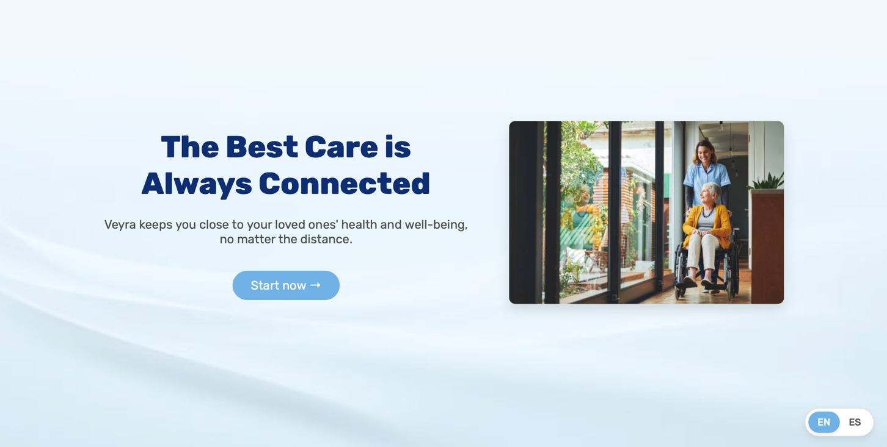
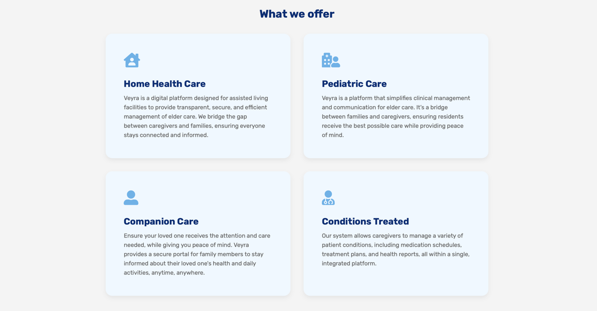
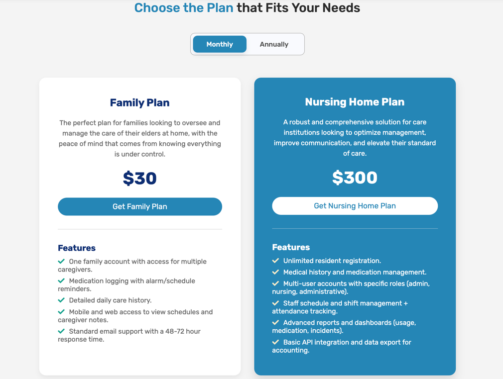
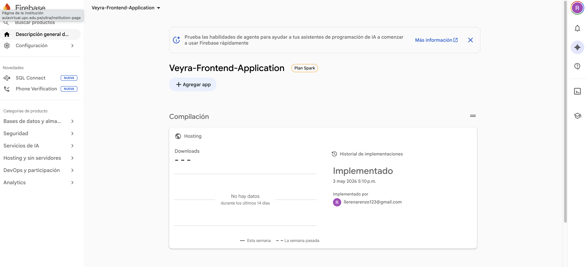
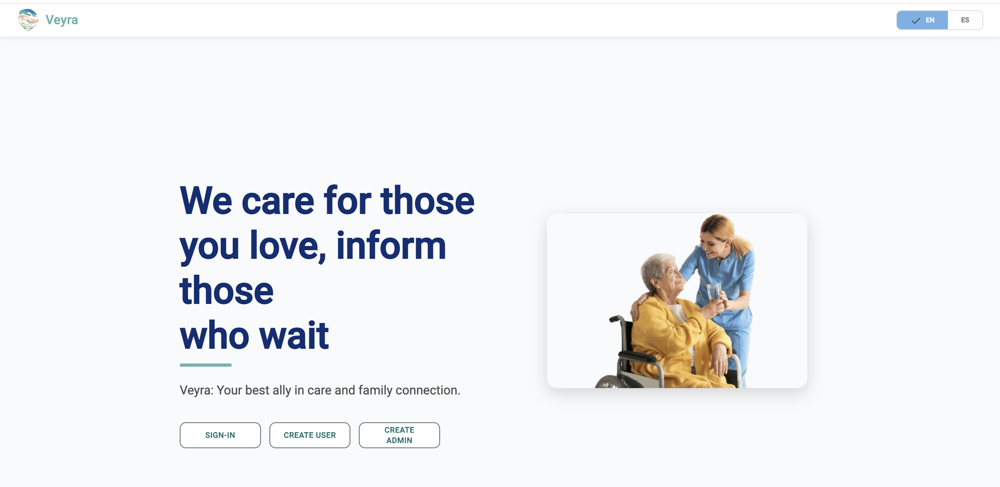
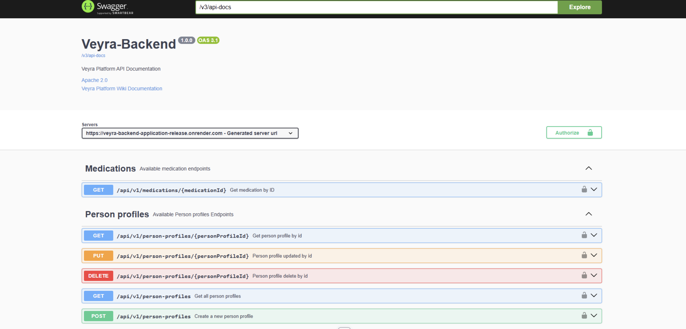

## 5.1. Software Configuration Management

En esta sección se describen las decisiones, convenciones y principios adoptados por el equipo para garantizar la coherencia, trazabilidad y control de versiones durante el ciclo de vida del desarrollo de la solución **Veyra**.  

Se establecen los lineamientos para:

- Configuración del entorno de desarrollo  
- Gestión del código fuente  
- Convenciones de estilo  
- Configuración de despliegue  

---

## 5.1.1. Software Development Environment Configuration

En esta sección se especifican los productos de software utilizados durante el ciclo de vida del proyecto. Para cada herramienta se detalla:

- Nombre  
- Propósito técnico dentro del proyecto Veyra  
- Ruta de referencia (software SaaS) o ruta de descarga (instalación local)  

Las herramientas se organizan según las siguientes disciplinas:

1. **Project Management**
2. **Requirements Management**
3. **Product UX/UI Design**
4. **Software Development**
5. **Software Testing**
6. **Software Documentation**

### Project Management

Esta disciplina se centra en la planificación, seguimiento y control de las actividades del proyecto, asegurando el cumplimiento de los objetivos dentro del tiempo y recursos establecidos.

**Jira**  
Plataforma de gestión de proyectos ágiles utilizada para:
- Administración del Product Backlog  
- Planificación de Sprints  
- Asignación de User Stories y Tasks  
- Seguimiento mediante tableros Scrum (To-Do, In-Process, To-Review, Done)  

**Ruta de referencia:** https://www.atlassian.com/software/jira  

---

### Requirements Management

Este proceso se enfoca en la documentación, verificación y seguimiento de los requisitos del proyecto, asegurando que las necesidades de los stakeholders sean satisfechas.

**Trello**  
Plataforma de gestión visual utilizada para:
- Organización del Sprint Backlog  
- Gestión de User Stories por estado  
- Priorización colaborativa de requisitos  

**Ruta de referencia:** https://trello.com  

---

### Product UX/UI Design

El diseño de la experiencia e interfaz de usuario contempla un sitio web responsivo compatible con escritorio y dispositivos móviles.

**UXPressia**  
Elaboración de User Personas, Empathy Maps, Customer Journey Maps e Impact Maps.  
**Ruta:** https://uxpressia.com/  

**Miro**  
Soporte para EventStorming (Big Picture y Design-Level) e identificación de elementos del dominio.  
**Ruta:** https://miro.com/es/  

**Figma**  
Diseño de Wireframes, Mockups y prototipos interactivos aplicando Material Design.  
**Ruta:** https://www.figma.com/es-es/  

**Lucidchart**  
Creación de Wireflows, User Flows, diagramas UML y diagramas de base de datos.  
**Ruta:** https://www.lucidchart.com/pages/es  

**Overflow**  
Diseño de User Flow Diagrams con rutas de navegación detalladas.  
**Ruta:** https://overflow.io/  

---

### Software Development

El desarrollo abarca Landing Page, Frontend Web Application y Backend Web Services.

**GitHub**  
Control de versiones y gestión de repositorios con GitFlow, Conventional Commits y Semantic Versioning.  
**Ruta:** https://github.com  
**Organización:** https://github.com/NovaPeru-Tech  

**WebStorm**  
IDE para desarrollo Frontend con Angular, HTML5, CSS3, JavaScript y TypeScript.  
**Descarga:** https://www.jetbrains.com/webstorm/  
**Licencia:** https://www.jetbrains.com/community/education/  

**IntelliJ IDEA**  
IDE para desarrollo Backend con Java y Spring Boot, con integración a Azure.  
**Descarga:** https://www.jetbrains.com/idea/  
**Licencia:** https://www.jetbrains.com/community/education/  

**Angular Framework**  
Desarrollo de aplicaciones frontend con componentes reutilizables y consumo de APIs.  
**Ruta:** https://angular.io/  

**Angular Material**  
Componentes UI basados en Material Design.  
**Ruta:** https://material.angular.io/  

**Spring Boot**  
Desarrollo de servicios RESTful con persistencia y documentación integrada.  
**Ruta:** https://spring.io/projects/spring-boot  

**Tecnologías base**
- HTML5: https://html.spec.whatwg.org/  
- CSS3: https://www.w3.org/Style/CSS/  
- JavaScript: https://developer.mozilla.org/es/docs/Web/JavaScript  

**TypeScript**  
Lenguaje tipado para Angular.  
**Ruta:** https://www.typescriptlang.org/  

**Java (JDK 17)**  
Lenguaje backend compatible con Azure.  
**Ruta:** https://openjdk.org/  

---

### Software Testing

Las pruebas permiten verificar que el software cumple con los requisitos especificados.

**Gherkin**  
Lenguaje DSL para criterios de aceptación en formato Given–When–Then.  
Permite definir escenarios comprensibles y automatizables.

**Keywords:** Feature, Scenario, Given, When, Then, And, But  

**Ruta de referencia:** https://cucumber.io/docs/gherkin/  

---

### Software Documentation

La documentación facilita el mantenimiento y evolución del sistema.

**OpenAPI / Swagger**  
Documentación interactiva de APIs REST (endpoints, parámetros, respuestas, códigos HTTP).  
**Ruta:** https://swagger.io/  
**URL:** https://veyrav01.azurewebsites.net/swagger-ui/index.html  

**Markdown**  
Lenguaje de marcado ligero para documentación en GitHub.  
**Ruta:** https://www.markdownguide.org/  

### 5.1.2. Source Code Management. 

En esta sección se establecen los medios y esquemas de organización aplicados para el seguimiento de modificaciones del código fuente. Se utiliza GitHub como plataforma y sistema de control de versiones distribuido.

---

#### Repositorios del Proyecto

| Producto                    | URL del Repositorio |
|----------------------------|---------------------|
| Organización NovaPeru-Tech | https://github.com/upc-pre-1ASI0732-2610-16880-NovaTech |
| Landing Page               | https://github.com/upc-pre-1ASI0732-2610-16880-NovaTech/Veyra-Landing-Page |
| Frontend Web Application   | https://github.com/upc-pre-1ASI0732-2610-16880-NovaTech/Veyra-Frontend-Application |
| Backend Web Services       | https://github.com/upc-pre-1ASI0732-2610-16880-NovaTech/Veyra-Backend-Application |
| Project Report             | https://github.com/upc-pre-1ASI0732-2610-16880-NovaTech/Veyra-Document-Report |

---

#### GitFlow Workflow

Se implementa GitFlow como modelo de flujo de trabajo para el control de versiones, permitiendo desarrollo paralelo y gestión estructurada de releases.

**Ramas principales:**

- **main** → versiones estables en producción  
- **develop** → integración de funcionalidades  

**Ramas de soporte:**

- **feature/<feature-name>** → nuevas funcionalidades  
- **release/<version>** → preparación de versiones  
- **hotfix/<issue>** → correcciones urgentes  

---

#### Convenciones de nomenclatura para ramas

| Tipo   | Formato                                      | Ejemplo                                  |
|--------|----------------------------------------------|------------------------------------------|
| Feature| `feature/<bounded-context>-<feature-description>` | `feature/residents-add-medical-history` |
| Release| `release/<major.minor.patch>`               | `release/1.0.0`                          |
| Hotfix | `hotfix/<issue-description>`                | `hotfix/fix-login-validation`            |

---

#### Conventional Commits

  Se aplica la especificación Conventional Commits para los mensajes de commit, siguiendo la estructura:

<pre><code>&lt;type&gt;[optional scope]: &lt;description&gt;

[optional body]

[optional footer(s)]
</code></pre>

**Tipos:**

| Tipo   | Descripción                         |
|--------|-------------------------------------|
| feat   | Nueva funcionalidad                |
| fix    | Corrección de bug                  |
| docs   | Cambios en documentación           |
| style  | Formato sin afectar lógica         |
| refactor | Refactorización                  |
| perf   | Mejora de rendimiento              |
| test   | Pruebas                            |
| build  | Build o dependencias               |
| chore  | Mantenimiento                      |

**Ejemplos:**

<strong>Ejemplos de Commits:</strong>

<pre><code>feat(residents): add medical history registration form
fix(auth): resolve token expiration validation issue
docs(readme): update deployment instructions
build(deps): upgrade Angular to version 17
chore(config): update environment variables for production
</code></pre>

---

#### Semantic Versioning

**Formato:** `MAJOR.MINOR.PATCH`

- **MAJOR** → cambios incompatibles  
- **MINOR** → nuevas funcionalidades  
- **PATCH** → correcciones  

**Ejemplos:**

- `1.0.0`  
- `1.1.0`  
- `1.1.1`  
- `2.0.0`  

---

#### Configuración de GitHub en WebStorm

1. Ir a **VCS > Enable Version Control Integration** y seleccionar Git  
2. Ir a **File > Settings > Version Control > GitHub** y agregar la cuenta  
3. Configurar usuario en **File > Settings > Version Control > Git**  
4. Conectar repositorio en **Git > Manage Remotes**  
5. Commit: `Ctrl + K`  
6. Push: `Ctrl + Shift + K`  

### 5.1.3. Source Code Style Guide & Conventions

En esta sección se establecen las convenciones de estilo y nomenclatura adoptadas para los lenguajes utilizados en el proyecto Veyra: HTML, CSS, JavaScript, TypeScript, Java y Gherkin. Se aplica nomenclatura en inglés para todos los elementos del código, siguiendo el *Ubiquitous Language* del dominio.

---

#### Referencias de guías de estilo adoptadas

| Lenguaje / Tecnología | Guía de estilo |
|----------------------|---------------|
| HTML / CSS | https://google.github.io/styleguide/htmlcssguide.html |
| JavaScript | https://google.github.io/styleguide/jsguide.html |
| TypeScript | https://google.github.io/styleguide/tsguide.html |
| Angular | https://angular.io/guide/styleguide |
| Java | https://google.github.io/styleguide/javaguide.html |
| Spring Boot | https://docs.spring.io/spring-boot/docs/current/reference/html/features.html |
| Gherkin | https://cucumber.io/docs/gherkin/reference/ |

---

#### Nomenclatura general

Se utiliza nomenclatura en inglés para todos los elementos del código, alineada al dominio del negocio.

| Elemento | Convención | Ejemplo |
|----------|-----------|---------|
| Clases (Java/TypeScript) | PascalCase | `ResidentService`, `MedicationController` |
| Interfaces (TypeScript) | PascalCase | `IResidentRepository`, `Resident` |
| Métodos / Funciones | camelCase | `getResidentById()`, `createMedication()` |
| Variables | camelCase | `residentName`, `medicationList` |
| Constantes | SCREAMING_SNAKE_CASE | `MAX_RESIDENTS`, `API_BASE_URL` |
| Componentes Angular (archivos) | kebab-case | `resident-list.component.ts` |
| Clases CSS | kebab-case | `.resident-card`, `.medication-form` |
| Endpoints REST | kebab-case (plural) | `/api/v1/residents`, `/api/v1/medications` |

---

#### Sangría

Se utiliza indentación de **2 espacios** en HTML, CSS, JavaScript y TypeScript.

<strong>Ejemplo HTML:</strong>

<pre><code>&lt;!DOCTYPE html&gt;
&lt;html&gt;
  &lt;head&gt;
    &lt;title&gt;VEYRA - Nursing Home Management&lt;/title&gt;
  &lt;/head&gt;
  &lt;body&gt;
    &lt;header&gt;
      &lt;h1&gt;Welcome to VEYRA&lt;/h1&gt;
    &lt;/header&gt;
    &lt;main&gt;
      &lt;p&gt;Comprehensive care management platform.&lt;/p&gt;
    &lt;/main&gt;
  &lt;/body&gt;
&lt;/html&gt;
</code></pre>

<h4>Convenciones por Lenguaje</h4>

<h5>HTML</h5>

<ul>
  <li>Declarar <code>&lt;!DOCTYPE html&gt;</code> en la primera línea.</li>
  <li>Utilizar minúsculas para nombres de elementos y atributos.</li>
  <li>Utilizar comillas dobles para valores de atributos: <code>&lt;div class="container"&gt;</code></li>
  <li>Incluir atributos <code>alt</code> en todas las imágenes para accesibilidad.</li>
  <li>No omitir elementos <code>&lt;title&gt;</code> y meta tags.</li>
  <li>Usar líneas en blanco para separar bloques de código extensos.</li>
</ul>

<h5>CSS</h5>

<ul>
  <li>Utilizar shorthand properties cuando sea posible: <code>margin: 10px 20px;</code></li>
  <li>Terminar todas las declaraciones con punto y coma.</li>
  <li>Un espacio después de los dos puntos en propiedades: <code>color: #333;</code></li>
  <li>Usar comillas simples para valores de font-family: <code>font-family: 'Open Sans', sans-serif;</code></li>
  <li>Organizar propiedades alfabéticamente dentro de cada selector.</li>
</ul>

<h5>JavaScript / TypeScript</h5>

<ul>
  <li>Usar <code>const</code> y <code>let</code> en lugar de <code>var</code>.</li>
  <li>Espacios alrededor de operadores: <code>const result = a + b;</code></li>
  <li>Punto y coma al final de instrucciones.</li>
  <li>Llaves de apertura en la misma línea de la declaración.</li>
  <li>Usar arrow functions para callbacks: <code>items.map(item => item.name)</code></li>
</ul>

<strong>Ejemplo TypeScript:</strong>

<pre><code>export class ResidentService {
  private residents: Resident[] = [];

  getResidentById(id: number): Resident | undefined {
    return this.residents.find(resident => resident.id === id);
  }

  createResident(resident: Resident): void {
    this.residents.push(resident);
  }
}
</code></pre>

<h5>Java</h5>

<ul>
  <li>Seguir convenciones de nomenclatura de Spring Boot.</li>
  <li>Documentar clases y métodos públicos con Javadoc.</li>
  <li>Organizar imports alfabéticamente, separando imports de java.*, javax.*, org.*, com.*</li>
  <li>Máximo 120 caracteres por línea.</li>
  <li>Usar anotaciones de Spring en líneas separadas.</li>
</ul>

<strong>Ejemplo Java:</strong>

<pre><code>@RestController
@RequestMapping("/api/v1/residents")
public class ResidentController {

    private final ResidentService residentService;

    public ResidentController(ResidentService residentService) {
        this.residentService = residentService;
    }

    @GetMapping("/{id}")
    public ResponseEntity&lt;Resident&gt; getResidentById(@PathVariable Long id) {
        return residentService.findById(id)
            .map(ResponseEntity::ok)
            .orElse(ResponseEntity.notFound().build());
    }
}
</code></pre>

<h5>Gherkin</h5>

<ul>
  <li>Escribir escenarios en inglés.</li>
  <li>Un escenario por comportamiento específico.</li>
  <li>Mantener pasos atómicos y reutilizables.</li>
  <li>Usar indentación de dos espacios para los pasos.</li>
</ul>

<strong>Ejemplo Gherkin:</strong>

<pre><code>Feature: Resident Management

  Scenario: Successfully register a new resident
    Given the administrator is authenticated
    And the administrator is on the resident registration form
    When the administrator enters valid resident information
    And clicks the "Register" button
    Then the system should display a success message
    And the new resident should appear in the residents list

  Scenario: Attempt to register resident with missing required fields
    Given the administrator is authenticated
    And the administrator is on the resident registration form
    When the administrator submits the form with empty required fields
    Then the system should display validation error messages
    And the resident should not be registered
</code></pre>

### 5.1.4. Software Deployment Configuration. 

  

	  En esta sección se especifica la configuración de despliegue para cada uno de los producto digitales de la solución Veyra: Landing Page, Frontend Web Application y Backend Web Services. 
  

<h4>Landing Page - GitHub Pages</h4>

  El Landing Page se despliega mediante GitHub Pages directamente desde el repositorio, aprovechando el hosting gratuito para sitios estáticos.

<strong>Pasos de configuración:</strong>

<ol>
  <li>Acceder al repositorio <code>NovaTech-LandingPage</code> en GitHub.</li>
  <li>Navegar a <strong>Settings &gt; Pages</strong> en el menú lateral.</li>
  <li>En la sección "Source", seleccionar la rama <code>main</code> y carpeta <code>/ (root)</code>.</li>
  <li>Hacer clic en <strong>Save</strong> y esperar la generación del sitio (1-2 minutos).</li>
  <li>Verificar el despliegue accediendo a la URL generada.</li>
</ol>

<strong>URL de despliegue:</strong> <a href="">https://upc-pre-1asi0732-2610-16880-novatech.github.io/Veyra-Landing-Page/</a>

<h4>Frontend Web Application - Vercel</h4>

  El Frontend desarrollado con Angular se despliega en Vercel, plataforma que ofrece hosting optimizado para aplicaciones frontend con CDN global y despliegue automático.

<strong>Pasos de configuración:</strong>

<ol>
  <li>Crear cuenta en <a href="https://vercel.com">Vercel</a> y vincular con GitHub.</li>
  <li>Importar el repositorio <code>NovaTech-Frontend</code> desde GitHub.</li>
  <li>Configurar el proyecto:
    <ul>
      <li><strong>Framework Preset:</strong> Angular</li>
      <li><strong>Build Command:</strong> <code>ng build --configuration production</code></li>
      <li><strong>Output Directory:</strong> <code>dist/nova-tech-frontend</code></li>
    </ul>
  </li>
  <li>Configurar variables de entorno:
    <ul>
      <li><code>API_BASE_URL</code>: URL del Backend API</li>
    </ul>
  </li>
  <li>Habilitar despliegue automático en cada push a la rama <code>main</code>.</li>
  <li>Hacer clic en <strong>Deploy</strong> y esperar la compilación.</li>
</ol>

<strong>URL de despliegue:</strong> <a href="">https://nova-peru-tech-frontend-v1-2w9r.vercel.app/home</a>

<h4>Backend Web Services - Azure App Service</h4>

  El Backend desarrollado con Spring Boot se despliega en Azure App Service, servicio de plataforma como servicio (PaaS) que facilita el hosting de aplicaciones web Java.

<strong>Pasos de configuración:</strong>

<strong>1. Creación del Azure App Service:</strong>

<ol>
  <li>Acceder al <a href="https://portal.azure.com">Portal de Azure</a>.</li>
  <li>Crear un nuevo recurso: <strong>App Service</strong>.</li>
  <li>Configurar:
    <ul>
      <li><strong>Runtime stack:</strong> Java 17</li>
      <li><strong>Operating System:</strong> Linux</li>
      <li><strong>Region:</strong> East US (o región más cercana)</li>
      <li><strong>App Service Plan:</strong> Seleccionar o crear plan según necesidades</li>
    </ul>
  </li>
</ol>

<strong>2. Configuración de Base de Datos (Azure SQL Database):</strong>

<ol>
  <li>Crear instancia de Azure SQL Database o MySQL.</li>
  <li>Configurar reglas de firewall para permitir conexiones desde App Service.</li>
  <li>Obtener cadena de conexión JDBC.</li>
</ol>

<strong>3. Configuración de Variables de Entorno:</strong>

En <strong>App Service &gt; Configuration &gt; Application settings</strong>, agregar:

<table>
  <thead>
    <tr>
      <th>Variable</th>
      <th>Descripción</th>
    </tr>
  </thead>
  <tbody>
    <tr>
      <td><code>SPRING_DATASOURCE_URL</code></td>
      <td>Cadena de conexión JDBC a la base de datos</td>
    </tr>
    <tr>
      <td><code>SPRING_DATASOURCE_USERNAME</code></td>
      <td>Usuario de la base de datos</td>
    </tr>
    <tr>
      <td><code>SPRING_DATASOURCE_PASSWORD</code></td>
      <td>Contraseña de la base de datos</td>
    </tr>
    <tr>
      <td><code>SPRING_PROFILES_ACTIVE</code></td>
      <td><code>prod</code></td>
    </tr>
  </tbody>
</table>

<strong>4. Despliegue desde IntelliJ IDEA:</strong>

<ol>
  <li>Instalar el plugin <strong>Azure Toolkit for IntelliJ</strong>.</li>
  <li>Autenticarse con la cuenta de Azure.</li>
  <li>Clic derecho en el proyecto &gt; <strong>Azure &gt; Deploy to Azure Web Apps</strong>.</li>
  <li>Seleccionar el App Service de destino.</li>
  <li>Ejecutar el despliegue y verificar en los logs.</li>
</ol>

<strong>URLs de despliegue:</strong>

<ul>
  <li><strong>API Base URL:</strong> <a href="https://veyrav01.azurewebsites.net">https://veyrav01.azurewebsites.net</a></li>
  <li><strong>Documentación Swagger UI:</strong> <a href="https://veyrav01.azurewebsites.net/swagger-ui/index.html">https://veyrav01.azurewebsites.net/swagger-ui/index.html</a></li>
</ul>

## 5.2. Product Implementation & Deployment. 
### 5.2.1. Sprint Backlogs. 

El Sprint Backlog 1 reúne las historias de usuario y tareas necesarias para implementar la primera versión de la landing page, incluyendo el menú de navegación, la visualización de planes, la sección de creadores, redes sociales, el formulario de contacto y el cambio de idioma.

Todas las tareas son monitoreadas y actualizadas mediante **Jira Software**.

  
<em>Figura: Tablero del Sprint 1 en Jira Software (Proyecto VEYRA)</em>

 

A continuación, la estructura de la tabla de control de estado para el Sprint:

| Sprint # | Sprint 1 |   |   |   |   |   |   |
|---------|----------|---|---|---|---|---|---|
| **User Story** |   | **Work-Item / Task** |   |   |   |   |  |
| **Id** | **Title** | **Id** | **Title** | **Description** | **Estimation (Hours)** | **Assigned To** | **Status (To-do / In-Process / To-Review / Done)** |
| TS-NH001 | Crear Nursing Home | T001 | Definir modelo de datos | Diseñar la entidad Nursing Home y su relación con el Admin. | 3h | Renzo Llerena | To-do |
| TS-NH001 | Crear Nursing Home | T002 | Implementar API POST | Desarrollar el endpoint para el registro de la casa de reposo. | 5h | Renzo Llerena | To-do |
| TS-NH001 | Crear Nursing Home | T003 | Validaciones de RUC | Implementar lógica de validación de identidad institucional. | 2h | Renzo Llerena | To-do |
| US-12 | Registro de residentes | T004 | Crear formulario de registro | Diseñar la interfaz de entrada de datos para residentes. | 4h | Camila Espinoza | To-do |
| US-12 | Registro de residentes | T005 | Endpoint de persistencia | Implementar la lógica para guardar perfiles en la BD. | 4h | Juan Santos | To-do |
| US-12 | Registro de residentes | T006 | Generación de ID único | Desarrollar el algoritmo de generación de códigos de residente. | 2h | Juan Santos | To-do |
| TS-RM002 | Ver expediente | T007 | Endpoint GET residente | Crear endpoint para obtener data completa por ID. | 3h | Miguel Roman | To-do |
| TS-RM002 | Ver expediente | T008 | Formateo de respuesta | Asegurar que la respuesta JSON incluya perfiles médicos. | 2h | Miguel Roman | To-do |
| TS-EM001 | Agregar empleado | T009 | Gestión de roles (RBAC) | Definir lógica de asignación de roles al crear empleado. | 4h | Adrian Valerio | To-do |
| TS-EM001 | Agregar empleado | T010 | Implementar API Empleados | Desarrollar el endpoint POST para nuevos trabajadores. | 5h | Yesser Renteria | To-do |
| TS-EM001 | Agregar empleado | T011 | Pruebas de integración | Verificar que el empleado se asigne al Nursing Home correcto. | 2h | Yesser Renteria | To-do |
| US-02 | Planes en Landing | T012 | Diseño UI de planes | Maquetar la sección de precios y características. | 3h | Camila Espinoza | To-do |
| US-02 | Planes en Landing | T013 | Integración de servicios | Conectar la vista con el catálogo de planes del backend. | 3h | Camila Espinoza | To-do |
| US-44 | Manejo de errores | T014 | Interceptor de errores | Crear un interceptor global para capturar fallos de red. | 4h | Renzo Llerena | To-do |
| US-44 | Manejo de errores | T015 | UI de Notificaciones | Diseñar modales de alerta amigables para el usuario. | 3h | Adrian Valerio | To-do |

El seguimiento y la actualización del Sprint Backlog se realizan en **Jira Software** mediante el tablero Scrum del proyecto, donde se registran los estados de cada tarea (To-do, In-Process, To-Review, Done). Durante las reuniones diarias (**Daily Scrum**), el equipo revisa el avance, actualiza el estado de las tareas y gestiona posibles bloqueos.

### 5.2.2. Implemented Landing Page Evidence 

<strong>Encabezado y menú de navegación:</strong>

<strong>Sección Hero:</strong>

<strong>Sección Services:</strong>

<strong>Sección Pricing:</strong>

<strong>Sección About the App:</strong>

<strong>Sección Testimonials:</strong>

<strong>Sección About the Team:</strong>

### 5.2.3. Implemented Frontend-Web Application Evidence 

### 5.2.5. Implemented RESTful API and/or Serverless Backend Evidence 

### 5.2.6. RESTful API documentation 
### 5.2.7. Team Collaboration Insights 

<strong>Sección About the Team:</strong>

## 5.3. Video About-the-Product. 
