# Capítulo VI: Product Verification & Validation
## 6.1. Testing Suites & Validation
### 6.1.1. Core Entities Unit Tests.
En esta sección se implementaron y ejecutaron pruebas unitarias para las entidades principales del sistema desarrolladas en Java utilizando el framework Spring Boot. Estas pruebas estuvieron enfocadas en validar el correcto funcionamiento de los modelos, clases de servicio y métodos principales de la aplicación de manera aislada.

El propósito de las pruebas unitarias fue asegurar que cada componente cumpla con los requisitos funcionales establecidos y que su lógica interna opere correctamente ante distintos escenarios de ejecución.

Para la implementación de las pruebas se utilizaron herramientas como:

JUnit 5 para la creación y ejecución de pruebas unitarias.
Mockito para simular dependencias y aislar componentes durante las pruebas.
Spring Boot Test para facilitar la integración de pruebas dentro del entorno Spring.

Las pruebas realizadas permitieron validar:

- La correcta creación y manipulación de entidades.
- El funcionamiento adecuado de métodos de servicios y repositorios.
- La validación de datos de entrada.
- El manejo de excepciones y errores.
- El cumplimiento de reglas de negocio definidas en el sistema.

Además, se emplearon mocks para evitar dependencias externas como conexiones a bases de datos o servicios externos, garantizando que las pruebas se enfoquen únicamente en la lógica de cada componente.

<div align="center">
  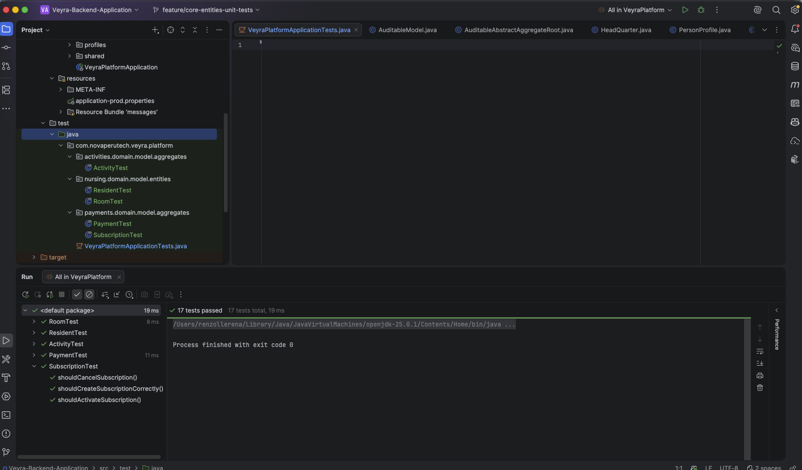
  <p><em>Figura: Ejecución satisfactoria de las pruebas de entidades principales.</em></p>
</div>


Los resultados obtenidos evidenciaron que las entidades principales del sistema funcionan correctamente bajo los escenarios evaluados, contribuyendo a mejorar la estabilidad, mantenibilidad y confiabilidad de la aplicación.

### 6.1.2. Core Integration Tests.

Las pruebas de integración fueron desarrolladas con el objetivo de validar la correcta comunicación entre los controladores REST, los servicios de aplicación, la configuración de seguridad, la persistencia de datos y las dependencias principales del backend de Veyra. A diferencia de las pruebas unitarias, estas pruebas permiten comprobar el comportamiento del sistema cuando varios componentes trabajan en conjunto dentro del contexto de Spring Boot.

Para esta validación se implementó la clase `CoreIntegrationTests`, orientada a verificar flujos esenciales del sistema, tanto técnicos como funcionales. En particular, se evaluaron procesos de autenticación, generación de token, restricción de acceso a endpoints protegidos, registro de casas de reposo, creación de residentes y registro de medicamentos asociados a un residente.

#### Evidencia de ejecución: `testSuccessfulSignUp()`

Este caso de prueba valida el flujo de **registro exitoso de usuario** dentro del backend de Veyra. La prueba envía una solicitud HTTP `POST` al endpoint de autenticación con datos válidos de usuario, verificando que el sistema pueda procesar el registro correctamente.

| Campo | Descripción |
|---|---|
| ID | ITC-01 |
| Clase de prueba | `AuthenticationControllerIntegrationTest` |
| Método evaluado | `testSuccessfulSignUp()` |
| Flujo relacionado | Registro de usuario |
| Módulos involucrados | Authentication Controller, User Service, repositorio de usuarios y configuración de seguridad |
| Tipo de prueba | Integration Test |
| Entrada | Credenciales válidas de registro |
| Resultado esperado | El sistema registra al usuario y retorna una respuesta HTTP exitosa |
| Estado | Aprobado |

<div align="center">
  
  <p><em>Figura: Ejecución satisfactoria de la prueba de integración para el registro de usuario.</em></p>
</div>

La ejecución satisfactoria de este caso confirma que el backend puede recibir una solicitud de registro, procesarla mediante la lógica de autenticación y devolver una respuesta válida. Esto evidencia la correcta integración entre la capa REST, el servicio de usuarios y la persistencia asociada.

#### Evidencia de ejecución: `testSuccessfulSignIn()`

Este caso de prueba valida el flujo de **inicio de sesión exitoso** dentro del backend de Veyra. La prueba primero registra un usuario de prueba y luego envía una solicitud HTTP `POST` al endpoint de inicio de sesión con credenciales válidas.

| Campo | Descripción |
|---|---|
| ID | ITC-02 |
| Clase de prueba | `AuthenticationControllerIntegrationTest` |
| Método evaluado | `testSuccessfulSignIn()` |
| Flujo relacionado | Inicio de sesión |
| Módulos involucrados | Authentication Controller, User Service, JWT, seguridad y repositorio de usuarios |
| Tipo de prueba | Integration Test |
| Entrada | Usuario registrado y credenciales válidas |
| Resultado esperado | El sistema autentica al usuario y retorna un token de acceso |
| Estado | Aprobado |

<div align="center">
  
  <p><em>Figura: Ejecución satisfactoria de la prueba de integración para el inicio de sesión.</em></p>
</div>

La ejecución satisfactoria de este caso confirma que el backend puede autenticar usuarios registrados y generar una respuesta válida para el acceso al sistema. Este flujo es crítico porque habilita el ingreso seguro a los módulos protegidos de Veyra.

#### Evidencia de ejecución: `testProtectedEndpointWithoutToken()`

Este caso de prueba valida el comportamiento de seguridad del backend cuando se intenta acceder a un endpoint protegido sin enviar un token de autenticación. La prueba realiza una solicitud HTTP `GET` a un recurso protegido sin incluir encabezado `Authorization`.

| Campo | Descripción |
|---|---|
| ID | ITC-03 |
| Clase de prueba | `AuthenticationControllerIntegrationTest` |
| Método evaluado | `testProtectedEndpointWithoutToken()` |
| Flujo relacionado | Protección de endpoints |
| Módulos involucrados | Spring Security, filtros de autenticación, endpoint protegido y configuración JWT |
| Tipo de prueba | Integration Test |
| Entrada | Solicitud sin token de autenticación |
| Resultado esperado | El sistema rechaza la solicitud y retorna una respuesta de no autorizado |
| Estado | Aprobado |

<div align="center">
  
  <p><em>Figura: Ejecución satisfactoria de la prueba de integración para endpoint protegido sin token.</em></p>
</div>

La ejecución satisfactoria de este caso confirma que el backend aplica correctamente las reglas de seguridad sobre endpoints protegidos. Esto permite validar que los recursos sensibles del sistema no puedan ser consultados por usuarios no autenticados.

#### Evidencia de ejecución: `testSuccessfulCreateNursingHome()`

Este caso de prueba valida el flujo de **registro de una casa de reposo** dentro del backend de Veyra. Este flujo representa el proceso de onboarding institucional, mediante el cual una residencia geriátrica puede quedar registrada en la plataforma para posteriormente gestionar residentes, personal, actividades y servicios asociados.

| Campo | Descripción |
|---|---|
| ID | ITC-04 |
| Clase de prueba | `NursingHomeControllerIntegrationTest` |
| Método evaluado | `testSuccessfulCreateNursingHome()` |
| Flujo relacionado | Registro de casa de reposo |
| Módulos involucrados | Nursing Home Controller, servicio de casas de reposo, persistencia y validaciones de dominio |
| Tipo de prueba | Integration Test |
| Entrada | Datos válidos de la institución geriátrica |
| Resultado esperado | El sistema registra la casa de reposo y retorna una respuesta HTTP exitosa |
| Estado | Aprobado |

<div align="center">
  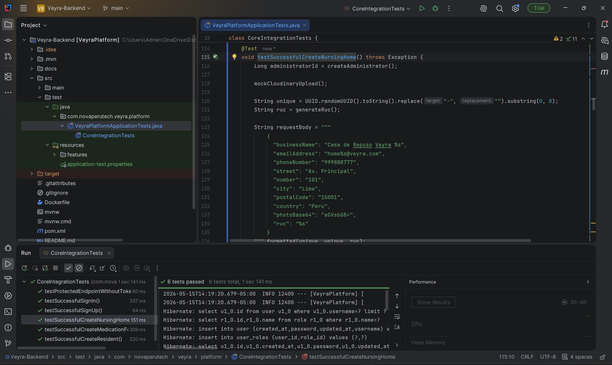
  <p><em>Figura: Ejecución satisfactoria de la prueba de integración para el registro de casa de reposo.</em></p>
</div>

La ejecución satisfactoria de este caso confirma que el backend permite registrar correctamente una institución geriátrica dentro de la plataforma. Esto valida uno de los flujos principales del modelo SaaS de Veyra, ya que cada casa de reposo representa una organización cliente dentro del sistema.

#### Evidencia de ejecución: `testSuccessfulCreateResident()`

Este caso de prueba valida el flujo de **registro de residente** dentro del backend de Veyra. La prueba comprueba que el sistema pueda recibir los datos principales de un adulto mayor y almacenarlos correctamente, permitiendo su posterior gestión clínica, administrativa y asistencial.

| Campo | Descripción |
|---|---|
| ID | ITC-05 |
| Clase de prueba | `ResidentControllerIntegrationTest` |
| Método evaluado | `testSuccessfulCreateResident()` |
| Flujo relacionado | Registro de residente |
| Módulos involucrados | Resident Controller, servicio de residentes, perfil del residente, persistencia y validaciones |
| Tipo de prueba | Integration Test |
| Entrada | Datos válidos del residente |
| Resultado esperado | El sistema registra al residente y retorna una respuesta HTTP exitosa |
| Estado | Aprobado |

<div align="center">
  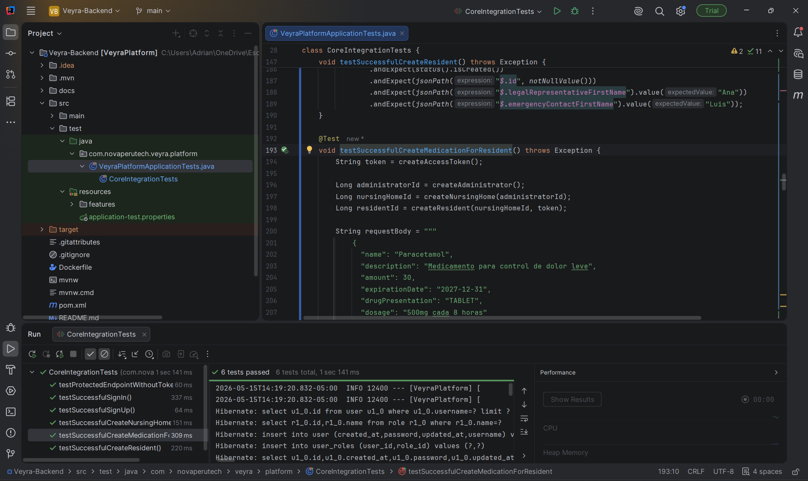
  <p><em>Figura: Ejecución satisfactoria de la prueba de integración para el registro de residente.</em></p>
</div>

La ejecución satisfactoria de este caso confirma que Veyra puede registrar residentes dentro del sistema, lo cual constituye una funcionalidad central para la gestión de casas de reposo. Este flujo es relevante porque permite centralizar la información del adulto mayor y sirve como base para módulos posteriores como seguimiento médico, actividades, comunicaciones familiares y reportes.

#### Evidencia de ejecución: `testSuccessfulRegisterHealthMetric()`

Este caso de prueba valida el flujo de **registro de métricas de salud** de un residente. La prueba comprueba que el sistema pueda recibir y almacenar información clínica relacionada con el seguimiento del adulto mayor, como presión arterial, temperatura, frecuencia cardiaca u otros indicadores relevantes.

| Campo | Descripción |
|---|---|
| ID | ITC-06 |
| Clase de prueba | `HealthTrackingIntegrationTest` |
| Método evaluado | `testSuccessfulRegisterHealthMetric()` |
| Flujo relacionado | Registro de métricas de salud |
| Módulos involucrados | Tracking Controller, servicio de métricas de salud, repositorio de mediciones y persistencia |
| Tipo de prueba | Integration Test |
| Entrada | Datos válidos de una medición clínica |
| Resultado esperado | El sistema registra la métrica de salud y retorna una respuesta HTTP exitosa |
| Estado | Aprobado |

<div align="center">
  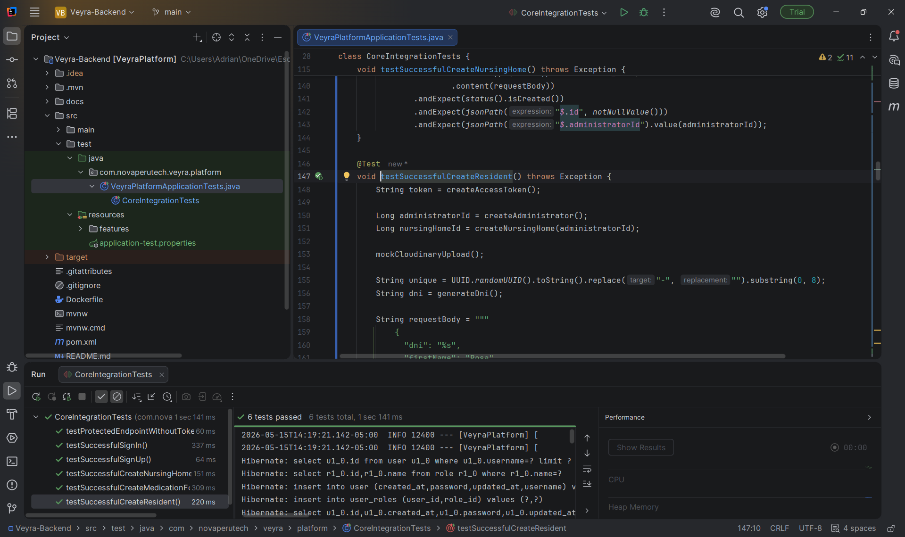
  <p><em>Figura: Ejecución satisfactoria de la prueba de integración para el registro de métricas de salud.</em></p>
</div>

La ejecución satisfactoria de este caso confirma que el backend permite registrar información clínica relevante para el monitoreo del residente. Este flujo se relaciona directamente con el valor de negocio de Veyra, ya que facilita el seguimiento continuo del estado de salud del adulto mayor y contribuye a una toma de decisiones más informada por parte del personal asistencial.

#### Resumen de pruebas de integración ejecutadas

| ID | Caso de prueba | Flujo validado | Enfoque | Resultado |
|---|---|---|---|---|
| ITC-01 | `testSuccessfulSignUp()` | Registro de usuario | Seguridad y acceso | Aprobado |
| ITC-02 | `testSuccessfulSignIn()` | Inicio de sesión y generación de token | Seguridad y acceso | Aprobado |
| ITC-03 | `testProtectedEndpointWithoutToken()` | Bloqueo de acceso sin autenticación | Seguridad de endpoints | Aprobado |
| ITC-04 | `testSuccessfulCreateNursingHome()` | Registro de casa de reposo | Onboarding institucional | Aprobado |
| ITC-05 | `testSuccessfulCreateResident()` | Registro de residente | Gestión del adulto mayor | Aprobado |
| ITC-06 | `testSuccessfulRegisterHealthMetric()` | Registro de métrica de salud | Seguimiento clínico | Aprobado |

Las pruebas de integración ejecutadas permiten validar flujos técnicos y de negocio relevantes para el backend de Veyra. Los casos relacionados con autenticación comprueban el acceso seguro al sistema, mientras que los casos orientados al negocio validan procesos centrales como el registro de instituciones, la gestión de residentes y el seguimiento clínico de adultos mayores.

### 6.1.3. Core Behavior-Driven Development

En esta sección se definen los escenarios de prueba utilizando el lenguaje Gherkin (Given-When-Then) para asegurar que el comportamiento del sistema cumpla con los criterios de aceptación de las Historias de Usuario principales (Core).

#### Epic: Medication Management

**User Story (US14):** As an administrator, I want to control the medication intake of the residents to ensure treatment compliance.

```gherkin
Feature: Health Metric Registration

  Scenario: Administrator successfully registers a medication intake
    Given the administrator is on the medication management module
    And the medication has available stock
    When the administrator registers a new dose intake for the resident
    Then the system should decrease the medication stock by one unit
    And the system should save the date and time of the intake
    And the system should display a "Medication registered successfully" message

  Scenario: Attempting to register a medication intake with no stock
    Given the administrator is on the medication management module
    And the selected medication has zero stock
    When the administrator attempts to register a new dose intake
    Then the system should prevent the registration
    And the system should display an "Out of stock" warning message
```

#### Epic: Family Communication

**User Story (US20):** As a family member, I want to send direct questions to the staff about my relative's daily routine to resolve specific doubts.
```gherkin
Feature: Family Portal Activity Viewing

  Scenario: Family member sends a direct question to the staff
    Given the family member is authenticated in the family portal
    And is viewing their relative's profile
    When the family member submits a question via the direct message form
    Then the system should send the message to the assigned staff member
    And the system should display a "Message sent successfully" confirmation
```

### 6.1.4. Core System Tests.

<div align="center">
  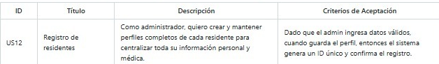
</div>
<div align="center">
  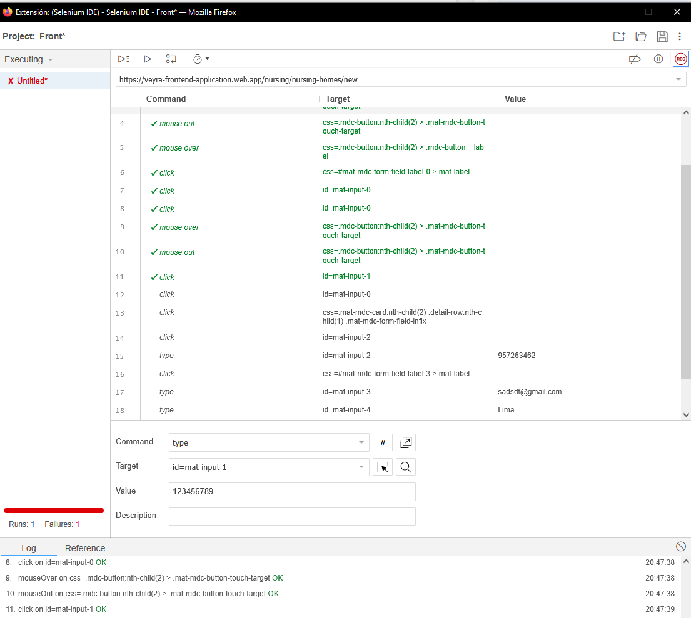
</div>

<br>
<br>

<div align="center">
  
</div>
<div align="center">
  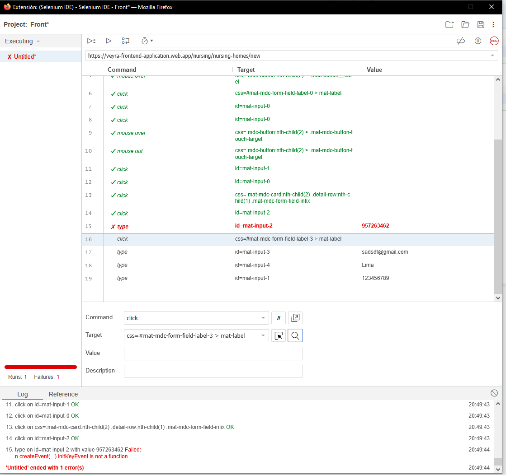
</div>

<br>
<br>

<div align="center">
  
</div>
<div align="center">
  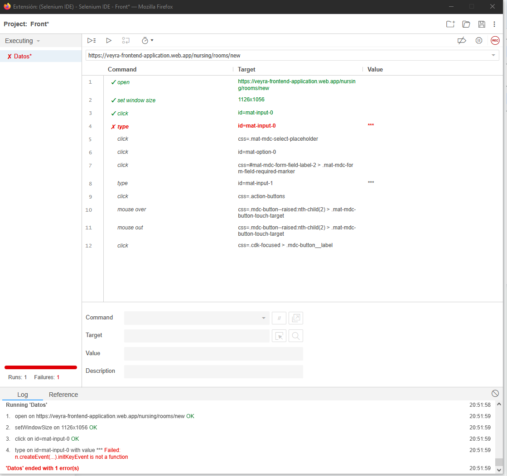
</div>

<br>
<br>

<div align="center">
  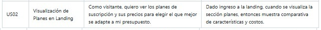
</div>
<div align="center">
  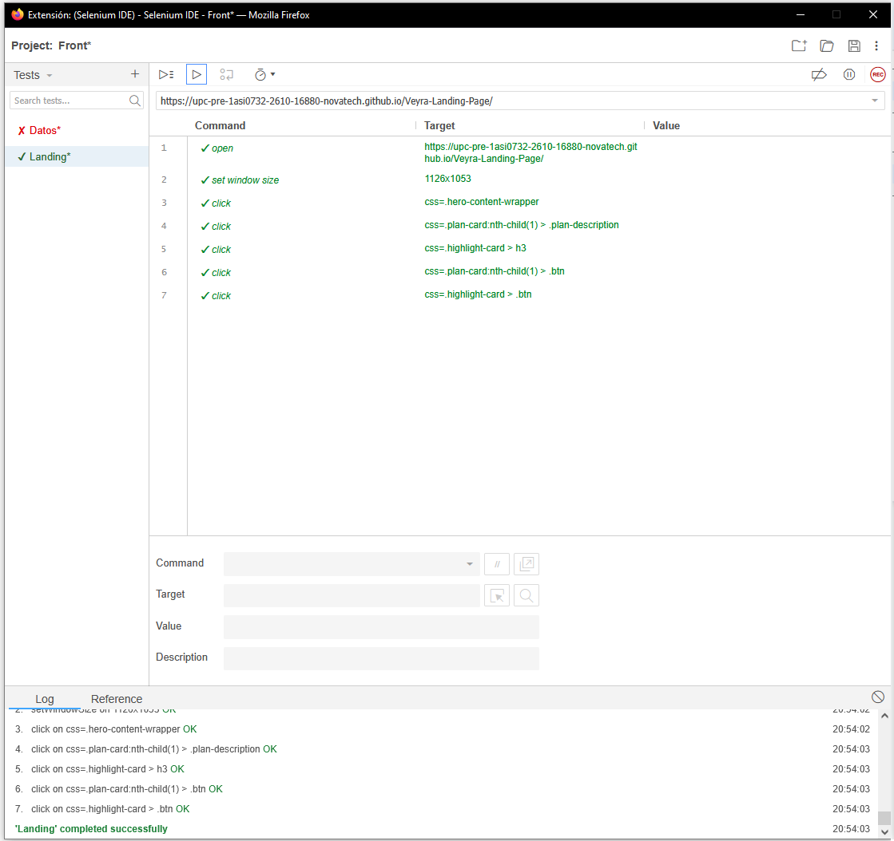
</div>

<br>
<br>

<div align="center">
  
</div>
<div align="center">
  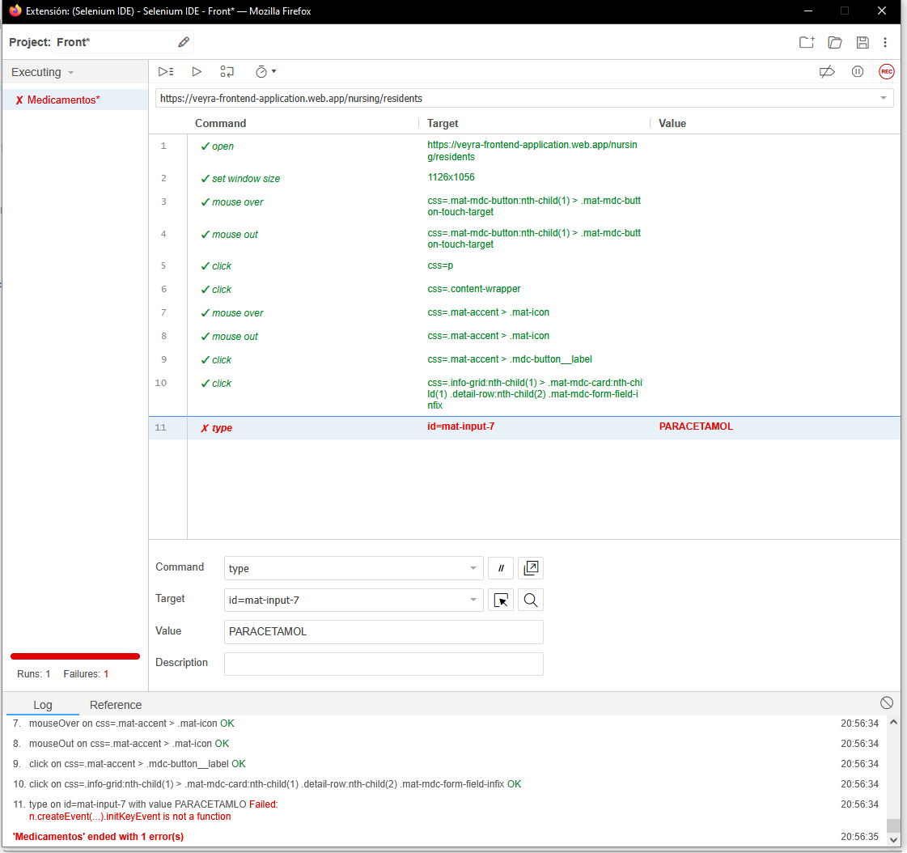
</div>


## 6.2. Static testing & Verification

La verificación estática del software se enfoca en evaluar la calidad del código fuente sin necesidad de ejecutar la aplicación. Este enfoque permite detectar defectos tempranos relacionados con estilo, convenciones, diseño, mantenibilidad, posibles vulnerabilidades y consistencia general antes de que el código llegue a las etapas de compilación o prueba dinámica.

En el proyecto **Veyra**, esta práctica se consideró parte esencial del aseguramiento de calidad, ya que el backend fue desarrollado con **Java** y **Spring Boot**, mientras que el frontend utiliza tecnologí­as modernas que requieren disciplina en nomenclatura, organización y revisión. La verificación estática ayudó a reducir retrabajos, mantener la coherencia entre módulos y reforzar la seguridad del producto desde el diseño del código.

Las actividades principales de esta etapa fueron:

- Revisiónn del cumplimiento de estándares de codificación.
- Validación de convenciones de nombres, estructura y legibilidad.
- Detección temprana de code smells y deuda tíécnica.
- Identificación de posibles riesgos de seguridad.
- Revisión manual del código por parte del equipo.

<div align="center">
  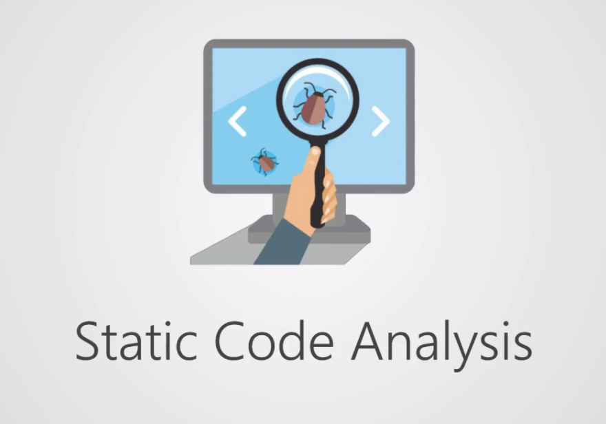
</div>

### 6.2.1. Static Code Analysis

El análisis estático del código consistió en revisar la base de código del proyecto Veyra sin ejecutar el sistema, con el objetivo de asegurar que la implementación mantenga un nivel aceptable de calidad tíécnica. Esta revisión se centró en la estructura del código, la claridad de los nombres, la coherencia entre capas, el uso correcto de patrones del framework y la detección de riesgos comunes en aplicaciones web.

Para este propósito se aplicaron criterios de inspección manual y buenas prácticas ampliamente aceptadas para Java, Spring Boot, TypeScript, Angular, HTML, CSS y Gherkin. Adicionalmente, se tomaron como referencia principios de diseño limpio, separación de responsabilidades y minimización de acoplamiento entre componentes.

Los beneficios de este análisis fueron:

- Mayor claridad en la arquitectura del código.
- Menor probabilidad de errores por estilo inconsistente.
- Detección temprana de código duplicado o difí­cil de mantener.
- Refuerzo del cumplimiento de buenas prácticas de seguridad.
- Mejora general de la trazabilidad entre requisitos y código.

<div align="center">
  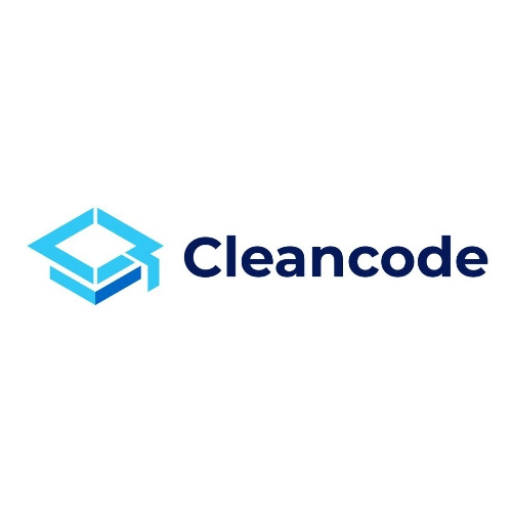
</div>

#### 6.2.1.1. Coding standard & Code conventions.

Las convenciones de codificación adoptadas en Veyra se definieron para mantener uniformidad en todo el repositorio y facilitar la colaboración entre los integrantes del equipo. Estas reglas ayudaron a que el código fuera predecible, entendible y más sencillo de revisar durante las etapas de desarrollo y validación.

En el backend, se aplicaron convenciones compatibles con el ecosistema **Spring Boot** y con el estilo recomendado para Java. En el frontend, se mantuvo una estructura consistente para componentes, servicios, modelos y plantillas, siguiendo patrones de Angular. En ambos casos se priorizó el uso de nombres descriptivos en inglíés, alineados con el lenguaje ubicuo del dominio.

#### Principios aplicados

- Uso de nombres descriptivos para clases, míétodos, variables y endpoints.
- Separación clara entre capas de presentación, dominio y persistencia.
- Preferencia por funciones o míétodos pequeños y con una íºnica responsabilidad.
- Estructura de carpetas coherente con el bounded context o módulo funcional.
- Uso consistente de indentación, sangrí­a y formato en todo el proyecto.

#### Convenciones para Backend

| Elemento | Convención aplicada | Ejemplo |
|---|---|---|
| Clases | `PascalCase` | `ResidentController`, `MedicationService` |
| Interfaces | `PascalCase` | `UserRepository`, `HealthMetricService` |
| Míétodos | `camelCase` | `createResident()`, `findById()` |
| Variables | `camelCase` | `residentId`, `medicationStock` |
| Constantes | `SCREAMING_SNAKE_CASE` | `MAX_DOSAGE_LIMIT`, `JWT_SECRET` |
| Endpoints REST | `kebab-case` y plural | `/api/v1/residents`, `/api/v1/medications` |
| Paquetes | miníºsculas y estructurados por contexto | `com.veyra.nursing.application` |

#### Convenciones para Frontend

| Elemento | Convención aplicada | Ejemplo |
|---|---|---|
| Componentes Angular | `PascalCase` para clase y `kebab-case` para archivo | `resident-list.component.ts` |
| Servicios | `PascalCase` | `ResidentService` |
| Props y variables | `camelCase` | `residentName`, `currentPlan` |
| Clases CSS | `kebab-case` | `.resident-card`, `.plan-button` |
| Rutas | `kebab-case` | `/family-portal`, `/resident-profile` |

#### Criterios de calidad sintáctica

- Se evitó el uso de nombres ambiguos o abreviaturas innecesarias.
- Se mantuvo consistencia en el uso de comentarios, solo cuando agregaban valor.
- Se procuró no mezclar lógica de negocio con presentación.
- Se respetaron los formatos esperados por el framework en controladores, servicios y repositorios.
- Se procuró mantener el código listo para extensión futura sin depender de soluciones acopladas.

#### 6.2.1.2. Code Quality & Code Security.

La calidad del código en Veyra no se limitó al cumplimiento de estí­lo, sino que tambien incluyó criterios de mantenibilidad, robustez y seguridad. Esta visión permitió revisar si la implementación efectivamente protege los datos, minimiza errores y evita prácticas que puedan comprometer la operación del sistema.

#### Quality aspects evaluated

- Legibilidad y facilidad de mantenimiento.
- Cohesión de responsabilidades por clase o módulo.
- Reutilización de componentes comunes.
- Manejo consistente de excepciones.
- Validación de entradas y respuestas.
- Claridad en la separación entre lógica de negocio e infraestructura.

#### Security aspects evaluated

- Validación de datos antes de persistir o procesar información sensible.
- Protección de endpoints mediante autenticación y autorización.
- Uso de tokens y configuraciones seguras para acceso al backend.
- Evitar la exposición de secretos en el código fuente.
- Control de acceso sobre recursos crí­ticos relacionados con residentes, personal y míétricas de salud.
- Revisión de mensajes de error para no revelar información interna innecesaria.

#### Riesgos prevenidos mediante verificación estática

| Riesgo | Cómo se mitigó |
|---|---|
| Inconsistencia de nombres | Uso de nomenclatura uniforme en todo el repositorio |
| Código difí­cil de mantener | Separación por capas y funciones pequeñas |
| Validaciones incompletas | Revisión de entradas en controladores y servicios |
| Exposición de credenciales | Uso de variables de entorno y exclusión de secretos del repo |
| Acceso no autorizado | Revisión de seguridad en endpoints protegidos |
| Errores silenciosos | Manejo explí­cito de excepciones y respuestas controladas |

#### Buenas prácticas de seguridad aplicadas

- Nunca almacenar credenciales en texto plano dentro del repositorio.
- Utilizar variables de entorno para configuraciones sensibles.
- Validar tokens y permisos antes de exponer operaciones protegidas.
- Sanitizar y validar entradas provenientes del usuario.
- Limitar la información mostrada en respuestas de error.
- Revisar dependencias y configuraciones antes de integrarlas al proyecto.

En conjunto, esta etapa de análisis permitió mejorar la confiabilidad del producto, ya que un código más limpio y seguro reduce el costo de mantenimiento y baja la probabilidad de defectos crí­ticos en etapas posteriores.

### 6.2.2. Reviews

Las revisiones de código constituyeron una parte clave del proceso de verificación estática en Veyra. A travíés de estas revisiones, el equipo pudo validar que cada cambio cumpliera con los estándares definidos antes de integrarse a la rama principal del proyecto.

Las reviews se realizaron durante el flujo habitual de trabajo con GitHub, principalmente mediante Pull Requests, donde se evaluaron la corrección funcional, el impacto en la arquitectura, la legibilidad del cambio y su alineación con los requisitos del sistema.

#### Objetivos de las reviews

- Confirmar que la implementación resuelve correctamente la necesidad planteada.
- Detectar errores lógicos o inconsistencias antes de fusionar cambios.
- Verificar el cumplimiento de las convenciones del proyecto.
- Revisar el impacto en seguridad, dependencias y estructura.
- Asegurar que el cambio no rompa comportamiento existente.

#### Aspectos revisados

| Aspecto | Descripción |
|---|---|
| Correctness | El cambio implementa lo solicitado sin alterar flujos crí­ticos. |
| Style | Se respetan convenciones de nombre, formato y organización. |
| Maintainability | La solución puede extenderse o refactorizarse fácilmente. |
| Security | No se introducen accesos inseguros o datos sensibles expuestos. |
| Consistency | El cambio encaja con patrones y decisiones tíécnicas previas. |
| Traceability | El commit o PR está vinculado a la historia o tarea correspondiente. |

#### Flujo de revisión aplicado

1. El desarrollador implementa el cambio en una rama de trabajo.
2. Se crea un Pull Request para solicitar revisión.
3. El equipo verifica el diff, el impacto funcional y la calidad del código.
4. Se solicitan ajustes si se detectan inconsistencias o riesgos.
5. Tras la aprobación, el cambio se fusiona a la rama correspondiente.

#### Resultado de las revisiones

Las revisiones permitieron detectar observaciones menores de estilo, ajustar nombres de variables, reforzar validaciones y ordenar mejor ciertos bloques de lógica. Gracias a este proceso, se mantuvo una base de código más estable y alineada con los objetivos del proyecto.

En particular, las reviews ayudaron a asegurar que los módulos relacionados con autenticación, gestión de residentes, seguimiento de salud y administración de medicamentos conservaran un comportamiento coherente y una implementación comprensible para el equipo.

En conclusión, la verificación estática y las revisiones fortalecieron la calidad global de Veyra antes de la ejecución de pruebas dinámicas, reduciendo el riesgo de errores tardí­os y contribuyendo a una entrega de software más confiable.
