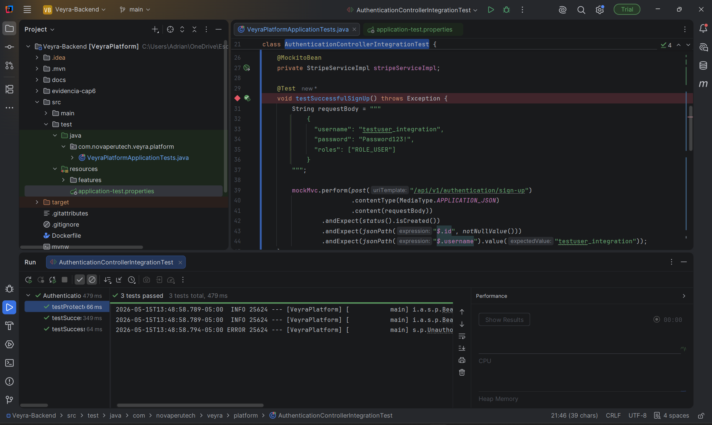
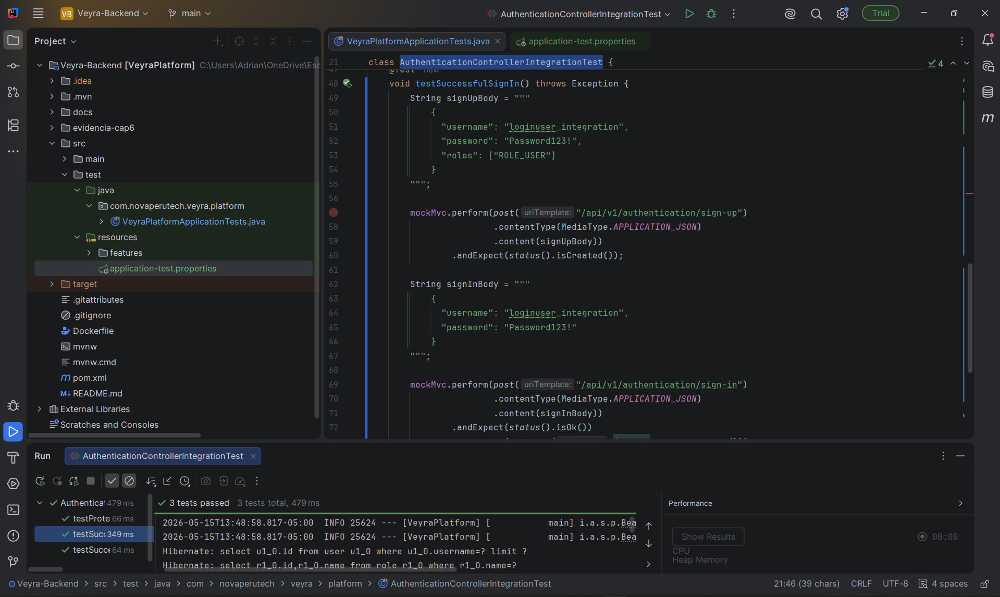
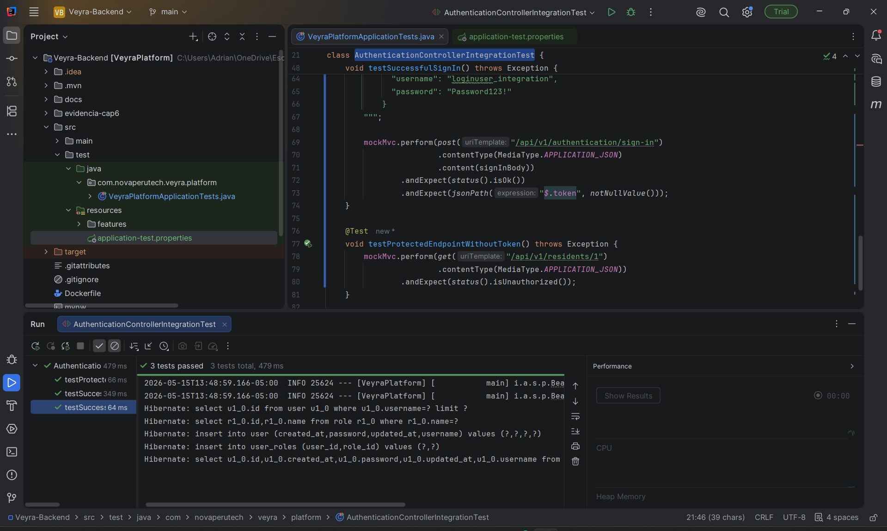

# Capítulo VI: Product Verification & Validation
## 6.1. Testing Suites & Validation
### 6.1.1. Core Entities Unit Tests.
En esta sección se implementaron y ejecutaron pruebas unitarias para las entidades principales del sistema desarrolladas en Java utilizando el framework Spring Boot. Estas pruebas estuvieron enfocadas en validar el correcto funcionamiento de los modelos, clases de servicio y métodos principales de la aplicación de manera aislada.

El propósito de las pruebas unitarias fue asegurar que cada componente cumpla con los requisitos funcionales establecidos y que su lógica interna opere correctamente ante distintos escenarios de ejecución.

Para la implementación de las pruebas se utilizaron herramientas como:

JUnit 5 para la creación y ejecución de pruebas unitarias.
Mockito para simular dependencias y aislar componentes durante las pruebas.
Spring Boot Test para facilitar la integración de pruebas dentro del entorno Spring.

Las pruebas realizadas permitieron validar:

- La correcta creación y manipulación de entidades.
- El funcionamiento adecuado de métodos de servicios y repositorios.
- La validación de datos de entrada.
- El manejo de excepciones y errores.
- El cumplimiento de reglas de negocio definidas en el sistema.

Además, se emplearon mocks para evitar dependencias externas como conexiones a bases de datos o servicios externos, garantizando que las pruebas se enfoquen únicamente en la lógica de cada componente.

Los resultados obtenidos evidenciaron que las entidades principales del sistema funcionan correctamente bajo los escenarios evaluados, contribuyendo a mejorar la estabilidad, mantenibilidad y confiabilidad de la aplicación.

### 6.1.2. Core Integration Tests.

Las pruebas de integración fueron desarrolladas con el objetivo de validar la correcta comunicación entre los controladores REST, los servicios de aplicación, la configuración de seguridad y las dependencias principales del backend de Veyra. A diferencia de las pruebas unitarias, estas pruebas permiten comprobar el comportamiento del sistema cuando varios componentes trabajan en conjunto dentro del contexto de Spring Boot.

#### Evidencia de ejecución: `testSuccessfulSignUp()`

Este caso de prueba valida el flujo de **registro exitoso de usuario** dentro del backend de Veyra. La prueba envía una solicitud HTTP `POST` al endpoint de autenticación con datos válidos de usuario, verificando que el sistema pueda procesar el registro correctamente.

| Campo | Descripción |
|---|---|
| ID | ITC-01 |
| Clase de prueba | `AuthenticationControllerIntegrationTest` |
| Método evaluado | `testSuccessfulSignUp()` |
| Flujo relacionado | Registro de usuario |
| Módulos involucrados | Authentication Controller, User Service, repositorio de usuarios y configuración de seguridad |
| Tipo de prueba | Integration Test |
| Entrada | Credenciales válidas de registro |
| Resultado esperado | El sistema registra al usuario y retorna una respuesta HTTP exitosa |
| Estado | Aprobado |

<div align="center">
  
  <p><em>Figura: Ejecución satisfactoria de la prueba de integración para el registro de usuario.</em></p>
</div>

La ejecución satisfactoria de este caso confirma que el backend puede recibir una solicitud de registro, procesarla mediante la lógica de autenticación y devolver una respuesta válida. Esto evidencia la correcta integración entre la capa REST, el servicio de usuarios y la persistencia asociada.

#### Evidencia de ejecución: `testSuccessfulSignIn()`

Este caso de prueba valida el flujo de **inicio de sesión exitoso** dentro del backend de Veyra. La prueba primero registra un usuario de prueba y luego envía una solicitud HTTP `POST` al endpoint de inicio de sesión con credenciales válidas.

| Campo | Descripción |
|---|---|
| ID | ITC-02 |
| Clase de prueba | `AuthenticationControllerIntegrationTest` |
| Método evaluado | `testSuccessfulSignIn()` |
| Flujo relacionado | Inicio de sesión |
| Módulos involucrados | Authentication Controller, User Service, JWT, seguridad y repositorio de usuarios |
| Tipo de prueba | Integration Test |
| Entrada | Usuario registrado y credenciales válidas |
| Resultado esperado | El sistema autentica al usuario y retorna un token de acceso |
| Estado | Aprobado |

<div align="center">
  
  <p><em>Figura: Ejecución satisfactoria de la prueba de integración para el inicio de sesión.</em></p>
</div>

La ejecución satisfactoria de este caso confirma que el backend puede autenticar usuarios registrados y generar una respuesta válida para el acceso al sistema. Este flujo es crítico porque habilita el ingreso seguro a los módulos protegidos de Veyra.

#### Evidencia de ejecución: `testProtectedEndpointWithoutToken()`

Este caso de prueba valida el comportamiento de seguridad del backend cuando se intenta acceder a un endpoint protegido sin enviar un token de autenticación. La prueba realiza una solicitud HTTP `GET` a un recurso protegido sin incluir encabezado `Authorization`.

| Campo | Descripción |
|---|---|
| ID | ITC-03 |
| Clase de prueba | `AuthenticationControllerIntegrationTest` |
| Método evaluado | `testProtectedEndpointWithoutToken()` |
| Flujo relacionado | Protección de endpoints |
| Módulos involucrados | Spring Security, filtros de autenticación, endpoint protegido y configuración JWT |
| Tipo de prueba | Integration Test |
| Entrada | Solicitud sin token de autenticación |
| Resultado esperado | El sistema rechaza la solicitud y retorna una respuesta de no autorizado |
| Estado | Aprobado |

<div align="center">
  
  <p><em>Figura: Ejecución satisfactoria de la prueba de integración para endpoint protegido sin token.</em></p>
</div>

La ejecución satisfactoria de este caso confirma que el backend aplica correctamente las reglas de seguridad sobre endpoints protegidos. Esto permite validar que los recursos sensibles del sistema no puedan ser consultados por usuarios no autenticados.

#### Resumen de pruebas ejecutadas

| ID | Caso de prueba | Flujo validado | Resultado |
|---|---|---|---|
| ITC-01 | `testSuccessfulSignUp()` | Registro de usuario | Aprobado |
| ITC-02 | `testSuccessfulSignIn()` | Inicio de sesión y generación de token | Aprobado |
| ITC-03 | `testProtectedEndpointWithoutToken()` | Bloqueo de acceso sin autenticación | Aprobado |

Las tres pruebas de integración fueron ejecutadas correctamente desde IntelliJ IDEA. Los resultados obtenidos permiten evidenciar que el módulo de autenticación del backend de Veyra mantiene una integración funcional entre controladores REST, servicios de aplicación, seguridad JWT y persistencia de usuarios.

### 6.1.3. Core Behavior-Driven Development

En esta sección se definen los escenarios de prueba utilizando el lenguaje Gherkin (Given-When-Then) para asegurar que el comportamiento del sistema cumpla con los criterios de aceptación de las Historias de Usuario principales (Core).

#### Epic: Resident Health Tracking

**User Story:** As a nursing home staff member, I want to record daily health metrics for residents so that their health status is constantly monitored.

```gherkin
Feature: Health Metric Registration

  Scenario: Staff registers a resident's daily vital signs successfully
    Given the staff member is on the resident's profile page
    And the resident has an active status in the system
    When the staff member enters the daily vital signs including blood pressure and temperature
    And clicks the "Save Metrics" button
    Then the system should save the new health record in the database
    And the system should display a "Health metrics updated successfully" message

  Scenario: Attempting to save metrics with missing required data
    Given the staff member is on the resident's profile page
    When the staff member leaves the "blood pressure" field empty
    And clicks the "Save Metrics" button
    Then the system should prevent the submission
    And the system should display a "Blood pressure is required" validation error
```

#### Epic: Family Communication

**User Story:** As a family member, I want to view my relative's daily activity logs so that I can stay informed about their well-being.
```gherkin
Feature: Family Portal Activity Viewing

  Scenario: Family member checks daily activities
    Given the family member is authenticated in the family portal
    And their account is linked to an active resident
    When the family member navigates to the "Daily Logs" section
    Then the system should display a chronological list of the resident's activities for the current day
```

### 6.1.4. Core System Tests.
