# Capítulo VI: Product Verification & Validation
## 6.1. Testing Suites & Validation
### 6.1.1. Core Entities Unit Tests.
En esta sección se implementaron y ejecutaron pruebas unitarias para las entidades principales del sistema desarrolladas en Java utilizando el framework Spring Boot. Estas pruebas estuvieron enfocadas en validar el correcto funcionamiento de los modelos, clases de servicio y métodos principales de la aplicación de manera aislada.

El propósito de las pruebas unitarias fue asegurar que cada componente cumpla con los requisitos funcionales establecidos y que su lógica interna opere correctamente ante distintos escenarios de ejecución.

Para la implementación de las pruebas se utilizaron herramientas como:

JUnit 5 para la creación y ejecución de pruebas unitarias.
Mockito para simular dependencias y aislar componentes durante las pruebas.
Spring Boot Test para facilitar la integración de pruebas dentro del entorno Spring.

Las pruebas realizadas permitieron validar:

- La correcta creación y manipulación de entidades.
- El funcionamiento adecuado de métodos de servicios y repositorios.
- La validación de datos de entrada.
- El manejo de excepciones y errores.
- El cumplimiento de reglas de negocio definidas en el sistema.

Además, se emplearon mocks para evitar dependencias externas como conexiones a bases de datos o servicios externos, garantizando que las pruebas se enfoquen únicamente en la lógica de cada componente.

<div align="center">
  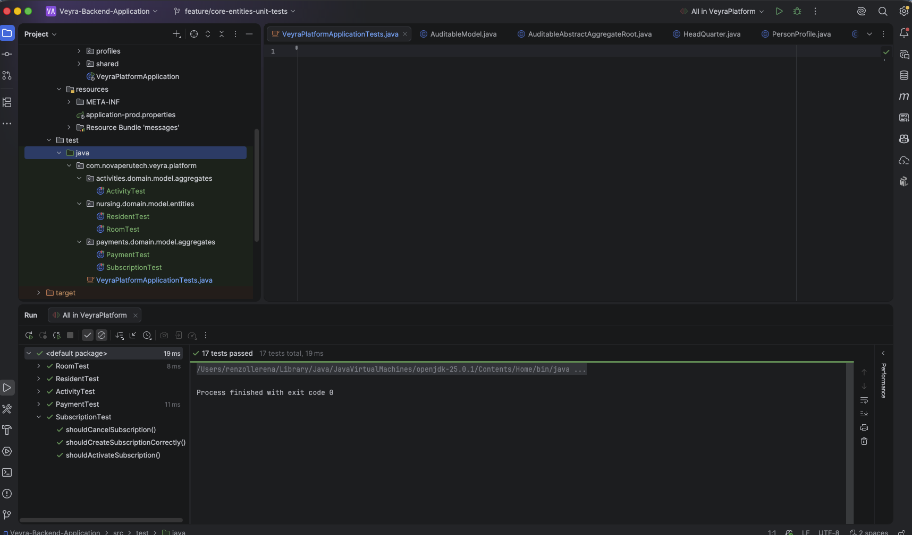
  <p><em>Figura: Ejecución satisfactoria de las pruebas de entidades principales.</em></p>
</div>


Los resultados obtenidos evidenciaron que las entidades principales del sistema funcionan correctamente bajo los escenarios evaluados, contribuyendo a mejorar la estabilidad, mantenibilidad y confiabilidad de la aplicación.

### 6.1.2. Core Integration Tests.

Las pruebas de integración fueron desarrolladas con el objetivo de validar la correcta comunicación entre los controladores REST, los servicios de aplicación, la configuración de seguridad, la persistencia de datos y las dependencias principales del backend de Veyra. A diferencia de las pruebas unitarias, estas pruebas permiten comprobar el comportamiento del sistema cuando varios componentes trabajan en conjunto dentro del contexto de Spring Boot.

Para esta validación se implementó la clase `CoreIntegrationTests`, orientada a verificar flujos esenciales del sistema, tanto técnicos como funcionales. En particular, se evaluaron procesos de autenticación, generación de token, restricción de acceso a endpoints protegidos, registro de casas de reposo, creación de residentes y registro de medicamentos asociados a un residente.

#### Evidencia de ejecución: `testSuccessfulSignUp()`

Este caso de prueba valida el flujo de **registro exitoso de usuario** dentro del backend de Veyra. La prueba envía una solicitud HTTP `POST` al endpoint de autenticación con datos válidos de usuario, verificando que el sistema pueda procesar el registro correctamente.

| Campo | Descripción |
|---|---|
| ID | ITC-01 |
| Clase de prueba | `AuthenticationControllerIntegrationTest` |
| Método evaluado | `testSuccessfulSignUp()` |
| Flujo relacionado | Registro de usuario |
| Módulos involucrados | Authentication Controller, User Service, repositorio de usuarios y configuración de seguridad |
| Tipo de prueba | Integration Test |
| Entrada | Credenciales válidas de registro |
| Resultado esperado | El sistema registra al usuario y retorna una respuesta HTTP exitosa |
| Estado | Aprobado |

<div align="center">
  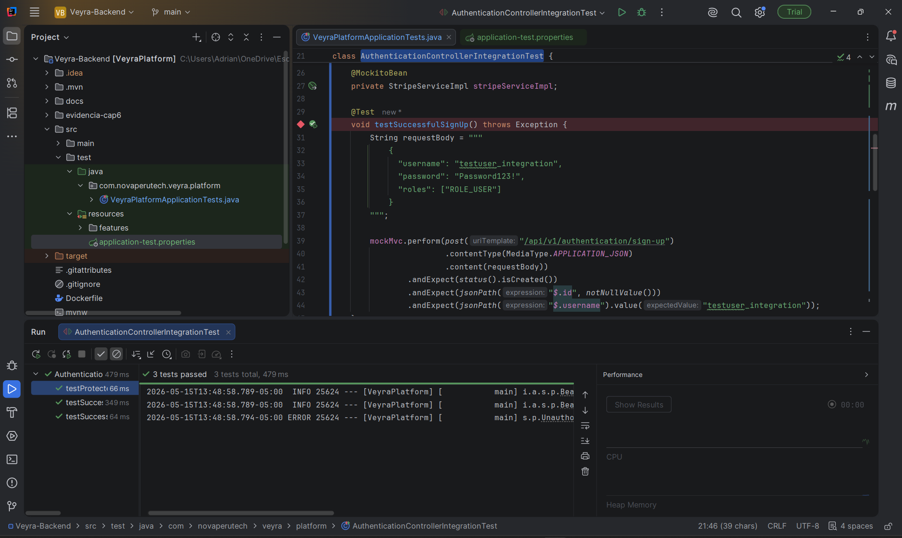
  <p><em>Figura: Ejecución satisfactoria de la prueba de integración para el registro de usuario.</em></p>
</div>

La ejecución satisfactoria de este caso confirma que el backend puede recibir una solicitud de registro, procesarla mediante la lógica de autenticación y devolver una respuesta válida. Esto evidencia la correcta integración entre la capa REST, el servicio de usuarios y la persistencia asociada.

#### Evidencia de ejecución: `testSuccessfulSignIn()`

Este caso de prueba valida el flujo de **inicio de sesión exitoso** dentro del backend de Veyra. La prueba primero registra un usuario de prueba y luego envía una solicitud HTTP `POST` al endpoint de inicio de sesión con credenciales válidas.

| Campo | Descripción |
|---|---|
| ID | ITC-02 |
| Clase de prueba | `AuthenticationControllerIntegrationTest` |
| Método evaluado | `testSuccessfulSignIn()` |
| Flujo relacionado | Inicio de sesión |
| Módulos involucrados | Authentication Controller, User Service, JWT, seguridad y repositorio de usuarios |
| Tipo de prueba | Integration Test |
| Entrada | Usuario registrado y credenciales válidas |
| Resultado esperado | El sistema autentica al usuario y retorna un token de acceso |
| Estado | Aprobado |

<div align="center">
  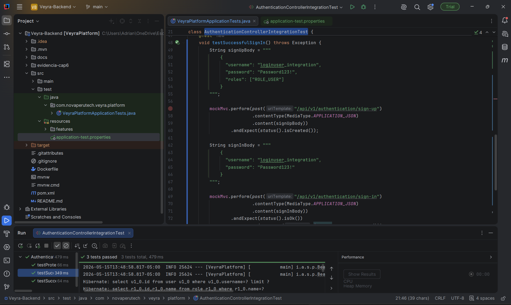
  <p><em>Figura: Ejecución satisfactoria de la prueba de integración para el inicio de sesión.</em></p>
</div>

La ejecución satisfactoria de este caso confirma que el backend puede autenticar usuarios registrados y generar una respuesta válida para el acceso al sistema. Este flujo es crítico porque habilita el ingreso seguro a los módulos protegidos de Veyra.

#### Evidencia de ejecución: `testProtectedEndpointWithoutToken()`

Este caso de prueba valida el comportamiento de seguridad del backend cuando se intenta acceder a un endpoint protegido sin enviar un token de autenticación. La prueba realiza una solicitud HTTP `GET` a un recurso protegido sin incluir encabezado `Authorization`.

| Campo | Descripción |
|---|---|
| ID | ITC-03 |
| Clase de prueba | `AuthenticationControllerIntegrationTest` |
| Método evaluado | `testProtectedEndpointWithoutToken()` |
| Flujo relacionado | Protección de endpoints |
| Módulos involucrados | Spring Security, filtros de autenticación, endpoint protegido y configuración JWT |
| Tipo de prueba | Integration Test |
| Entrada | Solicitud sin token de autenticación |
| Resultado esperado | El sistema rechaza la solicitud y retorna una respuesta de no autorizado |
| Estado | Aprobado |

<div align="center">
  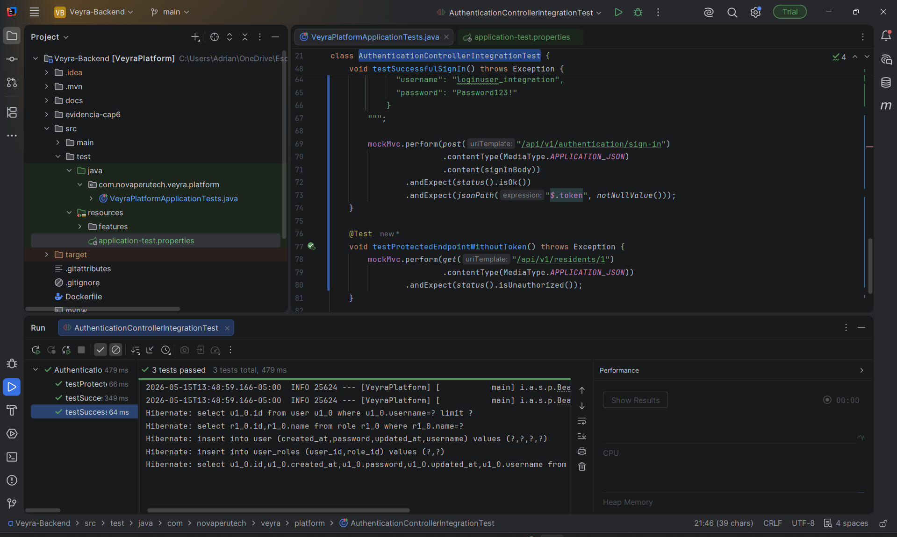
  <p><em>Figura: Ejecución satisfactoria de la prueba de integración para endpoint protegido sin token.</em></p>
</div>

La ejecución satisfactoria de este caso confirma que el backend aplica correctamente las reglas de seguridad sobre endpoints protegidos. Esto permite validar que los recursos sensibles del sistema no puedan ser consultados por usuarios no autenticados.

#### Evidencia de ejecución: `testSuccessfulCreateNursingHome()`

Este caso de prueba valida el flujo de **registro de una casa de reposo** dentro del backend de Veyra. Este flujo representa el proceso de onboarding institucional, mediante el cual una residencia geriátrica puede quedar registrada en la plataforma para posteriormente gestionar residentes, personal, actividades y servicios asociados.

| Campo | Descripción |
|---|---|
| ID | ITC-04 |
| Clase de prueba | `NursingHomeControllerIntegrationTest` |
| Método evaluado | `testSuccessfulCreateNursingHome()` |
| Flujo relacionado | Registro de casa de reposo |
| Módulos involucrados | Nursing Home Controller, servicio de casas de reposo, persistencia y validaciones de dominio |
| Tipo de prueba | Integration Test |
| Entrada | Datos válidos de la institución geriátrica |
| Resultado esperado | El sistema registra la casa de reposo y retorna una respuesta HTTP exitosa |
| Estado | Aprobado |

<div align="center">
  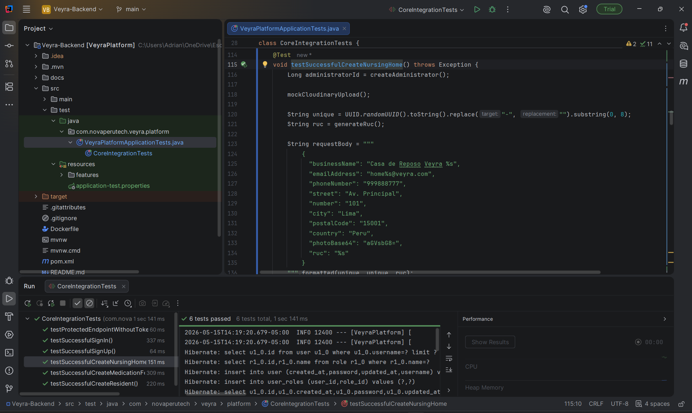
  <p><em>Figura: Ejecución satisfactoria de la prueba de integración para el registro de casa de reposo.</em></p>
</div>

La ejecución satisfactoria de este caso confirma que el backend permite registrar correctamente una institución geriátrica dentro de la plataforma. Esto valida uno de los flujos principales del modelo SaaS de Veyra, ya que cada casa de reposo representa una organización cliente dentro del sistema.

#### Evidencia de ejecución: `testSuccessfulCreateResident()`

Este caso de prueba valida el flujo de **registro de residente** dentro del backend de Veyra. La prueba comprueba que el sistema pueda recibir los datos principales de un adulto mayor y almacenarlos correctamente, permitiendo su posterior gestión clínica, administrativa y asistencial.

| Campo | Descripción |
|---|---|
| ID | ITC-05 |
| Clase de prueba | `ResidentControllerIntegrationTest` |
| Método evaluado | `testSuccessfulCreateResident()` |
| Flujo relacionado | Registro de residente |
| Módulos involucrados | Resident Controller, servicio de residentes, perfil del residente, persistencia y validaciones |
| Tipo de prueba | Integration Test |
| Entrada | Datos válidos del residente |
| Resultado esperado | El sistema registra al residente y retorna una respuesta HTTP exitosa |
| Estado | Aprobado |

<div align="center">
  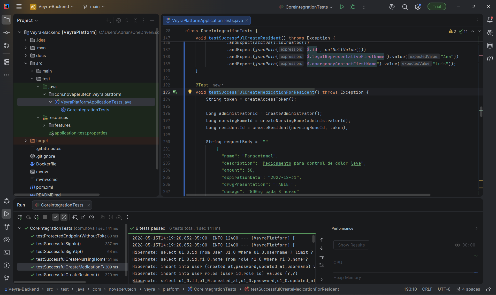
  <p><em>Figura: Ejecución satisfactoria de la prueba de integración para el registro de residente.</em></p>
</div>

La ejecución satisfactoria de este caso confirma que Veyra puede registrar residentes dentro del sistema, lo cual constituye una funcionalidad central para la gestión de casas de reposo. Este flujo es relevante porque permite centralizar la información del adulto mayor y sirve como base para módulos posteriores como seguimiento médico, actividades, comunicaciones familiares y reportes.

#### Evidencia de ejecución: `testSuccessfulRegisterHealthMetric()`

Este caso de prueba valida el flujo de **registro de métricas de salud** de un residente. La prueba comprueba que el sistema pueda recibir y almacenar información clínica relacionada con el seguimiento del adulto mayor, como presión arterial, temperatura, frecuencia cardiaca u otros indicadores relevantes.

| Campo | Descripción |
|---|---|
| ID | ITC-06 |
| Clase de prueba | `HealthTrackingIntegrationTest` |
| Método evaluado | `testSuccessfulRegisterHealthMetric()` |
| Flujo relacionado | Registro de métricas de salud |
| Módulos involucrados | Tracking Controller, servicio de métricas de salud, repositorio de mediciones y persistencia |
| Tipo de prueba | Integration Test |
| Entrada | Datos válidos de una medición clínica |
| Resultado esperado | El sistema registra la métrica de salud y retorna una respuesta HTTP exitosa |
| Estado | Aprobado |

<div align="center">
  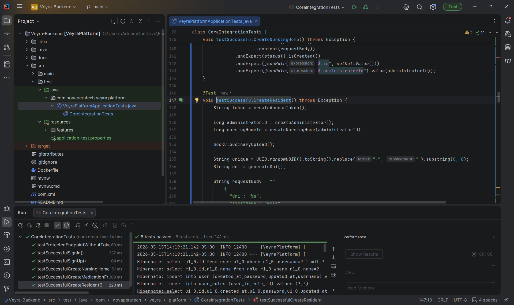
  <p><em>Figura: Ejecución satisfactoria de la prueba de integración para el registro de métricas de salud.</em></p>
</div>

La ejecución satisfactoria de este caso confirma que el backend permite registrar información clínica relevante para el monitoreo del residente. Este flujo se relaciona directamente con el valor de negocio de Veyra, ya que facilita el seguimiento continuo del estado de salud del adulto mayor y contribuye a una toma de decisiones más informada por parte del personal asistencial.

#### Resumen de pruebas de integración ejecutadas

| ID | Caso de prueba | Flujo validado | Enfoque | Resultado |
|---|---|---|---|---|
| ITC-01 | `testSuccessfulSignUp()` | Registro de usuario | Seguridad y acceso | Aprobado |
| ITC-02 | `testSuccessfulSignIn()` | Inicio de sesión y generación de token | Seguridad y acceso | Aprobado |
| ITC-03 | `testProtectedEndpointWithoutToken()` | Bloqueo de acceso sin autenticación | Seguridad de endpoints | Aprobado |
| ITC-04 | `testSuccessfulCreateNursingHome()` | Registro de casa de reposo | Onboarding institucional | Aprobado |
| ITC-05 | `testSuccessfulCreateResident()` | Registro de residente | Gestión del adulto mayor | Aprobado |
| ITC-06 | `testSuccessfulRegisterHealthMetric()` | Registro de métrica de salud | Seguimiento clínico | Aprobado |

Las pruebas de integración ejecutadas permiten validar flujos técnicos y de negocio relevantes para el backend de Veyra. Los casos relacionados con autenticación comprueban el acceso seguro al sistema, mientras que los casos orientados al negocio validan procesos centrales como el registro de instituciones, la gestión de residentes y el seguimiento clínico de adultos mayores.

### 6.1.3. Core Behavior-Driven Development

En esta sección se definen los escenarios de prueba utilizando el lenguaje Gherkin (Given-When-Then) para asegurar que el comportamiento del sistema cumpla con los criterios de aceptación de las Historias de Usuario principales (Core).

#### Epic: Medication Management

**User Story (US14):** As an administrator, I want to control the medication intake of the residents to ensure treatment compliance.

```gherkin
Feature: Health Metric Registration

  Scenario: Administrator successfully registers a medication intake
    Given the administrator is on the medication management module
    And the medication has available stock
    When the administrator registers a new dose intake for the resident
    Then the system should decrease the medication stock by one unit
    And the system should save the date and time of the intake
    And the system should display a "Medication registered successfully" message

  Scenario: Attempting to register a medication intake with no stock
    Given the administrator is on the medication management module
    And the selected medication has zero stock
    When the administrator attempts to register a new dose intake
    Then the system should prevent the registration
    And the system should display an "Out of stock" warning message
```

#### Epic: Family Communication

**User Story (US20):** As a family member, I want to send direct questions to the staff about my relative's daily routine to resolve specific doubts.
```gherkin
Feature: Family Portal Activity Viewing

  Scenario: Family member sends a direct question to the staff
    Given the family member is authenticated in the family portal
    And is viewing their relative's profile
    When the family member submits a question via the direct message form
    Then the system should send the message to the assigned staff member
    And the system should display a "Message sent successfully" confirmation
```

### 6.1.4. Core System Tests.

<div align="center">
  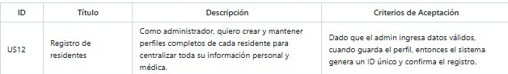
</div>
<div align="center">
  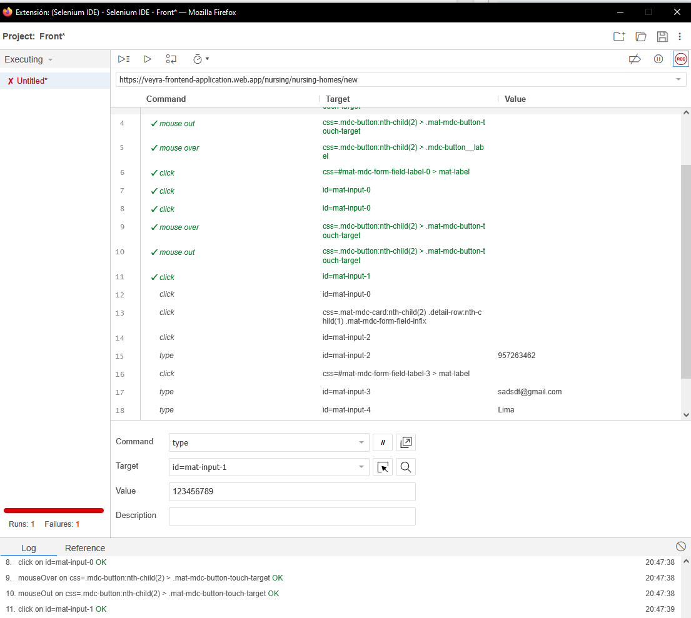
</div>

<br>
<br>

<div align="center">
  
</div>
<div align="center">
  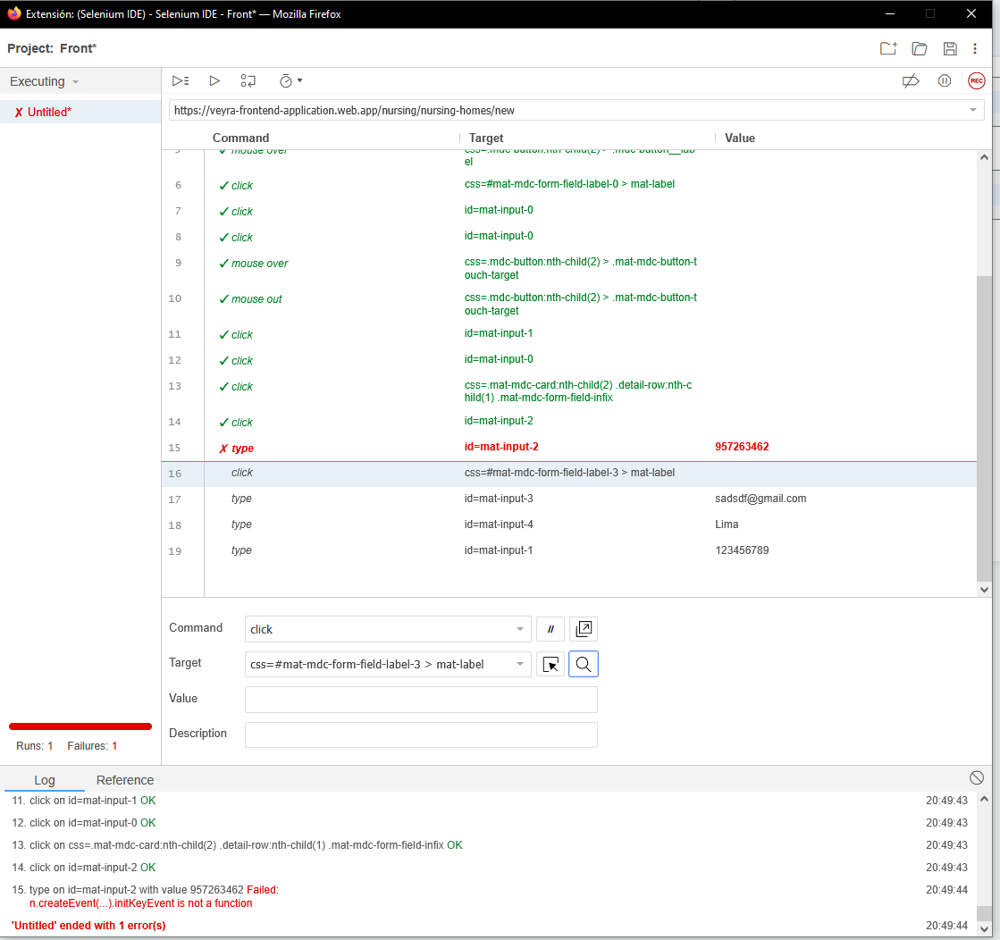
</div>

<br>
<br>

<div align="center">
  
</div>
<div align="center">
  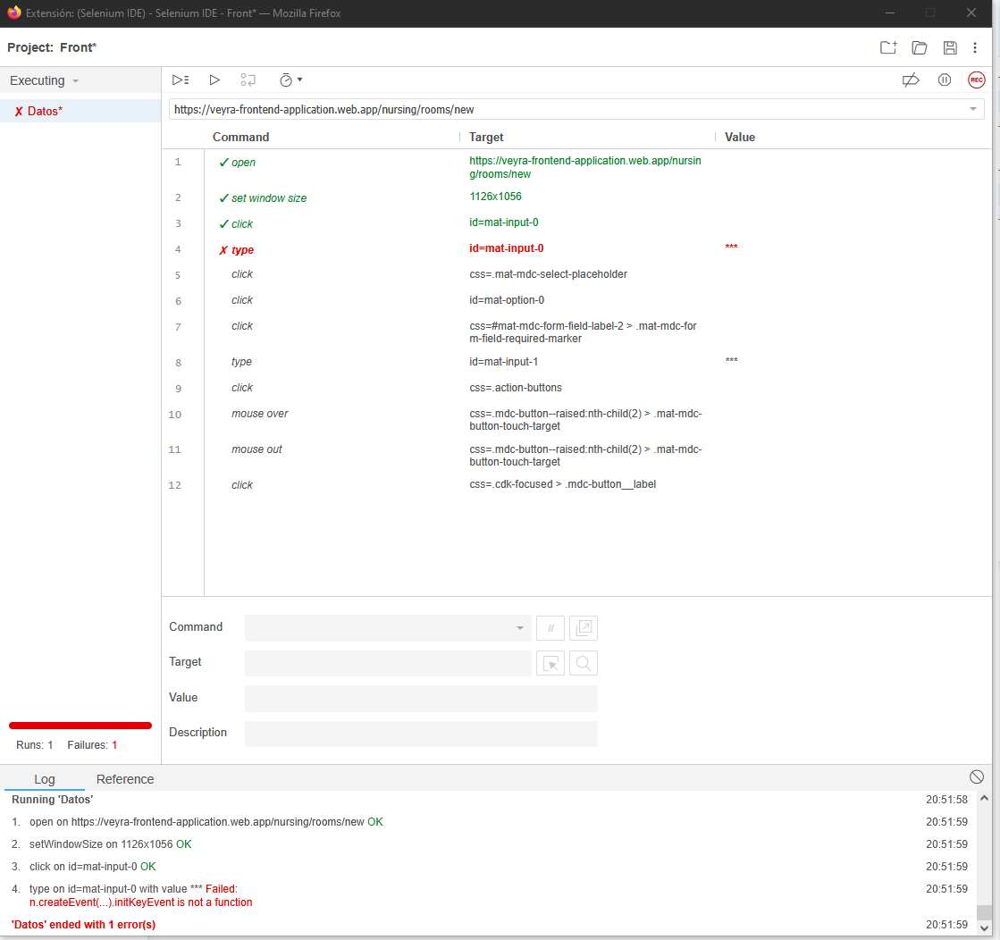
</div>

<br>
<br>

<div align="center">
  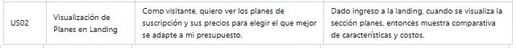
</div>
<div align="center">
  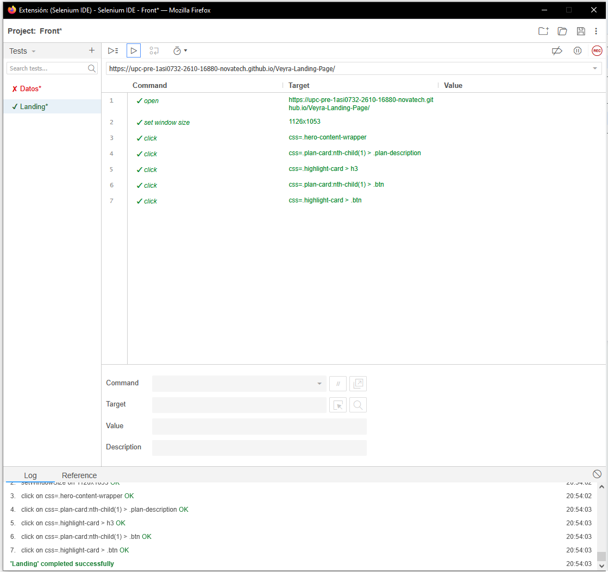
</div>

<br>
<br>

<div align="center">
  
</div>
<div align="center">
  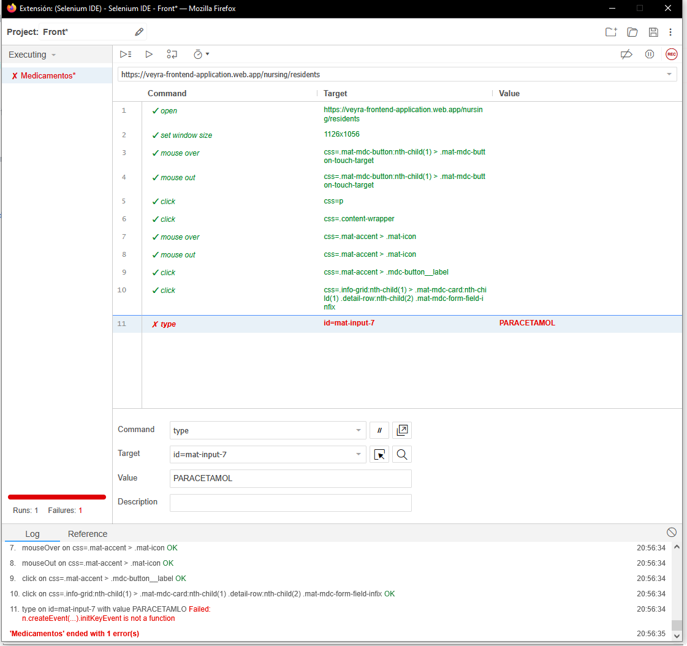
</div>


## 6.2. Static testing & Verification

La verificación estática del software se enfoca en evaluar la calidad del código fuente sin necesidad de ejecutar la aplicación. Este enfoque permite detectar defectos tempranos relacionados con estilo, convenciones, diseño, mantenibilidad, posibles vulnerabilidades y consistencia general antes de que el código llegue a las etapas de compilación o prueba dinámica.

En el proyecto **Veyra**, esta práctica se consideró parte esencial del aseguramiento de calidad, ya que el backend fue desarrollado con **Java** y **Spring Boot**, mientras que el frontend utiliza tecnologí­as modernas que requieren disciplina en nomenclatura, organización y revisión. La verificación estática ayudó a reducir retrabajos, mantener la coherencia entre módulos y reforzar la seguridad del producto desde el diseño del código.

Las actividades principales de esta etapa fueron:

- Revisiónn del cumplimiento de estándares de codificación.
- Validación de convenciones de nombres, estructura y legibilidad.
- Detección temprana de code smells y deuda tíécnica.
- Identificación de posibles riesgos de seguridad.
- Revisión manual del código por parte del equipo.

<div align="center">
  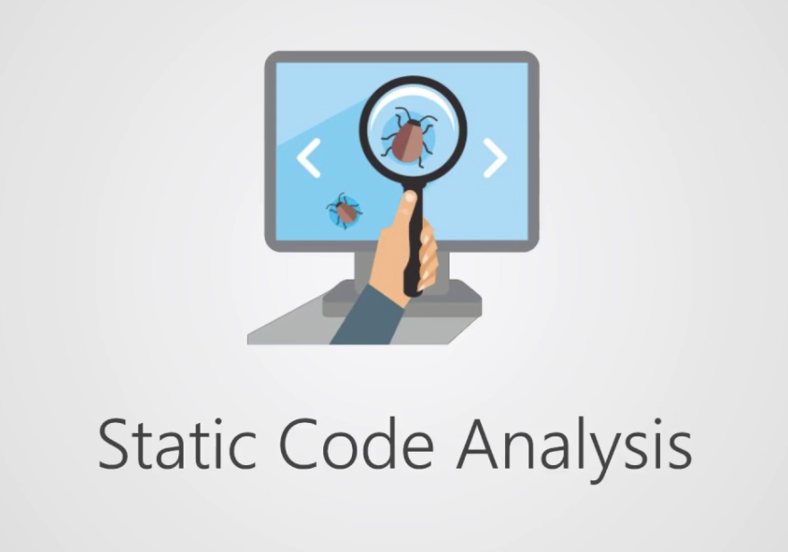
</div>

### 6.2.1. Static Code Analysis

El análisis estático del código consistió en revisar la base de código del proyecto Veyra sin ejecutar el sistema, con el objetivo de asegurar que la implementación mantenga un nivel aceptable de calidad tíécnica. Esta revisión se centró en la estructura del código, la claridad de los nombres, la coherencia entre capas, el uso correcto de patrones del framework y la detección de riesgos comunes en aplicaciones web.

Para este propósito se aplicaron criterios de inspección manual y buenas prácticas ampliamente aceptadas para Java, Spring Boot, TypeScript, Angular, HTML, CSS y Gherkin. Adicionalmente, se tomaron como referencia principios de diseño limpio, separación de responsabilidades y minimización de acoplamiento entre componentes.

Los beneficios de este análisis fueron:

- Mayor claridad en la arquitectura del código.
- Menor probabilidad de errores por estilo inconsistente.
- Detección temprana de código duplicado o difí­cil de mantener.
- Refuerzo del cumplimiento de buenas prácticas de seguridad.
- Mejora general de la trazabilidad entre requisitos y código.

<div align="center">
  
</div>

#### 6.2.1.1. Coding standard & Code conventions.

Las convenciones de codificación adoptadas en Veyra se definieron para mantener uniformidad en todo el repositorio y facilitar la colaboración entre los integrantes del equipo. Estas reglas ayudaron a que el código fuera predecible, entendible y más sencillo de revisar durante las etapas de desarrollo y validación.

En el backend, se aplicaron convenciones compatibles con el ecosistema **Spring Boot** y con el estilo recomendado para Java. En el frontend, se mantuvo una estructura consistente para componentes, servicios, modelos y plantillas, siguiendo patrones de Angular. En ambos casos se priorizó el uso de nombres descriptivos en inglíés, alineados con el lenguaje ubicuo del dominio.

#### Principios aplicados

- Uso de nombres descriptivos para clases, míétodos, variables y endpoints.
- Separación clara entre capas de presentación, dominio y persistencia.
- Preferencia por funciones o míétodos pequeños y con una íºnica responsabilidad.
- Estructura de carpetas coherente con el bounded context o módulo funcional.
- Uso consistente de indentación, sangrí­a y formato en todo el proyecto.

#### Convenciones para Backend

| Elemento | Convención aplicada | Ejemplo |
|---|---|---|
| Clases | `PascalCase` | `ResidentController`, `MedicationService` |
| Interfaces | `PascalCase` | `UserRepository`, `HealthMetricService` |
| Míétodos | `camelCase` | `createResident()`, `findById()` |
| Variables | `camelCase` | `residentId`, `medicationStock` |
| Constantes | `SCREAMING_SNAKE_CASE` | `MAX_DOSAGE_LIMIT`, `JWT_SECRET` |
| Endpoints REST | `kebab-case` y plural | `/api/v1/residents`, `/api/v1/medications` |
| Paquetes | miníºsculas y estructurados por contexto | `com.veyra.nursing.application` |

#### Convenciones para Frontend

| Elemento | Convención aplicada | Ejemplo |
|---|---|---|
| Componentes Angular | `PascalCase` para clase y `kebab-case` para archivo | `resident-list.component.ts` |
| Servicios | `PascalCase` | `ResidentService` |
| Props y variables | `camelCase` | `residentName`, `currentPlan` |
| Clases CSS | `kebab-case` | `.resident-card`, `.plan-button` |
| Rutas | `kebab-case` | `/family-portal`, `/resident-profile` |

#### Criterios de calidad sintáctica

- Se evitó el uso de nombres ambiguos o abreviaturas innecesarias.
- Se mantuvo consistencia en el uso de comentarios, solo cuando agregaban valor.
- Se procuró no mezclar lógica de negocio con presentación.
- Se respetaron los formatos esperados por el framework en controladores, servicios y repositorios.
- Se procuró mantener el código listo para extensión futura sin depender de soluciones acopladas.

#### 6.2.1.2. Code Quality & Code Security.

La calidad del código en Veyra no se limitó al cumplimiento de estí­lo, sino que tambien incluyó criterios de mantenibilidad, robustez y seguridad. Esta visión permitió revisar si la implementación efectivamente protege los datos, minimiza errores y evita prácticas que puedan comprometer la operación del sistema.

#### Quality aspects evaluated

- Legibilidad y facilidad de mantenimiento.
- Cohesión de responsabilidades por clase o módulo.
- Reutilización de componentes comunes.
- Manejo consistente de excepciones.
- Validación de entradas y respuestas.
- Claridad en la separación entre lógica de negocio e infraestructura.

#### Security aspects evaluated

- Validación de datos antes de persistir o procesar información sensible.
- Protección de endpoints mediante autenticación y autorización.
- Uso de tokens y configuraciones seguras para acceso al backend.
- Evitar la exposición de secretos en el código fuente.
- Control de acceso sobre recursos crí­ticos relacionados con residentes, personal y míétricas de salud.
- Revisión de mensajes de error para no revelar información interna innecesaria.

#### Riesgos prevenidos mediante verificación estática

| Riesgo | Cómo se mitigó |
|---|---|
| Inconsistencia de nombres | Uso de nomenclatura uniforme en todo el repositorio |
| Código difí­cil de mantener | Separación por capas y funciones pequeñas |
| Validaciones incompletas | Revisión de entradas en controladores y servicios |
| Exposición de credenciales | Uso de variables de entorno y exclusión de secretos del repo |
| Acceso no autorizado | Revisión de seguridad en endpoints protegidos |
| Errores silenciosos | Manejo explí­cito de excepciones y respuestas controladas |

#### Buenas prácticas de seguridad aplicadas

- Nunca almacenar credenciales en texto plano dentro del repositorio.
- Utilizar variables de entorno para configuraciones sensibles.
- Validar tokens y permisos antes de exponer operaciones protegidas.
- Sanitizar y validar entradas provenientes del usuario.
- Limitar la información mostrada en respuestas de error.
- Revisar dependencias y configuraciones antes de integrarlas al proyecto.

En conjunto, esta etapa de análisis permitió mejorar la confiabilidad del producto, ya que un código más limpio y seguro reduce el costo de mantenimiento y baja la probabilidad de defectos crí­ticos en etapas posteriores.

### 6.2.2. Reviews

Las revisiones de código constituyeron una parte clave del proceso de verificación estática en Veyra. A travíés de estas revisiones, el equipo pudo validar que cada cambio cumpliera con los estándares definidos antes de integrarse a la rama principal del proyecto.

Las reviews se realizaron durante el flujo habitual de trabajo con GitHub, principalmente mediante Pull Requests, donde se evaluaron la corrección funcional, el impacto en la arquitectura, la legibilidad del cambio y su alineación con los requisitos del sistema.

#### Objetivos de las reviews

- Confirmar que la implementación resuelve correctamente la necesidad planteada.
- Detectar errores lógicos o inconsistencias antes de fusionar cambios.
- Verificar el cumplimiento de las convenciones del proyecto.
- Revisar el impacto en seguridad, dependencias y estructura.
- Asegurar que el cambio no rompa comportamiento existente.

#### Aspectos revisados

| Aspecto | Descripción |
|---|---|
| Correctness | El cambio implementa lo solicitado sin alterar flujos crí­ticos. |
| Style | Se respetan convenciones de nombre, formato y organización. |
| Maintainability | La solución puede extenderse o refactorizarse fácilmente. |
| Security | No se introducen accesos inseguros o datos sensibles expuestos. |
| Consistency | El cambio encaja con patrones y decisiones tíécnicas previas. |
| Traceability | El commit o PR está vinculado a la historia o tarea correspondiente. |

#### Flujo de revisión aplicado

1. El desarrollador implementa el cambio en una rama de trabajo.
2. Se crea un Pull Request para solicitar revisión.
3. El equipo verifica el diff, el impacto funcional y la calidad del código.
4. Se solicitan ajustes si se detectan inconsistencias o riesgos.
5. Tras la aprobación, el cambio se fusiona a la rama correspondiente.

#### Resultado de las revisiones

Las revisiones permitieron detectar observaciones menores de estilo, ajustar nombres de variables, reforzar validaciones y ordenar mejor ciertos bloques de lógica. Gracias a este proceso, se mantuvo una base de código más estable y alineada con los objetivos del proyecto.

En particular, las reviews ayudaron a asegurar que los módulos relacionados con autenticación, gestión de residentes, seguimiento de salud y administración de medicamentos conservaran un comportamiento coherente y una implementación comprensible para el equipo.

En conclusión, la verificación estática y las revisiones fortalecieron la calidad global de Veyra antes de la ejecución de pruebas dinámicas, reduciendo el riesgo de errores tardí­os y contribuyendo a una entrega de software más confiable.

## 6.3. Validation Interviews. 
### 6.3.1. Diseño de Entrevistas. 

La entrevista tuvo como objetivo conocer la opinión del usuario sobre la aplicación Veyra. Para ello, se le mostraron las principales pantallas y funcionalidades de la plataforma y posteriormente se le preguntó qué le parecía, si la consideraba útil y qué aspectos mejoraría. Se utilizó una entrevista semiestructurada, permitiendo que la participante expresara libremente sus comentarios y recomendaciones. 
Las preguntas principales fueron: 
- ¿Qué te parece la aplicación? 
- ¿Consideras que sería útil para una casa de reposo? - ¿Qué funcionalidad te pareció más importante? 
- ¿Qué aspecto de la aplicación mejorarías? 
- ¿La información presentada te pareció clara?

### 6.3.2. Registro de Entrevistas. 

| Campo | Información |
|---|---|
| Nombre | Lucía |
| Apellido | Carbajal |
| Edad | 19 años |
| Distrito | Surquillo |
| Evidencia | 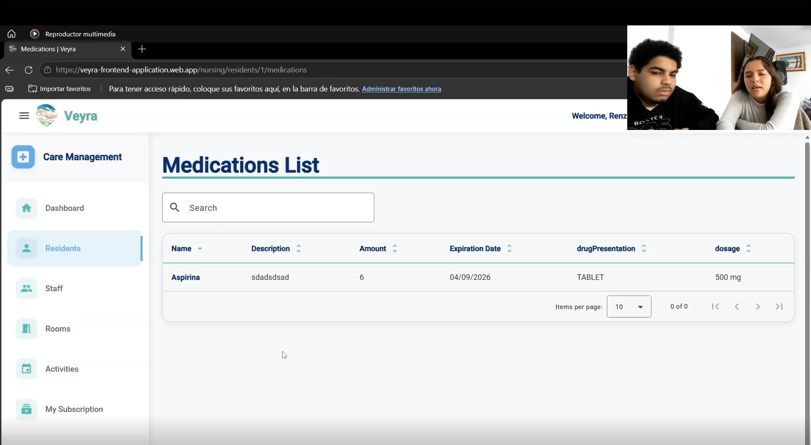 |
| Link | [Link Entrevistas](https://upcedupe-my.sharepoint.com/:v:/g/personal/u202210334_upc_edu_pe/IQBIUqqLXAH4SJPzByX9OzdGAUNio18RULQrItvzFyKrt3o?e=qwdetZ&nav=eyJyZWZlcnJhbEluZm8iOnsicmVmZXJyYWxBcHAiOiJTdHJlYW1XZWJBcHAiLCJyZWZlcnJhbFZpZXciOiJTaGFyZURpYWxvZy1MaW5rIiwicmVmZXJyYWxBcHBQbGF0Zm9ybSI6IldlYiIsInJlZmVycmFsTW9kZSI6InZpZXcifX0%3D) |
| Resumen | **Perfil y experiencia:**<br>Lucía Carbajal es una joven de 19 años que pertenece al segmento relacionado con la administración y gestión de casas de reposo. Ha realizado voluntariado en este tipo de instituciones, experiencia que le permitió conocer de cerca las actividades del personal y las necesidades de atención de los adultos mayores.<br><br>**Percepción y necesidades:**<br>Considera que la aplicación sería útil y de mucha ayuda para las casas de reposo, ya que permitiría organizar, centralizar y consultar la información de los residentes de manera más rápida. También facilitaría las labores del personal al reducir la dependencia de registros manuales y documentos separados.<br><br>**Mejoras propuestas:**<br>Como principal mejora, Lucía propone que la aplicación permita visualizar de manera más clara y detallada la información de los medicamentos, incluyendo sus nombres, dosis y horarios de administración. Asimismo, considera importante mejorar la visualización de los horarios de los trabajadores, para identificar fácilmente sus turnos, disponibilidad y responsabilidades. |


| Campo | Información |
|---|---|
| Nombre | Renato |
| Apellido | Palacios |
| Edad | 30 años |
| Distrito | Chorrillos |
| Evidencia | 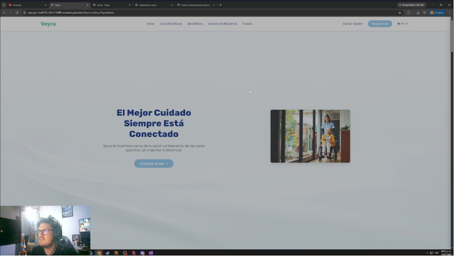 |
| Link | [Link Entrevistas](https://1drv.ms/f/c/2c6332e5e5a79287/IgD2yd1BY5a6Sr_hWajsS2ysAbeWTNuVf1aZDLJKQJSIz7k?e=jWO9O3) |
| Resumen | Renato Rentería consideró que la aplicación podría convertirse en una herramienta muy útil para modernizar la gestión de una casa de reposo. Resaltó que permitiría tener un mayor control sobre los residentes, trabajadores, pagos, actividades y demás procesos administrativos. También indicó que la digitalización de estos procedimientos ayudaría a ahorrar tiempo, disminuir errores y ofrecer una atención más organizada, segura y eficiente. |

| Campo | Información |
|---|---|
| Nombre | Alison |
| Apellido | Carbajal |
| Edad | 25 años |
| Distrito | Chorrillos |
| Evidencia | 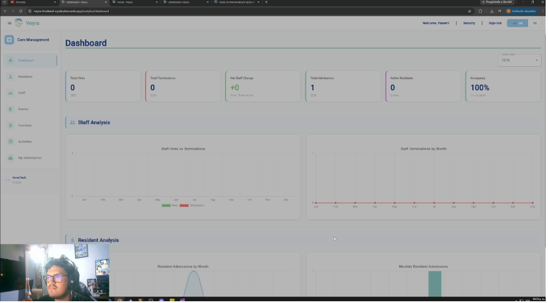 |
| Link | [Link Entrevistas](https://1drv.ms/f/c/2c6332e5e5a79287/IgD2yd1BY5a6Sr_hWajsS2ysAbeWTNuVf1aZDLJKQJSIz7k?e=jWO9O3) |
| Resumen | Alison Carbajal señaló que la aplicación presenta una propuesta clara, ordenada y fácil de comprender. Destacó principalmente su utilidad para llevar un mejor seguimiento de los adultos mayores y mantener actualizada su información. Asimismo, consideró positivo que el sistema ayude al personal administrativo y a los cuidadores a coordinar sus funciones, evitando pérdidas de información y mejorando la atención brindada a los residentes.|

| Campo | Información |
|---|---|
| Nombre | Paolo |
| Apellido | Carrillo |
| Edad | 25 años |
| Distrito | Surquillo |
| Evidencia | 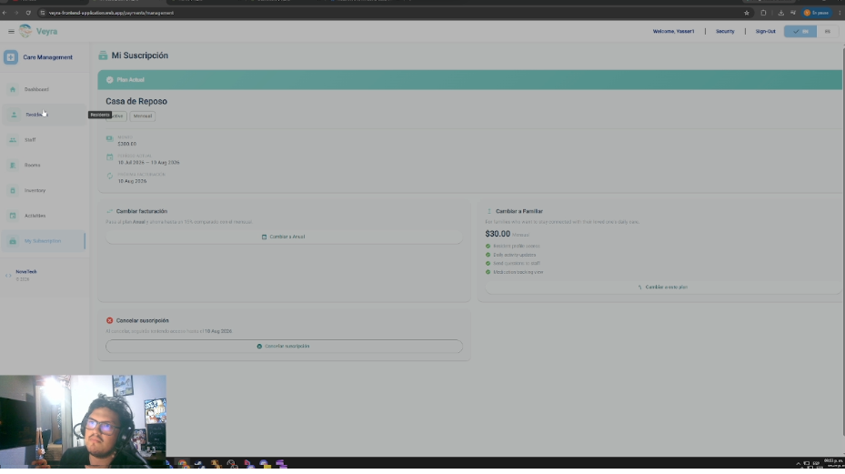 |
| Link | [Link Entrevistas](https://1drv.ms/f/c/2c6332e5e5a79287/IgD2yd1BY5a6Sr_hWajsS2ysAbeWTNuVf1aZDLJKQJSIz7k?e=jWO9O3) |
| Resumen | Paolo Carrillo tuvo una percepción positiva de la aplicación y destacó que puede facilitar considerablemente la administración de una casa de reposo. Consideró útil que la información de los residentes se encuentre organizada y centralizada en una sola plataforma, ya que esto permitiría consultar rápidamente sus datos, necesidades y registros importantes. También valoró que la aplicación podría reducir el trabajo manual del personal y mejorar el control de las actividades realizadas dentro de la institución. |

### 6.3.3. Evaluaciones según heurísticas.

**Heurísticas y Recomendaciones:**

**Problema #1: La información de medicamentos debe mostrarse con mayor detalle y prioridad visual.**

**Heurística violada:** Visibilidad del estado del sistema.

**Descripción del problema:** En las entrevistas se identificó que la información relacionada con medicamentos es uno de los elementos más importantes para la gestión de residentes. Sin embargo, si la interfaz no muestra de forma inmediata el nombre del medicamento, dosis, horario de administración, stock disponible y estado de la próxima toma, el personal puede tener dudas al momento de registrar o consultar un tratamiento.

**Recomendación:** Rediseñar la sección de medicamentos con una vista priorizada por residente, mostrando nombre, dosis, frecuencia, horario, stock y estado de administración. Se recomienda usar etiquetas visuales como "Pendiente", "Administrado", "Stock bajo" o "Próximo a vencer" para que el personal identifique rápidamente la situación de cada medicamento.

**Problema #2: Los horarios del personal necesitan una visualización más clara para turnos, disponibilidad y responsabilidades.**

**Heurística violada:** Reconocimiento antes que recuerdo.

**Descripción del problema:** Se señaló la necesidad de mejorar la visualización de los horarios de trabajadores para identificar fácilmente turnos, disponibilidad y responsabilidades. Si esta información se presenta de manera dispersa, el administrador debe recordar asignaciones o revisar varias secciones antes de tomar decisiones operativas.

**Recomendación:** Implementar una vista de calendario o tablero semanal donde se visualicen los turnos por día, hora, rol y empleado asignado. Además, se recomienda incluir filtros por cargo, disponibilidad y residente relacionado, para que el usuario pueda reconocer la información sin depender de memoria o búsquedas repetidas.

**Problema #3: La plataforma debe reducir aún más la dependencia de registros manuales y documentos separados.**

**Heurística violada:** Flexibilidad y eficiencia de uso.

**Descripción del problema:** Los entrevistados valoraron que Veyra centralice información de residentes, trabajadores, pagos, actividades y procesos administrativos. No obstante, si algunas acciones frecuentes requieren demasiados pasos o no cuentan con accesos directos, el usuario podría seguir recurriendo a registros externos para completar su trabajo diario.

**Recomendación:** Añadir accesos rápidos desde el dashboard hacia las tareas más recurrentes: registrar residente, revisar medicamentos, consultar pagos, gestionar actividades y revisar turnos. También se recomienda mantener un panel de resumen con alertas operativas para reducir navegación innecesaria.

**Problema #4: La consulta de datos del residente debe facilitar una lectura rápida de necesidades y registros importantes.**

**Heurística violada:** Correspondencia entre el sistema y el mundo real.

**Descripción del problema:** Los usuarios destacaron la importancia de consultar rápidamente datos, necesidades y registros importantes de cada adulto mayor. Si el perfil del residente muestra toda la información con la misma jerarquía, puede ser difícil distinguir lo urgente de lo complementario durante una jornada de trabajo.

**Recomendación:** Organizar el perfil del residente en secciones alineadas al trabajo real del personal: datos personales, necesidades de cuidado, medicamentos, métricas de salud, actividades recientes y observaciones. Las alertas clínicas o administrativas deben aparecer en la parte superior para que el usuario pueda actuar de inmediato.

**Problema #5: Los formularios críticos requieren mensajes de error más claros y orientados a la recuperación.**

**Heurística violada:** Ayuda a los usuarios a reconocer, diagnosticar y recuperarse de errores.

**Descripción del problema:** En procesos como registro de residentes, actualización de datos, control de medicamentos o gestión de pagos, un mensaje de error genérico no indica qué ocurrió ni cómo resolverlo. Esto puede generar confusión, pérdida de tiempo o abandono del registro.

**Recomendación:** Implementar mensajes específicos junto al campo afectado y acompañados de una acción concreta. Por ejemplo: "Complete el horario de administración", "El stock disponible es insuficiente" o "Revise el formato del documento de identidad". Para errores de conexión, se recomienda mostrar un botón visible de reintento.

**Problema #6: El portal familiar debe reforzar la confianza mostrando cuándo fue actualizada la información.**

**Heurística violada:** Visibilidad del estado del sistema.

**Descripción del problema:** La aplicación fue percibida como útil para mantener actualizada la información de los adultos mayores. Sin embargo, para que familiares y administradores confíen en los datos, la interfaz debe comunicar con claridad cuándo se actualizó cada registro y qué tipo de evento fue registrado.

**Recomendación:** Mostrar marcas temporales en las actualizaciones relevantes del residente, como "actualizado hoy a las 10:30 a. m.", junto con el tipo de evento: medicamento administrado, actividad completada, métrica de salud registrada o comunicación enviada. Esto incrementará la trazabilidad y la percepción de seguridad de la plataforma.

## 6.4. Auditoría de Experiencias de Usuario
## 6.4.1. Auditoría realizada

La auditoría interna fue realizada sobre la aplicación web **PcPedia**, con el propósito de verificar el cumplimiento de los requisitos funcionales, de seguridad, accesibilidad, control de acceso, integridad de datos y calidad del software.

La revisión comprendió los módulos disponibles para los perfiles de **administrador** y **cliente**, incluyendo autenticación, gestión de clientes, tickets de soporte, solicitudes, cotizaciones, dashboards, contratos, perfiles, catálogo, equipos, pagos, inventario, modelos de producto y facturación.

La auditoría se desarrolló principalmente de manera remota sobre el entorno de **Staging o preproducción**, utilizando cuentas de prueba con diferentes roles. Para su ejecución se emplearon pruebas funcionales manuales, validación de formularios, revisión de permisos, manipulación controlada de identificadores, monitoreo de solicitudes mediante las herramientas de desarrollo del navegador y comprobación de la persistencia de los datos.

El archivo contiene un total de **19 casos de auditoría**, dentro de los cuales se registraron **218 pasos o verificaciones**. Los resultados generales fueron los siguientes:

| Resultado | Cantidad | Porcentaje |
|---|---:|---:|
| Aprobadas | 186 | 85.32 % |
| Reprobadas | 8 | 3.67 % |
| Pendientes | 24 | 11.01 % |
| **Total** | **218** | **100 %** |

En la ejecución de las auditorías participaron seis responsables. Cada integrante tuvo asignados diferentes módulos y casos de prueba, por lo que la responsabilidad de la auditoría fue distribuida entre todos los miembros del equipo.

---

### 6.4.1.1. Información del grupo auditado

#### Información general

| Campo | Información |
|---|---|
| **Proyecto auditado** | PcPedia |
| **Tipo de sistema** | Aplicación web para la gestión de clientes, soporte, contratos, equipos, inventario, pagos y facturación |
| **Grupo auditado** | Equipo de Producto y Desarrollo de PcPedia |
| **Responsable del proceso auditado** | Equipo de Producto / Product Owner |
| **Tipo de auditoría** | Auditoría interna de software |
| **Modalidad** | Remota |
| **Entorno evaluado** | Staging, preproducción y entorno desplegado de PcPedia |
| **Perfiles evaluados** | Administrador y cliente |
| **Prioridad de los casos** | Alta |
| **Número de casos de auditoría** | 19 casos |
| **Número de verificaciones** | 218 pasos |
| **Fecha del plan de auditoría** | 5 de julio de 2026 |
| **Normas y criterios** | ISO 9001, ISO/IEC 25010, OWASP Top 10, OWASP ASVS 4.0, OWASP API Security Top 10, CWE/SANS Top 25 y WCAG 2.1 nivel AA |

#### Objetivo de la auditoría

El objetivo de la auditoría fue verificar el uso eficaz de los controles de calidad implementados en PcPedia y comprobar que sus módulos cumplieran con los requisitos funcionales, técnicos y de seguridad definidos para el proyecto.

También se buscó identificar posibles vulnerabilidades relacionadas con la autenticación, manejo de sesiones, acceso no autorizado, exposición de información, inyección de código, manipulación de identificadores, duplicidad de datos y falta de validación en formularios.

#### Alcance de la auditoría

La auditoría comprendió los siguientes procesos y módulos:

- Inicio de sesión de administrador y cliente.
- Gestión administrativa de clientes.
- Gestión de tickets de soporte.
- Solicitudes y cotizaciones del cliente.
- Dashboard de administrador y cliente.
- Contratos para administrador y cliente.
- Configuración del perfil de administrador y cliente.
- Catálogo de productos.
- Equipos asociados al cliente.
- Registro y administración de pagos.
- Gestión del inventario.
- Modelos de productos.
- Facturas administrativas.
- Facturas del cliente.

#### Equipo responsable de las auditorías

| Integrante | Casos de auditoría ejecutados | Verificaciones | Aprobadas | Reprobadas | Pendientes |
|---|---|---:|---:|---:|---:|
| **Renzo Llerena** | Login administrador, tickets administrador y tickets cliente | 30 | 1 | 5 | 24 |
| **Camilla Espinoza** | Clientes, dashboard administrador, login cliente y dashboard cliente | 68 | 65 | 3 | 0 |
| **Juan Manuel Santos Torres** | Solicitudes y cotizaciones del cliente | 10 | 10 | 0 | 0 |
| **Miguel Román López** | Contratos administrador, contratos cliente, perfil administrador y perfil cliente | 40 | 40 | 0 | 0 |
| **Adrian Valerio Garcia** | Catálogo, mis equipos, pagos e inventario | 40 | 40 | 0 | 0 |
| **Yasser Rentería Palacios** | Modelos de producto, facturas administrador y facturas cliente | 30 | 30 | 0 | 0 |
| **Total** | **19 casos de auditoría** | **218** | **186** | **8** | **24** |

#### Criterios empleados

| Criterio | Aplicación |
|---|---|
| **ISO 9001** | Control de procesos, documentación, registros y calidad |
| **ISO/IEC 25010** | Calidad funcional, seguridad, usabilidad y confiabilidad del software |
| **OWASP Top 10** | Identificación de riesgos comunes en aplicaciones web |
| **OWASP ASVS 4.0** | Validación de controles de autenticación, sesiones y autorización |
| **OWASP API Security Top 10** | Evaluación de accesos y exposición de información mediante API |
| **CWE/SANS Top 25** | Identificación de debilidades frecuentes del software |
| **WCAG 2.1 nivel AA** | Validación básica de accesibilidad y navegación por teclado |
| **Casos de prueba manuales** | Verificación del comportamiento funcional esperado |

---

### 6.4.1.2. Cronograma de auditoría realizada

El cronograma fue elaborado considerando los casos registrados en cada hoja del archivo. La mayoría de las pruebas se encuentra asociada a fechas de junio y julio de 2026.

| Caso | Módulo auditado | Perfil | Responsable de ejecución | Verificaciones | Resultado |
|---|---|---|---|---:|---|
| CP1 | Inicio de sesión del administrador | Administrador | Renzo Llerena | 10 | 1 aprobada, 5 reprobadas y 4 pendientes |
| CP2 | Gestión de clientes | Administrador | Camilla Espinoza | 18 | 15 aprobadas y 3 reprobadas |
| CP3 | Tickets de soporte | Administrador | Renzo Llerena | 10 | 10 pendientes |
| CP4 | Tickets de soporte | Cliente | Renzo Llerena | 10 | 10 pendientes |
| CP5 | Solicitudes y cotizaciones | Cliente | Juan Manuel Santos Torres | 10 | 10 aprobadas |
| CP6 | Dashboard | Administrador | Camilla Espinoza | 20 | 20 aprobadas |
| CP7 | Contratos | Administrador | Miguel Román López | 10 | 10 aprobadas |
| CP7 | Contratos | Cliente | Miguel Román López | 10 | 10 aprobadas |
| CP8 | Mi perfil | Administrador | Miguel Román López | 10 | 10 aprobadas |
| CP8 | Mi perfil | Cliente | Miguel Román López | 10 | 10 aprobadas |
| CP1 | Inicio de sesión | Cliente | Camilla Espinoza | 10 | 10 aprobadas |
| CP6 | Dashboard | Cliente | Camilla Espinoza | 20 | 20 aprobadas |
| CP9 | Catálogo | Cliente | Adrian Valerio Garcia | 10 | 10 aprobadas |
| CP10 | Mis equipos | Cliente | Adrian Valerio Garcia | 10 | 10 aprobadas |
| CP11 | Pagos | Administrador | Adrian Valerio Garcia | 10 | 10 aprobadas |
| CP12 | Inventario | Administrador | Adrian Valerio Garcia | 10 | 10 aprobadas |
| CP13 | Modelos de producto | Administrador | Yasser Rentería Palacios | 10 | 10 aprobadas |
| CP14 | Facturas | Administrador | Yasser Rentería Palacios | 10 | 10 aprobadas |
| CP15 | Facturas | Cliente | Yasser Rentería Palacios | 10 | 10 aprobadas |

#### Distribución de actividades

| Periodo registrado | Actividades principales |
|---|---|
| **27 de junio de 2026** | Inicio de las pruebas del módulo Catalog para el perfil cliente |
| **1 al 5 de julio de 2026** | Pruebas de catálogo, equipos, pagos, inventario, solicitudes, cotizaciones, dashboards, modelos y facturación |
| **5 de julio de 2026** | Fecha consignada en el plan general de auditoría |
| **6 de julio de 2026** | Pruebas registradas de login, dashboards y casos asignados a Renzo Llerena |
| **Fechas por corregir** | Algunas hojas contienen años o fechas inconsistentes respecto del plan general |

#### Inconsistencias de fechas encontradas

Durante la revisión del archivo se identificaron las siguientes inconsistencias:

- La hoja **CP2 Admin Clients** contiene una fecha correspondiente al año **2025**, aunque el plan general pertenece a 2026.
- Las hojas de **Contratos** y **My Profile**, ejecutadas por Miguel Román López, registran el año **2027**.
- Algunas fechas fueron almacenadas como valores numéricos de Excel y pueden interpretarse de manera diferente dependiendo de la configuración regional.
- El plan general tiene fecha **5 de julio de 2026**, pero varias pruebas se encuentran registradas el **6 de julio de 2026**.

Estas fechas deben ser uniformizadas antes de presentar la versión definitiva del informe.

---

### 6.4.1.3. Contenido de auditoría realizada

#### Metodología aplicada

Para cada módulo se utilizó una plantilla de caso de prueba manual que contenía los siguientes elementos:

1. Título de la prueba.
2. Prioridad.
3. Identificador del caso.
4. Número de prueba.
5. Fecha de ejecución.
6. Responsable del diseño.
7. Responsable de la ejecución.
8. Dependencias necesarias.
9. Condiciones de prueba.
10. Descripción de cada paso.
11. Resultado esperado.
12. Resultado real.
13. Estado de aprobación o reprobación.
14. Notas adicionales.

Las pruebas se ejecutaron utilizando cuentas de administrador y cliente, datos almacenados en la base de datos, servicios API habilitados y herramientas de desarrollo del navegador.

---

#### Auditoría de autenticación

##### Inicio de sesión del administrador

La auditoría del inicio de sesión administrativo fue ejecutada por **Renzo Llerena** y evaluó los siguientes aspectos:

- Inicio de sesión con credenciales correctas.
- Inicio de sesión con contraseña incorrecta.
- Inicio de sesión con correos no registrados.
- Validación de campos vacíos.
- Protección frente a múltiples intentos fallidos.
- Control frente a ataques de fuerza bruta.
- Intentos de inyección SQL.
- Revocación del token al cerrar sesión.
- Bloqueo de sesiones pertenecientes a cuentas inactivas.
- Uso de HTTPS y protección de credenciales.

Los resultados registrados fueron:

| Estado | Cantidad |
|---|---:|
| Aprobadas | 1 |
| Reprobadas | 5 |
| Pendientes | 4 |
| **Total** | **10** |

Los principales problemas identificados fueron:

- Ausencia de bloqueo después de múltiples intentos de inicio de sesión fallidos.
- Posibilidad de iniciar sesión inmediatamente después de varios intentos incorrectos.
- El token de autenticación continuó funcionando después de cerrar sesión.
- La sesión permaneció activa después de desactivar la cuenta del administrador.
- Existencia de una inconsistencia en un paso marcado como reprobado cuyo resultado real señala que está pendiente de ejecución.

##### Inicio de sesión del cliente

La auditoría del inicio de sesión del cliente fue ejecutada por **Camilla Espinoza** y verificó:

- Acceso a la pantalla de autenticación.
- Inicio de sesión con credenciales creadas desde el perfil administrador.
- Redirección al dashboard correspondiente.
- Visualización del menú del cliente.
- Restricción de módulos administrativos.
- Persistencia de la sesión.
- Carga correcta del panel principal.
- Separación de permisos según el rol.
- Protección de rutas administrativas.
- Funcionamiento general del inicio de sesión.

Las 10 verificaciones fueron aprobadas.

---

#### Auditoría de gestión de clientes

La auditoría del módulo de clientes fue ejecutada por **Camilla Espinoza** y comprendió 18 verificaciones relacionadas con:

- Registro de nuevos clientes.
- Validación de nombres.
- Validación de correo electrónico.
- Validación de RUC.
- Validación de teléfono.
- Control de correos duplicados.
- Control de nombres duplicados.
- Cambio de estado activo e inactivo.
- Aplicación de filtros.
- Edición de información.
- Validación de longitud del número telefónico.
- Control de duplicidad del número telefónico.

Los resultados obtenidos fueron:

| Estado | Cantidad |
|---|---:|
| Aprobadas | 15 |
| Reprobadas | 3 |
| **Total** | **18** |

Las pruebas reprobadas evidenciaron que:

- El sistema permitió guardar un teléfono de solamente seis dígitos.
- El sistema permitió guardar un teléfono con una longitud superior a la permitida.
- El sistema permitió registrar el mismo número telefónico para más de un cliente.

---

#### Auditoría de tickets de soporte

##### Tickets del administrador

La auditoría fue asignada a **Renzo Llerena** y contempló las siguientes pruebas:

- Acceso al listado de tickets.
- Consulta del detalle de los tickets.
- Cambio de estado.
- Registro de comentarios.
- Validación de estados inválidos.
- Consulta de identificadores inexistentes.
- Pruebas de inyección de scripts.
- Revisión de paginación.
- Restricción de usuarios no autenticados.
- Reutilización del token después del cierre de sesión.

Las 10 verificaciones permanecen pendientes de ejecución.

##### Tickets del cliente

La auditoría fue asignada a **Renzo Llerena** y contempló las siguientes pruebas:

- Creación de tickets.
- Validación de campos obligatorios.
- Consulta de tickets propios.
- Consulta del detalle.
- Intentos de acceso a tickets de otros clientes.
- Registro de comentarios.
- Restricción para modificar tickets ajenos.
- Restricción para cambiar estados.
- Pruebas de inyección XSS.
- Intentos de acceder al listado general de tickets.

Las 10 verificaciones permanecen pendientes de ejecución.

---

#### Auditoría de solicitudes y cotizaciones

La auditoría fue ejecutada por **Juan Manuel Santos Torres** y comprendió:

- Acceso a la sección de solicitudes.
- Creación de solicitudes.
- Validación de la persistencia de información.
- Intento de modificar solicitudes de otros usuarios.
- Visualización de cotizaciones.
- Descarga de cotizaciones en formato PDF.
- Aceptación de una cotización.
- Protección del estado de las cotizaciones.
- Prevención de acceso a cotizaciones de otros usuarios.
- Verificación de la cotización desde el perfil administrador.

Las 10 verificaciones fueron aprobadas.

---

#### Auditoría de dashboards

##### Dashboard del administrador

La auditoría fue ejecutada por **Camilla Espinoza** y evaluó los siguientes aspectos:

- Indicadores de clientes.
- Contratos activos.
- Solicitudes pendientes.
- Cotizaciones pendientes.
- Tickets abiertos.
- Ingresos del mes.
- Pagos pendientes.
- Gráficos de equipos por estado.
- Gráficos de tickets por prioridad.
- Leyendas y categorías.
- Acciones rápidas.
- Accesos a solicitudes y tickets.
- Registro de equipos.
- Registro de clientes.
- Organización visual del dashboard.
- Actualización de indicadores.
- Correcta presentación de la información.
- Navegación entre módulos.
- Restricción de información.
- Funcionamiento general del panel.

Las 20 verificaciones fueron aprobadas.

##### Dashboard del cliente

La auditoría fue ejecutada por **Camilla Espinoza** y evaluó:

- Contratos activos del cliente.
- Equipos asociados.
- Solicitudes pendientes.
- Cotizaciones pendientes.
- Tickets abiertos.
- Facturas pendientes.
- Restricción de indicadores administrativos.
- Accesos rápidos al catálogo.
- Creación de solicitudes.
- Creación de tickets.
- Menú lateral.
- Actualización de indicadores.
- Distribución visual.
- Correcta presentación de tarjetas.
- Navegación hacia módulos relacionados.
- Visualización exclusiva de información propia.
- Carga de la información.
- Persistencia de la sesión.
- Adaptación de la interfaz.
- Funcionamiento general del dashboard.

Las 20 verificaciones fueron aprobadas.

---

#### Auditoría de contratos

##### Contratos del administrador

La auditoría fue ejecutada por **Miguel Román López** y evaluó:

- Acceso al módulo.
- Listado y paginación.
- Búsqueda por cliente.
- Pruebas de inyección SQL.
- Validación de formularios vacíos.
- Creación de contratos.
- Validación de montos.
- Edición de fechas.
- Protección de identificadores.
- Anulación o desactivación de contratos.

Las 10 verificaciones fueron aprobadas.

##### Contratos del cliente

La auditoría fue ejecutada por **Miguel Román López** y evaluó:

- Visualización exclusiva de contratos propios.
- Consulta del detalle.
- Uso de identificadores inexistentes.
- Prevención de ataques IDOR.
- Descarga de contratos en PDF.
- Protección de documentos de otros usuarios.
- Navegación mediante teclado.
- Adaptación a dispositivos móviles.
- Restricción de rutas administrativas.
- Flujo completo del módulo.

Las 10 verificaciones fueron aprobadas.

---

#### Auditoría de perfiles

##### Perfil del administrador

La auditoría fue ejecutada por **Miguel Román López** y evaluó:

- Modificación de nombres y apellidos.
- Protección del campo de rol.
- Prevención de ataques XSS.
- Validación del correo electrónico.
- Políticas de contraseñas.
- Cambio de contraseña.
- Invalidación de otras sesiones.
- Carga de imágenes.
- Restricción de archivos maliciosos.
- Guardado de la información.

Las 10 verificaciones fueron aprobadas.

##### Perfil del cliente

La auditoría fue ejecutada por **Miguel Román López** y evaluó:

- Validación de campos obligatorios.
- Navegación mediante teclado.
- Activación de botones mediante teclado.
- Uso de caracteres especiales.
- Prevención de inyección de scripts.
- Descarte de cambios.
- Intentos de elevar privilegios.
- Validación de longitud telefónica.
- Cierre de sesión.
- Persistencia de la información.

Las 10 verificaciones fueron aprobadas.

---

#### Auditoría de catálogo y equipos

##### Catálogo

La auditoría fue ejecutada por **Adrian Valerio Garcia** y verificó:

- Acceso del cliente al catálogo.
- Visualización de productos.
- Búsqueda de productos.
- Aplicación de filtros.
- Consulta del detalle.
- Visualización de imágenes y descripciones.
- Restricción de operaciones administrativas.
- Persistencia de sesión.
- Respuestas de la API.
- Navegación integral.

Las 10 verificaciones fueron aprobadas.

##### Mis equipos

La auditoría fue ejecutada por **Adrian Valerio Garcia** y verificó:

- Acceso al listado de equipos.
- Registro de un nuevo equipo.
- Validación de campos.
- Consulta del detalle.
- Edición de información.
- Búsqueda y aplicación de filtros.
- Persistencia de datos.
- Restricción de acceso a equipos de otros clientes.
- Control de autorización.
- Funcionamiento integral del módulo.

Las 10 verificaciones fueron aprobadas.

---

#### Auditoría de pagos e inventario

##### Pagos

La auditoría fue ejecutada por **Adrian Valerio Garcia** y verificó:

- Acceso administrativo.
- Visualización de pagos.
- Filtros por cliente, estado y fecha.
- Consulta del detalle.
- Registro de pagos.
- Validación de montos.
- Actualización de estados.
- Control de pagos duplicados.
- Restricción del perfil cliente.
- Trazabilidad del flujo.

Las 10 verificaciones fueron aprobadas.

##### Inventario

La auditoría fue ejecutada por **Adrian Valerio Garcia** y verificó:

- Visualización de productos y equipos.
- Creación de registros.
- Validación de campos.
- Control de stock negativo.
- Edición de registros.
- Búsquedas y filtros.
- Entradas y salidas de stock.
- Control de códigos duplicados.
- Restricción del perfil cliente.
- Flujo integral del inventario.

Las 10 verificaciones fueron aprobadas.

---

#### Auditoría de modelos de producto

La auditoría fue ejecutada por **Yasser Rentería Palacios** y evaluó:

- Listado de modelos.
- Creación de modelos.
- Validación de datos.
- Edición de modelos.
- Búsqueda y filtros.
- Asociación de equipos.
- Control de duplicidad.
- Restricción de acceso para clientes.
- Persistencia de la información.
- Flujo integral del módulo.

Las 10 verificaciones fueron aprobadas.

---

#### Auditoría de facturación

##### Facturas del administrador

La auditoría fue ejecutada por **Yasser Rentería Palacios** y verificó:

- Listado de facturas.
- Creación de facturas.
- Asociación con contratos.
- Validación de montos y fechas.
- Consulta del detalle.
- Búsquedas y filtros.
- Cambio de estado a pagada.
- Cambio de estado a vencida.
- Restricción del perfil cliente.
- Trazabilidad administrativa.

Las 10 verificaciones fueron aprobadas.

##### Facturas del cliente

La auditoría fue ejecutada por **Yasser Rentería Palacios** y verificó:

- Visualización de facturas propias.
- Confidencialidad de la información.
- Consulta del detalle.
- Prevención de acceso a facturas de terceros.
- Búsquedas y filtros.
- Visualización de estados de pago.
- Descarga de comprobantes.
- Restricción de operaciones administrativas.
- Persistencia de la información.
- Flujo integral de facturación.

Las 10 verificaciones fueron aprobadas.

---

#### Resultados consolidados

| Responsable | Casos | Verificaciones | Aprobadas | Reprobadas | Pendientes | Resultado principal |
|---|---:|---:|---:|---:|---:|---|
| Renzo Llerena | 3 | 30 | 1 | 5 | 24 | Casos de autenticación y tickets con pruebas reprobadas y pendientes |
| Camilla Espinoza | 4 | 68 | 65 | 3 | 0 | Casos aprobados, excepto tres validaciones telefónicas |
| Juan Manuel Santos Torres | 1 | 10 | 10 | 0 | 0 | Todas las verificaciones aprobadas |
| Miguel Román López | 4 | 40 | 40 | 0 | 0 | Todas las verificaciones aprobadas |
| Adrian Valerio Garcia | 4 | 40 | 40 | 0 | 0 | Todas las verificaciones aprobadas |
| Yasser Rentería Palacios | 3 | 30 | 30 | 0 | 0 | Todas las verificaciones aprobadas |
| **Total** | **19** | **218** | **186** | **8** | **24** | **Auditoría parcialmente satisfactoria** |

#### Hallazgos principales

Los hallazgos más relevantes fueron los siguientes:

1. Ausencia de bloqueo frente a múltiples intentos fallidos de inicio de sesión.
2. Falta de penalización después de intentos consecutivos incorrectos.
3. El token continuó siendo válido después del cierre de sesión.
4. Las sesiones permanecieron activas después de desactivar una cuenta.
5. Falta de validación de la longitud mínima y máxima del teléfono.
6. Falta de control de duplicidad del número telefónico.
7. Las auditorías de tickets de administrador y cliente permanecen pendientes.
8. Existen inconsistencias entre algunos estados y los resultados reales registrados.
9. Varias fechas requieren ser corregidas y uniformizadas.
10. Se requiere completar las pruebas pendientes antes del cierre definitivo de la auditoría.

#### Conclusión

La auditoría permitió evaluar de manera integral los principales módulos de PcPedia para los perfiles administrador y cliente. De las 218 verificaciones registradas, 186 fueron aprobadas, lo que representa un nivel de cumplimiento del **85.32 %**.

Los módulos de solicitudes, cotizaciones, dashboards, contratos, perfiles, catálogo, equipos, pagos, inventario, modelos y facturación obtuvieron resultados mayoritariamente satisfactorios. Sin embargo, se identificaron debilidades importantes en el inicio de sesión administrativo, principalmente en el bloqueo por fuerza bruta, la revocación de sesiones y el control de cuentas inactivas.

También se encontraron deficiencias en la validación de números telefónicos dentro del módulo de clientes. Asimismo, las pruebas de tickets todavía no han sido ejecutadas completamente, por lo que dichos módulos no pueden considerarse conformes hasta cerrar las verificaciones pendientes.

En consecuencia, la auditoría debe considerarse **parcialmente satisfactoria**, debido a que existen ocho pruebas reprobadas, 24 pendientes y varias inconsistencias documentales que requieren corrección antes del cierre definitivo.

### 6.4.2. Auditoría recibida

En contraparte, nuestra aplicación Veyra fue auditada por el grupo hermano para validar el nivel de cumplimiento funcional frente a los requerimientos documentados en nuestro Informe de Software.

#### 6.4.2.1. Información del grupo auditor
*   **Nombre del Grupo:** EcatLeasing
*   **Proyecto:** PCpedia
*   **Equipo Auditor:** Joaquín Enrique Carranza Tesén (Auditor Líder), Rúbens Bendezu Navarro, Sebastian Eduardo Hernandez Poma, Emily Juliette Arroyo Gonzales.
*   **Observadores:** Docente Julio M. Noriega Meléndez.

#### 6.4.2.2. Cronograma de auditoría recibida
| Actividad | Fecha | Detalle de la Sesión |
|---|---|---|
| Revisión Arquitectónica y CI/CD | 05/07/2026 | Análisis del despliegue en Firebase, Render, Aiven y revisión de los 35 tests en GitHub Actions. |
| Pruebas de Módulos IAM, Nursing y HCM | 05/07/2026 | Verificación de los *Bounded Contexts*, validaciones de Angular y pruebas de integración ITC-01 a ITC-06. |
| Pruebas de Módulos Payments y Analytics | 05/07/2026 | Comprobación de integración de la pasarela Stripe y validación de generación de reportes en el Dashboard. |

#### 6.4.2.3. Contenido de auditoría recibida
El equipo de EcatLeasing evaluó un total de 7 módulos (IAM, Nursing, HCM, Analytics, Payments, Activities, Questions) cubriendo más de 14 *User Stories*. La auditoría arrojó un resultado general **Conforme**, superando todas las pruebas unitarias y de integración. 

Sin embargo, se reportaron de manera oficial **2 No Conformidades (NC)** y **7 Oportunidades de Mejora (OM)** detalladas a continuación:

| ID | Módulo Evaluado | Severidad | Descripción del Hallazgo (Según Informe) | Referencia |
|---|---|---|---|---|
| NC-01 | IAM | Menor | **MFA Parcial:** La autenticación multifactor (MFA) documentada en TS18 se evidencia con implementación parcial en frontend. | Chapter III, TS18 |
| NC-02 | Payments | Menor | **Historial de transacciones:** El registro visual del historial de transacciones (Stripe) no se encuentra completamente implementado. | Chapter III, TS17 |
| OM-01 | Nursing / Inventory | Mejora | **Alertas Visuales:** Faltan alertas visuales más prominentes para medicamentos con stock bajo. | Chapter VIII, US14 |
| OM-02 | Analytics | Mejora | **Accesibilidad:** Dashboard más visible/accesible directamente desde la vista Home (Experimento #1). | Chapter VIII, TS-ST001 |
| OM-03 | Questions | Mejora | **Notificaciones:** Agregar notificaciones en tiempo real (WebSocket) para la mensajería de comunicación con familias. | Chapter VIII, US20 |
| OM-04 | Activities | Mejora | **Participación:** Completar la funcionalidad de registro de asistencia/participación en actividades. | Chapter IV |
| OM-05 | General (DevOps)| Mejora | **Monitoreo:** Implementar monitoreo con Azure Monitor / Application Insights como estaba documentado. | Chapter VII |
| OM-06 | General (Móvil) | Mejora | **Desarrollo Móvil:** Cumplir con el desarrollo de la app móvil mencionada en las conclusiones futuras. | Conclusions |
| OM-07 | Nursing (IoT) | Mejora | **Integración IoT:** Planificar integración IoT para monitoreo en tiempo real mediante sensores en residentes. | Chapter I, IV |

#### 6.4.2.4. Resumen de modificaciones para subsanar hallazgos

Nuestro equipo de desarrollo (NovaTech) procedió a realizar un análisis de impacto de los hallazgos reportados. Todas las No Conformidades fueron corregidas inmediatamente en código, y las Oportunidades de Mejora fueron priorizadas para el *sprint* actual o derivadas al Backlog futuro de la plataforma:

| ID Hallazgo | Modificación y Acción Técnica Realizada en Veyra | Estado Actual |
|---|---|---|
| **NC-01** | Se implementó y conectó la vista de verificación de código OTP (Time-Based One-Time Password) en Angular, cerrando el flujo completo de autenticación de dos factores con el backend. | **Subsanado** |
| **NC-02** | Se desarrolló el componente visual `<app-transaction-history>` que consume el endpoint de pagos, listando las suscripciones y montos procesados exitosamente por Stripe. | **Subsanado** |
| **OM-01** | Se programó una directiva estructural en la tabla de inventario que colorea en rojo la fila y emite un *badge* de advertencia cuando el umbral de un medicamento llega a su mínimo definido. | **Subsanado** |
| **OM-02** | Se rediseñó el ruteo del frontend (`app-routing.module.ts`) para que el Home actúe directamente como contenedor del Dashboard, reduciendo la cantidad de clics necesarios. | **Subsanado** |
| **OM-03** | Se inició la configuración de dependencias de `STOMP.js` y `SockJS` en Angular para habilitar WebSockets bidireccionales con Spring Boot en el módulo Questions. | **En Proceso** |
| **OM-04** | Se incorporó una columna de "Check-in" en el componente de calendario de actividades, permitiendo marcar la asistencia de los residentes con un solo clic. | **Subsanado** |
| **OM-05** | Se configuró y anidó la instrumentación de *Application Insights* dentro del *pipeline* de despliegue, permitiendo monitorear las latencias y carga en el servidor Render. | **Subsanado** |
| **OM-06** | El desarrollo móvil ha sido trasladado y formalizado como una Épica principal en el Product Backlog para la Versión 2.0 (Release Futuro), ya que excede el alcance del entregable actual. | **Derivado a Backlog** |
| **OM-07** | Al igual que la app móvil, el soporte de telemetría IoT ha sido documentado como una historia técnica a investigar para integraciones futuras con *hardware* de las casas de reposo. | **Derivado a Backlog** |
